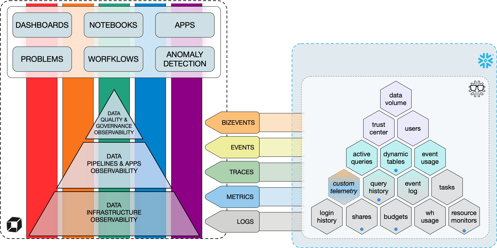
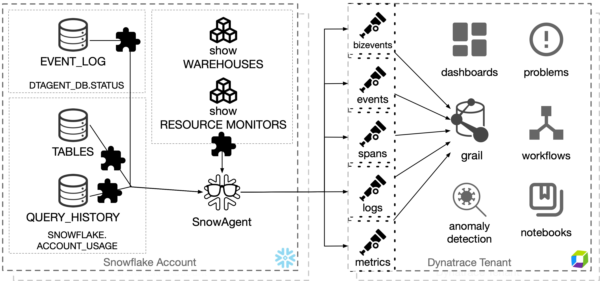
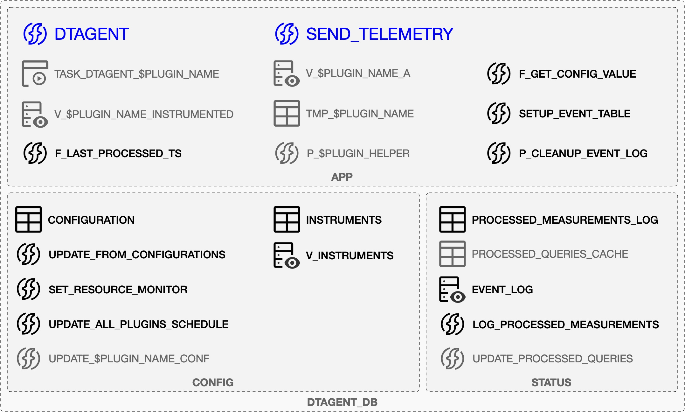
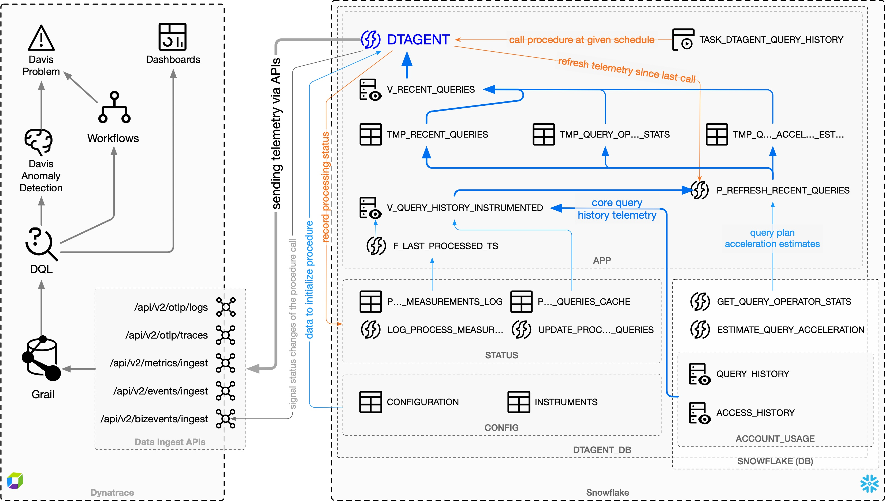

# Architecture and Core Capabilities

Dynatrace Snowflake Observability Agent was designed to augment [Data Platform Observability](DPO.md) capabilities already offered by Dynatrace with OneAgent and custom telemetry (including logs and bizevents) delivered by ETL and other applications. Dynatrace Snowflake Observability Agent aims to fullfil the promise of Data Platform Observability by delivering telemetry data already present in Snowflake directly to Dynatrace as logs, traces, events, and metrics. Depending on what type of telemetry is sent by given Dynatrace Snowflake Observability Agent plugin one or more [Data Platform Observability themes](DPO.md#the-five-core-themes-of-dpo) can be supported over one or multiple [layers of Data Platform Observability](DPO.md#the-three-tiers-of-data-platform-observability).



The main capabilities offered by Dynatrace Snowflake Observability Agent are:

1. **Data Collection**: Dynatrace Snowflake Observability Agent collects and parses useful observability data from various Snowflake sources.
2. **Data Transmission**: After collecting and parsing the information, Dynatrace Snowflake Observability Agent sends it to Dynatrace tenants where it is easily accessible and ready for analysis.
3. **Alerting**: Dynatrace Snowflake Observability Agent can send alerts regarding specific information, e.g., potential security breaches, unmonitored warehouses, directly during data parsing, as well as using workflows and anomaly detections set up on the Dynatrace tenant.
4. **Visualization**: Dynatrace Snowflake Observability Agent delivers telemetry which facilitates building Dynatrace dashboards that ease the process of data analysis.

Table of content:

* [High-Level overview](#high-level-overview)
* [Dynatrace Snowflake Observability Agent objects in Snowflake](#dynatrace-snowflake-observability-agent-objects-in-snowflake)
  * [The `APP` schema](#the-app-schema)
  * [The `CONFIG` schema](#the-config-schema)
  * [The `STATUS` schema](#the-status-schema)
* [Telemetry flow](#telemetry-flow)
* [Internal API for sending telemetry](#internal-api-for-sending-telemetry)
  * [Sending logs](#sending-logs)
  * [Sending traces/spans](#sending-tracesspans)
  * [Sending metrics](#sending-metrics)
  * [Sending events](#sending-events)
  * [Sending BizEvents](#sending-bizevents)
* [Sending custom telemetry](#sending-custom-telemetry)
  * [Default data structure](#default-data-structure)
  * [Examples of sending custom telemetry](#examples-of-sending-custom-telemetry)
    * [Sending logs and metrics from a view](#sending-logs-and-metrics-from-a-view)
    * [Sending logs, events, and bizevents from an array of custom objects](#sending-logs-events-and-bizevents-from-an-array-of-custom-objects)
* [Dynatrace Snowflake Observability Agent self-monitoring](#dynatrace-snowflake-observability-agent-self-monitoring)

## High-Level overview

Dynatrace Snowflake Observability Agent is designed to take full advantage of Snowflake Snowpark capabilities, allowing active "code" to be scheduled and executed within Snowflake, close to where the telemetry data comes from. Such a design enables telemetry to be sent over to Dynatrace, similar to OneAgent.

The following figure illustrates, at high level, how telemetry data flows from Snowflake sources to Dynatrace for consumption.



Dynatrace Snowflake Observability Agent is designed for easy extension with new plugins, each of which can utilize the core functions to deliver telemetry data via logs, spans/traces, events, bizevents, and metrics.

By default, each plugin is executed with an independent Snowflake task, scheduled to run at its own interval. Additionally, it is possible to call multiple plugins from a single Snowflake task if needed, providing flexible scheduling options.

The telemetry data can come from various sources, not only from `snowflake.account_usage` views but also from functions/procedures and "show" command calls. Dynatrace Snowflake Observability Agent encapsulates each telemetry data into views delivered by "plugins," with each plugin focusing on delivering telemetry from one or more sources related to a specific subject, e.g., query history or dynamic tables.

## Dynatrace Snowflake Observability Agent objects in Snowflake

Dynatrace Snowflake Observability Agent is fully contained within a single database (`DTAGENT_DB`) with a dedicated warehouse (`DTAGENT_WH`) and two roles per each Dynatrace Snowflake Observability Agent instance deployed:

* `DTAGENT_ADMIN` that owns all other objects, and
* `DTAGENT_VIEWER` that is designed to query and send telemetry data.

Since it is possible to run multiple Dynatrace Snowflake Observability Agent instances within one Snowflake account, additional instances (deployed in a multitenancy mode), have the names of those four objects include the tag name, i.e., `DTAGENT_$TAG_DB`, `DTAGENT_$TAG_WH`, `DTAGENT_$TAG_ADMIN`, and `DTAGENT_$TAG_VIEWER`.

The figure below depicts objects which are created and maintained by Dynatrace Snowflake Observability Agent within dedicated database in Snowflake:



### The `APP` schema

This is the main schema maintained by Dynatrace Snowflake Observability Agent. It contains two main stored procedures:

* `DTAGENT_DB.APP.DTAGENT(plugins)` is the main procedure of Dynatrace Snowflake Observability Agent, which sends telemetry generated by executing one or multiple [plugins](PLUGINS.md). Telemetry views queried by plugins use the internal telemetry API available in this procedure to send telemetry data directly to Dynatrace.
* `DTAGENT_DB.APP.SEND_TELEMETRY(sources, params)` is based on the same core and internal telemetry API code as `DTAGENT()` but instead of using plugins to query, process, and send telemetry data, it enables to [send arbitrary data](#sending-custom-telemetry) from given tables/views/queries or array/objects to Dynatrace.

Additionally, a set of helper functions to check the timestamp of the last telemetry piece of a given type processed so far (`F_LAST_PROCESSED_TS()`) or get configuration parameters (`F_GET_CONFIG_VALUE()`), plus procedures helping to set up and maintain the event log table, if it is set up by and managed this Dynatrace Snowflake Observability Agent instance.

Plugins can define their main and helper views, helper procedures, and tasks which invoke Dynatrace Snowflake Observability Agent with the given plugin at a given schedule.

In order for Dynatrace Snowflake Observability Agent to communicate with Dynatrace API, dedicated `SECRET`, `NETWORK RULE`, and `EXTERNAL ACCESS INTEGRATION` are set.

### The `CONFIG` schema

Contains two tables:

* `CONFIGURATIONS` with all configurable options of Dynatrace Snowflake Observability Agent, including internal API and plugins
* `INSTRUMENTS` for semantic dictionary definitions of all dimensions, attributes, and metrics that Dynatrace Snowflake Observability Agent can deliver to Dynatrace.

Information from both tables is used to initialize Dynatrace Snowflake Observability Agent main stored procedures.

Additionally, a set of helper procedures is delivered to change the behavior of Dynatrace Snowflake Observability Agent that is not initialized during runtime, e.g., the number of credits allowed daily by internal resource monitor, or the schedule of each plugin's execution.

### The `STATUS` schema

Provides a table (`PROCESSED_MEASUREMENTS_LOG`) with a log of all Dynatrace Snowflake Observability Agent executions and either an `EVENT_LOG` table set by Dynatrace Snowflake Observability Agent for this account or a view over the existing account-level event log table.

Plugins can maintain their own "status" tables in this schema. For example, the `query history` plugin maintains the list of recently processed query IDs in `PROCESSED_QUERIES_CACHE`.

It is a good practice to accompany status tables with helper procedures, such as `LOG_PROCESSED_MEASUREMENTS()` for the `PROCESSED_MEASUREMENTS_LOG` table.

## Telemetry flow

Telemetry delivered by Dynatrace Snowflake Observability Agent to Dynatrace becomes available in Grail and can be accessed with DQL at Notebooks, Dashboards, Workflows, and Anomaly detection rules.

The following figure depicts in details, each step of how the telemetry data flows from Snowflake telemetry sources through Dynatrace Snowflake Observability Agent to Dynatrace; in this case execution of `query_history` plugin is used as example.



1. The process starts with Snowflake task `TASK_DTAGENT_QUERY_HISTORY` calling the `DTAGENT()` procedure with `query_history` as a parameter:

    * The procedure initializes by reading the configuration and semantic dictionary (instruments).
    * A query tag is set for the session to identify this particular execution of Dynatrace Snowflake Observability Agent in Snowflake telemetry.
    * Before starting the processing, a BizEvent is sent to Dynatrace to indicate the start of a single plugin execution; a single all to `DTAGENT()` procedure can execute one or more plugins, one by one.

2. The `query_history` plugin initializes telemetry data for sending by calling the `P_REFRESH_RECENT_QUERIES()` procedure, which

    * data from `QUERY_HISTORY` and `ACCESS_HISTORY` tables, filtering out already processed queries, and
    * prepares a standardized view with telemetry based on that information.

3. For the slowest queries, the plugin enhances the telemetry with

    * a query profile by calling `GET_QUERY_OPERATOR_STATS()`, and
    * estimated query acceleration with estimates from `SYSTEM$ESTIMATE_QUERY_ACCELERATION()`.

4. Telemetry for each query is then sent to Dynatrace as traces, logs, and metrics; no events are sent by the `query_history` plugin.

5. The execution of Dynatrace Snowflake Observability Agent finalizes with

    * the list of processed queries is put into the `PROCESSED_QUERIES_CACHE` to avoid processing them again,
    * execution stats being recorded in the `PROCESSED_MEASUREMENTS_LOG` table,
    * a BizEvent sent to Dynatrace indicating the end of execution of the plugin is sent, and
    * the query tag for the session is being reset.

## Internal API for sending telemetry

Dynatrace Snowflake Observability Agent offers an internal API to send telemetry as [OTEL logs](https://docs.dynatrace.com/docs/discover-dynatrace/references/dynatrace-api/environment-api/opentelemetry/post-logs), [OTEL spans](https://docs.dynatrace.com/docs/discover-dynatrace/references/dynatrace-api/environment-api/opentelemetry/post-traces), [metrics](https://docs.dynatrace.com/docs/discover-dynatrace/references/dynatrace-api/environment-api/metric-v2), [events](https://docs.dynatrace.com/docs/discover-dynatrace/references/dynatrace-api/environment-api/events-v2), and [BizEvents](https://docs.dynatrace.com/docs/discover-dynatrace/references/dynatrace-api/environment-api/business-analytics-v2).

### Sending logs

Dynatrace Snowflake Observability Agent sends logs to Dynatrace using the [Python OpenTelemetry SDK](https://opentelemetry.io/docs/languages/python/) with [Dynatrace OTEL collector for logs](https://docs.dynatrace.com/docs/discover-dynatrace/references/dynatrace-api/environment-api/opentelemetry/post-logs).

### Sending traces/spans

Dynatrace Snowflake Observability Agent can create traces/spans using [Python OpenTelemetry SDK](https://opentelemetry.io/docs/languages/python/) configured to deliver data to [Dynatrace OTEL collector for traces](https://docs.dynatrace.com/docs/discover-dynatrace/references/dynatrace-api/environment-api/opentelemetry/post-traces). In case `trace_id` or `span_id`, or both, are available, e.g., in Snowflake Trail telemetry, their values are used when sending traces/spans.

Traces/spans delivery can be adjusted in the configuration:

```json
{
    "OTEL": {
        "SPANS": {
            "EXPORT_TIMEOUT_MILLIS": 10000,
            "MAX_EXPORT_BATCH_SIZE": 50
        }
    }
}
```

### Sending metrics

Due to limitations of OpenTelemetry metrics protocol, Dynatrace Snowflake Observability Agent sends metrics via the [Dynatrace Metrics API v2](https://docs.dynatrace.com/docs/discover-dynatrace/references/dynatrace-api/environment-api/metric-v2).

Dynatrace Snowflake Observability Agent sends metrics in batches of aggregated data once they reach the payload size limit for a request to avoid creating redundant calls.

The internal telemetry API enables for metrics cache to be manually flushed before reaching the maximum payload. The maximum size of payload and maximum number of retries to send data can be configured:

```json
{
    "OTEL": {
        "METRICS": {
            "MAX_RETRIES": 5,
            "MAX_BATCH_SIZE": 1000000
        }
    }
}
```

### Sending events

Dynatrace Snowflake Observability Agent enables to send events using the [Dynatrace Events API v2](https://docs.dynatrace.com/docs/discover-dynatrace/references/dynatrace-api/environment-api/events-v2).

Each event has columns specifying the event type and title accompanied by additional attributes describing its details. Dynatrace API for Events require each event to be send separately. Dynatrace Snowflake Observability Agent enables to configure maximum number of retries and delay (in milliseconds) between retries, in case event could not be delivered.

```json
{
    "OTEL": {
        "EVENTS": {
            "MAX_RETRIES": 5,
            "RETRY_DELAY": 10000
        }
    }
}
```

### Sending BizEvents

Dynatrace Snowflake Observability Agent is also capable of sending special type of events to Dynatrace, i.e., business events (BizEvents), using the [Dynatrace Business Events API v2](https://docs.dynatrace.com/docs/discover-dynatrace/references/dynatrace-api/environment-api/business-analytics-v2).

Those events are usually used for tracking execution of actions within Dynatrace Snowflake Observability Agent flow.
Each posted business event is required to have fields specifying its `id`, `source`, `specversion`, and `type`. Dynatrace Snowflake Observability Agent sends business events as batch of `CloudEvent` objects.

There are multiple parameters of delivering BizEvents can be configured:

```json
{
    "OTEL": {
        "BIZ_EVENTS": {
            "MAX_RETRIES": 5,
            "MAX_PAYLOAD_BYTES": 1000 * 1024 * 5,
            "MAX_EVENT_COUNT": 400,
            "RETRY_DELAY_MS": 10000,
            "RETRY_ON_STATUS": [429, 502, 503]
        }
    }
}
```

## Sending custom telemetry

Apart from sending telemetry prepared by plugins, Dynatrace Snowflake Observability Agent enables sending custom telemetry using the `DTAGENT_DB.APP.SEND_TELEMETRY(sources VARIANT, params OBJECT)` procedure.

The `sources` parameter specifies the content to be sent to Dynatrace and can be:

* a fully qualified name of a view or table,
* a `SELECT` or `SHOW ->> SELECT` SQL statement,
* a single object, or
* an array of objects.

The `params` parameter is an object with the following keys (parameters) that can be used to control the behavior of the `DTAGENT_DB.APP.SEND_TELEMETRY` procedure:

| Param Name     | Default Value      | Description |
|----------------|--------------------|-------------|
| `auto_mode`    | `true`             | If not set to `false`, Dynatrace Snowflake Observability Agent expects that data delivered in the `source` follows Dynatrace Snowflake Observability Agent data structure. |
| `context`      | `telemetry_sender` | Name of the context to identify the data source. This way we can differentiate between data delivered via `SEND_TELEMETRY` or even use `F_LAST_PROCESSED_TS()` |
| `metrics`      | `true`             | Should we send metrics based on `METRICS` (auto-mode only). |
| `logs`         | `true`             | `false` will disable sending telemetry as logs. |
| `events`       | `$auto_mode`       | `false` will disable sending events based on `EVENT_TIMESTAMPS` (auto-mode); otherwise, `true` will enable sending custom objects as events. |
| `biz_events`   | `false`            | `true` will enable sending custom objects as bizevents. |
| `davis_events` | `false`            | `true` will enable sending custom objects as Davis events. |

This stored procedure returns a tuple with number of objects sent:

* all entries,
* entries sent as logs,
* entries sent as metrics,
* entries sent as events,
* entries sent as BizEvents, and
* entries sent as Davis events.

### Default data structure

By default, this stored procedure expects each source object or table/view/query results row to be structured according to the following schema:

```json
{
    "START_TIME": 1732101411467179000,
    "DIMENSIONS": {
        "dimensions.name.1": "value",
        "dimensions.name.2": true,
        "dimensions.name.3": 100
    },
    "ATTRIBUTES": {
        "attribute.name.1": "value",
        "attribute.name.2": true,
        "attribute.name.3": 100
    },
    "EVENT_TIMESTAMPS": {
        "ddl": 1731436379508000000
    },
    "METRICS": {
        "metric.name.1": 1,
        "metric.name.2": 2.3,
        "metric.name.3": 100
    }
}
```

This schema corresponds to the names and structure of columns in the telemetry view created by Dynatrace Snowflake Observability Agent plugins to streamline the process of writing new plugins by using high level internal telemetry API, which can automatically identify metrics and events to be send from given payload.

### Examples of sending custom telemetry

Here is a couple of different examples of sending data to Dynatrace with `SEND_TELEMETRY()`.

#### Sending logs and metrics from a view

This example sends logs and metrics based on data from the `MY_DB.MY_SCHEMA.V_MY_VIEW` view, which follows the Dynatrace Snowflake Observability Agent data structure, without generating events based on `EVENT_TIMESTAMPS`:

```sql
call APP.SEND_TELEMETRY('MY_DB.MY_SCHEMA.V_MY_VIEW'::variant, OBJECT_CONSTRUCT('events', false));
```

#### Sending logs, events, and bizevents from an array of custom objects

This example sends logs, events, and bizevents based on data from an array of custom objects:

```sql
call APP.SEND_TELEMETRY(ARRAY_CONSTRUCT(
        OBJECT_CONSTRUCT(
            'timestamp', 1732103723000,
            'status.code', 'OK',
            '_message', 'This is a test object 1',
            'value.int', 10,
            'value.str', 'test',
            'value.bool', true,
            'value.list', ARRAY_CONSTRUCT(1, '2', 3),
            'value.dict', OBJECT CONSTRUCT('k', 'v', 'k2', 2)
        ),
        OBJECT_CONSTRUCT(
            'timestamp', 1732103723000,
            'status.code', 'OK',
            '_message', 'This is a test object 2',
            'event.type', 'PERFORMANCE_EVENT',
            'value.int', 10000000,
            'value.str', 'test 2',
            'value.bool', false,
            'value.list', ARRAY CONSTRUCT('1', '2'),
            'value.dict', OBJECT CONSTRUCT('k', 1, 'k2', 2)
        ),
        OBJECT_CONSTRUCT(
            'timestamp', 1732103723000,
            'status.code', 'ERROR',
            'event.type', 'ERROR_EVENT',
            'test.message', 'This is a test object 3',
            'value.int', -10,
            'value.str', 'error test',
            'value.bool', NULL,
            'value.list', ARRAY_CONSTRUCT(1, 3),
            'value.dict', OBJECT_CONSTRUCT('k', false, 'k2', true)
        )
    )::variant, OBJECT_CONSTRUCT('auto_mode', false, 'context', 'example', 'events', true, 'bizevents', true));
```

## Dynatrace Snowflake Observability Agent self-monitoring

Dynatrace Snowflake Observability Agent has configurable self-monitoring capabilities.

```json
{
    "PLUGINS": {
        "SELF_MONITORING": {
            "SEND_BIZEVENTS_ON_DEPLOY": true,
            "SEND_BIZEVENTS_ON_RUN": true
        }
    }
}
```

With `SEND_BIZEVENTS_ON_RUN` set to `true` Dynatrace Snowflake Observability Agent will provide updates to DT on the statuses of executed tasks in form of bizevents.
The messages contain - among others - the current status of task execution (possible values `STARTED`, `FINISHED`, `FAILED`), task name and run id.

Example of task status bizevent payload.

```json
{
    "event.type": "dsoa.task",
    "host.name": "snowflakecomputing.com",
    "service.name": "dynatrace",
    "dsoa.run.context": "self-monitoring",
    "dsoa.run.id": "2c8988a1b94d43aeaa11d3c83d45468b",
    "dsoa.task.exec.id": "2025-03-18 10:58:59.364252",
    "dsoa.task.exec.status": "STARTED",
    "dsoa.task.name": "query_history",
    "telemetry.exporter.name": "dynatrace.snowagent",
    "telemetry.exporter.version": "0.8.0.0"
}
```

With `SEND_BIZEVENTS_ON_DEPLOY`, Dynatrace Snowflake Observability Agent will send a bizevent to DT with each deployment run. Depending on the type of deployment, the event titles will be set as follows:

* full deployment ("New complete Dynatrace Snowflake Observability Agent deployment."),
* configuration update ("New Dynatrace Snowflake Observability Agent config and instruments deployment."),
* teardown ("Dynatrace Snowflake Observability Agent teardown initiated."),
* API key update ("Dynatrace Snowflake Observability Agent API key redeployed.").

Example of deployment bizevent payload.

```json
{
    "type": "CUSTOM_DEPLOYMENT",
    "title": "New complete Dynatrace Snowflake Observability Agent deployment.",
    "db.system": "snowflake",
    "deployment.environment": "TEST",
    "host.name": "snowflakecomputing.com",
    "telemetry.exporter.name": "dynatrace.snowagent",
    "dsoa.deployment.parameter": "full_deployment"
}
```
