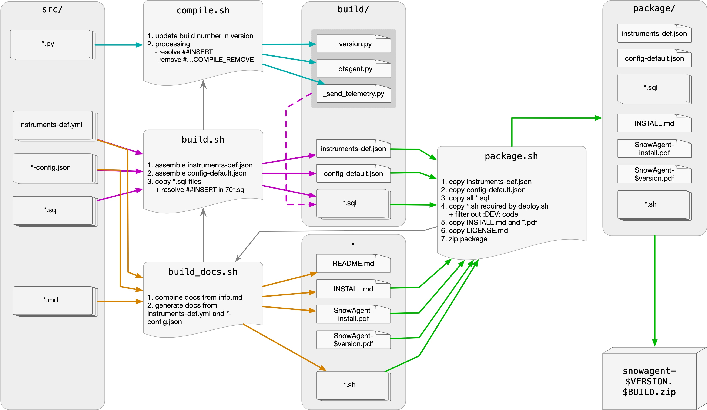

# Contributing

This document is intended for the developers wishing to contribute to Dynatrace Snowflake Observability Agent.

**IMPORTANT** before you contribute with a new plugin or make changes in the existing one, make sure you understand and follow the semantic conventions for naming dimensions, attributes, and metrics.

Table of content:

* [Semantic conventions](#semantic-conventions):
  * [Field and metric naming rules](#field-and-metric-naming-rules)
  * [Snowflake stored procedure, table, and view creation rules](#snowflake-stored-procedure-table-and-view-creation-rules)
  * [On metric types](#on-metric-types)
* [Working with Dynatrace Snowflake Observability Agent source code](#working-with-dynatrace-snowflake-observability-agent-source-code)
  * [Setting up development environment](#setting-up-development-environment)
  * [Building Dynatrace Snowflake Observability Agent](#building-dynatrace-snowflake-observability-agent)
  * [Testing Dynatrace Snowflake Observability Agent locally](#testing-dynatrace-snowflake-observability-agent-locally)
  * [Updating documentation](#updating-documentation)
  * [Packaging Dynatrace Snowflake Observability Agent for distribution](#packaging-dynatrace-snowflake-observability-agent-for-distribution)

## Semantic conventions

### Field and metric naming rules

The following rules apply to naming fields (dimensions, attributes, and metrics) for telemetry generated by Dynatrace Snowflake Observability Agent:

1. Use existing OpenTelemetry or Dynatrace semantics if they express the same field.
1. Custom fields SHOULD start with `snowflake.`
1. ALWAYS use lower-case + `snake_case` for naming.
1. AVOID using measurement units in names; NEVER use them at the end of the field name.
1. DO NOT provide dimensionality information in field name
1. DO NOT produce different names of the same metric depending on the dimension set; this is no longer necessary in 3rd Gen.
1. DO NOT add extension name or technology as part of field name.
1. DO NOT use `.count` suffix.
1. Boolean metrics should have `is_` or `has_` prefix.
1. Use singular and plural properly to reflect the field content.
1. Split with DOT `.` when we can identify a (virtual) object along the field name path.
1. Avoid reporting OBJECT fields returned by Snowflake directly; this can cause objects to be expanded in an uncontrolled fashion. Instead, expand object within the view and describe semantics for those expanded fields.

### Snowflake stored procedure, table, and view creation rules

These rules apply to making Snowflake stored procedures and temporary tables as part of Dynatrace Snowflake Observability Agent.

1. Avoid returning boolean values from Snowflake stored procedures. Instead make them more descriptive e.g. by specifying affected tables.
1. Avoid using `create or replace table` in stored procedures by initializing tables before them and truncating them in the procedure.
1. Grant at least `select` to `DTAGENT_VIEWER` and `ownership` to `DTAGENT_ADMIN` on tables. Granting table ownership should be done as `ACCOUNTADMIN` to make sure it is executed correctly.
1. Create procedures as `DTAGENT_ADMIN` and execute them as `caller` if possible.
1. Grant procedure usage to `DTAGENT_VIEWER`.
1. Include [exception statements](https://docs.snowflake.com/en/sql-reference/snowflake-scripting/exception).
1. For views reported as logs to DT tenant, it is good practice to include `_MESSAGE` column, as it will be automatically mapped to `content` field in logs, otherwise `content` will be set to `context_name` when using `Plugin::_log_entries()`.
1. When naming and referring to objects within the `DTAGENT_DB` make sure that they are called with all uppercase (not `dtagent_db.app...`) names. Lowercase names will not be caught and renamed when deployed with a custom tag - which will cause objects to initialize in the default `DTAGENT_DB` instead of the desired, tagged one.

### On metric types

There are 3 types of metrics defined in [OpenTelemetry Metrics API](https://opentelemetry.io/docs/specs/otel/metrics/api/#counter):

* `counters`: something that we can keep on adding up
* `gauge`: something that gives a number with which we don’t do sum/avg etc
* `histograms`: something that we plan to sum/avg etc, so basically everything else ...

**IMPORTANT:** However, since Dynatrace API only recognizes `counters` and `gauges`, and there are no examples so far of `counter` metrics,
all metrics are sent as `gauge` until further improvements in the Dynatrace Snowflake Observability Agent code.

## Source code overview

The source code of Dynatrace Snowflake Observability Agent is organized into several types of files:

1. **Python sources**: These are compiled into the final Snowpark code for the core stored procedures (`DTAGENT()` and `SEND_TELEMETRY()`).

1. **SQL scripts**: Used to initialize Dynatrace Snowflake Observability Agent and create necessary objects, including views, procedures, and tasks. These scripts are located in `*.sql` folders. The best practice is to prefix all SQL files with three-digit numbers to enforce the proper order of execution. Following prefixes are "reserved" for special type of SQL scripts:

    * `0xx` for core Dynatrace Snowflake Observability Agent initialization, plus plugin specific procedures, views, and other scripts necessary for their execution,
    * `70x` for core procedures,
    * `80x` for task definitions, and
    * `90x` for plugin-specific update procedures.

1. **Configuration files**: Defined for the core and telemetry API, and separately for each plugin. These are located in `*.conf` folders.

1. **Documentation files**: Each part of Dynatrace Snowflake Observability Agent and each plugin has documentation in `info.md` files, located in `*.conf` folders.

1. **Semantic Dictionary files**: Defined in `instruments-def.yml` files, located in `*.conf` folders.

### Core code

The core of Dynatrace Snowflake Observability Agent code is located in the following folders:

* `src/dtagent` contains the Python files,
* `src/dtagent.conf` includes default configuration, documentation, and core semantic dictionary entries, and
* `src/dtagent.sql` contains SQL files used to initialize [Dynatrace Snowflake Observability Agent base objects](ARCHITECTURE.md#dynatrace-snowflake-observability-agent-objects-in-snowflake).

### Internal telemetry API code

The telemetry API Python code is located in the **`src/dtagent/otel`** package, with default configuration is in `src/dtagent.conf/otel-config.json`.

### Plugin code

Each plugin consists of:

* a single Python file (`$plugin_name.py`),
* a `$plugin_name.sql` folder with definition of views, temporary tables, and helper procedures, and
* a `$plugin_name.conf` folder with configuration, semantic dictionary, and plugin documentation.

These are located in the **`src/dtagent/plugins`** directory.

### Bash scripts

Dynatrace Snowflake Observability Agent comes with a number of bash scripts used to support development (see [Working with Dynatrace Snowflake Observability Agent source code](#working-with-dynatrace-snowflake-observability-agent-source-code) for details):

* `./compile.sh` compiles Python code into Snowpark code,
* `./build.sh` builds Snowpark code into SQL scripts,
* `./build_docs.sh` rebuilds documentation, including PDF documents,
* `./package.sh` prepares Dynatrace Snowflake Observability Agent for distribution,
* `./test.sh` runs a single plugin test,
* `./test_core.sh` runs a test in Jenkins context,

and deployment (also delivered in distribution package):

* `./deploy.sh` used to deploy Dynatrace Snowflake Observability Agent,
* `./setup.sh` ensures all prerequisites for deploying Dynatrace Snowflake Observability Agent are met,
* `./install_snow_cli.sh` installs Snowflake CLI,
* `./prepare_deploy_script.sh` generates a single deployment SQL script,
* `./prepare_config.sh` prepares single configuration document for uploading to Snowflake,
* `./prepare_configuration_ingest.sh` prepares SQL script that will update configuration,
* `./prepare_instruments_ingest.sh` prepares SQL script that will update semantic dictionary,
* `./update_secret.sh` is called to setup Dynatrace token as API Key,
* `./refactor_field_names.sh` call to update names of fields in your DQL code,
* `./send_event.sh` is called to send bizevents to Dynatrace to indicate when deployment starts and finishes.

## Working with Dynatrace Snowflake Observability Agent source code

The following figure illustrates all the steps to build code ready to be deployed, build the documentation, and finally prepare the distribution package.



The build process for the Dynatrace Snowflake Observability Agent package involves several steps:

1. **Compilation**: The `compile.sh` script is used to create `_version.py` and complete Python code for both main stored procedures, resulting in a single file for each (`_dtagent.py` and `_send_telemetry.py`). The `##INSERT` directive is used to control the order in which source Python files are assembled into the main one. **NOTE**: When Snowflake reports issues in those stored procedures, the lines in the Python code will correspond to the lines in these two files.
2. **Building and embedding**: The `build.sh` script creates a single default configuration file (`build/config-default.json`) and a semantic dictionary file (`build/instruments-def.json`). It also copies over all SQL files from all `*.sql` folders. During the build process, the compiled Python files are embedded into the templates for the `APP.DTAGENT(sources array)` and `APP.SEND_TELEMETRY(sources variant, params object)` procedures respectively. The corresponding SQL files reference precompiled Python code to be embedded with the `##INSERT` directive.
3. **Documentation Update**: The `build_doc.sh` script ensures that the documentation in `README.md` and PDF files is up to date, including all changes to the default configuration and semantic dictionary definition.
4. **Packaging**: The `package.sh` script copies all files intended for delivery into a separate folder (`package`), which is eventually zipped into an archive with the version and build number in the name.

## Setting up development environment

You will need [Python 3.9](https://www.python.org/) or newer and [git](https://git-scm.com/).
If you are on Windows, you will need to install WSL2. Please refer to the `Prerequisites` in [the installation documentation](INSTALL.md) for more details.

The recommended setup is to use [VS Code](https://code.visualstudio.com/) with [Snowflake plugin](https://marketplace.visualstudio.com/items?itemName=snowflake.snowflake-vsc). Though neither of those are necessary, and any IDE that supports python and SQL should do.
On Windows, after installing WSL, it is necessary to open your IDE of choice using WSL (see [Setting up WSL on VS Code guide)](https://learn.microsoft.com/en-us/windows/wsl/tutorials/wsl-vscode).

## Building Dynatrace Snowflake Observability Agent

If you checked out sources from git, once the environment is set up, before you can deploy your changes to Snowflake or package your release for someone else to deploy it, you need to run:

```bash
./build.sh
```

The build process ensures all SQL and JSON files are ready to be deployed by starting with the invocation of `./compile.sh`, which creates a single Python script for the main Dynatrace Snowflake Observability Agent procedure (`./build/_dtagent.py`) and the telemetry sender procedure (`./build/telemetry.py`). During the build, these Python files are embedded into the templates for the `APP.DTAGENT(sources array)` and `APP.SEND_TELEMETRY(sources variant, params object)` procedures, respectively.". Other source files, including configuration and semantic dictionary, are also copied into the `./build` directory.

After successfully compiling and building the Dynatrace Snowflake Observability Agent, you need to deploy it using the `./deploy.sh` command (see [installation documentation for more details](INSTALL.md)).

## Updating documentation

If you have made any changes to the documentation files (`info.md`), configuration files (`*.conf/*-config.json`), semantic dictionary files (`*.conf/instruments-def.yml`), added a new plugin, or simply want to refresh the documentation, you need to run:

```bash
./build_docs.sh
```

This command will rebuild Dynatrace Snowflake Observability Agent and refresh `README.md`, plus it will deliver `Dynatrace-Snowflake-Observability-Agent-$VERSION.pdf`.

If the build process fails to run, you might need to install the following packages:

```bash
# on macOS
brew install pango cairo gdk-pixbuf libffi
# on Ubuntu
sudo apt-get install libcairo2 libpango-1.0-0 libpangocairo-1.0-0 libgdk-pixbuf2.0-0 libffi-dev
```

In some cases, you may need to also set up `WEASYPRINT_DLL_DIRECTORIES`:

```bash
# on macOS
export WEASYPRINT_DLL_DIRECTORIES=/opt/homebrew/lib
```

## Packaging Dynatrace Snowflake Observability Agent for distribution

In case we want to share Dynatrace Snowflake Observability Agent with other users, we can call:

```bash
./package.sh
```

This will prepare a distribution package called `dynatrace_snowflake_observability_agent-$VERSION.$BUILD.zip`. The package will contain everything that is necessary to distribute Dynatrace Snowflake Observability Agent.

## Testing Dynatrace Snowflake Observability Agent locally

After successfully deploying the Dynatrace Snowflake Observability Agent, you can run tests using:

```bash
./test.sh $test_name
```

All tests are implemented with the `pytest` framework and stored in the `test` folder. Before running the tests, make sure to create the `test/credentials.json` file from the `test/credentials.jsonc` template.

Parameter `$test_name` is required and needs to be the name of the file - excluding the extension - from the `/test/plugins` directory that you want to run. The test files follow the naming pattern `/test/plugins/test_*.py`.

To test a single plugin, you can call:

```bash
./test.sh test_$plugin_name
```

If you want to (re)initialize the test data, you need to run:

```bash
./test.sh test_$plugin_name -p
```

The SQL files stored in the `test` folder can be used to run some additional tests manually.
