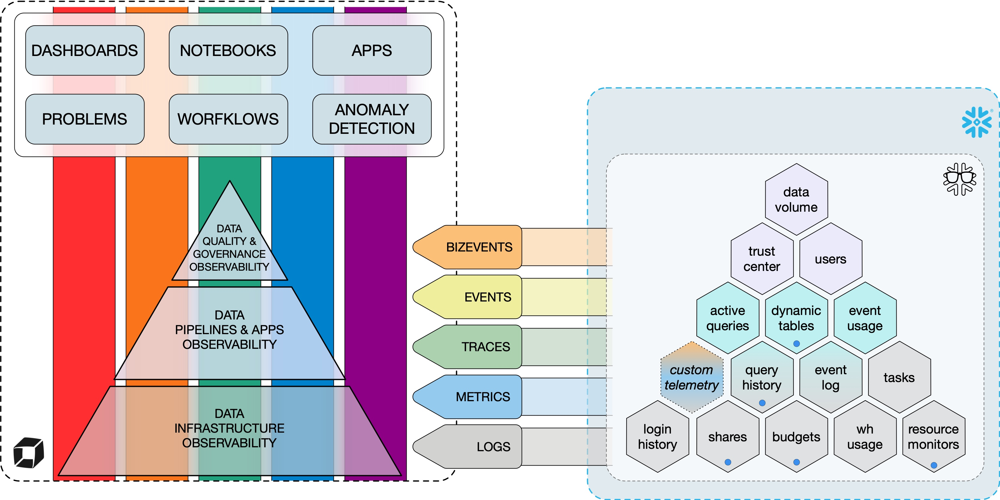

# Dynatrace Snowflake Observability Agent

{width=200px}

**Dynatrace Snowflake Observability Agent** is a powerful tool designed to enhance [Data Platform Observability](#data-platform-observability) within the Snowflake environment. It complements Dynatrace's capabilities by [extending observability](#plugins) into areas where traditional OneAgent or synthetic monitoring may not reach. Dynatrace Snowflake Observability Agent provides comprehensive telemetry for monitoring, analyzing, and detecting anomalies in data processing. It delivers observability data in the form of OpenTelemetry [logs](#sending-logs) and [spans](#sending-tracesspans), as well as Dynatrace [metrics](#sending-metrics), [events](#sending-events), and [business events (CloudEvents)](#sending-bizevents), ensuring a seamless integration with Dynatrace's observability platform.

Table of content:

* [Data Platform Observability](#data-platform-observability)
* [Use cases](#use-case-highlights)
* [Architecture](#architecture-and-core-capabilities)
* [Plugins](#plugins)
* [Semantic dictionary](#semantic-dictionary)
* [How to install](#how-to-install)
* [Changelog](#changelog)
* [Contributing](#contributing)
* [Appendix A: Migrating semantics from version 0.7 to 0.8](#appendix-a-sec)
* [Appendix B: Migrating meta-field semantics to version 0.8.3 or higher](#appendix-b-sec)

## Data Platform Observability

In today's data-driven world, maintaining a robust and efficient data platform is crucial. As organizations increasingly rely on data to drive decision-making, especially with the advent of AI and large language models (LLMs), ensuring the timely delivery of high-quality data while keeping costs under control and maintaining operational efficiency and security is paramount. This is where Data Platform Observability (DPO) comes into play.

* [Why observability is crucial](#why-observability-is-crucial)
* [The five core themes of DPO](#the-five-core-themes-of-dpo)
* [The three tiers of Data Platform Observability](#the-three-tiers-of-data-platform-observability)
* [Aligning the three tiers with the five themes](#aligning-the-three-tiers-with-the-five-themes)
* [How Dynatrace can help](#how-dynatrace-can-help)

### Why observability is crucial

**Data Platform Observability (DPO)** refers to the ability to fully understand the health and performance of your entire data ecosystem. It encompasses monitoring, tracking, and analyzing the usage and processing of data across various stages to ensure they meet the required standards of quality, performance, and security. As data platforms grow in complexity and scale, the need for observability becomes increasingly critical.

When you do not adhere to the Data Platform Observability paradigm and lose track of the overall health of your data platform, you risk not only losing credibility (by delivering late or poor-quality data) but also incurring monetary losses:

* [According to Gartner](https://www.decube.io/post/data-observability-use-case-finance), poor data quality costs organizations an average of **$12.9 million annually**. This includes losses from inefficiencies, missed opportunities, and compliance penalties. For instance, in the financial industry, data observability can help avoid losses due to bad data quality, which can cost over **$14 million a year**.
* [The IBM Cost of a Data Breach Report 2023](https://www.wissen.com/blog/data-security-and-privacy-challenges-in-modern-data-pipelines) highlights that the global average cost of a data breach was **$4.45 million**. Implementing robust observability can help detect and mitigate security threats early, reducing the risk and associated costs.
* Data Platform Observability ensures that data pipelines function smoothly, detecting anomalies and inefficiencies before they impact end-users. This can lead to [improved operational efficiency and reduced downtime](https://dagster.io/guides/data-governance/data-observability-in-2025-pillars-pros-cons-best-practices), which translates to cost savings; extended observability implemented by [Netflix enabled it to improve the reliability of the data pipelines](https://www.acceldata.io/article/critical-use-cases-for-data-observability-that-can-save-your-business-money) and [Airbnb to optimize their usage and costs](https://aws.amazon.com/solutions/case-studies/airbnb-optimizes-usage-and-costs-case-study/).
* Effective data governance, supported by observability, helps maintain data quality and compliance with regulations. This is crucial for [avoiding fines and maintaining customer trust](https://www.liquibase.com/blog/data-database-governance-challenges-that-risk-pipeline-productivity-potential).
* Observability can help in [managing and optimizing costs](https://www2.deloitte.com/us/en/pages/consulting/articles/data-observability.html) by providing insights into resource usage and identifying areas where efficiencies can be gained.

### The five core themes of DPO

{style="width: 1500px; max-width: 100%; max-height: 100%;"}

Building on the importance of Data Platform Observability (DPO) in ensuring the health and performance of your data ecosystem, we can analyze DPO through five core themes:

* [security](#security-theme),
* [operations](#operations-theme),
* [costs](#costs-theme),
* [performance](#performance-theme),
* [quality](#quality-theme).

These themes highlight the various aspects where observability plays a crucial role in maintaining and optimizing your data platform. [By thoroughly examining each theme](https://www.montecarlodata.com/blog-data-observability-use-cases/), we can better understand how DPO contributes to overall data quality, security, operational efficiency, cost management, and performance optimization.

Let's dive deeper into each of these themes, starting with the Security theme.

#### Security theme

Data Platform Observability (DPO) plays a crucial role in maintaining the security of your data ecosystem. By implementing robust security measures, organizations can prevent data breaches, protect sensitive information, and ensure compliance with regulatory standards. Here are some key aspects of the security theme.

* **Centralized analysis** enables the Chief Information Security Officer (CISO) to conduct regular security audits and vulnerability assessments. These audits are essential for identifying weaknesses in the digital infrastructure and ensuring compliance with industry standards. Regular security audits help safeguard sensitive data, reduce the likelihood of data breaches, and avoid costly penalties. For example, non-compliance with regulations like GDPR can result in fines of up to [€20 million or 4% of annual global turnover](https://qualysec.com/what-is-it-security-audits/):

* **Detecting anomalies** is a powerful tool for identifying irregularities in data access and usage. By leveraging machine learning and statistical methods, organizations can detect outliers that may indicate security threats, such as [unauthorized transactions or operational hiccups](https://www.mindbridge.ai/blog/anomaly-detection-techniques-how-to-uncover-risks-identify-patterns-and-strengthen-data-integrity/). Effective anomaly detection helps improve [prevent fraud and ensure compliance with security standards](https://www.tinybird.co/blog-posts/real-time-anomaly-detection).

* [**User activity monitoring (UAM)**](https://www.teramind.co/blog/user-activity-monitoring/) is critical for detecting and preventing security threats. By tracking user actions across devices, networks, and applications, organizations can identify suspicious behavior and respond promptly. Key aspects of UAM include:

  * **Detecting increases in login failures** helps identify potential brute force attacks or unauthorized access attempts. [An increase in login failures](https://karim-ashraf.gitbook.io/karim_ashraf_space/writeups/advanced-log-analysis/how-to-detect-and-respond-to-brute-force-attacks-using-log-data) can signal a security threat that needs immediate attention.
  * **Identifying abnormal login behavior** involves analyzing login patterns, such as frequency and origin IP, to detect unusual activities that [may indicate compromised accounts](https://medium.com/@RocketMeUpCybersecurity/using-behavioral-analytics-to-identify-anomalous-user-activity-6788db431f71).
  * **Tracking key pair rotation** ensures that [cryptographic keys are updated and managed securely](https://apidog.com/blog/api-key-rotation-best-practices-for-enhanced-security/#5-monitor-key-usage), reducing the risk of unauthorized access.
  * **Analyzing anomalies in data access** helps prevent data breaches by identifying [unusual or potentially harmful admin activities](https://cyberinsight.co/what-is-a-behavioral-analysis-in-cyber-security/). Detecting these anomalies is crucial.
  * **Monitoring sensitive data protection** ensures that sensitive data is protected with masking mechanisms, [helping to prevent unauthorized access and data leaks](https://www.digitalguardian.com/blog/what-user-activity-monitoring-how-it-works-benefits-best-practices-and-more).

[The financial impact of data breaches can be significant](https://gettrusted.io/blog/the-real-cost-of-data-breaches-in-2024-2025/). The global average cost of a data breach surged to **$4.88 million in 2024**, with industries like healthcare and finance facing even higher costs due to the sensitive nature of their data. Implementing robust security measures, including regular audits, user activity monitoring, and anomaly detection, can help mitigate these risks and reduce the associated costs.

By focusing on these key aspects, organizations can enhance their security posture, protect sensitive data, and avoid the financial and reputational damage associated with data breaches.

#### Operations theme

Ensuring the smooth operation of your data ecosystem requires a robust approach to observability. By monitoring infrastructure and applications, organizations can detect and resolve issues promptly, optimize performance, and prevent resource wastage. Here are the main elements of the operations theme:

##### Infrastructure monitoring

Infrastructure monitoring involves tracking the performance, availability, and health of various components within your data platform. [This includes servers, virtual machines, containers, databases, and more](https://www.ibm.com/think/topics/infrastructure-monitoring).

* **Monitoring data flow** ensures that data flows as expected (through [scheduled tasks, data streams](https://docs.snowflake.com/en/user-guide/data-pipelines-intro), or [dynamic table refreshes](https://docs.snowflake.com/en/user-guide/dynamic-tables-monitor)) to maintain data integrity and availability. A notable example is the [2012 Knight Capital Group incident](https://www.henricodolfing.com/2019/06/project-failure-case-study-knight-capital.html), where a software glitch due to an unmonitored, reactivated old code led to erroneous trades. This oversight resulted in a $440 million loss within 45 minutes, highlighting the critical need for robust monitoring mechanisms to prevent such costly errors.

* **Identifying breaking changes in data shares** helps maintain data compatibility and prevents disruptions in data workflows. For example, [monitoring for changes in the schema of shared data](https://quickstarts.snowflake.com/guide/monitor_schema_drift_in_data_shares_with_sharewatch/index.html#0), such as a column being renamed or removed, is crucial to avoid undetected issues.

* **Monitoring uptime** ensures the availability and performance of critical infrastructure components. [FedEx suffered a major outage](https://finance.yahoo.com/news/fedex-experienced-network-disruptions-due-134013340.html) that halted their operations for several hours, resulting in millions of dollars in lost revenue and damaged reputation.

##### Apps Monitoring

Application monitoring focuses on tracking the performance and health of running applications, procedures, and data pipelines. This helps prevent resource exhaustion and ensures efficient execution of data workflows.

* **Monitoring running apps, procedures, and pipelines** involves tracking their status and performance to identify bottlenecks and optimize resource usage. For instance, [Walmart experienced significant slowdowns during peak shopping periods](https://www.wsj.com/business/retail/walmart-computer-glitch-halts-sales-and-returns-at-stores-02858f45) due to unoptimized application performance, leading to lost sales and frustrated customers.

* **Preventing resource exhaustion** requires monitoring resource usage and setting up alerts for resource consumption to prevent unexpected costs and ensure efficient use of resources. Even tech giants like Twitter are not immune to the perils of CPU exhaustion. [A case study from Twitter](https://danluu.com/cgroup-throttling/) revealed that their most CPU-bound services started experiencing performance degradation and failures when CPU utilization reached around 50% of their reserved container capacity. This unexpected behavior, despite having theoretically available resources, highlights the complexities of resource management in containerized environments and the importance of understanding the interplay between CPU allocation, thread management, and scheduling mechanisms.

* **Gaining insights into app and pipeline execution** provides detailed understanding of performance patterns and identifies areas for improvement. [Netflix improved their user experience](https://www.33rdsquare.com/netflix-case-study-eda-unveiling-data-driven-strategies-for-streaming/) by analyzing and optimizing their data pipelines, resulting in reduced buffering times and increased customer satisfaction.

By focusing on these key aspects, organizations can enhance their operational efficiency, prevent downtime, and optimize resource usage, ultimately leading to cost savings and improved performance.

#### Costs theme

**Cost Management and Optimization** is crucial for maintaining financial efficiency and ensuring that resources are utilized effectively. By proactively managing resources, monitoring costs, and optimizing warehouse parameters, organizations can achieve significant cost savings and improve overall performance. Here are the main elements of the costs theme:

##### Resource management

**Proactively managing resource monitors** and **tracking centralized budgets** is essential for optimizing warehouse parameters based on usage analysis. Effective resource management involves adjusting resource allocation to meet changing demands. For example, [a case study on project strategy and budget management](https://www.datatobiz.com/case-studies/project-strategy-and-budget-management-with-ecac-dashboard/) with an ECAC dashboard demonstrated how real-time visibility into project costs improved cost estimation accuracy by 18% and reduced budget deviations by 8%. This approach helps ensure efficient resource utilization and cost control.

Combining spending limits, linked resources, and spending history provides a comprehensive view of costs. This allows for early identification of cost overruns or underruns, enabling proactive measures to be taken. A case study from Netflix demonstrated how they used a centralized data platform to tag, track, and manage their cloud costs effectively. By implementing detailed cost monitoring and reporting, [Netflix was able to optimize their cloud resource usage](https://dyota.substack.com/p/aws-case-study-netflixs-automated), resulting in significant cost savings and improved budget management.

##### Cost monitoring

Detecting long-running and failed queries, monitoring data ingestion costs, and tracking credits used by serverless tasks are key aspects of cost monitoring. These practices help prevent unexpected expenses and ensure efficient resource usage.

**Monitoring long-running queries** helps identify performance bottlenecks and optimize query execution. For instance, [a case study on managing long-running queries in MySQL](https://www.atatus.com/blog/managing-long-running-queries-mysql/) showed how using slow query logs and performance schema improved database performance.

**Tracking data ingestion costs** used during events helps manage expenses effectively. [A case study on automating data ingestion for Marubeni Power](https://futuralis.com/case-study/marubeni-power/) demonstrated how serverless solutions improved efficiency and reduced operational overheads.

Additionally, **monitoring credits spent by serverless tasks** ensures that resources are used efficiently. A practical case for serverless architecture highlighted the benefits of [using AWS services to simplify infrastructure management and optimize costs](https://www.forbes.com/councils/forbestechcouncil/2025/03/03/the-practical-case-for-serverless-simplifying-infrastructure-with-serverless-architecture/).

##### Optimizing warehouse parameters

Optimizing warehouse parameters based on usage analysis is vital for ensuring efficient resource utilization and cost savings.

**Analyzing usage patterns** helps optimize Snowflake virtual warehouses and improve performance. A case study from Snowflake demonstrated how a company used the Information Schema to profile their warehouse usage. By leveraging functions like `WAREHOUSE_LOAD_HISTORY` and `WAREHOUSE_METERING_HISTORY`, they were able to gather detailed information about their virtual warehouse usage, identify inefficiencies, and optimize their compute resources. [This led to significant cost savings and improved performance](https://www.snowflake.com/en/blog/understanding-snowflake-utilization-warehouse-profiling/).

**Monitoring data volume growth** helps manage storage costs effectively. [A comprehensive survey of anomaly detection techniques](https://journalofbigdata.springeropen.com/articles/10.1186/s40537-020-00320-x) for high-dimensional big data discussed methods for identifying and addressing data anomalies.

By focusing on these key aspects, organizations can enhance their cost management strategies, prevent unexpected expenses, and optimize resource usage, ultimately leading to significant cost savings and improved performance.

#### Performance theme

Performance management is essential for ensuring efficient and effective database operations. By monitoring and optimizing query performance, organizations can identify and address bottlenecks, enhance resource utilization, and improve overall system efficiency.

Providing **detailed query status** information helps manage performance effectively. Knowing the count, fastest, slowest, and average running time of queries is crucial. Tracking how long queries have been running helps identify performance bottlenecks. [An article from Secoda](https://www.secoda.co/glossary/query-monitoring) explains how query monitoring optimizes database performance by tracking query behavior and addressing issues like slow execution and resource bottlenecks. It emphasizes the importance of metrics such as execution time, resource usage, and query volume.

In his article, [Ramdoss explores](https://ijsra.net/content/enhancing-database-query-performance-cost-optimization-approach) various **query optimization techniques**, including cost-based analysis, indexing, and execution plan analysis. It highlights the significance of understanding query performance metrics to ensure efficient data management and improve user experience.

By focusing on these key aspects, organizations can enhance their performance management strategies, prevent unexpected expenses, and optimize resource usage, ultimately leading to significant cost savings and improved performance.

##### Detecting and analyzing slow queries

Identifying and addressing slow queries is crucial for maintaining optimal database performance.

**Detecting common query performance anti-patterns**, such as Cartesian joins, can significantly improve query efficiency. [A case study on SQL anti-patterns](https://sonra.io/mastering-sql-how-to-detect-and-avoid-34-common-sql-antipatterns/) highlights how avoiding these can enhance performance. Another study on Azure SQL's query anti-pattern event demonstrates how detecting these patterns can prevent performance issues. A practical guide on query optimization discusses methods to diagnose and resolve such issues.

**Monitoring for anomalies** helps identify queries that are slower than usual. [Kamatchi and Suri discuss](https://www.academia.edu/31463105/IMPROVING_ETL_SQL_EXECUTION_THROUGH_ANOMALY_DETECTION) anomaly detection techniques applied to SQL query execution times can significantly enhance ETL process efficiency by identifying and addressing abnormal changes in execution times.

**Identifying and optimizing costly, repeated queries** can reduce resource consumption. [An article from WebCE](https://blog.webce.com/article/database-query-performance-case-studies%3A-repeated-queries) explores how SQL Server’s Query Store feature was used to identify and troubleshoot repeated queries. It discusses leveraging caching in the application layer to reduce the frequency of repeated queries and improve performance.

##### Identifying tables leading to query slowdown

Recognizing tables that contribute to slow queries is essential for improving overall performance. Tables that slow down queries can be optimized to enhance performance. [Optimizing table structures](https://datatas.com/table-structure-and-its-impact-on-performance/), including normalization, indexing, and choosing appropriate data types, can significantly improve query processing speed and overall database efficiency.

##### Optimizing warehouses

Optimizing warehouse parameters based on usage analysis ensures efficient resource utilization and cost savings.

**Analyzing usage patterns** helps optimize virtual warehouses. [An article from Snowflake](https://www.snowflake.com/en/blog/understanding-snowflake-utilization-warehouse-profiling/) explains how profiling warehouse usage in Snowflake can help identify patterns and optimize resource allocation, leading to increased speed of data processing and significant cost reductions.

**Monitoring warehouse loads** helps determine resource needs and optimize warehouse sizes. [A case study from Snowflake](https://medium.com/snowflake/mastering-snowflake-warehouse-utilization-a-deep-dive-into-the-warehouse-utilization-view-855fa72fdf11) demonstrates how the WAREHOUSE_UTILIZATION view provides detailed insights into resource consumption, enabling effective cost optimization and performance improvements. The Snowflake web interface and [`QUERY_HISTORY` view](https://docs.snowflake.com/en/sql-reference/account-usage/query_history) allow for [analysis of concurrent queries processed by a warehouse](https://docs.snowflake.com/en/user-guide/warehouses-load-monitoring), helping to identify periods of high and low utilization for better resource management.

#### Quality theme

The exponential rise in data generation brings new challenges in ensuring data quality. Data Platform Observability (DPO) helps address these challenges by providing insights into the entire data lifecycle, from ingestion to usage. This involves monitoring and managing data systems to ensure data remains reliable, accurate, and timely. Effective data quality management is essential for making informed decisions and optimizing digital operations.

Here are five pillars of data observability that help us realize the quality theme, extended with detailed points and case studies.

##### Freshness

Freshness refers to the timeliness of the data. In an ideal data ecosystem, all data is as current as possible. [Observing the freshness of data](https://www.anomalo.com/blog/defining-data-freshness-measuring-and-monitoring-data-timeliness/) helps to ensure that decisions are based on the most recent and relevant information. [Monitoring table refresh events ensures up-to-date information](https://datahubproject.io/learn/data-freshness/). For example, a financial institution relying on outdated data for forecasting may face misguided decisions and misallocated resources; implementing data freshness monitoring will help to make accurate projections and optimize investments.

##### Distribution

Distribution is the statistical spread or range of the data. Data distribution is essential in identifying patterns, outliers, or anomalies. Deviation from the expected distribution can signal an issue in data collection or processing. Identifying patterns and anomalies helps maintain data integrity. A retail company used data distribution monitoring to detect anomalies in sales data, leading to the identification of a data processing error that was causing inaccurate sales reports.

[Chip Huyen discusses the importance of monitoring data distribution shifts](https://huyenchip.com/2022/02/07/data-distribution-shifts-and-monitoring.html) and provides examples of how deviations can impact model performance. This article includes a case study on a company that faced issues due to data distribution shifts in their machine learning model.

##### Volume

Volume refers to the quantity of data generated or processed during a certain time period. Unexpected increases or drops in the data volume are usually good indicators of undetected issues. The volume aspect often overlaps with data freshness, making it challenging to determine whether the expected but missing data will arrive later or if it's permanently lost. Understanding data growth and its impact on performance is crucial.

[A case study from Neev Data](https://dqops.com/what-is-data-volume/) discusses how a consumer electronics retailer managed data growth by archiving inactive data, which improved system performance and stability.

##### Schema

Schema refers to the structure or format of the data, including the data types and relationships between different entities. Observing the schema can help identify and flag unexpected changes, like the addition of new fields or the removal of existing ones. Understanding the structure, content, and quality of data is essential. An ETL process improvement initiative used data profiling to identify and resolve schema inconsistencies, ensuring high-quality data for analytics.

[An article from DQLabs.ai](https://www.dqlabs.ai/blog/what-are-schema-changes-and-how-does-that-affect-your-data-reliability/) explores the impact of schema changes on data reliability and provides strategies for detecting and monitoring these changes.
[Another article from DQOps discusses schema changes and drifts](https://dqops.com/schema-changes-and-drifts-definition-examples/), providing definitions, examples, and best practices for managing and monitoring schema changes. Both emphasize the use of data observability tools to continuously monitor schema drifts.

##### Lineage

Lineage is the journey of the data through a system. It provides insights into where the data comes from (upstream) and what it affects (downstream). Data lineage plays a crucial role in root cause analysis as well as informing impacted systems about an issue as quickly as possible. Understanding data flow and transformations from source to destination is vital.

[Mizrahi discusses](https://www.secoda.co/blog/data-lineage-in-action-case-studies-across-industries) real-world examples of how different industries use data lineage to enhance data transparency and operational efficiency. It highlights the importance of tracking data lineage for root cause analysis and issue resolution.
[In his article from Analytics Vidhya, Shukla discusses](https://www.analyticsvidhya.com/blog/2022/11/data-lineage-case-studies-of-data-driven-businesses/) how companies like Netflix, Slack, and Postman have implemented data lineage to improve their data management practices and operational efficiency. [Mitich provides examples on how column-level data lineage helps companies](https://www.selectstar.com/resources/column-level-data-lineage-in-action-5-real-world-examples) across various industries detect data quality issues, streamline compliance, and improve decision-making. For example, Bowery Farming improved data visibility and reduced support tickets, while Xometry saved millions by reducing data outages and improving data accuracy.

By focusing on these five pillars of data observability, organizations can ensure high data quality, which is essential for making informed decisions and optimizing digital operations.

### The three tiers of Data Platform Observability

To effectively implement Data Platform Observability across all five themes—security, operations, costs, performance, and quality—we need to gather and analyze telemetry across the three tiers that constitute the Data Platform.

It can be a challenging task, especially when using a diverse stack of tools and platforms, e.g., AWS (EC2), Snowflake, custom Java services for ETL, dbt, PowerBI, and DataHub. Some common challenges include:

* **Integration**: Ensuring seamless integration between different tools and platforms to provide a unified view of the data ecosystem.
* **Metadata management**: Managing and ingesting metadata from various sources to maintain data visibility and governance.
* **Scalability**: Handling large-scale environments without impacting performance.
* **Collaboration**: Facilitating collaboration between data engineers, analysts, and business stakeholders.

{width=60%}

#### T1. Data Infrastructure Observability

Monitoring infrastructure components such as CPU, memory, and network usage is crucial. By collecting telemetry data on resource utilization, system health, and performance metrics, we gain visibility into the underlying infrastructure's health. This helps identify bottlenecks and optimize resource allocation.

[Acceldata discusses](https://www.acceldata.io/article/top-ten-use-cases-for-data-observability) various use cases for data observability, including infrastructure design, capacity planning, and performance tuning. This article highlights how observability can optimize resource allocation and improve system performance

#### T2. Data Apps and Pipelines Observability

[Monitoring orchestration events, tasks, and pipeline execution ensures smooth operation](https://firsteigen.com/blog/top-data-pipeline-monitoring-tools/). By tracking the execution of data pipelines, including task completion times, error rates, and data flow, we can detect and resolve issues promptly, improving the reliability of data processing. This proactive approach minimizes downtime and enhances overall system performance, ensuring that data-driven decisions are based on accurate and timely information.

#### T3. Data Quality and Governance Observability

Implementing data quality checks and monitoring data lineage ensures data integrity and compliance. By collecting telemetry on data quality metrics, lineage, and governance policies, we can track data flow and transformations, maintaining high data quality standards.

[An article by IBM](https://www.ibm.com/think/topics/data-lineage-for-healthcare) discusses the importance of data lineage in healthcare for ensuring data integrity and compliance. It highlights how data lineage helps healthcare organizations manage data accuracy, quality, and integrity, leading to better patient outcomes. [This guide covers](https://www.clindcast.com/the-guide-to-healthcare-data-quality-management-in-2025/) various aspects of healthcare data quality management, including data quality metrics, governance policies, and the impact of data quality on patient outcomes. It emphasizes the importance of maintaining high data quality standards to ensure compliance and improve patient care.

### Aligning the three tiers with the five themes

To provide a comprehensive observability strategy, it's essential to align the three tiers with the five key themes:

#### Security

* T1: Monitor for unauthorized access and unusual activity.
* T2: Track data access patterns and secure sensitive data.
* T3: Ensure data compliance with security policies.

#### Operations

* T1: Optimize resource allocation and reduce downtime.
* T2: Ensure smooth and efficient data processing.
* T3: Maintain operational data quality and governance standards.

#### Costs

* T1: Identify and eliminate resource wastage.
* T2: Optimize pipeline efficiency to reduce processing costs.
* T3: Prevent costly data quality issues and compliance fines.

#### Performance

* T1: Enhance system performance through proactive monitoring.
* T2: Improve data processing speeds and reliability.
* T3: Ensure high-quality data for accurate and timely insights.

#### Quality

* T1: Maintain high availability and reliability of infrastructure.
* T2: Ensure data pipelines deliver accurate and timely data.
* T3: Continuously monitor and improve data quality standards.

By integrating observability across these three tiers and aligning them with the five themes, organizations can mitigate the aforementioned challenges and achieve a holistic view of their data platform, ensuring optimal performance, security, and cost-efficiency.

### How Dynatrace can help

Though there is a lot of focus on the data quality, we can see is just a piece of a puzzle, placed in the upper-right corner of the larger Data Platform Observability picture. In order to deliver valuable data products, we need to make sure we don't consider data product delivery operating in the vacuum. Therefore, implementing Data Platform Observability (DPO) is essential for maintaining the security, operational efficiency, cost-effectiveness, performance, and quality of data platforms.

Dynatrace provides a comprehensive solution to achieve this across three observability tiers: infrastructure, applications/pipelines, and quality/governance.

{width=60%}

Dynatrace integrates multiple data sources, including Snowflake, to offer a holistic view of the data platform. This integration enhances monitoring and proactive issue resolution, ensuring high data quality for both internal and external customers. By combining multiple telemetry sources, Dynatrace provides a comprehensive view of costs, performance, and security.

Key questions to consider include how to leverage telemetry data from Snowflake and integrate it with Dynatrace for comprehensive monitoring, and how Dynatrace’s tools—such as dashboarding, workflows, anomaly detection, and problem reporting—enhance the ability to monitor and improve data quality proactively. Additionally, understanding the functional requirements, such as table size monitoring and data quality check integration, is crucial for providing real-time insights and proactive issue resolution.

By addressing these questions and focusing on the key aspects of security, operations, costs, performance, and quality, organizations can enhance their data quality management strategies, prevent data-related issues, and optimize digital operations. This ultimately leads to significant improvements in data reliability and decision-making.

Dynatrace's advanced observability capabilities include advanced dashboarding, which provides detailed dashboards, workflows, and alerting capabilities for efficient monitoring and management. AI-powered insights utilize AI to detect anomalies, identify root causes, and provide actionable insights. Seamless integration with various tools and platforms ensures a comprehensive observability solution.

Leveraging Dynatrace's advanced observability capabilities enables organizations to effectively implement DPO, ensuring robust data quality management and operational excellence across their data platforms.

## Use Case Highlights

Dynatrace Snowflake Observability Agent delivers telemetry to implement all five [Data Platform Observability](#data-platform-observability) themes. Here are some example use cases which can be realized with observability data gathered and delivered to Dynatrace by Dynatrace Snowflake Observability Agent.

* [Theme: Security](#theme-security)
* [Theme: Operations](#theme-operations)
* [Theme: Costs](#theme-costs)
* [Theme: Performance](#theme-performance)
* [Theme: Quality](#theme-quality)

### Theme: Security

| Use case                     | In Details                                                                                                                                                                                                 | Data                          |
|------------------------------|-----------------------------------------------------------------------------------------------------------------------------------------------------------------------------------------------------------|-------------------------------|
| Warehouse security monitoring | We can detect potential data security issues and breaches as quickly as possible. We gather information about these security issues as well as entities put at risk by the vulnerabilities.                | [Trust Center plugin](#trust_center_info_sec) |
| Log in and session monitoring | We provide detailed information on logging history and sessions, which is essential for detecting security breaches.                                                                                       | [Login History plugin](#login_history_info_sec) |

### Theme: Operations

| Use case                     | In Details                                                                                                                                                                                                 | Data                          |
|------------------------------|-----------------------------------------------------------------------------------------------------------------------------------------------------------------------------------------------------------|-------------------------------|
| Predicting credits exhaustion | We can be smarter than static threshold sending (or not) emails that a resource monitor's credits are going over the threshold. We could actually, by analyzing costs so far, predict whether they would suffice by the time the resource monitor resets. | [Warehouse Usage plugin](#warehouse_usage_info_sec) |
| Snowflake Trail monitoring   | We gather information from Snowflake Trail which provides enhanced visibility into pipeline health.                                                                                                        | [Event Log plugin](#event_log_info_sec) |

### Theme: Costs

| Use case                     | In Details                                                                                                                                                                                                 | Data                          |
|------------------------------|-----------------------------------------------------------------------------------------------------------------------------------------------------------------------------------------------------------|-------------------------------|
| Resource monitors analysis   | It is not often so simple to determine if the credits limit set on a resource monitor is enough or too much, or might be too little in the near future. With more detailed data, we should be able to analyze it better. | [Resource Monitors plugin](#resource_monitors_info_sec) |
| Budgets analysis             | Combines budget details like spending limits and linked resources, as well as their spending history to allow for complete and comfortable analysis of costs.                                              | [Budgets plugin](#budgets_info_sec) |
| Ingest cost analysis         | Allows for monitoring of data ingestion, credits used during the events, and bytes ingested.                                                                                                              | [Event Usage plugin](#event_usage_info_sec) |
| Serverless tasks analysis    | We can monitor credits spent by serverless tasks which play a vital role in relying on compute resources managed by Snowflake.                                                                             | [Tasks plugin](#tasks_info_sec) |
| Warehouse metering history   | We can monitor the spending of particular warehouses and possibly predict trends in their expenses.                                                                                                        | [Warehouse Usage plugin](#warehouse_usage_info_sec) |

### Theme: Performance

| Use case                     | In Details                                                                                                                                                                                                 | Data                          |
|------------------------------|-----------------------------------------------------------------------------------------------------------------------------------------------------------------------------------------------------------|-------------------------------|
| Query slowdowns              | With anomaly detection we should be able to detect queries that go slower in given context (query tag, table, …)                                                                                           | [Query History plugin](#query_history_info_sec) |
| Table slowdowns              | We would like to know if certain tables should be reindexed to improve performance, i.e., query slowdown may indicate deterioration of table data structure over time, but we should not limit our analysis only to tables that are slow all the time. | [Query History plugin](#query_history_info_sec) |
| Warehouse optimization       | Do we use the right warehouses for the job? Too big or too small?                                                                                                                                          | [Query History plugin](#query_history_info_sec) |
| Multi-level query analysis   | Why are our procedures or functions slow?                                                                                                                                                                  | [Query History plugin](#query_history_info_sec) |
| Detect costly repeated queries | Taking into account the size of the warehouse, we should detect the most costly queries.                                                                                                                  | [Query History plugin](#query_history_info_sec) |
| Monitoring tasks performance | We can monitor and report on task performance to verify if there are any slowdowns or failing tasks.                                                                                                       | [Tasks plugin](#tasks_info_sec) |
| Monitor warehouse loads      | We can monitor the loads put on warehouses to determine which could benefit from additional resources or which don’t utilize their resources fully.                                                        | [Warehouse Usage plugin](#warehouse_usage_info_sec) |
| Query summary                | We provide a summary of queries, giving their count, fastest, slowest, and average running time. This can be useful in detecting slowdowns.                                                                | [Active Queries plugin](#active_queries_info_sec) |
| Current Queries monitoring   | What is the status of my query? How long has it been running?                                                                                                                                              | [Active Queries plugin](#active_queries_info_sec) |

### Theme: Quality

| Use case                     | In Details                                                                                                                                                                                                 | Data                          |
|------------------------------|-----------------------------------------------------------------------------------------------------------------------------------------------------------------------------------------------------------|-------------------------------|
| Data volume monitoring       | We want to understand how data volume in monitored databases, schemas, and tables changes over time; especially if there are any anomalies in the change.                                                  | [Data Volume plugin](#data_volume_info_sec) |
| Snowflake Trail monitoring   | We gather information from Snowflake Trail which provides enhanced visibility into data quality.                                                                                                           | [Event Log plugin](#event_log_info_sec) |

## Architecture and Core Capabilities

Dynatrace Snowflake Observability Agent was designed to augment [Data Platform Observability](#data-platform-observability) capabilities already offered by Dynatrace with OneAgent and custom telemetry (including logs and bizevents) delivered by ETL and other applications. Dynatrace Snowflake Observability Agent aims to fullfil the promise of Data Platform Observability by delivering telemetry data already present in Snowflake directly to Dynatrace as logs, traces, events, and metrics. Depending on what type of telemetry is sent by given Dynatrace Snowflake Observability Agent plugin one or more [Data Platform Observability themes](#the-five-core-themes-of-dpo) can be supported over one or multiple [layers of Data Platform Observability](#the-three-tiers-of-data-platform-observability).

{style="width: 1000px; max-width: 100%; max-height: 100%;"}

The main capabilities offered by Dynatrace Snowflake Observability Agent are:

1. **Data Collection**: Dynatrace Snowflake Observability Agent collects and parses useful observability data from various Snowflake sources.
2. **Data Transmission**: After collecting and parsing the information, Dynatrace Snowflake Observability Agent sends it to Dynatrace tenants where it is easily accessible and ready for analysis.
3. **Alerting**: Dynatrace Snowflake Observability Agent can send alerts regarding specific information, e.g., potential security breaches, unmonitored warehouses, directly during data parsing, as well as using workflows and anomaly detections set up on the Dynatrace tenant.
4. **Visualization**: Dynatrace Snowflake Observability Agent delivers telemetry which facilitates building Dynatrace dashboards that ease the process of data analysis.

Table of content:

* [High-Level overview](#high-level-overview)
* [Dynatrace Snowflake Observability Agent objects in Snowflake](#dynatrace-snowflake-observability-agent-objects-in-snowflake)
  * [The `APP` schema](#the-app-schema)
  * [The `CONFIG` schema](#the-config-schema)
  * [The `STATUS` schema](#the-status-schema)
* [Telemetry flow](#telemetry-flow)
* [Internal API for sending telemetry](#internal-api-for-sending-telemetry)
  * [Sending logs](#sending-logs)
  * [Sending traces/spans](#sending-tracesspans)
  * [Sending metrics](#sending-metrics)
  * [Sending events](#sending-events)
  * [Sending BizEvents](#sending-bizevents)
* [Sending custom telemetry](#sending-custom-telemetry)
  * [Default data structure](#default-data-structure)
  * [Examples of sending custom telemetry](#examples-of-sending-custom-telemetry)
    * [Sending logs and metrics from a view](#sending-logs-and-metrics-from-a-view)
    * [Sending logs, events, and bizevents from an array of custom objects](#sending-logs-events-and-bizevents-from-an-array-of-custom-objects)
* [Dynatrace Snowflake Observability Agent self-monitoring](#dynatrace-snowflake-observability-agent-self-monitoring)

### High-Level overview

Dynatrace Snowflake Observability Agent is designed to take full advantage of Snowflake Snowpark capabilities, allowing active "code" to be scheduled and executed within Snowflake, close to where the telemetry data comes from. Such a design enables telemetry to be sent over to Dynatrace, similar to OneAgent.

The following figure illustrates, at high level, how telemetry data flows from Snowflake sources to Dynatrace for consumption.

{width=80%}

Dynatrace Snowflake Observability Agent is designed for easy extension with new plugins, each of which can utilize the core functions to deliver telemetry data via logs, spans/traces, events, bizevents, and metrics.

By default, each plugin is executed with an independent Snowflake task, scheduled to run at its own interval. Additionally, it is possible to call multiple plugins from a single Snowflake task if needed, providing flexible scheduling options.

The telemetry data can come from various sources, not only from `snowflake.account_usage` views but also from functions/procedures and "show" command calls. Dynatrace Snowflake Observability Agent encapsulates each telemetry data into views delivered by "plugins," with each plugin focusing on delivering telemetry from one or more sources related to a specific subject, e.g., query history or dynamic tables.

### Dynatrace Snowflake Observability Agent objects in Snowflake

Dynatrace Snowflake Observability Agent is fully contained within a single database (`DTAGENT_DB`) with a dedicated warehouse (`DTAGENT_WH`) and two roles per each Dynatrace Snowflake Observability Agent instance deployed:

* `DTAGENT_ADMIN` that owns all other objects, and
* `DTAGENT_VIEWER` that is designed to query and send telemetry data.

Since it is possible to run multiple Dynatrace Snowflake Observability Agent instances within one Snowflake account, additional instances (deployed in a multitenancy mode), have the names of those four objects include the tag name, i.e., `DTAGENT_$TAG_DB`, `DTAGENT_$TAG_WH`, `DTAGENT_$TAG_ADMIN`, and `DTAGENT_$TAG_VIEWER`.

The figure below depicts objects which are created and maintained by Dynatrace Snowflake Observability Agent within dedicated database in Snowflake:

{width=80%}

#### The `APP` schema

This is the main schema maintained by Dynatrace Snowflake Observability Agent. It contains two main stored procedures:

* `DTAGENT_DB.APP.DTAGENT(plugins)` is the main procedure of Dynatrace Snowflake Observability Agent, which sends telemetry generated by executing one or multiple [plugins](#plugins). Telemetry views queried by plugins use the internal telemetry API available in this procedure to send telemetry data directly to Dynatrace.
* `DTAGENT_DB.APP.SEND_TELEMETRY(sources, params)` is based on the same core and internal telemetry API code as `DTAGENT()` but instead of using plugins to query, process, and send telemetry data, it enables to [send arbitrary data](#sending-custom-telemetry) from given tables/views/queries or array/objects to Dynatrace.

Additionally, a set of helper functions to check the timestamp of the last telemetry piece of a given type processed so far (`F_LAST_PROCESSED_TS()`) or get configuration parameters (`F_GET_CONFIG_VALUE()`), plus procedures helping to set up and maintain the event log table, if it is set up by and managed this Dynatrace Snowflake Observability Agent instance.

Plugins can define their main and helper views, helper procedures, and tasks which invoke Dynatrace Snowflake Observability Agent with the given plugin at a given schedule.

In order for Dynatrace Snowflake Observability Agent to communicate with Dynatrace API, dedicated `SECRET`, `NETWORK RULE`, and `EXTERNAL ACCESS INTEGRATION` are set.

#### The `CONFIG` schema

Contains two tables:

* `CONFIGURATIONS` with all configurable options of Dynatrace Snowflake Observability Agent, including internal API and plugins
* `INSTRUMENTS` for semantic dictionary definitions of all dimensions, attributes, and metrics that Dynatrace Snowflake Observability Agent can deliver to Dynatrace.

Information from both tables is used to initialize Dynatrace Snowflake Observability Agent main stored procedures.

Additionally, a set of helper procedures is delivered to change the behavior of Dynatrace Snowflake Observability Agent that is not initialized during runtime, e.g., the number of credits allowed daily by internal resource monitor, or the schedule of each plugin's execution.

#### The `STATUS` schema

Provides a table (`PROCESSED_MEASUREMENTS_LOG`) with a log of all Dynatrace Snowflake Observability Agent executions and either an `EVENT_LOG` table set by Dynatrace Snowflake Observability Agent for this account or a view over the existing account-level event log table.

Plugins can maintain their own "status" tables in this schema. For example, the `query history` plugin maintains the list of recently processed query IDs in `PROCESSED_QUERIES_CACHE`.

It is a good practice to accompany status tables with helper procedures, such as `LOG_PROCESSED_MEASUREMENTS()` for the `PROCESSED_MEASUREMENTS_LOG` table.

### Telemetry flow

Telemetry delivered by Dynatrace Snowflake Observability Agent to Dynatrace becomes available in Grail and can be accessed with DQL at Notebooks, Dashboards, Workflows, and Anomaly detection rules.

The following figure depicts in details, each step of how the telemetry data flows from Snowflake telemetry sources through Dynatrace Snowflake Observability Agent to Dynatrace; in this case execution of `query_history` plugin is used as example.

{width=80%}

1. The process starts with Snowflake task `TASK_DTAGENT_QUERY_HISTORY` calling the `DTAGENT()` procedure with `query_history` as a parameter:

    * The procedure initializes by reading the configuration and semantic dictionary (instruments).
    * A query tag is set for the session to identify this particular execution of Dynatrace Snowflake Observability Agent in Snowflake telemetry.
    * Before starting the processing, a BizEvent is sent to Dynatrace to indicate the start of a single plugin execution; a single all to `DTAGENT()` procedure can execute one or more plugins, one by one.

1. The `query_history` plugin initializes telemetry data for sending by calling the `P_REFRESH_RECENT_QUERIES()` procedure, which

    * data from `QUERY_HISTORY` and `ACCESS_HISTORY` tables, filtering out already processed queries, and
    * prepares a standardized view with telemetry based on that information.

1. For the slowest queries, the plugin enhances the telemetry with

    * a query profile by calling `GET_QUERY_OPERATOR_STATS()`, and
    * estimated query acceleration with estimates from `SYSTEM$ESTIMATE_QUERY_ACCELERATION()`.

1. Telemetry for each query is then sent to Dynatrace as traces, logs, and metrics; no events are sent by the `query_history` plugin.

1. The execution of Dynatrace Snowflake Observability Agent finalizes with

    * the list of processed queries is put into the `PROCESSED_QUERIES_CACHE` to avoid processing them again,
    * execution stats being recorded in the `PROCESSED_MEASUREMENTS_LOG` table,
    * a BizEvent sent to Dynatrace indicating the end of execution of the plugin is sent, and
    * the query tag for the session is being reset.

### Internal API for sending telemetry

Dynatrace Snowflake Observability Agent offers an internal API to send telemetry as [OTEL logs](https://docs.dynatrace.com/docs/discover-dynatrace/references/dynatrace-api/environment-api/opentelemetry/post-logs), [OTEL spans](https://docs.dynatrace.com/docs/discover-dynatrace/references/dynatrace-api/environment-api/opentelemetry/post-traces), [metrics](https://docs.dynatrace.com/docs/discover-dynatrace/references/dynatrace-api/environment-api/metric-v2), [events](https://docs.dynatrace.com/docs/discover-dynatrace/references/dynatrace-api/environment-api/events-v2), and [BizEvents](https://docs.dynatrace.com/docs/discover-dynatrace/references/dynatrace-api/environment-api/business-analytics-v2).

#### Sending logs

Dynatrace Snowflake Observability Agent sends logs to Dynatrace using the [Python OpenTelemetry SDK](https://opentelemetry.io/docs/languages/python/) with [Dynatrace OTEL collector for logs](https://docs.dynatrace.com/docs/discover-dynatrace/references/dynatrace-api/environment-api/opentelemetry/post-logs).

#### Sending traces/spans

Dynatrace Snowflake Observability Agent can create traces/spans using [Python OpenTelemetry SDK](https://opentelemetry.io/docs/languages/python/) configured to deliver data to [Dynatrace OTEL collector for traces](https://docs.dynatrace.com/docs/discover-dynatrace/references/dynatrace-api/environment-api/opentelemetry/post-traces). In case `trace_id` or `span_id`, or both, are available, e.g., in Snowflake Trail telemetry, their values are used when sending traces/spans.

Traces/spans delivery can be adjusted in the configuration:

```json
{
    "OTEL": {
        "SPANS": {
            "EXPORT_TIMEOUT_MILLIS": 10000,
            "MAX_EXPORT_BATCH_SIZE": 50
        }
    }
}
```

#### Sending metrics

Due to limitations of OpenTelemetry metrics protocol, Dynatrace Snowflake Observability Agent sends metrics via the [Dynatrace Metrics API v2](https://docs.dynatrace.com/docs/discover-dynatrace/references/dynatrace-api/environment-api/metric-v2).

Dynatrace Snowflake Observability Agent sends metrics in batches of aggregated data once they reach the payload size limit for a request to avoid creating redundant calls.

The internal telemetry API enables for metrics cache to be manually flushed before reaching the maximum payload. The maximum size of payload and maximum number of retries to send data can be configured:

```json
{
    "OTEL": {
        "METRICS": {
            "MAX_RETRIES": 5,
            "MAX_BATCH_SIZE": 1000000
        }
    }
}
```

#### Sending events

Dynatrace Snowflake Observability Agent enables to send events using the [Dynatrace Events API v2](https://docs.dynatrace.com/docs/discover-dynatrace/references/dynatrace-api/environment-api/events-v2).

Each event has columns specifying the event type and title accompanied by additional attributes describing its details. Dynatrace API for Events require each event to be send separately. Dynatrace Snowflake Observability Agent enables to configure maximum number of retries and delay (in milliseconds) between retries, in case event could not be delivered.

```json
{
    "OTEL": {
        "EVENTS": {
            "MAX_RETRIES": 5,
            "RETRY_DELAY": 10000
        }
    }
}
```

#### Sending BizEvents

Dynatrace Snowflake Observability Agent is also capable of sending special type of events to Dynatrace, i.e., business events (BizEvents), using the [Dynatrace Business Events API v2](https://docs.dynatrace.com/docs/discover-dynatrace/references/dynatrace-api/environment-api/business-analytics-v2).

Those events are usually used for tracking execution of actions within Dynatrace Snowflake Observability Agent flow.
Each posted business event is required to have fields specifying its `id`, `source`, `specversion`, and `type`. Dynatrace Snowflake Observability Agent sends business events as batch of `CloudEvent` objects.

There are multiple parameters of delivering BizEvents can be configured:

```json
{
    "OTEL": {
        "BIZ_EVENTS": {
            "MAX_RETRIES": 5,
            "MAX_PAYLOAD_BYTES": 1000 * 1024 * 5,
            "MAX_EVENT_COUNT": 400,
            "RETRY_DELAY_MS": 10000,
            "RETRY_ON_STATUS": [429, 502, 503]
        }
    }
}
```

### Sending custom telemetry

Apart from sending telemetry prepared by plugins, Dynatrace Snowflake Observability Agent enables sending custom telemetry using the `DTAGENT_DB.APP.SEND_TELEMETRY(sources VARIANT, params OBJECT)` procedure.

The `sources` parameter specifies the content to be sent to Dynatrace and can be:

* a fully qualified name of a view or table,
* a `SELECT` SQL statement,
* a single object, or
* an array of objects.

The `params` parameter is an object with the following keys (parameters) that can be used to control the behavior of the `DTAGENT_DB.APP.SEND_TELEMETRY` procedure:

| Param Name  | Default Value | Description |
|-------------|---------------|-------------|
| `auto_mode` | `true`        | If not set to `false`, Dynatrace Snowflake Observability Agent expects that data delivered in the `source` follows Dynatrace Snowflake Observability Agent data structure. |
| `metrics`   | `true`        | Should we send metrics based on `METRICS` (auto-mode only). |
| `logs`      | `true`        | `false` will disable sending telemetry as logs. |
| `events`    | `$auto_mode`  | `false` will disable sending events based on `EVENT_TIMESTAMPS` (auto-mode); otherwise, `true` will enable sending custom objects as events. |
| `bizevents` | `false`       | `true` will enable sending custom objects as bizevents. |

This stored procedure returns a tuple with number of objects sent:

* all entries,
* entries sent as logs,
* entries sent as metrics,
* entries sent as events,
* entries sent as bizevents.

#### Default data structure

By default, this stored procedure expects each source object or table/view/query results row to be structured according to the following schema:

```json
{
    "START_TIME": 1732101411467179000,
    "DIMENSIONS": {
        "dimensions.name.1": "value",
        "dimensions.name.2": true,
        "dimensions.name.3": 100
    },
    "ATTRIBUTES": {
        "attribute.name.1": "value",
        "attribute.name.2": true,
        "attribute.name.3": 100
    },
    "EVENT_TIMESTAMPS": {
        "ddl": 1731436379508000000
    },
    "METRICS": {
        "metric.name.1": 1,
        "metric.name.2": 2.3,
        "metric.name.3": 100
    }
}
```

This schema corresponds to the names and structure of columns in the telemetry view created by Dynatrace Snowflake Observability Agent plugins to streamline the process of writing new plugins by using high level internal telemetry API, which can automatically identify metrics and events to be send from given payload.

#### Examples of sending custom telemetry

Here is a couple of different examples of sending data to Dynatrace with `SEND_TELEMETRY()`.

##### Sending logs and metrics from a view

This example sends logs and metrics based on data from the `MY_DB.MY_SCHEMA.V_MY_VIEW` view, which follows the Dynatrace Snowflake Observability Agent data structure, without generating events based on `EVENT_TIMESTAMPS`:

```sql
call APP.SEND_TELEMETRY('MY_DB.MY_SCHEMA.V_MY_VIEW'::variant, OBJECT_CONSTRUCT('events', false));
```

##### Sending logs, events, and bizevents from an array of custom objects

This example sends logs, events, and bizevents based on data from an array of custom objects:

```sql
call APP.SEND_TELEMETRY(ARRAY_CONSTRUCT(
        OBJECT_CONSTRUCT(
            'timestamp', 1732103723000,
            'status.code', 'OK',
            '_message', 'This is a test object 1',
            'value.int', 10,
            'value.str', 'test',
            'value.bool', true,
            'value.list', ARRAY_CONSTRUCT(1, '2', 3),
            'value.dict', OBJECT CONSTRUCT('k', 'v', 'k2', 2)
        ),
        OBJECT_CONSTRUCT(
            'timestamp', 1732103723000,
            'status.code', 'OK',
            '_message', 'This is a test object 2',
            'event.type', 'PERFORMANCE_EVENT',
            'value.int', 10000000,
            'value.str', 'test 2',
            'value.bool', false,
            'value.list', ARRAY CONSTRUCT('1', '2'),
            'value.dict', OBJECT CONSTRUCT('k', 1, 'k2', 2)
        ),
        OBJECT_CONSTRUCT(
            'timestamp', 1732103723000,
            'status.code', 'ERROR',
            'event.type', 'ERROR_EVENT',
            'test.message', 'This is a test object 3',
            'value.int', -10,
            'value.str', 'error test',
            'value.bool', NULL,
            'value.list', ARRAY_CONSTRUCT(1, 3),
            'value.dict', OBJECT_CONSTRUCT('k', false, 'k2', true)
        )
    )::variant, OBJECT_CONSTRUCT('auto_mode', false, 'events', true, 'bizevents', true));
```

### Dynatrace Snowflake Observability Agent self-monitoring

Dynatrace Snowflake Observability Agent has configurable self-monitoring capabilities.

```json
{
    "PLUGINS": {
        "SELF_MONITORING": {
            "SEND_BIZEVENTS_ON_DEPLOY": true,
            "SEND_BIZEVENTS_ON_RUN": true
        }
    }
}
```

With `SEND_BIZEVENTS_ON_RUN` set to `true` Dynatrace Snowflake Observability Agent will provide updates to DT on the statuses of executed tasks in form of bizevents.
The messages contain - among others - the current status of task execution (possible values `STARTED`, `FINISHED`, `FAILED`), task name and run id.

Example of task status bizevent payload.

```json
{
    "event.type": "dsoa.task",
    "host.name": "snowflakecomputing.com",
    "service.name": "dynatrace",
    "dsoa.run.context": "self-monitoring",
    "dsoa.run.id": "2c8988a1b94d43aeaa11d3c83d45468b",
    "dsoa.task.exec.id": "2025-03-18 10:58:59.364252",
    "dsoa.task.exec.status": "STARTED",
    "dsoa.task.name": "query_history",
    "telemetry.exporter.name": "dynatrace.snowagent",
    "telemetry.exporter.version": "0.8.0.0"
}
```

With `SEND_BIZEVENTS_ON_DEPLOY`, Dynatrace Snowflake Observability Agent will send a bizevent to DT with each deployment run. Depending on the type of deployment, the event titles will be set as follows:

* full deployment ("New complete Dynatrace Snowflake Observability Agent deployment."),
* configuration update ("New Dynatrace Snowflake Observability Agent config and instruments deployment."),
* teardown ("Dynatrace Snowflake Observability Agent teardown initiated."),
* API key update ("Dynatrace Snowflake Observability Agent API key redeployed.").

Example of deployment bizevent payload.

```json
{
    "type": "CUSTOM_DEPLOYMENT",
    "title": "New complete Dynatrace Snowflake Observability Agent deployment.",
    "db.system": "snowflake",
    "deployment.environment": "TEST",
    "host.name": "snowflakecomputing.com",
    "telemetry.exporter.name": "dynatrace.snowagent",
    "dsoa.deployment.parameter": "full_deployment"
}
```

## Plugins

* [Active Queries](#active_queries_info_sec)
* [Budgets](#budgets_info_sec)
* [Data Schemas](#data_schemas_info_sec)
* [Data Volume](#data_volume_info_sec)
* [Dynamic Tables](#dynamic_tables_info_sec)
* [Event Log](#event_log_info_sec)
* [Event Usage](#event_usage_info_sec)
* [Login History](#login_history_info_sec)
* [Query History](#query_history_info_sec)
* [Resource Monitors](#resource_monitors_info_sec)
* [Shares](#shares_info_sec)
* [Tasks](#tasks_info_sec)
* [Trust Center](#trust_center_info_sec)
* [Users](#users_info_sec)
* [Warehouse Usage](#warehouse_usage_info_sec)

<a name="active_queries_info_sec"></a>

### The Active Queries plugin
This plugin lists currently running queries and tracks the status of queries that have finished since the last check.
It reports finding from `INFORMATION_SCHEMA.QUERY_HISTORY()` function.

Provides details on compilation and running (until now) time of the currently running query or recently finished ones.

By default information on all queries is reported as logs and metrics.

Active queries can be reported in two different modes:

* Fast mode - only reports currently active queries. Chosen with `PLUGINS.ACTIVE_QUERIES.FAST_MODE` set to `true`.
* Normal mode - reports queries with start timestamp up to 15 minutes from the current time. Chosen with `PLUGINS.ACTIVE_QUERIES.FAST_MODE` set to `false`.

Additionally, you can decide to monitor details for queries only with selected execution status, by using the `PLUGINS.ACTIVE_QUERIES.REPORT_EXECUTION_STATUS` configuration parameter; by default: no additional filters are applied with `PLUGINS.ACTIVE_QUERIES.REPORT_EXECUTION_STATUS` set to empty (`[]`).
Multiple statuses can be chosen (for example: `["RUNNING", "QUEUED"]`). This filtering will be applied on top of the chosen mode.

> **HINT:** Please note that Snowflake's `INFORMATION_SCHEMA.QUERY_HISTORY()` function can return up to 10000 most recent queries. Therefore, if you decide to monitor queries other than just those currently `RUNNING` or being `QUEUED`, on a heavily loaded Snowflake account, there might be more than 10000 queries reported within the default 10-min interval between executing the `active_queries` plugin. Hence, if you see that the following query returns 10000 at any point, you may want to adjust the schedule of the `active_queries` plugin to avoid data loss.

```dql
fetch logs
| filter db.system == "snowflake"
| filter dsoa.run.context == "active_queries"
| filter deployment.environment == "YOUR_ENV"
| sort timestamp asc
| summarize {
  timestamp = takeFirst(timestamp),
  start = takeFirst(timestamp),
  end = takeLast(timestamp),
  timeframe = timeframe(from: takeFirst(timestamp), to:takeLast(timestamp)),
  count = count()
}, by: {
  dsoa.run.id
}
```

[Show semantics for this plugin](#active_queries_semantics_sec)

#### Active Queries default configuration

To disable this plugin, set `IS_DISABLED` to `true`.

In case the global property `PLUGINS.DISABLED_BY_DEFAULT` is set to `true`, you need to explicitly set `IS_ENABLED` to `true` to enable selected plugins; `IS_DISABLED` is not checked then.

```json
{
    "PLUGINS": {
        "ACTIVE_QUERIES": {
            "SCHEDULE": "USING CRON */6 * * * * UTC",
            "IS_DISABLED": false,
            "FAST_MODE": true,
            "REPORT_EXECUTION_STATUS": []
        }
    }
}
```

> **IMPORTANT**: For the `query_history` and `active_queries` plugins to report telemetry for all queries, the `DTAGENT_VIEWER` role must be granted `MONITOR` privileges on all warehouses.  
> This is ensured by default through the periodic execution of the `APP.P_MONITOR_WAREHOUSES()` procedure, triggered by the `APP.TASK_DTAGENT_QUERY_HISTORY_GRANTS` task.  
> The schedule for this special task can be configured using the `PLUGINS.QUERY_HISTORY.SCHEDULE_GRANTS` configuration option.  
> Since this procedure runs with the elevated privileges of the `DTAGENT_ADMIN` role, you may choose to disable it and manually ensure that the `DTAGENT_VIEWER` role is granted the appropriate `MONITOR` rights.

<a name="budgets_info_sec"></a>

### The Budgets plugin
This plugin enables monitoring of Snowflake budgets, resources linked to them, and their expenditures. It sets up and manages the Dynatrace Snowflake Observability Agent's own budget.

All budgets within the account are reported on as logs and metrics; this includes their details, spending limit, and recent expenditures.
The plugin runs once a day and excludes already reported expenditures.

[Show semantics for this plugin](#budgets_semantics_sec)

#### Budgets default configuration

To disable this plugin, set `IS_DISABLED` to `true`.

In case the global property `PLUGINS.DISABLED_BY_DEFAULT` is set to `true`, you need to explicitly set `IS_ENABLED` to `true` to enable selected plugins; `IS_DISABLED` is not checked then.

```json
{
    "PLUGINS": {
        "BUDGETS": {
            "QUOTA": 10,
            "SCHEDULE": "USING CRON 30 0 * * * UTC",
            "IS_DISABLED": false
        }
    }
}
```

<a name="data_schemas_info_sec"></a>

### The Data Schemas plugin
Enables monitoring of data schema changes. Reports events on recent modifications to objects (tables, schemas, databases) made by DDL queries, within the last 4 hours.

[Show semantics for this plugin](#data_schemas_semantics_sec)

#### Data Schemas default configuration

To disable this plugin, set `IS_DISABLED` to `true`.

In case the global property `PLUGINS.DISABLED_BY_DEFAULT` is set to `true`, you need to explicitly set `IS_ENABLED` to `true` to enable selected plugins; `IS_DISABLED` is not checked then.

```json
{
    "PLUGINS": {
        "DATA_SCHEMAS": {
            "SCHEDULE": "USING CRON 0 0,8,16 * * * UTC",
            "IS_DISABLED": false,
            "EXCLUDE": [],
            "INCLUDE": [
                "%"
            ]
        }
    }
}
```

<a name="data_volume_info_sec"></a>

### The Data Volume plugin
This plugin enables tracking the volume of data (in bytes and rows) stored in Snowflake through reported metrics.
Additionally, it sends events when there are changes in table structure (DDL) or content.

The following information is reported:

* table type,
* timestamp of the last data update and the time elapsed since then,
* timestamp of the last DDL and the time elapsed since then,
* number of bytes in the table, and
* number of rows in the table.

[Show semantics for this plugin](#data_volume_semantics_sec)

#### Data Volume default configuration

To disable this plugin, set `IS_DISABLED` to `true`.

In case the global property `PLUGINS.DISABLED_BY_DEFAULT` is set to `true`, you need to explicitly set `IS_ENABLED` to `true` to enable selected plugins; `IS_DISABLED` is not checked then.

```json
{
    "PLUGINS": {
        "DATA_VOLUME": {
            "INCLUDE": [
                "DTAGENT_DB.%.%",
                "%.PUBLIC.%"
            ],
            "EXCLUDE": [
                "%.INFORMATION_SCHEMA.%",
                "%.%.TMP_%"
            ],
            "SCHEDULE": "USING CRON 30 0,4,8,12,16,20 * * * UTC",
            "IS_DISABLED": false
        }
    }
}
```

<a name="dynamic_tables_info_sec"></a>

### The Dynamic Tables plugin
This plugin enables tracking availability and performance of running Snowflake dynamic table refreshes, via logs and a set of metrics.
Additionally, there are events sent when dynamic tables refresh tasks are executed.

The telemetry is based on checking 3 functions:

* `INFORMATION_SCHEMA.DYNAMIC_TABLES()`,
* `INFORMATION_SCHEMA.DYNAMIC_TABLE_REFRESH_HISTORY()`, and
* `INFORMATION_SCHEMA.DYNAMIC_TABLE_GRAPH_HISTORY()`.

[Show semantics for this plugin](#dynamic_tables_semantics_sec)

#### Dynamic Tables default configuration

To disable this plugin, set `IS_DISABLED` to `true`.

In case the global property `PLUGINS.DISABLED_BY_DEFAULT` is set to `true`, you need to explicitly set `IS_ENABLED` to `true` to enable selected plugins; `IS_DISABLED` is not checked then.

```json
{
    "PLUGINS": {
        "DYNAMIC_TABLES": {
            "INCLUDE": [
                "%.%.%"
            ],
            "EXCLUDE": [
                "DTAGENT_DB.%.%"
            ],
            "SCHEDULE": "USING CRON */30 * * * * UTC",
            "SCHEDULE_GRANTS": "USING CRON 30 */12 * * * UTC",
            "IS_DISABLED": false
        }
    }
}
```

> **IMPORTANT**: For this plugin to function correctly, `MONITOR on DYNAMIC TABLES` must be granted to the `DTAGENT_VIEWER` role.  
> By default, this is handled by the `P_GRANT_MONITOR_DYNAMIC_TABLES()` procedure, which is executed with the elevated privileges of the `DTAGENT_ADMIN` role, via the `APP.TASK_DTAGENT_DYNAMIC_TABLES_GRANTS` task.  
> The schedule for this task can be configured separately using the `PLUGINS.DYNAMIC_TABLES.SCHEDULE_GRANTS` configuration option.  
> Alternatively, you may choose to disable this special task and manually ensure that the `DTAGENT_VIEWER` role is granted the necessary `MONITOR` rights.

<a name="event_log_info_sec"></a>

### The Event Log plugin
This plugin delivers to Dynatrace data reported by Snowflake Trail in the `EVENT TABLE`.

By default, it runs every 30 minutes and registers entries from the last 12 hours, omitting the ones, which:

* where already delivered,
* with scope set to `DTAGENT_OTLP` as they are internal log recording entries sent over the OpenTelemetry protocol
* related to execution of other instances of Dynatrace Snowflake Observability Agent, or
* with importance below the level set as `CORE.LOG_LEVEL`, i.e., only warnings or errors from the given Dynatrace Snowflake Observability Agent instance are reported.

By default, it produces log entries containing the following information:

* timestamp of the entry to Snowflake Trail,
* timestamp the plugin observed the entry,
* content,
* type of record, and
* trace of the entry.

Metric entries (`RECORD_TYPE = 'METRIC'`) are sent via Dynatrace Metrics API v2.
Metrics that were identified during development time will have their semantics included already in the Dynatrace Snowflake Observability Agent semantic dictionary; semantics for any new metric will be copied from information provided by Snowflake Trail.

Span entries (`RECORD_TYPE = 'SPAN'`) are send via OpenTelemetry Trace API, with trace ID and span ID set as reported by Snowflake Trail.

Unless [OpenTelemetry-compliant attribute names](https://opentelemetry.io/docs/specs/semconv/attributes-registry/), such as `code.function`, are reported in the event log table, Snowflake prefixes all internal telemetry names with `snow.`. Dynatrace Snowflake Observability Agent passes all telemetry under the original names provided by Snowflake in the event log table. The only exception is the `SCOPE` column, where attribute names are short (like `name`) and Dynatrace Snowflake Observability Agent reports them with `snowflake.event.scope.` prefix, e.g., `snowflake.event.scope.name`.

[Show semantics for this plugin](#event_log_semantics_sec)

#### Event Log default configuration

To disable this plugin, set `IS_DISABLED` to `true`.

In case the global property `PLUGINS.DISABLED_BY_DEFAULT` is set to `true`, you need to explicitly set `IS_ENABLED` to `true` to enable selected plugins; `IS_DISABLED` is not checked then.

```json
{
    "PLUGINS": {
        "EVENT_LOG": {
            "MAX_ENTRIES": 10000,
            "RETENTION_HOURS": 12,
            "SCHEDULE": "USING CRON */30 * * * * UTC",
            "SCHEDULE_CLEANUP": "USING CRON 0 * * * * UTC",
            "IS_DISABLED": false
        }
    }
}
```

> **IMPORTANT**: A dedicated cleanup task, `APP.TASK_DTAGENT_EVENT_LOG_CLEANUP`, ensures that the `EVENT_LOG` table contains only data no older than the duration you define with the `PLUGINS.EVENT_LOG.RETENTION_HOURS` configuration option.  
> You can schedule this task separately using the `PLUGINS.EVENT_LOG.SCHEDULE_CLEANUP` configuration option, run the cleanup procedure `APP.P_CLEANUP_EVENT_LOG()` manually, or manage the retention of data in the `EVENT_LOG` table yourself.

> **INFO**: The `EVENT_LOG` table cleanup process works only if this specific instance of Dynatrace Snowflake Observability Agent set up the table.

<a name="event_usage_info_sec"></a>

### The Event Usage plugin
This plugin delivers information regarding the history of data loaded into Snowflake event tables. It reports telemetry from the `EVENT_USAGE_HISTORY` view.

Log entries include include:

* timestamps: start and end time of the event,
* bytes ingested during the event (also reported as `snowflake.data.ingested` metric),
* credits consumed during the event (also reported as `snowflake.credits.used` metric).

[Show semantics for this plugin](#event_usage_semantics_sec)

#### Event Usage default configuration

To disable this plugin, set `IS_DISABLED` to `true`.

In case the global property `PLUGINS.DISABLED_BY_DEFAULT` is set to `true`, you need to explicitly set `IS_ENABLED` to `true` to enable selected plugins; `IS_DISABLED` is not checked then.

```json
{
    "PLUGINS": {
        "EVENT_USAGE": {
            "SCHEDULE": "USING CRON 0 * * * * UTC",
            "IS_DISABLED": false
        }
    }
}
```

<a name="login_history_info_sec"></a>

### The Login History plugin
Provides detail about logins history as well as sessions history in form of logs.
The log entries include information on:

* users id who is regarded by the log,
* potential error codes,
* type of Snowflake connection,
* timestamp of logging in,
* environment the client used during the session,
* timestamp of the start of the session,
* timestamp of the end of the session,
* reason of ending the session, and
* version used by the client.

Additionally, when login error is reported, a `CUSTOM_ALERT` event is sent.

[Show semantics for this plugin](#login_history_semantics_sec)

#### Login History default configuration

To disable this plugin, set `IS_DISABLED` to `true`.

In case the global property `PLUGINS.DISABLED_BY_DEFAULT` is set to `true`, you need to explicitly set `IS_ENABLED` to `true` to enable selected plugins; `IS_DISABLED` is not checked then.

```json
{
    "PLUGINS": {
        "LOGIN_HISTORY": {
            "SCHEDULE": "USING CRON */30 * * * * UTC",
            "IS_DISABLED": false
        }
    }
}
```

<a name="query_history_info_sec"></a>

### The Query History plugin
This plugin provides information on what SQL queries were run, by whom, when, and their performance. This information is extracted from the `SNOWFLAKE.ACCOUNT_USAGE.QUERY_HISTORY` view, combined with details such as related objects or estimated costs from `SNOWFLAKE.ACCOUNT_USAGE.ACCESS_HISTORY`. For the slowest queries, additional information is retrieved from the `QUERY_OPERATOR_STATS` and `SYSTEM$ESTIMATE_QUERY_ACCELERATION` functions.

By default, this plugin executes every 30 minutes and analyzes queries that finished within the last 2 hours and have not already been processed.

Among the information it provides are:

* the IDs of processed queries,
* runtimes of processed queries,
* numbers of credits used by processed queries,
* number of bytes scanned during the completion of a query, and
* number of partitions scanned during the completion of a query.

Each query execution is reported as a log line and span, with a hierarchy of spans made from the relation to parent queries. If the query profile was retrieved with `QUERY_OPERATOR_STATS`, it is delivered as span events and additional log lines. This plugin also delivers many metrics based on telemetry information provided by Snowflake.

[Show semantics for this plugin](#query_history_semantics_sec)

#### Query History default configuration

To disable this plugin, set `IS_DISABLED` to `true`.

In case the global property `PLUGINS.DISABLED_BY_DEFAULT` is set to `true`, you need to explicitly set `IS_ENABLED` to `true` to enable selected plugins; `IS_DISABLED` is not checked then.

```json
{
    "PLUGINS": {
        "QUERY_HISTORY": {
            "SCHEDULE_GRANTS": "USING CRON */30 * * * * UTC",
            "SCHEDULE": "USING CRON */30 * * * * UTC",
            "IS_DISABLED": false,
            "SLOW_QUERIES_THRESHOLD": 10000,
            "SLOW_QUERIES_TO_ANALYZE_LIMIT": 50
        }
    }
}
```

> **IMPORTANT**: For the `query_history` and `active_queries` plugins to report telemetry for all queries, the `DTAGENT_VIEWER` role must be granted `MONITOR` privileges on all warehouses.  
> This is ensured by default through the periodic execution of the `APP.P_MONITOR_WAREHOUSES()` procedure, triggered by the `APP.TASK_DTAGENT_QUERY_HISTORY_GRANTS` task.  
> The schedule for this special task can be configured using the `PLUGINS.QUERY_HISTORY.SCHEDULE_GRANTS` configuration option.  
> Since this procedure runs with the elevated privileges of the `DTAGENT_ADMIN` role, you may choose to disable it and manually ensure that the `DTAGENT_VIEWER` role is granted the appropriate `MONITOR` rights.

<a name="resource_monitors_info_sec"></a>

### The Resource Monitors plugin
This plugin reports the state of resource monitors and analyzes the conditions of warehouses. All necessary information found by the plugin is delivered through metrics and logs. Additionally, events are sent when changes in the state of a resource monitor or warehouse are detected.

By default, it executes every 30 minutes and resumes the analysis from where it left off. Before collecting the data, the state of all resource monitors is refreshed.

This plugin:

* logs the current state of each resource monitor and warehouse,
* logs an error if an account-level monitor setup is missing,
* logs a warning if a warehouse is not monitored at all, and
* sends events on all new activities of monitors and warehouses.

[Show semantics for this plugin](#resource_monitors_semantics_sec)

#### Resource Monitors default configuration

To disable this plugin, set `IS_DISABLED` to `true`.

In case the global property `PLUGINS.DISABLED_BY_DEFAULT` is set to `true`, you need to explicitly set `IS_ENABLED` to `true` to enable selected plugins; `IS_DISABLED` is not checked then.

```json
{
    "PLUGINS": {
        "RESOURCE_MONITORS": {
            "SCHEDULE": "USING CRON */30 * * * * UTC",
            "IS_DISABLED": false
        }
    }
}
```

<a name="shares_info_sec"></a>

### The Shares plugin
This plugin enables tracking shares, both inbound and outbound, present in a Snowflake account, or a subset of those subject to configuration. Apart from reporting basic information on each share, as delivered from `SHOW SHARES`, this plugin also:

* logs lists tables that were shared with the current account (inbound share),
* logs objects shared from this account (outbound share),
* sends events when a share is created,
* sends events when an object is granted to a share, and
* sends events when a table is shared, updated, or modified (DDL).

By default, shares are monitored every 60 minutes. It is possible to exclude certain shares (or parts of them) from tracking detailed information.

[Show semantics for this plugin](#shares_semantics_sec)

#### Shares default configuration

To disable this plugin, set `IS_DISABLED` to `true`.

In case the global property `PLUGINS.DISABLED_BY_DEFAULT` is set to `true`, you need to explicitly set `IS_ENABLED` to `true` to enable selected plugins; `IS_DISABLED` is not checked then.

```json
{
    "PLUGINS": {
        "SHARES": {
            "SCHEDULE": "USING CRON */30 * * * * UTC",
            "IS_DISABLED": false,
            "EXCLUDE_FROM_MONITORING": [],
            "EXCLUDE": [
                ""
            ],
            "INCLUDE": [
                "%.%.%"
            ]
        }
    }
}
```

<a name="tasks_info_sec"></a>

### The Tasks plugin
This plugin provides detailed information on the usage and performance of tasks within a Snowflake account. It leverages three key functions/views from Snowflake:

* `TASK_HISTORY`: Delivers the history of task usage for the entire Snowflake account, a specified task, or task graph.
* `TASK_VERSIONS`: Enables retrieval of the history of task versions, with entries indicating the tasks that comprised a task graph and their properties at a given time.
* `SERVERLESS_TASK_HISTORY`: Provides information on the serverless task usage history, including the serverless task name and credits consumed by serverless task usage.

In short, the plugin delivers, as logs by default, information on:

* timestamps of the task execution,
* warehouse ID the task is performed on,
* database ID the task is performed on,
* credits used (as metric).

Additionally, an event is sent when a new task graph version is created. By default, the plugin executes every 90 minutes.

[Show semantics for this plugin](#tasks_semantics_sec)

#### Tasks default configuration

To disable this plugin, set `IS_DISABLED` to `true`.

In case the global property `PLUGINS.DISABLED_BY_DEFAULT` is set to `true`, you need to explicitly set `IS_ENABLED` to `true` to enable selected plugins; `IS_DISABLED` is not checked then.

```json
{
    "PLUGINS": {
        "TASKS": {
            "SCHEDULE": "USING CRON 30 * * * * UTC",
            "IS_DISABLED": false
        }
    }
}
```

<a name="trust_center_info_sec"></a>

### The Trust Center plugin
Delivers new findings reported (within the last 24 hours) by Snowflake Trust Center as log entries.
For findings with `CRITICAL` severity, `CUSTOM_ALERT` event is sent to Dynatrace.

This plugin provides information on:

* scanner name, description, and packages details,
* number of entities at risk as a metric, plus
* details on those entities as `snowflake.entity.details` log attribute.

[Show semantics for this plugin](#trust_center_semantics_sec)

#### Trust Center default configuration

To disable this plugin, set `IS_DISABLED` to `true`.

In case the global property `PLUGINS.DISABLED_BY_DEFAULT` is set to `true`, you need to explicitly set `IS_ENABLED` to `true` to enable selected plugins; `IS_DISABLED` is not checked then.

```json
{
    "PLUGINS": {
        "TRUST_CENTER": {
            "SCHEDULE": "USING CRON 30 */12 * * * UTC",
            "LOG_DETAILS": false,
            "IS_DISABLED": false
        }
    }
}
```

<a name="users_info_sec"></a>

### The Users plugin
Focuses on providing a broad overview of the users in the system. The data is downloaded from `USERS`, `LOGIN_HISTORY`, and `GRANTS_TO_USERS` views. By default, sends all e-mails hashed (to send them in cleartext, switch `PLUGINS.USERS.IS_HASHED` to `false`). It is possible to create a table with emails-to-hash map which can be accessed at `STATUS.EMAIL_HASH_MAP` by setting `PLUGINS.USERS.RETAIN_EMAIL_HASH_MAP` to `true`. The core functionality of the plugin is to report all active users and those that have been removed since last run, with one log line per user. This information is provided by default, regardless of other enabled modes.
Role monitoring includes three possible modes:

* `DIRECT_ROLES` - users with comma-separated list of roles directly granted to the user, with roles that have been removed since last run;
* `ALL_ROLES` - users with comma-separated list of all roles granted to the user;
* `ALL_PRIVILEGES` - users with all privileges granted per user.

Role monitoring mode can be defined at `PLUGINS.USERS.ROLES_MONITORING_MODE` configuration option. More detailed monitoring modes will impact performance, caution is recommended with more advanced modes.

It is possible to choose more than one mode at a time, which will result in multiple analyses being performed.

The plugin reports on:

* date of last successful login of a user,
* user's default and directly granted roles, and
* user account details.

[Show semantics for this plugin](#users_semantics_sec)

#### Users default configuration

To disable this plugin, set `IS_DISABLED` to `true`.

In case the global property `PLUGINS.DISABLED_BY_DEFAULT` is set to `true`, you need to explicitly set `IS_ENABLED` to `true` to enable selected plugins; `IS_DISABLED` is not checked then.

```json
{
    "PLUGINS": {
        "USERS": {
            "SCHEDULE": "USING CRON 0 0 * * * UTC",
            "IS_DISABLED": false,
            "IS_HASHED": true,
            "RETAIN_EMAIL_HASH_MAP": false,
            "ROLES_MONITORING_MODE": []
        }
    }
}
```

<a name="warehouse_usage_info_sec"></a>

### The Warehouse Usage plugin
The `warehouse usage` plugin delivers detailed information regarding warehouses' credit usage, workload, and events triggered on them. This plugin provides telemetry based on the `WAREHOUSE_EVENTS_HISTORY`, `WAREHOUSE_LOAD_HISTORY`, and `WAREHOUSE_METERING_HISTORY` views.

It sends:

* metrics on hourly credit usage of warehouses,
* metrics on query load values for executed queries,
* log entries on warehouse events, such as creating, dropping, altering, resizing, resuming, or suspending a cluster or the entire warehouse.

[Show semantics for this plugin](#warehouse_usage_semantics_sec)

#### Warehouse Usage default configuration

To disable this plugin, set `IS_DISABLED` to `true`.

In case the global property `PLUGINS.DISABLED_BY_DEFAULT` is set to `true`, you need to explicitly set `IS_ENABLED` to `true` to enable selected plugins; `IS_DISABLED` is not checked then.

```json
{
    "PLUGINS": {
        "WAREHOUSE_USAGE": {
            "SCHEDULE": "USING CRON 0 * * * * UTC",
            "IS_DISABLED": false
        }
    }
}
```

## Semantic Dictionary

* [Shared semantics](#core_semantics_sec)
* [Active Queries](#active_queries_semantics_sec)
* [Budgets](#budgets_semantics_sec)
* [Data Schemas](#data_schemas_semantics_sec)
* [Data Volume](#data_volume_semantics_sec)
* [Dynamic Tables](#dynamic_tables_semantics_sec)
* [Event Log](#event_log_semantics_sec)
* [Event Usage](#event_usage_semantics_sec)
* [Login History](#login_history_semantics_sec)
* [Query History](#query_history_semantics_sec)
* [Resource Monitors](#resource_monitors_semantics_sec)
* [Shares](#shares_semantics_sec)
* [Tasks](#tasks_semantics_sec)
* [Trust Center](#trust_center_semantics_sec)
* [Users](#users_semantics_sec)
* [Warehouse Usage](#warehouse_usage_semantics_sec)

<a name="core_semantics_sec"></a>

### Dynatrace Snowflake Observability Agent `core` semantics

#### Dimensions at the `core` plugin

| Identifier | Description | Example |
|------------|-------------|---------|
| db.&#8203;system | The database management system (DBMS) product being used. It is always 'snowflake' | snowflake |
| deployment.&#8203;environment | The deployment environment, e.g., production, staging, or development. | PROD |
| deployment.&#8203;environment.&#8203;tag | Optional tag for the deployment environment in multitenancy mode | SA080 |
| host.&#8203;name | The name of the host. | mysnowflake.us-east-1.snowflakecomputing.com |
| service.&#8203;name | The name of the service. | mysnowflake.us-east-1 |
| telemetry.&#8203;exporter.&#8203;name | The name of the telemetry exporter. It is always 'dynatrace.snowagent' | dynatrace.snowagent |
| telemetry.&#8203;exporter.&#8203;version | The version of the telemetry exporter. | 0.8.0.17308403933 |

#### Attributes at the `core` plugin

| Identifier | Description | Example |
|------------|-------------|---------|
| dsoa.&#8203;run.&#8203;context | The name of the Dynatrace Snowflake Observability Agent plugin (or part of plugin) used to produce the telemetry (logs, traces, metrics, or events). | query_history |
| dsoa.&#8203;run.&#8203;id | Unique ID of each execution of the Dynatrace Snowflake Observability Agent plugin. It can be used to differentiate between telemetry produced between two executions, e.g., to calculate the change in the system. | 4aa7c76c-e98c-4b8b-a5b3-a8a721bbde2d |
| snowflake.&#8203;event.&#8203;type | Type of (timestamp based) event | snowflake.table.update |

<a name="active_queries_semantics_sec"></a>

### The `Active Queries` plugin semantics

[Show plugin description](#active_queries_info_sec)

All telemetry delivered by this plugin is reported as `dsoa.run.context == "active_queries"`.

#### Dimensions at the `Active Queries` plugin

| Identifier | Description | Example |
|------------|-------------|---------|
| db.&#8203;namespace | The name of the database in which the query was executed. | analytics_db |
| db.&#8203;user | The name of the user who executed the query. | john_doe |
| snowflake.&#8203;query.&#8203;execution_status | The execution status of the query, such as: <br>- RESUMING_WAREHOUSE, <br>- RUNNING, <br>- QUEUED, <br>- BLOCKED, <br>- SUCCESS, <br>- FAILED_WITH_ERROR, <br>- FAILED_WITH_INCIDENT.  | FAILED_WITH_ERROR |
| snowflake.&#8203;role.&#8203;name | The role that was active in the session at the time of the query. | analyst_role |
| snowflake.&#8203;warehouse.&#8203;name | The name of the warehouse used to execute the query. | compute_wh |

#### Attributes at the `Active Queries` plugin

| Identifier | Description | Example |
|------------|-------------|---------|
| db.&#8203;operation.&#8203;name | The type of operation performed by the query, such as: <br>- SELECT, <br>- INSERT, <br>- UPDATE.  | SELECT |
| db.&#8203;query.&#8203;text | The text of the SQL query. | SELECT * FROM sales_data |
| session.&#8203;id | The unique identifier for the session in which the query was executed. | 123456789 |
| snowflake.&#8203;error.&#8203;code | The error code if the query failed. | 1001 |
| snowflake.&#8203;error.&#8203;message | The error message if the query failed. | Syntax error in SQL statement |
| snowflake.&#8203;query.&#8203;hash | The hash value of the query text. | hash_abcdef |
| snowflake.&#8203;query.&#8203;hash_version | The version of the query hash logic. | 1 |
| snowflake.&#8203;query.&#8203;id | The unique identifier for the query. | b1bbaa7f-8144-4e50-947a-b7e9bf7d62d5 |
| snowflake.&#8203;query.&#8203;parametrized_hash | The hash value of the parameterized query text. | param_hash_abcdef |
| snowflake.&#8203;query.&#8203;parametrized_hash_version | The version of the parameterized query hash logic. | 1 |
| snowflake.&#8203;query.&#8203;tag | The tag associated with the query, if any. | daily_report |
| snowflake.&#8203;schema.&#8203;name | The name of the schema in which the query was executed. | public |
| snowflake.&#8203;warehouse.&#8203;type | The type of warehouse used to execute the query. | STANDARD |

#### Metrics at the `Active Queries` plugin

| Identifier | Name | Unit | Description | Example |
|------------|------|------|-------------|---------|
| snowflake.&#8203;data.&#8203;written_to_result | Bytes Written to Result | bytes | Number of bytes written to a result object. | 1048576 |
| snowflake.&#8203;rows.&#8203;written_to_result | Rows Written to Result | rows | Number of rows written to a result object. For CREATE TABLE AS SELECT (CTAS) and all DML operations, this result is 1;. | 1 |
| snowflake.&#8203;time.&#8203;compilation | Query Compilation Time | ms | The total compilation time of the currently running query.  | 5000 |
| snowflake.&#8203;time.&#8203;execution | Execution Time | ms | Execution time (in milliseconds) | 100000 |
| snowflake.&#8203;time.&#8203;running | Query Running Time | ms | The total running time of the currently running query.  | 120000 |
| snowflake.&#8203;time.&#8203;total_elapsed | Total Elapsed Time | ms | Elapsed time (in milliseconds). | 120000 |

<a name="budgets_semantics_sec"></a>

### The `Budgets` plugin semantics

[Show plugin description](#budgets_info_sec)

All telemetry delivered by this plugin is reported as `dsoa.run.context == "budgets"`.

#### Dimensions at the `Budgets` plugin

| Identifier | Description | Example |
|------------|-------------|---------|
| db.&#8203;namespace | The name of the database that was specified in the context of the query at compilation. | analytics_db |
| snowflake.&#8203;budget.&#8203;name | Name of the budget. | monthly_budget |
| snowflake.&#8203;schema.&#8203;name | Schema that was specified in the context of the query at compilation. | public |
| snowflake.&#8203;service.&#8203;type | Type of service that is consuming credits, which can be one of the following: <br>- AUTO_CLUSTERING, <br>- HYBRID_TABLE_REQUESTS, <br>- MATERIALIZED_VIEW, <br>- PIPE, <br>- QUERY_ACCELERATION, <br>- SEARCH_OPTIMIZATION, <br>- SERVERLESS_ALERTS, <br>- SERVERLESS_TASK, <br>- SNOWPIPE_STREAMING, <br>- WAREHOUSE_METERING, <br>- WAREHOUSE_METERING_READER  | WAREHOUSE_METERING |

#### Attributes at the `Budgets` plugin

| Identifier | Description | Example |
|------------|-------------|---------|
| snowflake.&#8203;budget.&#8203;owner | The owner of the budget, typically the user or role responsible for managing the budget. | budget_admin |
| snowflake.&#8203;budget.&#8203;owner.&#8203;role_type | The type of role assigned to the budget owner, indicating their level of access and responsibilities. | ACCOUNTADMIN |
| snowflake.&#8203;budget.&#8203;resource | The resources linked to the budget, such as databases, warehouses, or other Snowflake objects that the budget monitors. | [ "database1", "warehouse1" ] |

#### Metrics at the `Budgets` plugin

| Identifier | Name | Unit | Description | Example |
|------------|------|------|-------------|---------|
| snowflake.&#8203;credits.&#8203;limit | Budget Spending Limit | credits | The number of credits set as the spending limit for the budget. | 100 |
| snowflake.&#8203;credits.&#8203;spent | Credits Spent | credits | Number of credits used. | 75 |

#### Event timestamps at the `Budgets` plugin

| Identifier | Description | Example |
|------------|-------------|---------|
| snowflake.&#8203;budget.&#8203;created_on | The timestamp when the budget was created. | 2024-11-30 23:59:59.999 |
| snowflake.&#8203;event.&#8203;trigger | Additionally to sending logs, each entry in `EVENT_TIMESTAMPS` is sent as event with key set to `snowflake.event.trigger`, value to key from `EVENT_TIMESTAMPS` and `timestamp` set to the key value. | snowflake.budget.created_on |

<a name="data_schemas_semantics_sec"></a>

### The `Data Schemas` plugin semantics

[Show plugin description](#data_schemas_info_sec)

All telemetry delivered by this plugin is reported as `dsoa.run.context == "data_schemas"`.

#### Attributes at the `Data Schemas` plugin

| Identifier | Description | Example |
|------------|-------------|---------|
| db.&#8203;user | The user who issued the query. | SYSTEM |
| snowflake.&#8203;object.&#8203;ddl.&#8203;modified | A JSON array that specifies the objects that were associated with a write operation in the query. | { "DTAGENT_DB.APP.TMP_RECENT_QUERIES": { "objectColumns": "HISTOGRAM_METRICS, COUNTER_METRICS, START_TIME, STATUS_CODE, SESSION_ID, QUERY_ID, DIMENSIONS, END_TIME, NAME, ATTRIBUTES, PARENT_QUERY_ID", "objectDomain": "Table" } } |
| snowflake.&#8203;object.&#8203;ddl.&#8203;operation | The SQL keyword that specifies the operation on the table, view, or column: <br>- ALTER, <br>- CREATE, <br>- DROP, <br>- REPLACE,  <br>- UNDROP.  | REPLACE |
| snowflake.&#8203;object.&#8203;ddl.&#8203;properties | A JSON array that specifies the object or column properties when you create, modify, drop, or undrop the object or column.  There are two types of properties: atomic and compound.  | {"creationMode": "CREATE", "columns": {"ADD": ["ATTRIBUTE","JOB_ID"]}} |
| snowflake.&#8203;object.&#8203;id | An identifier for the object, which is unique within a given account and domain. | 747545 |
| snowflake.&#8203;object.&#8203;name | The fully qualified name of the object defined or modified by the DDL operation. | DTAGENT_DB.APP.TMP_RECENT_QUERIES |
| snowflake.&#8203;object.&#8203;type | The domain of the object defined or modified by the DDL operation, which includes all objects that can be tagged and: <br>- MASKING POLICY, <br>- ROW ACCESS POLICY, <br>- TAG.  | Table |
| snowflake.&#8203;query.&#8203;id | An internal, system<br>-generated identifier for the SQL statement. | 01b30d58-0604-6e1c-0040-e003029c1322 |
| snowflake.&#8203;query.&#8203;parent_id | The query ID of the parent job or NULL if the job does not have a parent. | 01b2fd01-0604-6864-0040-e003029abda2 |
| snowflake.&#8203;query.&#8203;root_id | The query ID of the top most job in the chain or NULL if the job does not have a parent. | 01b2fd00-0604-6864-0040-e003029abd82 |

<a name="data_volume_semantics_sec"></a>

### The `Data Volume` plugin semantics

[Show plugin description](#data_volume_info_sec)

All telemetry delivered by this plugin is reported as `dsoa.run.context == "data_volume"`.

#### Dimensions at the `Data Volume` plugin

| Identifier | Description | Example |
|------------|-------------|---------|
| db.&#8203;collection.&#8203;name | The full name of the table, including the catalog, schema, and table name. | analytics_db.public.sales_data |
| db.&#8203;namespace | The name of the database that contains the table. | analytics_db |
| snowflake.&#8203;table.&#8203;type | The type of the table, such as: <br>- BASE TABLE, <br>- TEMPORARY TABLE, <br>- EXTERNAL TABLE.  | BASE TABLE |

#### Metrics at the `Data Volume` plugin

| Identifier | Name | Unit | Description | Example |
|------------|------|------|-------------|---------|
| snowflake.&#8203;data.&#8203;rows | Row Count | rows | Sum of all rows in all objects in this scope. | 1000000 |
| snowflake.&#8203;data.&#8203;size | Table Size in Bytes | bytes | Total size (in bytes) of all objects in this scope. | 1073741824 |
| snowflake.&#8203;table.&#8203;time_since.&#8203;last_ddl | Time Since Last DDL | min | Time (in minutes) since last time given objects structure was altered. | 2880 |
| snowflake.&#8203;table.&#8203;time_since.&#8203;last_update | Time Since Last Update | min | Time (in minutes) since last time content of given objects was updated. | 1440 |

#### Event timestamps at the `Data Volume` plugin

| Identifier | Description | Example |
|------------|-------------|---------|
| snowflake.&#8203;event.&#8203;trigger | Additionally to sending logs, each entry in `EVENT_TIMESTAMPS` is sent as event with key set to `snowflake.event.trigger`, value to key from `EVENT_TIMESTAMPS` and `timestamp` set to the key value. | snowflake.table.update |
| snowflake.&#8203;table.&#8203;ddl | Timestamp of the last DDL operation performed on the table or view. All supported table/view DDL operations update this field: <br>- CREATE, <br>- ALTER, <br>- DROP, <br>- UNDROP  | 2024-11-01 12:00:00.000 |
| snowflake.&#8203;table.&#8203;update | Date and time the object was last altered by a DML, DDL, or background metadata operation. | 2024-11-10 16:45:00.000 |

<a name="dynamic_tables_semantics_sec"></a>

### The `Dynamic Tables` plugin semantics

[Show plugin description](#dynamic_tables_info_sec)

This plugin delivers telemetry in multiple contexts. To filter by one of plugin's context names (reported as `dsoa.run.context`), please check the `Context Name` column below.

#### Dimensions at the `Dynamic Tables` plugin

| Identifier | Description | Example | Context Name |
|------------|-------------|---------|--------------|
| db.&#8203;collection.&#8203;name | Name of the dynamic table. | EMPLOYEE_DET | dynamic_tables, dynamic_table_refresh_history, dynamic_table_graph_history |
| db.&#8203;namespace | The name of the database in which the query was executed. | DYNAMIC_TABLE_DB | dynamic_tables, dynamic_table_refresh_history, dynamic_table_graph_history |
| snowflake.&#8203;schema.&#8203;name | Name of the schema that contains the dynamic table. | DYNAMIC_TABLE_SCH | dynamic_tables, dynamic_table_refresh_history, dynamic_table_graph_history |
| snowflake.&#8203;table.&#8203;full_name | Fully qualified name of the dynamic table. | DYNAMIC_TABLE_DB.DYNAMIC_TABLE_SCH.EMPLOYEE_DET | dynamic_tables, dynamic_table_refresh_history, dynamic_table_graph_history |

#### Attributes at the `Dynamic Tables` plugin

| Identifier | Description | Example | Context Name |
|------------|-------------|---------|--------------|
| db.&#8203;query.&#8203;text | The SELECT statement for this dynamic table. | SELECT A.EMP_ID,A.EMP_NAME,A.EMP_ADDRESS, B.SKILL_ID,B.SKILL_NAME,B.SKILL_LEVEL FROM EMPLOYEE A, EMPLOYEE_SKILL B WHERE A.EMP_ID=B.EMP_ID ORDER BY B.SKILL_ID ; | dynamic_table_graph_history |
| snowflake.&#8203;query.&#8203;id | If present, this represents the query ID of the refresh job that produced the results for the dynamic table. | 01b899f1-0712-45a6-0040-e00303977b8e | dynamic_tables, dynamic_table_refresh_history |
| snowflake.&#8203;table.&#8203;dynamic.&#8203;graph.&#8203;alter_trigger | Describes why a new entry is created in the DYNAMIC_TABLE_GRAPH_HISTORY function. Can be one of the following: <br>- NONE (backwards<br>-compatible), <br>- CREATE_DYNAMIC_TABLE, <br>- ALTER_TARGET_LAG, <br>- SUSPEND, RESUME, <br>- REPLICATION_REFRESH, <br>- ALTER_WAREHOUSE.  | [ "CREATE_DYNAMIC_TABLE" ] | dynamic_table_graph_history |
| snowflake.&#8203;table.&#8203;dynamic.&#8203;graph.&#8203;inputs | Each OBJECT represents a table, view, or dynamic table that serves as the input to this dynamic table. | [ { "kind": "TABLE", "name": "DYNAMIC_TABLE_DB.DYNAMIC_TABLE_SCH.EMPLOYEE" }, { "kind": "TABLE", "name": "DYNAMIC_TABLE_DB.DYNAMIC_TABLE_SCH.EMPLOYEE_SKILL" } ] | dynamic_table_graph_history |
| snowflake.&#8203;table.&#8203;dynamic.&#8203;graph.&#8203;valid_from | Encodes the VALID_FROM timestamp of the DYNAMIC_TABLE_GRAPH_HISTORY table function when the refresh occurred. | 2024-11-20 19:53:47.448 Z | dynamic_table_refresh_history, dynamic_table_graph_history |
| snowflake.&#8203;table.&#8203;dynamic.&#8203;graph.&#8203;valid_to | If present, the description of the dynamic table is valid up to this time. If null, the description is still accurate. |  | dynamic_table_graph_history |
| snowflake.&#8203;table.&#8203;dynamic.&#8203;lag.&#8203;target.&#8203;type | The type of target lag. | USER_DEFINED | dynamic_tables, dynamic_table_graph_history |
| snowflake.&#8203;table.&#8203;dynamic.&#8203;latest.&#8203;code | Code representing the current state of the refresh. If the LAST_COMPLETED_REFRESH_STATE is FAILED, this column shows the error code associated with the failure. | SUCCESS | dynamic_tables |
| snowflake.&#8203;table.&#8203;dynamic.&#8203;latest.&#8203;data_timestamp | Data timestamp of the last successful refresh. | 2024-11-22 12:55:29.695 Z | dynamic_tables |
| snowflake.&#8203;table.&#8203;dynamic.&#8203;latest.&#8203;dependency.&#8203;data_timestamp | Data timestamp of the latest dependency to become available. | 2024-11-25 06:09:53.695 Z | dynamic_table_refresh_history |
| snowflake.&#8203;table.&#8203;dynamic.&#8203;latest.&#8203;dependency.&#8203;name | Qualified name of the latest dependency to become available. | DYNAMIC_TABLE_DB.DYNAMIC_TABLE_SCH.EMPLOYEE | dynamic_table_refresh_history |
| snowflake.&#8203;table.&#8203;dynamic.&#8203;latest.&#8203;message | Description of the current state of the refresh. If the LAST_COMPLETED_REFRESH_STATE is FAILED, this column shows the error message associated with the failure. |  | dynamic_tables |
| snowflake.&#8203;table.&#8203;dynamic.&#8203;latest.&#8203;state | Status of the last terminated refresh for the dynamic table. Can be one of the following: <br>- **SUCCEEDED**: Refresh completed successfully, <br>- **FAILED**: Refresh failed during execution, <br>- **UPSTREAM_FAILED**: Refresh not performed due to an upstream failed refresh, <br>- **CANCELLED**: Refresh was canceled before execution.  | SUCCEEDED | dynamic_tables |
| snowflake.&#8203;table.&#8203;dynamic.&#8203;refresh.&#8203;action | Describes the type of refresh action performed. One of: <br>- **NO_DATA**: no new data in base tables. Doesn’t apply to the initial refresh of newly created dynamic tables whether or not the base tables have data, <br>- **REINITIALIZE**: base table changed or source table of a cloned dynamic table was refreshed during clone, <br>- **FULL**: Full refresh, because dynamic table contains query elements that are not incremental (see SHOW DYNAMIC TABLE refresh_mode_reason) or because full refresh was cheaper than incremental refresh, <br>- **INCREMENTAL**: normal incremental refresh.  | NO_DATA | dynamic_table_refresh_history |
| snowflake.&#8203;table.&#8203;dynamic.&#8203;refresh.&#8203;code | Code representing the current state of the refresh. | SUCCESS | dynamic_table_refresh_history |
| snowflake.&#8203;table.&#8203;dynamic.&#8203;refresh.&#8203;completion_target | Time by which this refresh should complete to keep lag under the TARGET_LAG parameter for the dynamic table. | 2024-11-25 06:10:05.695 Z | dynamic_table_refresh_history |
| snowflake.&#8203;table.&#8203;dynamic.&#8203;refresh.&#8203;data_timestamp | Transactional timestamp when the refresh was evaluated. | 2024-11-25 06:09:53.695 Z | dynamic_table_refresh_history |
| snowflake.&#8203;table.&#8203;dynamic.&#8203;refresh.&#8203;end | Time when the refresh completed. | 2024-11-25 06:09:55.308 Z | dynamic_table_refresh_history |
| snowflake.&#8203;table.&#8203;dynamic.&#8203;refresh.&#8203;message | Description of the current state of the refresh. |  | dynamic_table_refresh_history |
| snowflake.&#8203;table.&#8203;dynamic.&#8203;refresh.&#8203;start | Time when the refresh job started. | 2024-11-25 06:09:54.978 Z | dynamic_table_refresh_history |
| snowflake.&#8203;table.&#8203;dynamic.&#8203;refresh.&#8203;state | Status of the refresh for the dynamic table. The status can be one of the following: <br>- **SCHEDULED**: refresh scheduled, but not yet executed, <br>- **EXECUTING**: refresh in progress, <br>- **SUCCEEDED**: refresh completed successfully, <br>- **FAILED**: refresh failed during execution, <br>- **CANCELLED**: refresh was canceled before execution, <br>- **UPSTREAM_FAILED**: refresh not performed due to an upstream failed refresh.  | SUCCEEDED | dynamic_table_refresh_history |
| snowflake.&#8203;table.&#8203;dynamic.&#8203;refresh.&#8203;trigger | Describes the trigger for the refresh. One of: <br>- **SCHEDULED**: normal background refresh to meet target lag or downstream target lag, <br>- **MANUAL**: user/task used ALTER DYNAMIC TABLE <name> REFRESH, <br>- **CREATION**: refresh performed during the creation DDL statement, triggered by the creation of the dynamic table or any consumer dynamic tables.  | SCHEDULED | dynamic_table_refresh_history |
| snowflake.&#8203;table.&#8203;dynamic.&#8203;scheduling.&#8203;reason.&#8203;code | Optional reason code if the state is not ACTIVE. | MAINTENANCE | dynamic_tables, dynamic_table_graph_history |
| snowflake.&#8203;table.&#8203;dynamic.&#8203;scheduling.&#8203;reason.&#8203;message | Text description of the reason the dynamic table is not active. Only applies if the state is not active. | Scheduled maintenance | dynamic_tables, dynamic_table_graph_history |
| snowflake.&#8203;table.&#8203;dynamic.&#8203;scheduling.&#8203;state | Scheduling state of the dynamic table. | ACTIVE | dynamic_tables, dynamic_table_graph_history |

#### Metrics at the `Dynamic Tables` plugin

| Identifier | Name | Unit | Description | Example | Context Name |
|------------|------|------|-------------|---------|--------------|
| snowflake.&#8203;partitions.&#8203;added | Partitions Added | partitions | The number of partitions added during the refresh. | 5 | dynamic_table_refresh_history |
| snowflake.&#8203;partitions.&#8203;removed | Partitions Removed | partitions | The number of partitions removed during the refresh. | 3 | dynamic_table_refresh_history |
| snowflake.&#8203;rows.&#8203;copied | Rows Copied | rows | The number of rows copied during the refresh. | 75 | dynamic_table_refresh_history |
| snowflake.&#8203;rows.&#8203;deleted | Rows Deleted | rows | The number of rows deleted during the refresh. | 50 | dynamic_table_refresh_history |
| snowflake.&#8203;rows.&#8203;inserted | Rows Inserted | rows | The number of rows inserted during the refresh. | 100 | dynamic_table_refresh_history |
| snowflake.&#8203;table.&#8203;dynamic.&#8203;lag.&#8203;max | Maximum Lag Time | seconds | The maximum lag time in seconds of refreshes for this dynamic table. | 83 | dynamic_tables |
| snowflake.&#8203;table.&#8203;dynamic.&#8203;lag.&#8203;mean | Mean Lag Time | seconds | The mean lag time (in seconds) of refreshes for this dynamic table. | 26 | dynamic_tables |
| snowflake.&#8203;table.&#8203;dynamic.&#8203;lag.&#8203;target.&#8203;time_above | Time Above Target Lag | seconds | The time in seconds when the actual lag was more than the defined target lag. | 151 | dynamic_tables |
| snowflake.&#8203;table.&#8203;dynamic.&#8203;lag.&#8203;target.&#8203;value | Target Lag Time | seconds | The time in seconds in the retention period or since the last configuration change, when the actual lag was more than the defined target lag. | 60 | dynamic_table_refresh_history, dynamic_table_graph_history |
| snowflake.&#8203;table.&#8203;dynamic.&#8203;lag.&#8203;target.&#8203;within_ratio | Time Within Target Lag Ratio | ratio | The ratio of time in the retention period or since the last configuration change, when actual lag is within the target lag. | 0.999 | dynamic_tables |

#### Event timestamps at the `Dynamic Tables` plugin

| Identifier | Description | Example | Context Name |
|------------|-------------|---------|--------------|
| snowflake.&#8203;event.&#8203;trigger | Additionally to sending logs, each entry in `EVENT_TIMESTAMPS` is sent as event with key set to `snowflake.event.trigger`, value to key from `EVENT_TIMESTAMPS` and `timestamp` set to the key value. | snowflake.table.dynamic.scheduling.resumed_on | dynamic_table_refresh_history, dynamic_table_graph_history |
| snowflake.&#8203;table.&#8203;dynamic.&#8203;graph.&#8203;valid_from | The description of the dynamic table is valid after this time. | 2024-11-20 19:53:47.448 Z | dynamic_table_refresh_history, dynamic_table_graph_history |
| snowflake.&#8203;table.&#8203;dynamic.&#8203;scheduling.&#8203;resumed_on | Optional timestamp when it was last resumed if dynamic table is ACTIVE. | 2024-11-25 08:09:53.695 Z | dynamic_table_graph_history |
| snowflake.&#8203;table.&#8203;dynamic.&#8203;scheduling.&#8203;suspended_on | Optional timestamp when the dynamic table was suspended. | 2024-11-25 06:09:53.695 Z | dynamic_table_graph_history |

<a name="event_log_semantics_sec"></a>

### The `Event Log` plugin semantics

[Show plugin description](#event_log_info_sec)

This plugin delivers telemetry in multiple contexts. To filter by one of plugin's context names (reported as `dsoa.run.context`), please check the `Context Name` column below.

#### Dimensions at the `Event Log` plugin

| Identifier | Description | Example | Context Name |
|------------|-------------|---------|--------------|
| db.&#8203;namespace | The name of the database that was specified in the context of the query at compilation. | PROD_DB | event_log_metrics, event_log_spans |
| snowflake.&#8203;query.&#8203;id | The unique identifier for the query. | b1bbaa7f-8144-4e50-947a-b7e9bf7d62d5 | event_log_metrics, event_log_spans |
| snowflake.&#8203;role.&#8203;name | The role used to execute the query. | SYSADMIN | event_log_metrics, event_log_spans |
| snowflake.&#8203;schema.&#8203;name | The name of the schema in which the query was executed. | public | event_log_metrics, event_log_spans |
| snowflake.&#8203;warehouse.&#8203;name | The warehouse used to execute the query. | COMPUTE_WH | event_log_metrics, event_log_spans |

#### Metrics at the `Event Log` plugin

| Identifier | Name | Unit | Description | Example | Context Name |
|------------|------|------|-------------|---------|--------------|
| process.&#8203;cpu.&#8203;utilization | Process CPU Utilization | 1 | The percentage of CPU utilization by the process. | 0.015 | event_log_metrics |
| process.&#8203;memory.&#8203;usage | Process Memory Usage | bytes | The total memory usage by the process in bytes. | 34844672 | event_log_metrics |

<a name="event_usage_semantics_sec"></a>

### The `Event Usage` plugin semantics

[Show plugin description](#event_usage_info_sec)

All telemetry delivered by this plugin is reported as `dsoa.run.context == "event_usage"`.

#### Metrics at the `Event Usage` plugin

| Identifier | Name | Unit | Description | Example |
|------------|------|------|-------------|---------|
| snowflake.&#8203;credits.&#8203;used | Credits Used for Event Table | credits | Number of credits billed for loading data into the event table during the START_TIME and END_TIME window. | 15 |
| snowflake.&#8203;data.&#8203;ingested | Bytes Ingested for Event Table | bytes | Number of bytes of data loaded during the START_TIME and END_TIME window. | 10485760 |

<a name="login_history_semantics_sec"></a>

### The `Login History` plugin semantics

[Show plugin description](#login_history_info_sec)

This plugin delivers telemetry in multiple contexts. To filter by one of plugin's context names (reported as `dsoa.run.context`), please check the `Context Name` column below.

#### Dimensions at the `Login History` plugin

| Identifier | Description | Example | Context Name |
|------------|-------------|---------|--------------|
| client.&#8203;ip | The IP address of the client that initiated the event. | 192.168.1.1 | login_history |
| client.&#8203;type | The type of client used to connect to Snowflake, such as JDBC_DRIVER or ODBC_DRIVER. | JDBC_DRIVER | login_history |
| db.&#8203;user | The user who performed the event in the database. | john_doe | login_history, sessions |
| event.&#8203;name | The type of event that occurred, such as: <br>- LOGIN, <br>- LOGOUT.  | LOGIN | login_history |

#### Attributes at the `Login History` plugin

| Identifier | Description | Example | Context Name |
|------------|-------------|---------|--------------|
| authentication.&#8203;factor.&#8203;first | The first factor used for authentication, typically a password. | password123 | login_history |
| authentication.&#8203;factor.&#8203;second | The second factor used for authentication, such as an MFA token, or NULL if not applicable. | MFA_TOKEN_ABC123 | login_history |
| authentication.&#8203;type | The type of authentication used for the session. | PASSWORD | sessions |
| client.&#8203;application.&#8203;id | The ID of the client application used for the session. | app123 | sessions |
| client.&#8203;application.&#8203;version | The version of the client application used for the session. | 1.0.0 | sessions |
| client.&#8203;build_id | The build ID of the client application. | build123 | sessions |
| client.&#8203;environment | The environment of the client application. | PRODUCTION | sessions |
| client.&#8203;version | The version of the client software used to connect to Snowflake. | 1.0.0 | login_history, sessions |
| db.&#8203;snowflake.&#8203;connection | The name of the connection used by the client, or NULL if the client is not using a connection URL. | connection_1 | login_history |
| error.&#8203;code | The error code associated with the login attempt, if it was not successful. | ERR001 | login_history |
| event.&#8203;id | A unique identifier for the login attempt or the login event associated with the session. | 123456789 | login_history, sessions |
| event.&#8203;related_id | An identifier for a related event, if applicable. | 987654321 | login_history |
| session.&#8203;id | The unique identifier for the session. | session123 | sessions |
| snowflake.&#8203;session.&#8203;closed_reason | The reason the session was closed. | USER_LOGOUT | sessions |
| snowflake.&#8203;session.&#8203;start | The start time of the session. | 1633046400000000000 | sessions |
| status.&#8203;code | The status of the login attempt, indicating success (OK) or failure (ERROR). | OK | login_history |
| status.&#8203;message | A message providing additional details about the status of the login attempt. | Login successful | login_history |

<a name="query_history_semantics_sec"></a>

### The `Query History` plugin semantics

[Show plugin description](#query_history_info_sec)

All telemetry delivered by this plugin is reported as `dsoa.run.context == "query_history"`.

#### Dimensions at the `Query History` plugin

| Identifier | Description | Example |
|------------|-------------|---------|
| db.&#8203;collection.&#8203;name | The name of the table involved in the query. | users |
| db.&#8203;namespace | The name of the database that was specified in the context of the query at compilation. | PROD_DB |
| db.&#8203;operation.&#8203;name | The type of operation performed by the query. | SELECT |
| db.&#8203;snowflake.&#8203;dbs | The databases involved in the query. | PROD_DB |
| db.&#8203;user | Snowflake user who issued the query. | admin |
| snowflake.&#8203;query.&#8203;execution_status | The execution status of the query. | SUCCESS |
| snowflake.&#8203;role.&#8203;name | The role used to execute the query. | SYSADMIN |
| snowflake.&#8203;warehouse.&#8203;name | The warehouse used to execute the query. | COMPUTE_WH |

#### Attributes at the `Query History` plugin

| Identifier | Description | Example |
|------------|-------------|---------|
| authentication.&#8203;type | The authentication method used for the session. | PASSWORD |
| client.&#8203;application.&#8203;id | The ID of the client application used to execute the query. | app123 |
| client.&#8203;application.&#8203;version | The version of the client application used to execute the query. | 1.0.0 |
| client.&#8203;build_id | The build ID of the client application. | build123 |
| client.&#8203;environment | The environment of the client application. | production |
| client.&#8203;version | The version of the client. | 1.0.0 |
| db.&#8203;query.&#8203;text | The text of the query. | SELECT * FROM users; |
| db.&#8203;snowflake.&#8203;tables | The tables involved in the query. | users |
| db.&#8203;snowflake.&#8203;views | The views involved in the query. | user_view |
| dsoa.&#8203;debug.&#8203;span.&#8203;events.&#8203;added | Internal debug field indicating the number of span events successfully added to the given span. | 5 |
| dsoa.&#8203;debug.&#8203;span.&#8203;events.&#8203;failed | Internal debug field indicating the number of span events that failed to be added to the given span. | 1 |
| event.&#8203;id | The login event ID associated with the query. | login123 |
| session.&#8203;id | The session ID during which the query was executed. | 1234567890 |
| snowflake.&#8203;cluster_number | The cluster number associated with the query. | cluster1 |
| snowflake.&#8203;database.&#8203;id | The unique identifier of the database involved in the query. | db123 |
| snowflake.&#8203;error.&#8203;code | The error code returned by the query, if any. | ERR123 |
| snowflake.&#8203;error.&#8203;message | The error message returned by the query, if any. | Syntax error |
| snowflake.&#8203;query.&#8203;accel_est.&#8203;estimated_query_times | Object that contains the estimated query execution time in seconds for different query acceleration scale factors. If the status for the query is not eligible for query acceleration, this object is empty. | { "scaleFactor1": 10, "scaleFactor2": 5 } |
| snowflake.&#8203;query.&#8203;accel_est.&#8203;status | Indicates whether the query is eligible to benefit from the query acceleration service. Possible values are: eligible, ineligible, accelerated, invalid. | eligible |
| snowflake.&#8203;query.&#8203;accel_est.&#8203;upper_limit_scale_factor | Number of the highest query acceleration scale factor in the estimatedQueryTimes object. If the status for the query is not eligible for query acceleration, this field is set to 0. | 2 |
| snowflake.&#8203;query.&#8203;data_transfer.&#8203;inbound.&#8203;cloud | The cloud provider from which data was transferred inbound. | AWS |
| snowflake.&#8203;query.&#8203;data_transfer.&#8203;inbound.&#8203;region | The region from which data was transferred inbound. | us-west-2 |
| snowflake.&#8203;query.&#8203;data_transfer.&#8203;outbound.&#8203;cloud | The cloud provider to which data was transferred outbound. | AWS |
| snowflake.&#8203;query.&#8203;data_transfer.&#8203;outbound.&#8203;region | The region to which data was transferred outbound. | us-west-2 |
| snowflake.&#8203;query.&#8203;hash | The hash of the query text. | hash123 |
| snowflake.&#8203;query.&#8203;hash_version | The version of the query hash. | v1 |
| snowflake.&#8203;query.&#8203;id | The unique identifier for the query. | b1bbaa7f-8144-4e50-947a-b7e9bf7d62d5 |
| snowflake.&#8203;query.&#8203;is_client_generated | Indicates if the statement was generated by the client. | true |
| snowflake.&#8203;query.&#8203;operator.&#8203;attributes | Information about the operator, depending on the operator type. | { "equality_join_condition": "(T4.C = T1.C)",   "join_type": "INNER" } |
| snowflake.&#8203;query.&#8203;operator.&#8203;id | The operator’s identifier, unique within the query. Values start at 0. | 0 |
| snowflake.&#8203;query.&#8203;operator.&#8203;parent_ids | Identifiers of the parent operators for this operator, or NULL if this is the final operator in the query plan. | [0] |
| snowflake.&#8203;query.&#8203;operator.&#8203;stats | Statistics about the operator (e.g., the number of output rows from the operator). | { "input_rows": 64, "output_rows": 64 } |
| snowflake.&#8203;query.&#8203;operator.&#8203;time | The breakdown of the execution time of the operator: <br>- **overall_percentage**: The percentage of the total query time spent by this operator, <br>- **initialization**: Time spent setting up query processing, <br>- **processing**: Time spent processing the data by the CPU, <br>- **synchronization**: Time spent synchronizing activities between participating processes, <br>- **local_disk_io**: Time during which processing was blocked while waiting for local disk access, <br>- **remote_disk_io**: Time during which processing was blocked while waiting for remote disk access, <br>- **network_communication**: Time during which processing was waiting for network data transfer.  | { "overall_percentage": 50.0,"initialization": 0.5,"processing": 4.0,"synchronization": 0.5,"local_disk_io": 0.2,"remote_disk_io": 0.1,"network_communication": 0.2 } |
| snowflake.&#8203;query.&#8203;operator.&#8203;type | The type of query operator (e.g., TableScan or Filter). | TableScan |
| snowflake.&#8203;query.&#8203;parametrized_hash | The hash of the parameterized query text. | param_hash123 |
| snowflake.&#8203;query.&#8203;parametrized_hash_version | The version of the parameterized query hash. | v1 |
| snowflake.&#8203;query.&#8203;parent_id | The unique identifier for the parent query, if applicable. | parent123 |
| snowflake.&#8203;query.&#8203;retry_cause | The cause for retrying the query, if applicable. | Network issue |
| snowflake.&#8203;query.&#8203;step.&#8203;id | Identifier of the step in the query plan. | 1 |
| snowflake.&#8203;query.&#8203;tag | The tag associated with the query. | tag1 |
| snowflake.&#8203;query.&#8203;transaction_id | The transaction ID associated with the query. | txn123 |
| snowflake.&#8203;release_version | The release version of Snowflake at the time of query execution. | 5.0 |
| snowflake.&#8203;role.&#8203;type | The type of role used to execute the query. | PRIMARY |
| snowflake.&#8203;schema.&#8203;id | The unique identifier of the schema involved in the query. | schema123 |
| snowflake.&#8203;schema.&#8203;name | The name of the schema involved in the query. | public |
| snowflake.&#8203;secondary_role_stats | Statistics related to secondary roles used during the query execution. | role_stat1 |
| snowflake.&#8203;session.&#8203;closed_reason | The reason the session was closed. | User logout |
| snowflake.&#8203;session.&#8203;start | The start time of the session. | 2024-11-05T21:11:07Z |
| snowflake.&#8203;warehouse.&#8203;cluster.&#8203;number | The cluster number of the warehouse used. | cluster1 |
| snowflake.&#8203;warehouse.&#8203;id | The unique identifier of the warehouse used. | wh123 |
| snowflake.&#8203;warehouse.&#8203;size | The size of the warehouse used. | X-SMALL |
| snowflake.&#8203;warehouse.&#8203;type | The type of warehouse used. | STANDARD |

#### Metrics at the `Query History` plugin

| Identifier | Name | Unit | Description | Example |
|------------|------|------|-------------|---------|
| snowflake.&#8203;acceleration.&#8203;data.&#8203;scanned | Query Acceleration Bytes Scanned | bytes | Number of bytes scanned by the query acceleration service. | 2097152 |
| snowflake.&#8203;acceleration.&#8203;partitions.&#8203;scanned | Query Acceleration Partitions Scanned | partitions | Number of partitions scanned by the query acceleration service. | 50 |
| snowflake.&#8203;acceleration.&#8203;scale_factor.&#8203;max | Query Acceleration Upper Limit Scale Factor | factor | Upper limit scale factor that a query would have benefited from. | 4 |
| snowflake.&#8203;credits.&#8203;cloud_services | Cloud Services Credits Used | credits | Number of credits used for cloud services. | 10 |
| snowflake.&#8203;data.&#8203;deleted | Bytes Deleted | bytes | Number of bytes deleted by the query. | 1048576 |
| snowflake.&#8203;data.&#8203;read.&#8203;from_result | Bytes Read from Result | bytes | Number of bytes read from a result object. | 1048576 |
| snowflake.&#8203;data.&#8203;scanned | Bytes Scanned | bytes | Number of bytes scanned by this statement. | 10485760 |
| snowflake.&#8203;data.&#8203;scanned_from_cache | Percentage Scanned from Cache | percent | The percentage of data scanned from the local disk cache. The value ranges from 0.0 to 1.0. Multiply by 100 to get a true percentage. | 75 |
| snowflake.&#8203;data.&#8203;sent_over_the_network | Bytes Sent Over the Network | bytes | Volume of data sent over the network. | 524288 |
| snowflake.&#8203;data.&#8203;spilled.&#8203;local | Bytes Spilled to Local Storage | bytes | Volume of data spilled to local disk. | 1048576 |
| snowflake.&#8203;data.&#8203;spilled.&#8203;remote | Bytes Spilled to Remote Storage | bytes | Volume of data spilled to remote disk. | 2097152 |
| snowflake.&#8203;data.&#8203;transferred.&#8203;inbound | Inbound Data Transfer Bytes | bytes | Number of bytes transferred in statements that load data from another region and/or cloud. | 10485760 |
| snowflake.&#8203;data.&#8203;transferred.&#8203;outbound | Outbound Data Transfer Bytes | bytes | Number of bytes transferred in statements that unload data to another region and/or cloud. | 5242880 |
| snowflake.&#8203;data.&#8203;written | Bytes Written | bytes | Number of bytes written (e.g. when loading into a table). | 2097152 |
| snowflake.&#8203;data.&#8203;written_to_result | Bytes Written to Result | bytes | Number of bytes written to a result object. | 1048576 |
| snowflake.&#8203;external_functions.&#8203;data.&#8203;received | External Function Total Received Bytes | bytes | The total number of bytes that this query received from all calls to all remote services. | 1048576 |
| snowflake.&#8203;external_functions.&#8203;data.&#8203;sent | External Function Total Sent Bytes | bytes | The total number of bytes that this query sent in all calls to all remote services. | 524288 |
| snowflake.&#8203;external_functions.&#8203;invocations | External Function Total Invocations | count | The aggregate number of times that this query called remote services. For important details, see the Usage Notes. | 5 |
| snowflake.&#8203;external_functions.&#8203;rows.&#8203;received | External Function Total Received Rows | rows | The total number of rows that this query received from all calls to all remote services. | 1000 |
| snowflake.&#8203;external_functions.&#8203;rows.&#8203;sent | External Function Total Sent Rows | rows | The total number of rows that this query sent in all calls to all remote services. | 500 |
| snowflake.&#8203;load.&#8203;used | Query Load Percent | percent | The approximate percentage of active compute resources in the warehouse for this query execution. | 85 |
| snowflake.&#8203;partitions.&#8203;scanned | Partitions Scanned | partitions | Number of micro<br>-partitions scanned. | 100 |
| snowflake.&#8203;partitions.&#8203;total | Partitions Total | partitions | Total micro<br>-partitions of all tables included in this query. | 500 |
| snowflake.&#8203;rows.&#8203;deleted | Rows Deleted | rows | Number of rows deleted by the query. | 500 |
| snowflake.&#8203;rows.&#8203;inserted | Rows Inserted | rows | Number of rows inserted by the query. | 1000 |
| snowflake.&#8203;rows.&#8203;unloaded | Rows Unloaded | rows | Number of rows unloaded during data export. | 1000 |
| snowflake.&#8203;rows.&#8203;updated | Rows Updated | rows | Number of rows updated by the query. | 300 |
| snowflake.&#8203;rows.&#8203;written_to_result | Rows Written to Result | rows | Number of rows written to a result object. For CREATE TABLE AS SELECT (CTAS) and all DML operations, this result is 1;. | 1 |
| snowflake.&#8203;time.&#8203;child_queries_wait | Child Queries Wait Time | ms | Time (in milliseconds) to complete the cached lookup when calling a memoizable function. | 200 |
| snowflake.&#8203;time.&#8203;compilation | Compilation Time | ms | Compilation time (in milliseconds) | 5000 |
| snowflake.&#8203;time.&#8203;execution | Execution Time | ms | Execution time (in milliseconds) | 100000 |
| snowflake.&#8203;time.&#8203;fault_handling | Fault Handling Time | ms | Total execution time (in milliseconds) for query retries caused by errors that are not actionable. | 1500 |
| snowflake.&#8203;time.&#8203;list_external_files | List External Files Time | ms | Time (in milliseconds) spent listing external files. | 300 |
| snowflake.&#8203;time.&#8203;queued.&#8203;overload | Queued Overload Time | ms | Time (in milliseconds) spent in the warehouse queue, due to the warehouse being overloaded by the current query workload. | 1500 |
| snowflake.&#8203;time.&#8203;queued.&#8203;provisioning | Queued Provisioning Time | ms | Time (in milliseconds) spent in the warehouse queue, waiting for the warehouse compute resources to provision, due to warehouse creation, resume, or resize. | 3000 |
| snowflake.&#8203;time.&#8203;repair | Queued Repair Time | ms | Time (in milliseconds) spent in the warehouse queue, waiting for compute resources in the warehouse to be repaired. | 500 |
| snowflake.&#8203;time.&#8203;retry | Query Retry Time | ms | Total execution time (in milliseconds) for query retries caused by actionable errors. | 2000 |
| snowflake.&#8203;time.&#8203;total_elapsed | Total Elapsed Time | ms | Elapsed time (in milliseconds). | 120000 |
| snowflake.&#8203;time.&#8203;transaction_blocked | Transaction Blocked Time | ms | Time (in milliseconds) spent blocked by a concurrent DML. | 1000 |

<a name="resource_monitors_semantics_sec"></a>

### The `Resource Monitors` plugin semantics

[Show plugin description](#resource_monitors_info_sec)

All telemetry delivered by this plugin is reported as `dsoa.run.context == "resource_monitors"`.

#### Dimensions at the `Resource Monitors` plugin

| Identifier | Description | Example |
|------------|-------------|---------|
| snowflake.&#8203;resource_monitor.&#8203;name | The name of the resource monitor. | RM_MONITOR |
| snowflake.&#8203;warehouse.&#8203;name | The name of the warehouse. | COMPUTE_WH |

#### Attributes at the `Resource Monitors` plugin

| Identifier | Description | Example |
|------------|-------------|---------|
| snowflake.&#8203;budget.&#8203;name | The name of the budget associated with the warehouse. | BUDGET_2024 |
| snowflake.&#8203;credits.&#8203;quota | The credit quota of the resource monitor. | 1000 |
| snowflake.&#8203;credits.&#8203;quota.&#8203;remaining | The remaining credits of the resource monitor. | 500 |
| snowflake.&#8203;credits.&#8203;quota.&#8203;used | The credits used by the resource monitor. | 500 |
| snowflake.&#8203;resource_monitor.&#8203;frequency | The frequency of the resource monitor. | DAILY |
| snowflake.&#8203;resource_monitor.&#8203;is_active | Indicates if the resource monitor is active. | true |
| snowflake.&#8203;resource_monitor.&#8203;level | The level of the resource monitor. | ACCOUNT |
| snowflake.&#8203;warehouse.&#8203;execution_state | The execution state of the warehouse. | RUNNING |
| snowflake.&#8203;warehouse.&#8203;has_query_acceleration_enabled | Indicates if query acceleration is enabled for the warehouse. | true |
| snowflake.&#8203;warehouse.&#8203;is_auto_resume | Indicates if the warehouse is set to auto<br>-resume. | true |
| snowflake.&#8203;warehouse.&#8203;is_auto_suspend | Indicates if the warehouse is set to auto<br>-suspend. | true |
| snowflake.&#8203;warehouse.&#8203;is_current | Indicates if the warehouse is the current warehouse. | true |
| snowflake.&#8203;warehouse.&#8203;is_default | Indicates if the warehouse is the default warehouse. | true |
| snowflake.&#8203;warehouse.&#8203;is_unmonitored | Indicates if the warehouse is NOT monitored by a resource monitor. | true |
| snowflake.&#8203;warehouse.&#8203;owner | The owner of the warehouse. | admin |
| snowflake.&#8203;warehouse.&#8203;owner.&#8203;role_type | The role type of the warehouse owner. | SYSADMIN |
| snowflake.&#8203;warehouse.&#8203;scaling_policy | The scaling policy of the warehouse. | STANDARD |
| snowflake.&#8203;warehouse.&#8203;size | The size of the warehouse. | X-SMALL |
| snowflake.&#8203;warehouse.&#8203;type | The type of the warehouse. | STANDARD |
| snowflake.&#8203;warehouses.&#8203;names | The names of the warehouses monitored. | COMPUTE_WH |

#### Metrics at the `Resource Monitors` plugin

| Identifier | Name | Unit | Description | Example |
|------------|------|------|-------------|---------|
| snowflake.&#8203;acceleration.&#8203;scale_factor.&#8203;max | Query Acceleration Max Scale Factor | factor | Maximal scale factor for query acceleration in the given warehouse | 2 |
| snowflake.&#8203;compute.&#8203;available | Percentage Available | percent | Percentage of available resources in given warehouse. | 60 |
| snowflake.&#8203;compute.&#8203;other | Percentage Other | percent | Percentage of other resources in given warehouse | 10 |
| snowflake.&#8203;compute.&#8203;provisioning | Percentage Provisioning | percent | Percentage of provisioning resources in given warehouse. | 20 |
| snowflake.&#8203;compute.&#8203;quiescing | Percentage Quiescing | percent | Percentage of quiescing resources in given warehouse. | 10 |
| snowflake.&#8203;credits.&#8203;quota | Credits Quota | credits | Total number of credits allowed for the given resource monitor | 1000 |
| snowflake.&#8203;credits.&#8203;quota.&#8203;remaining | Credits Remaining | credits | Number of credits remaining for the given resource monitor | 250 |
| snowflake.&#8203;credits.&#8203;quota.&#8203;used | Credits Used | credits | Number of credits used by the given resource monitor | 750 |
| snowflake.&#8203;credits.&#8203;quota.&#8203;used_pct | Percentage Quota Used | percent | Percentage of quota used by given resource monitor | 75 |
| snowflake.&#8203;queries.&#8203;queued | Queued Queries | queries | Current number of queued queries in the given warehouse | 5 |
| snowflake.&#8203;queries.&#8203;running | Running Queries | queries | Current number of running queries in the given warehouse | 15 |
| snowflake.&#8203;resource_monitor.&#8203;warehouses | Warehouses Count | warehouses | Number of warehouses monitored by the given resource monitor | 5 |
| snowflake.&#8203;warehouse.&#8203;clusters.&#8203;max | Maximum Cluster Count | clusters | Maximal number of clusters in the given warehouse | 10 |
| snowflake.&#8203;warehouse.&#8203;clusters.&#8203;min | Minimum Cluster Count | clusters | Minimal number of clusters in the given warehouse | 1 |
| snowflake.&#8203;warehouse.&#8203;clusters.&#8203;started | Started Clusters | clusters | Current number of started clusters in the given warehouse | 3 |

#### Event timestamps at the `Resource Monitors` plugin

| Identifier | Description | Example |
|------------|-------------|---------|
| snowflake.&#8203;event.&#8203;trigger | Additionally to sending logs, each entry in `EVENT_TIMESTAMPS` is sent as event with key set to `snowflake.event.trigger`, value to key from `EVENT_TIMESTAMPS` and `timestamp` set to the key value. | snowflake.warehouse.resumed_on |
| snowflake.&#8203;resource_monitor.&#8203;created_on | The timestamp when the resource monitor was created. | 2024-10-15 12:34:56.789 |
| snowflake.&#8203;resource_monitor.&#8203;end_time | The timestamp when the resource monitor ended. | 2024-11-30 23:59:59.999 |
| snowflake.&#8203;resource_monitor.&#8203;start_time | The timestamp when the resource monitor started. | 2024-11-01 00:00:00.000 |
| snowflake.&#8203;warehouse.&#8203;created_on | The timestamp when the warehouse was created. | 2024-09-01 08:00:00.000 |
| snowflake.&#8203;warehouse.&#8203;resumed_on | The timestamp when the warehouse was last resumed. | 2024-11-15 09:00:00.000 |
| snowflake.&#8203;warehouse.&#8203;updated_on | The timestamp when the warehouse was last updated. | 2024-11-10 14:30:00.000 |

<a name="shares_semantics_sec"></a>

### The `Shares` plugin semantics

[Show plugin description](#shares_info_sec)

This plugin delivers telemetry in multiple contexts. To filter by one of plugin's context names (reported as `dsoa.run.context`), please check the `Context Name` column below.

#### Dimensions at the `Shares` plugin

| Identifier | Description | Example | Context Name |
|------------|-------------|---------|--------------|
| db.&#8203;collection.&#8203;name | Name of the shared Snowflake table. | SALES_DATA | inbound_shares |
| db.&#8203;namespace | Name of the database used to store shared data. | DEV_DB | outbound_shares, inbound_shares |
| snowflake.&#8203;grant.&#8203;name | Name of the grant to a share. | READ_ACCESS | outbound_shares |
| snowflake.&#8203;schema.&#8203;name | Name of the schema where the table is located. | PUBLIC | inbound_shares |
| snowflake.&#8203;share.&#8203;name | Name of the share. | SAMPLE_DATA | outbound_shares, inbound_shares |

#### Attributes at the `Shares` plugin

| Identifier | Description | Example | Context Name |
|------------|-------------|---------|--------------|
| snowflake.&#8203;data.&#8203;rows | Number of rows in the table. | 20000 | inbound_shares |
| snowflake.&#8203;data.&#8203;size | Number of bytes accessed by a scan of the table. | 800000 | inbound_shares |
| snowflake.&#8203;grant.&#8203;by | Shows the name of the account which made the grant. | ACCOUNTADMIN | outbound_shares |
| snowflake.&#8203;grant.&#8203;grantee | Shows the grantee account name. | PARTNER_ACCOUNT | outbound_shares |
| snowflake.&#8203;grant.&#8203;on | Shows on what type of object the grant was made. | DATABASE | outbound_shares |
| snowflake.&#8203;grant.&#8203;option | Indicates if grant option is available. | False | outbound_shares |
| snowflake.&#8203;grant.&#8203;privilege | Shows the type of privilege granted. | USAGE | outbound_shares |
| snowflake.&#8203;grant.&#8203;to | Shows to what the grant was made. | SHARE | outbound_shares |
| snowflake.&#8203;share.&#8203;has_db_deleted | Indicates whether DB related to that INBOUND share has been deleted. | False | inbound_shares |
| snowflake.&#8203;share.&#8203;has_details_reported | Indicates whether or not details on this share should be reported. | False | inbound_shares |
| snowflake.&#8203;share.&#8203;is_secure_objects_only | Indicates if the share is only for secure objects. | True | outbound_shares, inbound_shares |
| snowflake.&#8203;share.&#8203;kind | Indicates the type of share. | OUTBOUND | outbound_shares, inbound_shares |
| snowflake.&#8203;share.&#8203;listing_global_name | Global name of the share listing. | GLOBAL_SHARE_NAME | outbound_shares, inbound_shares |
| snowflake.&#8203;share.&#8203;owner | Shows the account owning the share. | ACCOUNTADMIN | outbound_shares, inbound_shares |
| snowflake.&#8203;share.&#8203;shared_from | Shows the owner account of the share. | SNOWFLAKE | outbound_shares, inbound_shares |
| snowflake.&#8203;share.&#8203;shared_to | Shows the account the share was made to. | PARTNER_ACCOUNT | outbound_shares, inbound_shares |
| snowflake.&#8203;table.&#8203;clustering_key | Clustering key for the table. | DATE | inbound_shares |
| snowflake.&#8203;table.&#8203;comment | Comment for this table. | The tables defined in this database that are accessible to the current user's role. | inbound_shares |
| snowflake.&#8203;table.&#8203;is_auto_clustering_on | Indicates whether automatic clustering is enabled for the table. | YES | inbound_shares |
| snowflake.&#8203;table.&#8203;is_dynamic | Indicates whether the table is a dynamic table. | NO | inbound_shares |
| snowflake.&#8203;table.&#8203;is_hybrid | Indicates whether this is a hybrid table. | False | inbound_shares |
| snowflake.&#8203;table.&#8203;is_iceberg | Indicates whether the table is an Iceberg table. | NO | inbound_shares |
| snowflake.&#8203;table.&#8203;is_temporary | Indicates whether this is a temporary table. | NO | inbound_shares |
| snowflake.&#8203;table.&#8203;is_transient | Indicates whether this is a transient table. | NO | inbound_shares |
| snowflake.&#8203;table.&#8203;last_ddl_by | The current username for the user who executed the last DDL operation. | DBA_USER | inbound_shares |
| snowflake.&#8203;table.&#8203;owner | Name of the role that owns the table. | ACCOUNTADMIN | inbound_shares |
| snowflake.&#8203;table.&#8203;retention_time | Number of days that historical data is retained for Time Travel. | 5 | inbound_shares |
| snowflake.&#8203;table.&#8203;type | Indicates the table type. | BASE TABLE | inbound_shares |

#### Event timestamps at the `Shares` plugin

| Identifier | Description | Example | Context Name |
|------------|-------------|---------|--------------|
| snowflake.&#8203;event.&#8203;trigger | Additionally to sending logs, each entry in `EVENT_TIMESTAMPS` is sent as event with key set to `snowflake.event.trigger`, value to key from `EVENT_TIMESTAMPS` and `timestamp` set to the key value. | snowflake.grant.created_on | outbound_shares, inbound_shares |
| snowflake.&#8203;grant.&#8203;created_on | Timestamp of the date of creating the grant. | 1639051180946000000 | outbound_shares |
| snowflake.&#8203;share.&#8203;created_on | Timestamp of the date of creating the share. | 1639051180714000000 | outbound_shares, inbound_shares |
| snowflake.&#8203;table.&#8203;created_on | Creation time of the table. | 1649940827875000000 | inbound_shares |
| snowflake.&#8203;table.&#8203;ddl | Timestamp of the last DDL operation performed on the table or view. | 1639940327875000000 | inbound_shares |
| snowflake.&#8203;table.&#8203;update | Date and time the object was last altered by a DML, DDL, or background metadata operation. | 1649962827875000000 | inbound_shares |

<a name="tasks_semantics_sec"></a>

### The `Tasks` plugin semantics

[Show plugin description](#tasks_info_sec)

This plugin delivers telemetry in multiple contexts. To filter by one of plugin's context names (reported as `dsoa.run.context`), please check the `Context Name` column below.

#### Dimensions at the `Tasks` plugin

| Identifier | Description | Example | Context Name |
|------------|-------------|---------|--------------|
| db.&#8203;namespace | The name of the database. | PROD_DB | serverless_tasks, task_versions, task_history |
| snowflake.&#8203;schema.&#8203;name | The name of the schema. | public | serverless_tasks, task_versions, task_history |
| snowflake.&#8203;task.&#8203;name | The name of the task. | daily_backup_task | serverless_tasks, task_versions, task_history |
| snowflake.&#8203;warehouse.&#8203;name | The name of the warehouse. | COMPUTE_WH | task_versions |

#### Attributes at the `Tasks` plugin

| Identifier | Description | Example | Context Name |
|------------|-------------|---------|--------------|
| db.&#8203;query.&#8203;text | The text of the query. | SELECT * FROM users; | task_versions |
| snowflake.&#8203;database.&#8203;id | The unique identifier for the database. | db123 | serverless_tasks, task_versions |
| snowflake.&#8203;error.&#8203;code | The error code returned by the task. | ERR123 | task_history |
| snowflake.&#8203;error.&#8203;message | The error message returned by the task. | Syntax error | task_history |
| snowflake.&#8203;query.&#8203;hash | The hash of the query. | hash123 | task_history |
| snowflake.&#8203;query.&#8203;hash_version | The version of the query hash. | v1 | task_history |
| snowflake.&#8203;query.&#8203;id | The unique identifier for the query. | query123 | task_history |
| snowflake.&#8203;query.&#8203;parametrized_hash | The parameterized hash of the query. | param_hash123 | task_history |
| snowflake.&#8203;query.&#8203;parametrized_hash_version | The version of the parameterized query hash. | v1 | task_history |
| snowflake.&#8203;schema.&#8203;id | The unique identifier for the schema. | schema123 | serverless_tasks, task_versions |
| snowflake.&#8203;task.&#8203;condition | The condition text of the task. | status = 'SUCCESS' | task_versions, task_history |
| snowflake.&#8203;task.&#8203;config | The configuration of the task. | config123 | task_history |
| snowflake.&#8203;task.&#8203;config.&#8203;allow_overlap | Indicates if overlapping execution is allowed. | true | task_versions |
| snowflake.&#8203;task.&#8203;end_time | The end time of the task. | 1633046700000000000 | serverless_tasks |
| snowflake.&#8203;task.&#8203;error_integration | The error integration for the task. | error_integration123 | task_versions |
| snowflake.&#8203;task.&#8203;graph.&#8203;root_id | The root ID of the task graph. | root123 | task_versions, task_history |
| snowflake.&#8203;task.&#8203;graph.&#8203;version | The version of the task graph. | v1 | task_versions, task_history |
| snowflake.&#8203;task.&#8203;id | The unique identifier for the task. | task123 | serverless_tasks, task_versions |
| snowflake.&#8203;task.&#8203;instance_id | The unique identifier for the task instance. | instance123 | serverless_tasks |
| snowflake.&#8203;task.&#8203;last_committed_on | The last committed time of the task. | 1633046400000000000 | task_versions |
| snowflake.&#8203;task.&#8203;last_suspended_on | The last suspended time of the task. | 1633046700000000000 | task_versions |
| snowflake.&#8203;task.&#8203;owner | The owner of the task. | admin | task_versions |
| snowflake.&#8203;task.&#8203;predecessors | The predecessors of the task. | taskA, taskB | task_versions |
| snowflake.&#8203;task.&#8203;run.&#8203;attempt | The attempt number of the task run. | 1 | task_history |
| snowflake.&#8203;task.&#8203;run.&#8203;completed_time | The completed time of the task run. | 1633046700000000000 | task_history |
| snowflake.&#8203;task.&#8203;run.&#8203;group_id | The group ID of the task run. | group123 | task_history |
| snowflake.&#8203;task.&#8203;run.&#8203;id | The unique identifier for the task run. | run123 | task_history |
| snowflake.&#8203;task.&#8203;run.&#8203;return_value | The return value of the task run. | 0 | task_history |
| snowflake.&#8203;task.&#8203;run.&#8203;scheduled_from | The source from which the task was scheduled. | CRON | task_history |
| snowflake.&#8203;task.&#8203;run.&#8203;scheduled_time | The scheduled time of the task run. | 1633046400000000000 | task_history |
| snowflake.&#8203;task.&#8203;run.&#8203;state | The state of the task run. | RUNNING | task_history |
| snowflake.&#8203;task.&#8203;schedule | The schedule of the task. | `0 0 * * *` | task_versions |
| snowflake.&#8203;task.&#8203;start_time | The start time of the task. | 1633046400000000000 | serverless_tasks |

#### Metrics at the `Tasks` plugin

| Identifier | Name | Unit | Description | Example | Context Name |
|------------|------|------|-------------|---------|--------------|
| snowflake.&#8203;credits.&#8203;used | Serverless Tasks Credits Used | credits | Number of credits billed for serverless task usage during the START_TIME and END_TIME window. | 10 | serverless_tasks |

#### Event timestamps at the `Tasks` plugin

| Identifier | Description | Example | Context Name |
|------------|-------------|---------|--------------|
| snowflake.&#8203;event.&#8203;trigger | Additionally to sending logs, each entry in `EVENT_TIMESTAMPS` is sent as event with key set to `snowflake.event.trigger`, value to key from `EVENT_TIMESTAMPS` and `timestamp` set to the key value. | snowflake.task.graph.version.created_on | task_versions |
| snowflake.&#8203;task.&#8203;graph.&#8203;version.&#8203;created_on | The creation time of the task graph version. | 1633046400000000000 | task_versions |

<a name="trust_center_semantics_sec"></a>

### The `Trust Center` plugin semantics

[Show plugin description](#trust_center_info_sec)

All telemetry delivered by this plugin is reported as `dsoa.run.context == "trust_center"`.

#### Dimensions at the `Trust Center` plugin

| Identifier | Description | Example |
|------------|-------------|---------|
| event.&#8203;category | The category of the event, such as 'Warning' or 'Vulnerability management', based on the severity. | Warning |
| snowflake.&#8203;trust_center.&#8203;scanner.&#8203;id | The unique identifier for the scanner used in the Trust Center. | scanner123 |
| snowflake.&#8203;trust_center.&#8203;scanner.&#8203;package.&#8203;id | The unique identifier for the scanner package used in the Trust Center. | package123 |
| snowflake.&#8203;trust_center.&#8203;scanner.&#8203;type | The type of scanner used in the Trust Center, such as 'CIS Benchmarks' or 'Threat Intelligence'. | CIS Benchmarks |
| vulnerability.&#8203;risk.&#8203;level | The risk level of the vulnerability, such as LOW, MEDIUM, HIGH, or CRITICAL. | HIGH |

#### Attributes at the `Trust Center` plugin

| Identifier | Description | Example |
|------------|-------------|---------|
| error.&#8203;code | The error code associated with the scanner, if any. | ERR001 |
| event.&#8203;id | A unique identifier for the security event. | event123 |
| event.&#8203;kind | The kind of event, in this case, 'SECURITY_EVENT'. | SECURITY_EVENT |
| snowflake.&#8203;entity.&#8203;details | Additional details about the entity involved in the event. | Contains user data |
| snowflake.&#8203;entity.&#8203;id | The unique identifier for the entity involved in the event. | entity123 |
| snowflake.&#8203;entity.&#8203;name | The name of the entity involved in the event. | User Table |
| snowflake.&#8203;entity.&#8203;type | The type of entity involved in the event, such as a table, view, or user. | table |
| snowflake.&#8203;trust_center.&#8203;scanner.&#8203;description | A short description of the scanner used in the Trust Center. | Ensure monitoring and alerting exist for password sign-in without MFA |
| snowflake.&#8203;trust_center.&#8203;scanner.&#8203;name | The name of the scanner used in the Trust Center. | 2.4 |
| snowflake.&#8203;trust_center.&#8203;scanner.&#8203;package.&#8203;name | The name of the scanner package used in the Trust Center. | CIS Package |
| status.&#8203;message | The name and description of the scanner, providing additional details about the status. | 2.4 Ensure monitoring and alerting exist for password sign-in without MFA |

#### Metrics at the `Trust Center` plugin

| Identifier | Name | Unit | Description | Example |
|------------|------|------|-------------|---------|
| snowflake.&#8203;trust_center.&#8203;findings | Trust Center Findings Count | count | The total number of findings at risk identified by the scanner. | 10 |

<a name="users_semantics_sec"></a>

### The `Users` plugin semantics

[Show plugin description](#users_info_sec)

All telemetry delivered by this plugin is reported as `dsoa.run.context == "users"`.

#### Dimensions at the `Users` plugin

| Identifier | Description | Example |
|------------|-------------|---------|
| db.&#8203;user | Snowflake user who issued the query. | admin |

#### Attributes at the `Users` plugin

| Identifier | Description | Example |
|------------|-------------|---------|
| snowflake.&#8203;user.&#8203;bypass_mfa_until | The time until which the user can bypass MFA. | 2024-11-06T00:00:00Z |
| snowflake.&#8203;user.&#8203;comment | Any comments associated with the user. | New user account |
| snowflake.&#8203;user.&#8203;created_on | The creation time of the user account. | 1651830381846000000 |
| snowflake.&#8203;user.&#8203;default.&#8203;namespace | The default namespace for the user. | PUBLIC |
| snowflake.&#8203;user.&#8203;default.&#8203;role | The default role for the user. | SYSADMIN |
| snowflake.&#8203;user.&#8203;default.&#8203;secondary_role | The default secondary role for the user. | SECURITYADMIN |
| snowflake.&#8203;user.&#8203;default.&#8203;warehouse | The default warehouse for the user. | COMPUTE_WH |
| snowflake.&#8203;user.&#8203;deleted_on | The deletion time of the user account, if applicable. | 1615219846384000000 |
| snowflake.&#8203;user.&#8203;display_name | The display name of the user. | John Doe |
| snowflake.&#8203;user.&#8203;email | The email address of the user. | `jdoe@example.com` |
| snowflake.&#8203;user.&#8203;expires_at | The expiration date of the user account. | 1620213179885000000 |
| snowflake.&#8203;user.&#8203;ext_authn.&#8203;duo | Indicates if Duo authentication is enabled for the user. | true |
| snowflake.&#8203;user.&#8203;ext_authn.&#8203;uid | The external authentication UID for the user. | ext123 |
| snowflake.&#8203;user.&#8203;has_password | Indicates if the user has a password set. | true |
| snowflake.&#8203;user.&#8203;id | The unique identifier for the user. | 12345 |
| snowflake.&#8203;user.&#8203;is_disabled | Indicates if the user account is disabled. | false |
| snowflake.&#8203;user.&#8203;is_locked | Indicates if the user account is locked by Snowflake. | false |
| snowflake.&#8203;user.&#8203;last_success_login | The last successful login time of the user. | 1732181350954000000 |
| snowflake.&#8203;user.&#8203;locked_until_time | The time until which the user account is locked. | 1615479617866000000 |
| snowflake.&#8203;user.&#8203;must_change_password | Indicates if the user must change their password. | true |
| snowflake.&#8203;user.&#8203;name | The login name of the user. | jdoe |
| snowflake.&#8203;user.&#8203;name.&#8203;first | The first name of the user. | John |
| snowflake.&#8203;user.&#8203;name.&#8203;last | The last name of the user. | Doe |
| snowflake.&#8203;user.&#8203;owner | The role that owns the user account. | ACCOUNTADMIN |
| snowflake.&#8203;user.&#8203;password_last_set_time | The last time the user's password was set. | 1615219848053000000 |
| snowflake.&#8203;user.&#8203;privilege | Name of the privilege and type of object this privilege granted on to the user or role. Composed as `privilege:granted_on_object`. | CREATE SERVICE:SCHEMA |
| snowflake.&#8203;user.&#8203;privilege.&#8203;granted_by | Array of all roles which granted grants to a user for a privilege. | ['ACCOUNTADMIN'] |
| snowflake.&#8203;user.&#8203;privilege.&#8203;grants_on | List of all objects of given type on which given privilege was given; both object type and privilege are reported as `snowflake.user.privilege` | ['TRUST_CENTER_ADMIN', 'COMPUTE_WH'] |
| snowflake.&#8203;user.&#8203;privilege.&#8203;last_altered | Nanosecond timestamp of the last alteration to user's privileges. | 1732181350954000000 |
| snowflake.&#8203;user.&#8203;roles.&#8203;all | Comma separated list of all roles granted to a user. | SNOWFLAKE_FINANCE,MONITORING |
| snowflake.&#8203;user.&#8203;roles.&#8203;direct | List of all direct roles granted to user. | ['DEVOPS_ROLE', 'SYSADMIN', 'ACCOUNTADMIN'] |
| snowflake.&#8203;user.&#8203;roles.&#8203;direct.&#8203;removed | Name of the role that was revoked from user. | ACCOUNTADMIN |
| snowflake.&#8203;user.&#8203;roles.&#8203;direct.&#8203;removed_on | Nanosecond timestamp of the last deletion of a direct role to a user. | 1718260900411000000 |
| snowflake.&#8203;user.&#8203;roles.&#8203;granted_by | Array of admin roles that were used to grant current list of user roles. | ['DEMIGOD', 'SECURITYADMIN', 'ACCOUNTADMIN'] |
| snowflake.&#8203;user.&#8203;roles.&#8203;last_altered | Nanosecond timestamp of last alteration of roles granted to user. | 1718260900411000000 |
| snowflake.&#8203;user.&#8203;type | Specifies the type of user | LEGACY_SERVICE |

<a name="warehouse_usage_semantics_sec"></a>

### The `Warehouse Usage` plugin semantics

[Show plugin description](#warehouse_usage_info_sec)

This plugin delivers telemetry in multiple contexts. To filter by one of plugin's context names (reported as `dsoa.run.context`), please check the `Context Name` column below.

#### Dimensions at the `Warehouse Usage` plugin

| Identifier | Description | Example | Context Name |
|------------|-------------|---------|--------------|
| snowflake.&#8203;warehouse.&#8203;event.&#8203;name | The name of the event. | WAREHOUSE_START | warehouse_usage |
| snowflake.&#8203;warehouse.&#8203;event.&#8203;state | The state of the event, such as STARTED or COMPLETED. | STARTED | warehouse_usage |
| snowflake.&#8203;warehouse.&#8203;name | The name of the warehouse. | COMPUTE_WH | warehouse_usage, warehouse_usage_load, warehouse_usage_metering |

#### Attributes at the `Warehouse Usage` plugin

| Identifier | Description | Example | Context Name |
|------------|-------------|---------|--------------|
| db.&#8203;user | The user who initiated the event. | admin | warehouse_usage |
| snowflake.&#8203;query.&#8203;id | The unique identifier for the query associated with the event. | query123 | warehouse_usage |
| snowflake.&#8203;role.&#8203;name | The role name associated with the event. | SYSADMIN | warehouse_usage |
| snowflake.&#8203;warehouse.&#8203;cluster.&#8203;number | The number of the cluster within the warehouse. | 1 | warehouse_usage |
| snowflake.&#8203;warehouse.&#8203;clusters.&#8203;count | The number of clusters in the warehouse. | 2 | warehouse_usage |
| snowflake.&#8203;warehouse.&#8203;event.&#8203;reason | The reason for the event. | USER_REQUEST | warehouse_usage |
| snowflake.&#8203;warehouse.&#8203;id | The unique identifier for the warehouse. | wh123 | warehouse_usage, warehouse_usage_load, warehouse_usage_metering |
| snowflake.&#8203;warehouse.&#8203;size | The size of the warehouse. | X-SMALL | warehouse_usage |

#### Metrics at the `Warehouse Usage` plugin

| Identifier | Name | Unit | Description | Example | Context Name |
|------------|------|------|-------------|---------|--------------|
| snowflake.&#8203;credits.&#8203;cloud_services | Cloud Services Credits Used | credits | The number of credits used for cloud services. | 2 | warehouse_usage_metering |
| snowflake.&#8203;credits.&#8203;compute | Compute Credits Used | credits | The number of credits used for compute. | 8 | warehouse_usage_metering |
| snowflake.&#8203;credits.&#8203;used | Total Credits Used | credits | The total number of credits used by the warehouse. | 10 | warehouse_usage_metering |
| snowflake.&#8203;load.&#8203;blocked | Average Blocked Queries | count | The average number of queries blocked by a transaction lock. | 0 | warehouse_usage_load |
| snowflake.&#8203;load.&#8203;queued.&#8203;overloaded | Average Queued Queries (Load) | count | The average number of queries queued due to load. | 2 | warehouse_usage_load |
| snowflake.&#8203;load.&#8203;queued.&#8203;provisioning | Average Queued Queries (Provisioning) | count | The average number of queries queued due to provisioning. | 1 | warehouse_usage_load |
| snowflake.&#8203;load.&#8203;running | Average Running Queries | count | The average number of running queries. | 5 | warehouse_usage_load |

## How to Install

Dynatrace Snowflake Observability Agent comes in the form of a series of SQL scripts (accompanied with a few configuration files), which need to be deployed at Snowflake by executing them in the correct order.

### Deploying Dynatrace Snowflake Observability Agent

The default option to install Dynatrace Snowflake Observability Agent is from the distribution package.
Should you require to install Dynatrace Snowflake Observability Agent from the sources, please check the [Installing Dynatrace Snowflake Observability Agent from sources](#installing-dynatrace-snowflake-observability-agent-from-sources) section before continuing here.
To deploy Dynatrace Snowflake Observability Agent, run the `./deploy.sh` command:

```bash
./deploy.sh $config_name $file_prefix
```

The `$config_name` parameter is required and must match one of the previously created configuration files.

The `$file_prefix` parameter is optional and can take multiple values:

* If left empty, all SQL scripts will be executed at once.
* If set to `config`, the configuration table will be updated using the config file specified by the `$config_name` parameter.
* If set to `apikey`, the Dynatrace Access Token (API Key) will be stored in Snowflake and made available only to the Dynatrace Snowflake Observability Agent stored procedure.
* If set to `manual`, a complete SQL script with all commands necessary to deploy and set up Dynatrace Snowflake Observability Agent will be produced; use the Snowflake Web UI to execute it.
* If set to `teardown`, Dynatrace Snowflake Observability Agent will be uninstalled from your Snowflake account.
* If set to any other value, only the files with base names starting with that `$file_prefix` will be executed as part of the deployment procedure.

You should store the Access Token for your Dynatrace tenant (to which you want to send telemetry from your environment) as the environment variable `DTAGENT_TOKEN`. The token should have the following scopes enabled:

* `logs.ingest`
* `metrics.ingest`
* `events.ingest`
* `bizevents.ingest`
* `openTelemetryTrace.ingest`

We **strongly** recommend to ensure your token is not recorded in shell script history; please find an example how to define `DTAGENT_TOKEN` environment variable on Linux or WSL below:

```bash
export HISTCONTROL=ignorespace
## make sure to put the space before the next command to ensure that the TOKEN is not recorded in bash history
 export DTAGENT_TOKEN="dynatrace-token"
```

If you do not set the `DTAGENT_TOKEN` environment variable, or if it does not contain a valid token value:

* The Dynatrace Snowflake Observability Agent deployment process **WILL NOT** send self-monitoring BizEvents to your Dynatrace tenant to mark the start and finish of the deployment process.
* The deployment process *will not be able* to set `DTAGENT_API_KEY` when deploying the complete configuration (`./deploy.sh $config_name`) or when updating just the API key (`./deploy.sh $config_name apikey`). In these cases, **YOU WILL** be prompted to provide the correct `DTAGENT_TOKEN` value during deployment.

No additional objects need to be provided for the deployment process on the Snowflake side. Dynatrace Snowflake Observability Agent will build a database to store his information - `DTAGENT_DB` by default or `DTAGENT_{TAG}_DB` if tag is provided (see [Multitenancy](#multitenancy)).

The complete log of deployment and the script executed during deployment is available as `.logs/dtagent-deploy-$config_name-$current_date.log`.

### Setting up a profile

Before you deploy Dynatrace Snowflake Observability Agent to Snowflake, you need to configure a profile with necessary information to establish connection between single Snowflake account and single Dynatrace account.
Dynatrace Snowflake Observability Agent enables to send telemetry from multiple Snowflake accounts to one or multiple (see [Multitenancy](#multitenancy)) Dynatrace account.
You will need to create a profile configuration file for each Snowflake-Dynatrace pair.

#### Creating profile configuration file for Snowflake-Dynatrace connection

You must create the deployment configuration file in the `conf/` directory.
The file must follow `config-$config_name.json` naming convention and the content as presented in the `conf/config-template.json` template.
Make sure the `CORE` entries; you can skip the rest.
Optionally you can adjust plugin configurations.

One of the configuration options for each Dynatrace Snowflake Observability Agent plugin is the `SCHEDULE`, which determines when the Snowflake task responsible for executing this plugin should start.
By default, the majority of tasks are scheduled to execute on the hour or half hour to increase warehouse utilization and reduce costs.
Dynatrace Snowflake Observability Agent allows you to configure the schedule for each plugin separately using one of three formats:

* CRON format: `USING CRON */30 * * * * UTC`
* Interval format: `30 MINUTES`
* Task graph definition: `after DTAGENT_DB.APP.TASK_DTAGENT_QUERY_HISTORY_GRANTS`

> **NOTE:** Due to Snowflake limitations, using task graph definition (`AFTER`) requires all tasks in one graph to be owned by the same role.

##### Multi-configuration deployment

The configuration file is a JSON array containing multiple configuration definitions — one for each environment. This enables you to deploy to several environments, potentially with similar settings, in a single operation.

**HINT:** When specifying multiple configurations, the first configuration in the array serves as the base. All subsequent configurations inherit settings from the first, so you only need to specify the differences for each additional environment. This helps reduce duplication of common configuration values.

```jsonc
[
    {
        "CORE": {
            "DEPLOYMENT_ENVIRONMENT": "ENV1",
            /// ...
        },
        "OTEL": {
            /// ...
        },
        "PLUGINS": {
            /// ...
        }
    },
    {
        "CORE": {
            "DEPLOYMENT_ENVIRONMENT": "ENV2"
        }
    }
]
```

##### Multitenancy

If you want to deliver telemetry from one Snowflake account to multiple Dynatrace tenants, or require different configurations and schedules for some plugins, you can achieve this by creating configuration with multiple deployment environment (Dynatrace Snowflake Observability Agent instances) definitions. Specify a different `CORE.DEPLOYMENT_ENVIRONMENT` parameter for each instance. We **strongly** recommend also defining a unique `CORE.TAG` for each additional Dynatrace Snowflake Observability Agent instance running on the same Snowflake account.

Example:

```jsonc
[
    {
        //...
        "CORE": {
            //...
            "DEPLOYMENT_ENVIRONMENT": "TEST-MT001",
            //...
            "TAG": "MT001"
        },
        //...
    }
]
```

You can specify the configuration for each instance in a separate configuration file or use the multi-configuration deployment described above.

##### IMPORTANT

* Running `./deploy.sh $config_name` expects a `conf/config-$config_name.json` file with at least one configuration defined.
* If you have multiple `CORE.DEPLOYMENT_ENVIRONMENT` values specified in a single configuration file, you will need a [matching `snow connection` profile for each one](#setting-up-connection-to-snowflake).
* If you plan to deploy configurations that send telemetry to different Dynatrace tenants, **DO NOT** define the `DTAGENT_TOKEN` environment variable in advance; you will be prompted to provide it separately for each configuration as needed.

#### Setting up connection to Snowflake

You must add a connection definition to Snowflake using the following command. The connection name must follow this pattern: `snow_agent_$config_name`. Only the required fields are necessary, as external authentication is used by default. These connection profiles are used **ONLY** during the deployment process.

To deploy Dynatrace Snowflake Observability Agent properly, the specified user must be able to assume the `ACCOUNTADMIN` role on the target Snowflake account.

**HINT:** Running `./setup.sh $config_name` or `./deploy.sh $config_name` will prompt you to create Snowflake connection profiles named `snow_agent_$ENV`, where `ENV` matches each `CORE.DEPLOYMENT_ENVIRONMENT` in your configuration. If these profiles do not exist, you will be prompted to create them.

**WARNING:** If you wish to use a different connection name or pattern, you must modify the `./deploy.sh` script and update the `--connection` parameter in the `snow sql` call.

```bash
snow connection add --connection-name snow_agent_$ENV
```

To list your currently defined connections run:

```bash
snow connection list
```

Here is an example of how to fill in the form to configure connection based on external browser authentication, which is a recommended way for users authenticating with external SSO:

```bash
Snowflake account name: ${YOUR_SNOWFLAKE_ACCOUNT_NAME.REGION_NAME}
Snowflake username: ${YOUR_USERNAME}
Snowflake password [optional]: 
Role for the connection [optional]: 
Warehouse for the connection [optional]: 
Database for the connection [optional]: 
Schema for the connection [optional]: 
Connection host [optional]: 
Connection port [optional]: 
Snowflake region [optional]: 
Authentication method [optional]: externalbrowser
Path to private key file [optional]: 
```

You can also run this command to fill in the required and recommended parts:

```bash
snow connection add --connection-name snow_agent_$config_name --account ${YOUR_SNOWFLAKE_ACCOUNT_NAME.REGION_NAME} --user ${YOUR_USERNAME} --authenticator externalbrowser
```

If you have any issues setting up the connection check [the SnowCli documentation](https://docs.snowflake.com/en/user-guide/snowsql).

### Prerequisites

#### Windows Subsystem for Linux

On Windows it is necessary to install Windows Subsystem for Linux before proceeding with the following steps. Dynatrace Snowflake Observability Agent must be executed through WSL to guarantee proper functioning: WSL version 2.0 or higher is recommended (see [Install WSL guide)](https://learn.microsoft.com/en-us/windows/wsl/install):

#### MacOS

You will need `brew` installed and up to date (XCode) Command Line Tools.

To install `brew` go to [Brew installation](https://docs.brew.sh/Installation)
To update Command Line Tools you need to run

```bash
xcode-select --install
```

or go to Software Update in System Settings

### Installing Dynatrace Snowflake Observability Agent from sources

For the development purposes you can install Dynatrace Snowflake Observability Agent from sources.

#### Getting local copy of Dynatrace Snowflake Observability Agent

To get the source code of Dynatrace Snowflake Observability Agent you will need `git` installed.
Run the following command:

```bash
git clone https://github.com/dynatrace-oss/dynatrace-snowflake-observability-agent.git
```

Otherwise you should receive a package with Dynatrace Snowflake Observability Agent named `dynatrace_snowflake_observability_agent-$version.zip` which you should unpack.

#### Installing necessary software

You can simply run `./setup.sh` to install all necessary software on your MacOS or Ubuntu.

##### Creating virtual environment

Once you have Python (only versions 3.9 through 3.11 are supported) installed, it is a good practice to operate with Python code within a virtual environment (see [Virtual Environment Guide](https://docs.python.org/3/library/venv.html)). To create and active one run:

```bash
python -m venv .venv
source .venv/bin/activate
```

##### Installing required packages

Packages necessary to run the program should be installed using following commands.

We need [Snowflake CLI](https://github.com/snowflakedb/snowflake-cli) installed either via pipx

```bash
## if You do not have pipx installed, run
sudo apt install pipx
## with pipx installed, run
pipx install snowflake-cli-labs
```

or Homebrew (macOS only):

```bash
brew tap snowflakedb/snowflake-cli
brew install snowflake-cli
snow --help
```

Once this is done install the remaining Python packages:

```bash
pip install -r requirements.txt
```

Finally, you need to install few more development tools:

* [jq](https://github.com/jqlang/jq)

In Windows WSL / Ubuntu linux run:

```bash
sudo apt install jq
```

On macOS run:

```bash
brew install jq
```

* gawk

In Windows WSL / Ubuntu linux run:

```bash
sudo apt install gawk
```

On macOS run:

```bash
brew install gawk
```

## Changelog

All notable changes to this project will be documented in this file.

### Dynatrace Snowflake Observability Agent 0.9.0

Released on July 25, 2025

#### Highlights

* **Open Source**: This release marks a significant milestone for the Dynatrace Snowflake Observability Agent.
The project is now available as an Open Source project on GitHub under the permissive MIT license.
We welcome community contributions to help us expand its capabilities and improve observability for Snowflake environments.

### Dynatrace Snowflake Observability Agent 0.8.3

Released on July 14, 2025.

#### Breaking Changes in 0.8.3

* **Meta-field semantics**: In order to align with rebranding to new official name of Dynatrace Snowflake Observability Agent (DSOA) or Dynatrace SnowAgent in short, a number of field names had to be refactored.

#### Plugins Updated in 0.8.3

* **Shares**: Reduced the number of events sent by the plugin to improve performance.
* **Query History**: Empty queries executed by SYSTEM user at `COMPUTE_SERVICE_WH_*` are no longer reported to Dynatrace.

#### Added in 0.8.3

* **Tutorial**: Step-by-step debug tutorial to check if telemetry on currently running queries is correctly delivered via active_queries plugin to Dynatrace.
* **Test Suite**: Test suite now ensures that standardized views deliver `TIMESTAMP` column.

#### Improved in 0.8.3

* **Improved Security Model**: Basic plugin tasks are now executed as `DTAGENT_VIEWER`, with only special tasks executed as `DTAGENT_ADMIN`.
* **Enhanced Communication Handling**: Improved auto-detection of communication issues between Snowflake and Dynatrace, reducing time to wrap up processes that were unsuccessful in sending telemetry to Dynatrace.
* **Optimized Deployment**: Monitoring grants are no longer granted during deployment time, reducing time to deploy the complete agent.
* **Cost Optimization**: Tasks are now scheduled `USING CRON` to reduce costs of running the agent by saturating usage of warehouse time.
* **Enhanced Deployment Script**: Improved interaction in `deploy.sh` when `DT_TOKEN` is not provided.

#### Fixed in 0.8.3

* **BizEvents Timestamps**: Fixed timestamps of BizEvents sent from Snowflake.
* **SSL Connection Handling**: SSL connection issues are now gracefully handled during the deployment process.
* **Negative Elapsed Time**: Negative values of `snowflake.time.total_elapsed` are no longer propagated from Snowflake telemetry.
* **Problem Reporting**: Agent no longer mutes problems when processing or sending telemetry.
* **Status Logging**: Fixed how results of running Agent are reported in `STATUS.LOG_PROCESSED_MEASUREMENTS` in case of no data being processed.
* **Span Hierarchy**: Fixed span hierarchy reported from Snowflake query parent ID.

### Dynatrace Snowflake Observability Agent 0.8.2

Released on May 20, 2025.

#### Breaking Changes in 0.8.2

* **Multi-Config Deployment**: Configuration is now expected to be a JSON array of objects. Dynatrace Snowflake Observability Agent is deployed to all specified configurations, with keys from the first configuration taking precedence in case of conflicts.
* **Users Plugin**: Now sends all user-related information as logs.
* **Timestamp-Triggered Events**: The name of the timestamp field that triggered the event is now sent as the value of the `snowflake.event.trigger` field in the event.

#### Plugins Updated in 0.8.2

* **Active Queries**:
  * Introduced a configurable fast mode via the `PLUGINS.ACTIVE_QUERIES.FAST_MODE` key. The existing filter from `PLUGINS.ACTIVE_QUERIES.REPORT_EXECUTION_STATUS` remains available and is applied in addition to the mode.
  * Updated `MONITOR` privileges granted to Dynatrace Snowflake Observability Agent roles to ensure visibility into all queries.
* **Users**: Added multiple monitoring modes: `DIRECT_ROLES`, `ALL_ROLES`, and `ALL_PRIVILEGES`. See the "Users Plugin" section for more details.
* **Query History**: Improved performance by accelerating the process of granting Dynatrace Snowflake Observability Agent the necessary permissions to monitor all warehouses.

#### Added in 0.8.2

* **Communication Failure Handling**: Dynatrace Snowflake Observability Agent now aborts execution upon persistent communication issues. A task status BizEvent is sent with `dsoa.task.exec.status` set to `FAILED`, including details of the last failed connection attempt.

#### Fixed in 0.8.2

* **Teardown Process**: Correctly tears down tagged instances.
* **Span Event Reporting**: Removed the hard limit of 128 span events. The limit is now configurable via `OTEL.SPANS.MAX_EVENT_COUNT`.
* **Spans for Queries**: Fixed the problem with a hierarchy of query calls not being represented by a hierarchy of spans (*0.8.2 Hotfix 1*).
* **Self-Monitoring Configuration**: Plugin default configurations no longer overwrite self-monitoring settings.
* **Self-Monitoring BizEvents**: BizEvents are now sent by default when Dynatrace Snowflake Observability Agent is deployed and executed.

### Dynatrace Snowflake Observability Agent 0.8.1

Released on Mar 24, 2025.

#### Breaking Changes in 0.8.1

* **Active Queries**: The plugin no longer reports a summary of query statuses since the last run. By default, only queries with `snowflake.query.execution_status` set to `RUNNING` are reported.
* **Event Log**: Entries are now reported as OTEL logs instead of events.
* **Attribute Name Changes**: Corrected typos in attribute names: `authentication.factor.first`, `authentication.factor.second`, `snowflake.task.run.scheduled_from`.

#### New Plugins in 0.8.1

* **Data Schema**: Enables monitoring of data schema changes. Reports on objects (tables, schemas, databases) modified by DDL queries.

#### Plugins Updated in 0.8.1

* **Active Queries**: Improved performance by reporting only RUNNING queries.
* **Resource Monitors**: Added `snowflake.warehouse.is_unmonitored` attribute. Log entries marked as `WARNING` for warehouses missing resource monitors and `ERROR` for accounts missing global resource monitors.
* **Event Log**: Metric entries are now reported as Dynatrace metrics, and traces/spans as OTEL traces/spans, reusing `trace_id` and `span_id` generated by Snowflake.
* **Event Log**: Old entries are cleaned up based on their timestamp compared to the `PLUGINS.EVENT_LOG.RETENTION_HOURS` configuration option.
* **Trust Center**: Sends all information as logs and metrics, and only critical findings as problem events.

#### Added in 0.8.1

* **Documentation**: Includes complete chapters on Data Platform Observability and Dynatrace Snowflake Observability Agent architecture.
* **Bill of Materials**: Lists Snowflake objects delivered and referenced by Dynatrace Snowflake Observability Agent.
* **New Attribute**: `deployment.environment.tag` helps identify Dynatrace Snowflake Observability Agent instances by `CORE.TAG` value.

#### Improved in 0.8.1

* **Code Quality**: Multiple improvements, including automated code quality checks and using YAML format for semantic dictionary `instruments-def` files.
* **Telemetry**: `dsoa.task.exec.id` is now shared among all telemetry sent in a given run of the plugin, even if different types of objects are being sent.
* **Documentation**: Improved clarity on how each plugin sends telemetry data, specifying what is sent as logs, spans, events, bizevents, or metrics.

#### Fixed in 0.8.1

* **Active Queries**: Long-running queries are reported each time the plugin executes. If a query remains `RUNNING` for an hour, it will be reported 5 times with the default 10-minute interval.
* **Query History**: Now reports queries executed by external tasks or those without `snowflake.query.parent_id` in the `QUERY_HISTORY` view.
* **Trust Center**: Correctly reports `status.message` after changes to the content of `SCANNER_NAME` in `TRUST_CENTER.FINDINGS`.
* **Event Log**: Correctly runs in multitenancy mode.
* Code Adjustments: Correctly sends complex objects after migrating to the new version of OTEL libraries.
* Teardown Process: Removes resource monitors associated with the Dynatrace Snowflake Observability Agent instance being removed.

### Dynatrace Snowflake Observability Agent 0.8.0

Released on Jan 9, 2025.

#### Breaking Changes in 0.8.0

* **Dimension, Attribute, and Metric Names**: Refactored for aligned, easier-to-work-with semantics.
* **Configuration Refactored**: Both JSON files and `CONFIG.CONFIGURATIONS` representation have been refactored to simplify changes, including the ability to reconfigure and disable each plugin separately.

#### New Plugins in 0.8.0

* **Shares**: Reports on tables within outbound and inbound shares to track broken ones.
* **Event Usage**: Provides information on the history of data loaded into Snowflake event tables, reporting findings from the `EVENT_USAGE_HISTORY` view.

#### Plugins Updated in 0.8.0

* **Users**: Added support for key-pair rotation.
* **Query History**: Added support for query retry (time and cause) and fault handling time. Also, information on query acceleration estimates is now automatically added for slower queries.

#### Added in 0.8.0

* Support for sending Events and BizEvents.
* The new `APP.SEND_TELEMETRY()` procedure allows sending data from tables, views, or arrays/objects as selected telemetry types to Dynatrace.
* You can now configure only selected plugins to be active.
* Severe issues in the monitored Snowflake environment are sent directly as Dynatrace Problem events.
* Complete documentation is now available in PDF form.
* Dynatrace Snowflake Observability Agent tasks are reported via BizEvents.
* A self-monitoring dashboard has been added.

#### Improved in 0.8.0

* Stored procedures now return meaningful, human-readable status on successful runs or error messages in case of issues.
* Event information is now sent as events instead of logs.
* More telemetry attributes are now reported as metric dimensions.

#### Fixed in 0.8.0

* All queries are now reported as span traces in the Query History.
* The Dynatrace API Key is automatically deployed during initial setups.
* Re-deploying Dynatrace Snowflake Observability Agent runs without issues.

### Dynatrace Snowflake Observability Agent 0.7.3

Released on Nov 29, 2024.

#### New Plugins in 0.7.3

* **Dynamic Tables**: Enables tracking the availability and performance of running Snowflake dynamic table refreshes. The telemetry is based on checking three functions: `INFORMATION_SCHEMA.DYNAMIC_TABLES()`, `INFORMATION_SCHEMA.DYNAMIC_TABLE_REFRESH_HISTORY()`, and `INFORMATION_SCHEMA.DYNAMIC_TABLE_GRAPH_HISTORY()`.

#### Added in 0.7.3

* Added support for multitenancy, enabling telemetry to be sent to multiple Dynatrace tenants from a single Snowflake account.

### Dynatrace Snowflake Observability Agent 0.7.2

Released on Oct 8, 2024.

#### New Plugins in 0.7.2

* **Active Queries**: Lists currently running queries and tracks the status of queries that finished since the last check. Reports findings from the `INFORMATION_SCHEMA.QUERY_HISTORY()` function, providing details on compilation and running times.

#### Added in 0.7.2

* Pickle for testing of the Users plugin.
* Copyright statements to the code.

#### Fixed in 0.7.2

* Issues with reporting metrics from the Budgets plugin.
* Granting monitoring access for the role `DTAGENT_VIEWER` on new warehouses.
* Self-monitoring issues, with plugins not reporting once their execution is finished.
* Warehouse usage views filtering, to avoid sending the same entries multiple times.

### Dynatrace Snowflake Observability Agent 0.7.1

Released on Sep 25, 2024.

#### Added in 0.7.1

* Possibility of using customer-owned account event tables instead of `EVENT_LOG`.
* Automatically disabling the Trust Center plugin if Trust Center findings are not enabled by the admin.
* Resource monitor as a dimension for warehouse monitoring settings.
* Ability to define only modified configuration values in per-env config file.

#### Fixed in 0.7.1

* Budget task by adjusting timestamps in plugin views.
* DT token is no longer visible in query logs.
* DT token is no longer visible in Snowflake query history.

#### Changed in 0.7.1

* Configuration deployment is resilient to providing incomplete configuration information.
* Transposed `CONFIG.CONFIGURATION` table to make it easier for extending. Refactored related code.
* Updated dashboards.

### Dynatrace Snowflake Observability Agent 0.7.0

Released on Sep 12, 2024.

#### New Plugins in 0.7.0

* **Budgets**: Monitors budgets, resources linked to them, and their expenditures. Allows managing the Dynatrace Snowflake Observability Agent’s own budget, reporting on all budgets within the account, including their details, spending limit, and recent spending.
* **Tasks**: Provides information regarding the last performed serverless tasks, including credits used, timestamps, and IDs of the warehouse and database the task is performed on.
* **Warehouse Usage**: Provides detailed information regarding warehouses' credit usage, workload, and events triggered on them, based on `WAREHOUSE_EVENTS_HISTORY`, `WAREHOUSE_LOAD_HISTORY`, and `WAREHOUSE_METERING_HISTORY`.

#### Added in 0.7.0

* Updating configuration table when deployment procedure is called without parameters.
* `#dynatrace-snowflake-observability-agent` and `#how-to-install` files.
* Query quality monitoring dashboard.
* BI ETL operations log dashboard.
* Warehouses and resource monitors dashboard.
* Snowflake security dashboard.
* Snowflake security anomaly detection workflow.
* Data volume anomaly detection workflow.
* `test/test_utils.py` file, cleaned and simplified tests.

#### Fixed in 0.7.0

* Generic method `Plugin::_log_entries()`.
* Issues with connecting to Snowflake with a custom connection name.
* Missing table information in query history view.

#### Changed in 0.7.0

* Cleaned up semantics.
* Updated dashboards, workflows, and anomaly detection to new semantics (post-cleanup).
* Migrated metric extraction rules to DQL to unlock PPX/OpenPipeline.

### Dynatrace Snowflake Observability Agent 0.6.0

Released on Aug 30, 2024.

#### New Plugins in 0.6.0

* **Login History**: Provides details about login and session history from `V_LOGIN_HISTORY` and `V_SESSIONS`, including user IDs, error codes, connection types, timestamps, and session details.
* **Trust Center**: Evaluates and monitors accounts for security, downloading data from the `TRUST_CENTER.FINDINGS` view and providing information on scanner details and at-risk entities.

#### Added in 0.6.0

* Enabled trimming `event_log` table to the last 24 hours.
* Setting context in which spans and logs are generated.
* Analyzing only the top N slowest queries with query operator stats.

#### Fixed in 0.6.0

* Tasks and procedures are not run by `ACCOUNTADMIN` nor `SECURITYADMIN`.
* Sending `processed_last_timestamp` as a string to `DTAGENT_DB.STATUS.LOG_PROCESSED_MEASUREMENTS`.

#### Changed in 0.6.0

* Optimized memory usage in DT_AGENT.
* Refactored code to replace globals with encapsulating classes.
* Optimized Dynatrace Snowflake Observability Agent credit usage.
* Expanded `event_log` attributes into separate log attributes.

### Dynatrace Snowflake Observability Agent 0.5.0

Released on May 21, 2024.

#### New Plugins in 0.5.0

* **Resource Monitors**: Reports the state of resource monitors and analyzes warehouse conditions, providing detailed logs and warnings about monitor setups and warehouse states.

#### Added in 0.5.0

* Enabled tracing of slow queries.
* Mapped metrics to custom device entities.
* Implemented metrics based on table and database volume.
* Sending augmented query history as logs with related trace.id.
* Recursive query dependencies analysis into multilevel span-trace hierarchies.
* Retrying API posts to Dynatrace if connection fails.
* Support for internal Snowflake logging.
* Sending recently logged information in `event_log` to table to DT as logs.

#### Fixed in 0.5.0

* `get_query_operator_stats` to analyze each query independently to avoid queries overflowing Snowflake memory.

#### Changed in 0.5.0

* Improved dimension sets with metrics.

## Contributing

This document is intended for the developers wishing to contribute to Dynatrace Snowflake Observability Agent.

**IMPORTANT** before you contribute with a new plugin or make changes in the existing one, make sure you understand and follow the semantic conventions for naming dimensions, attributes, and metrics.

Table of content:

* [Semantic conventions](#semantic-conventions):
  * [Field and metric naming rules](#field-and-metric-naming-rules)
  * [Snowflake stored procedure, table, and view creation rules](#snowflake-stored-procedure-table-and-view-creation-rules)
  * [On metric types](#on-metric-types)
* [Working with Dynatrace Snowflake Observability Agent source code](#working-with-dynatrace-snowflake-observability-agent-source-code)
  * [Setting up development environment](#setting-up-development-environment)
  * [Building Dynatrace Snowflake Observability Agent](#building-dynatrace-snowflake-observability-agent)
  * [Testing Dynatrace Snowflake Observability Agent locally](#testing-dynatrace-snowflake-observability-agent-locally)
  * [Updating documentation](#updating-documentation)
  * [Packaging Dynatrace Snowflake Observability Agent for distribution](#packaging-dynatrace-snowflake-observability-agent-for-distribution)

### Semantic conventions

#### Field and metric naming rules

The following rules apply to naming fields (dimensions, attributes, and metrics) for telemetry generated by Dynatrace Snowflake Observability Agent:

1. Use existing OpenTelemetry or Dynatrace semantics if they express the same field.
1. Custom fields SHOULD start with `snowflake.`
1. ALWAYS use lower-case + `snake_case` for naming.
1. AVOID using measurement units in names; NEVER use them at the end of the field name.
1. DO NOT provide dimensionality information in field name
1. DO NOT produce different names of the same metric depending on the dimension set; this is no longer necessary in 3rd Gen.
1. DO NOT add extension name or technology as part of field name.
1. DO NOT use `.count` suffix.
1. Boolean metrics should have `is_` or `has_` prefix.
1. Use singular and plural properly to reflect the field content.
1. Split with DOT `.` when we can identify a (virtual) object along the field name path.
1. Avoid reporting OBJECT fields returned by Snowflake directly; this can cause objects to be expanded in an uncontrolled fashion. Instead, expand object within the view and describe semantics for those expanded fields.

#### Snowflake stored procedure, table, and view creation rules

These rules apply to making Snowflake stored procedures and temporary tables as part of Dynatrace Snowflake Observability Agent.

1. Avoid returning boolean values from Snowflake stored procedures. Instead make them more descriptive e.g. by specifying affected tables.
1. Avoid using `create or replace table` in stored procedures by initializing tables before them and truncating them in the procedure.
1. Grant at least `select` to `DTAGENT_VIEWER` and `ownership` to `DTAGENT_ADMIN` on tables. Granting table ownership should be done as `ACCOUNTADMIN` to make sure it is executed correctly.
1. Create procedures as `DTAGENT_ADMIN` and execute them as `caller` if possible.
1. Grant procedure usage to `DTAGENT_VIEWER`.
1. Include [exception statements](https://docs.snowflake.com/en/sql-reference/snowflake-scripting/exception).
1. For views reported as logs to DT tenant, it is good practice to include `_MESSAGE` column, as it will be automatically mapped to `content` field in logs, otherwise `content` will be set to `context_name` when using `Plugin::_log_entries()`.
1. When naming and referring to objects within the `DTAGENT_DB` make sure that they are called with all uppercase (not `dtagent_db.app...`) names. Lowercase names will not be caught and renamed when deployed with a custom tag - which will cause objects to initialize in the default `DTAGENT_DB` instead of the desired, tagged one.

#### On metric types

There are 3 types of metrics defined in [OpenTelemetry Metrics API](https://opentelemetry.io/docs/specs/otel/metrics/api/#counter):

* `counters`: something that we can keep on adding up
* `gauge`: something that gives a number with which we don’t do sum/avg etc
* `histograms`: something that we plan to sum/avg etc, so basically everything else ...

**IMPORTANT:** However, since Dynatrace API only recognizes `counters` and `gauges`, and there are no examples so far of `counter` metrics,
all metrics are sent as `gauge` until further improvements in the Dynatrace Snowflake Observability Agent code.

### Source code overview

The source code of Dynatrace Snowflake Observability Agent is organized into several types of files:

1. **Python sources**: These are compiled into the final Snowpark code for the core stored procedures (`DTAGENT()` and `SEND_TELEMETRY()`).

1. **SQL scripts**: Used to initialize Dynatrace Snowflake Observability Agent and create necessary objects, including views, procedures, and tasks. These scripts are located in `*.sql` folders. The best practice is to prefix all SQL files with three-digit numbers to enforce the proper order of execution. Following prefixes are "reserved" for special type of SQL scripts:

    * `0xx` for core Dynatrace Snowflake Observability Agent initialization, plus plugin specific procedures, views, and other scripts necessary for their execution,
    * `70x` for core procedures,
    * `80x` for task definitions, and
    * `90x` for plugin-specific update procedures.

1. **Configuration files**: Defined for the core and telemetry API, and separately for each plugin. These are located in `*.conf` folders.

1. **Documentation files**: Each part of Dynatrace Snowflake Observability Agent and each plugin has documentation in `info.md` files, located in `*.conf` folders.

1. **Semantic Dictionary files**: Defined in `instruments-def.yml` files, located in `*.conf` folders.

#### Core code

The core of Dynatrace Snowflake Observability Agent code is located in the following folders:

* `src/dtagent` contains the Python files,
* `src/dtagent.conf` includes default configuration, documentation, and core semantic dictionary entries, and
* `src/dtagent.sql` contains SQL files used to initialize [Dynatrace Snowflake Observability Agent base objects](#dynatrace-snowflake-observability-agent-objects-in-snowflake).

#### Internal telemetry API code

The telemetry API Python code is located in the **`src/dtagent/otel`** package, with default configuration is in `src/dtagent.conf/otel-config.json`.

#### Plugin code

Each plugin consists of:

* a single Python file (`$plugin_name.py`),
* a `$plugin_name.sql` folder with definition of views, temporary tables, and helper procedures, and
* a `$plugin_name.conf` folder with configuration, semantic dictionary, and plugin documentation.

These are located in the **`src/dtagent/plugins`** directory.

#### Bash scripts

Dynatrace Snowflake Observability Agent comes with a number of bash scripts used to support development (see [Working with Dynatrace Snowflake Observability Agent source code](#working-with-dynatrace-snowflake-observability-agent-source-code) for details):

* `./compile.sh` compiles Python code into Snowpark code,
* `./build.sh` builds Snowpark code into SQL scripts,
* `./build_docs.sh` rebuilds documentation, including PDF documents,
* `./package.sh` prepares Dynatrace Snowflake Observability Agent for distribution,
* `./test.sh` runs a single plugin test,
* `./test_core.sh` runs a test in Jenkins context,

and deployment (also delivered in distribution package):

* `./deploy.sh` used to deploy Dynatrace Snowflake Observability Agent,
* `./setup.sh` ensures all prerequisites for deploying Dynatrace Snowflake Observability Agent are met,
* `./install_snow_cli.sh` installs Snowflake CLI,
* `./prepare_deploy_script.sh` generates a single deployment SQL script,
* `./prepare_config.sh` prepares single configuration document for uploading to Snowflake,
* `./prepare_configuration_ingest.sh` prepares SQL script that will update configuration,
* `./prepare_instruments_ingest.sh` prepares SQL script that will update semantic dictionary,
* `./update_secret.sh` is called to setup Dynatrace token as API Key,
* `./refactor_field_names.sh` call to update names of fields in your DQL code,
* `./send_event.sh` is called to send bizevents to Dynatrace to indicate when deployment starts and finishes.

### Working with Dynatrace Snowflake Observability Agent source code

The following figure illustrates all the steps to build code ready to be deployed, build the documentation, and finally prepare the distribution package.


The build process for the Dynatrace Snowflake Observability Agent package involves several steps:

1. **Compilation**: The `compile.sh` script is used to create `_version.py` and complete Python code for both main stored procedures, resulting in a single file for each (`_dtagent.py` and `_send_telemetry.py`). The `##INSERT` directive is used to control the order in which source Python files are assembled into the main one. **NOTE**: When Snowflake reports issues in those stored procedures, the lines in the Python code will correspond to the lines in these two files.
1. **Building and embedding**: The `build.sh` script creates a single default configuration file (`build/config-default.json`) and a semantic dictionary file (`build/instruments-def.json`). It also copies over all SQL files from all `*.sql` folders. During the build process, the compiled Python files are embedded into the templates for the `APP.DTAGENT(sources array)` and `APP.SEND_TELEMETRY(sources variant, params object)` procedures respectively. The corresponding SQL files reference precompiled Python code to be embedded with the `##INSERT` directive.
1. **Documentation Update**: The `build_doc.sh` script ensures that the documentation in `#dynatrace-snowflake-observability-agent` and PDF files is up to date, including all changes to the default configuration and semantic dictionary definition.
1. **Packaging**: The `package.sh` script copies all files intended for delivery into a separate folder (`package`), which is eventually zipped into an archive with the version and build number in the name.

### Setting up development environment

You will need [Python 3.9](https://www.python.org/) or newer and [git](https://git-scm.com/).
If you are on Windows, you will need to install WSL2. Please refer to the `Prerequisites` in [the installation documentation](#how-to-install) for more details.

The recommended setup is to use [VS Code](https://code.visualstudio.com/) with [Snowflake plugin](https://marketplace.visualstudio.com/items?itemName=snowflake.snowflake-vsc). Though neither of those are necessary, and any IDE that supports python and SQL should do.
On Windows, after installing WSL, it is necessary to open your IDE of choice using WSL (see [Setting up WSL on VS Code guide)](https://learn.microsoft.com/en-us/windows/wsl/tutorials/wsl-vscode).

### Building Dynatrace Snowflake Observability Agent

If you checked out sources from git, once the environment is set up, before you can deploy your changes to Snowflake or package your release for someone else to deploy it, you need to run:

```bash
./build.sh
```

The build process ensures all SQL and JSON files are ready to be deployed by starting with the invocation of `./compile.sh`, which creates a single Python script for the main Dynatrace Snowflake Observability Agent procedure (`./build/_dtagent.py`) and the telemetry sender procedure (`./build/telemetry.py`). During the build, these Python files are embedded into the templates for the `APP.DTAGENT(sources array)` and `APP.SEND_TELEMETRY(sources variant, params object)` procedures, respectively.". Other source files, including configuration and semantic dictionary, are also copied into the `./build` directory.

After successfully compiling and building the Dynatrace Snowflake Observability Agent, you need to deploy it using the `./deploy.sh` command (see [installation documentation for more details](#how-to-install)).

### Updating documentation

If you have made any changes to the documentation files (`info.md`), configuration files (`*.conf/*-config.json`), semantic dictionary files (`*.conf/instruments-def.yml`), added a new plugin, or simply want to refresh the documentation, you need to run:

```bash
./build_docs.sh
```

This command will rebuild Dynatrace Snowflake Observability Agent and refresh `#dynatrace-snowflake-observability-agent`, plus it will deliver `Dynatrace-Snowflake-Observability-Agent-$VERSION.pdf`.

If the build process fails to run, you might need to install the following packages:

```bash
## on macOS
brew install pango cairo gdk-pixbuf libffi
## on Ubuntu
sudo apt-get install libcairo2 libpango-1.0-0 libpangocairo-1.0-0 libgdk-pixbuf2.0-0 libffi-dev
```

In some cases, you may need to also set up `WEASYPRINT_DLL_DIRECTORIES`:

```bash
## on macOS
export WEASYPRINT_DLL_DIRECTORIES=/opt/homebrew/lib
```

### Packaging Dynatrace Snowflake Observability Agent for distribution

In case we want to share Dynatrace Snowflake Observability Agent with other users, we can call:

```bash
./package.sh
```

This will prepare a distribution package called `dynatrace_snowflake_observability_agent-$VERSION.$BUILD.zip`. The package will contain everything that is necessary to distribute Dynatrace Snowflake Observability Agent.

### Testing Dynatrace Snowflake Observability Agent locally

After successfully deploying the Dynatrace Snowflake Observability Agent, you can run tests using:

```bash
./test.sh $test_name
```

All tests are implemented with the `pytest` framework and stored in the `test` folder. Before running the tests, make sure to create the `test/credentials.json` file from the `test/credentials.jsonc` template.

Parameter `$test_name` is required and needs to be the name of the file - excluding the extension - from the `/test/plugins` directory that you want to run. The test files follow the naming pattern `/test/plugins/test_*.py`.

To test a single plugin, you can call:

```bash
./test.sh test_$plugin_name
```

If you want to (re)initialize the test data, you need to run:

```bash
./test.sh test_$plugin_name -p
```

The SQL files stored in the `test` folder can be used to run some additional tests manually.
<a name="appendix-a-sec"></a>

## Appendix A: Migrating semantics from version 0.7 to 0.8

In version 0.8, the semantics of the telemetry sent by Dynatrace Snowflake Observability Agent underwent significant refactoring to improve compatibility with industry standards such as OpenTelemetry and the naming conventions in the Dynatrace Semantic Dictionary.
This ensures better interoperability and adherence to widely accepted practices.

To update to the new version, users need to run the `refactor_field_names.sh` script, which is included in the package.
This script requires two parameters:

1. **fields-refactoring.csv**: This file, provided in the package, contains the mapping of old field names to new field names.
2. **Exported Data Folder**: The location of the folder containing all exported dashboards, workflows, and other relevant data.

By running the script with these parameters, it will automatically update all semantics to be compatible with version 0.8.
This process ensures that all field names are correctly updated according to the new naming conventions.

Below is a table that lists all the changes made to the field names.
This table provides a clear mapping between the old names (version 0.7) and the new names (version 0.8):

### Field Name Mapping

<!-- do not correct any typos in first column; they were in the previous release and are fixed now -->

| 0.7 Name | 0.8 Name |
|----------|----------|
| authentiacation.factor.first | authentication.factor.first |
| authentiacation.factor.second | authentication.factor.second |
| snowflake.task.run.sheduled_from | snowflake.task.run.scheduled_from |
| telemetry.exporter.module | dsoa.run.context |
| snowflake.resource_monitor.credits.quota | snowflake.credits.quota |
| snowflake.resource_monitor.credits.remaining | snowflake.credits.quota.remaining |
| snowflake.resource_monitor.credits.used | snowflake.credits.quota.used |
| snowflake.error_code | snowflake.error.code |
| snowflake.error_message | snowflake.error.message |
| snowflake.inbound_data_transfer_cloud | snowflake.query.data_transfer.inbound.cloud |
| snowflake.inbound_data_transfer_region | snowflake.query.data_transfer.inbound.region |
| snowflake.outbound_data_transfer_cloud | snowflake.query.data_transfer.outbound.cloud |
| snowflake.outbound_data_transfer_region | snowflake.query.data_transfer.outbound.region |
| snowflake.query_hash | snowflake.query.hash |
| snowflake.query_hash_version | snowflake.query.hash.version |
| snowflake.query_id | snowflake.query.id |
| snowflake.is_client_generated_statement | snowflake.query.is_client_generated |
| snowflake.query_parameterized_hash | snowflake.query.parametrized_hash |
| snowflake.query_parameterized_hash_version | snowflake.query.parametrized_hash.version |
| snowflake.parent_query_id | snowflake.query.parent_id |
| snowflake.query_retry_cause | snowflake.query.retry_cause |
| snowflake.query_tag | snowflake.query.tag |
| snowflake.transaction_id | snowflake.query.transaction_id |
| snowflake.role_name | snowflake.role.name |
| snowflake.role_type | snowflake.role.type |
| snowflake.task.instance.id | snowflake.task.instance_id |
| snowflake.user.default_namespace | snowflake.user.default.namespace |
| snowflake.user.default_role | snowflake.user.default.role |
| snowflake.user.default_secondary_role | snowflake.user.default.secondary_role |
| snowflake.user.default_warehouse | snowflake.user.default.warehouse |
| snowflake.user.ext_authn_duo | snowflake.user.ext_authn.duo |
| snowflake.user.ext_authn_uid | snowflake.user.ext_authn.uid |
| snowflake.user.snowflake_lock | snowflake.user.is_locked |
| snowflake.user.first_name | snowflake.user.name.first |
| snowflake.user.last_name | snowflake.user.name.last |
| snowflake.user.ownership_role | snowflake.user.owner |
| snowflake.user.all_roles | snowflake.user.roles.direct |
| snowflake.warehouse.cluster_number | snowflake.warehouse.cluster.number |
| snowflake.warehouse.cluster.count | snowflake.warehouse.clusters.count |
| snowflake.warehouse.owner_role_type | snowflake.warehouse.owner.role_type |
| db.snowflake.db_names | db.snowflake.dbs |
| db.snowflake.table_names | db.snowflake.tables |
| db.snowflake.view_names | db.snowflake.views |
| snowflake.role_name | snowflake.role.name |
| snowflake.budget.spending.service_type | snowflake.service.type |
| snowflake.`*`query_acceleration_bytes_scanned | snowflake.acceleration.data.scanned |
| snowflake.`*`query_acceleration_partitions_scanned | snowflake.acceleration.partitions.scanned |
| snowflake.`*`query_acceleration_upper_limit_scale_factor | snowflake.acceleration.scale_factor.max |
| snowflake.warehouse.query_acceleration_max_scale_factor | snowflake.acceleration.scale_factor.max |
| snowflake.warehouse.percentage_available | snowflake.compute.available |
| snowflake.warehouse.percentage_other | snowflake.compute.other |
| snowflake.warehouse.percentage_provisioning | snowflake.compute.provisioning |
| snowflake.warehouse.percentage_quiescing | snowflake.compute.quiescing |
| snowflake.`*`cloud_services.credits.used | snowflake.credits.cloud_services |
| snowflake.warehouse.credits.cloud_services | snowflake.credits.cloud_services |
| snowflake.warehouse.credits.compute | snowflake.credits.compute |
| snowflake.budget.spending_limit | snowflake.credits.limit |
| snowflake.resource_monitor.credits.quota | snowflake.credits.quota |
| snowflake.resource_monitor.credits.percentage_quota_used | snowflake.credits.quota.used_pct |
| snowflake.resource_monitor.credits.remaining | snowflake.credits.quota.remaining |
| snowflake.resource_monitor.credits.used | snowflake.credits.quota.used |
| snowflake.budget.spending.credits_spent | snowflake.credits.spent |
| snowflake.event_usage.credits.used | snowflake.credits.used |
| snowflake.serverless_tasks.credits.used | snowflake.credits.used |
| snowflake.warehouse.credits.used | snowflake.credits.used |
| snowflake.`*`bytes_deleted | snowflake.data.deleted |
| snowflake.event_usage.bytes_ingested | snowflake.data.ingested |
| snowflake.`*`bytes_read_from_result | snowflake.data.read.from_result |
| snowflake.`*`size.row_count | snowflake.data.rows |
| snowflake.`*`bytes_scanned | snowflake.data.scanned |
| snowflake.`*`percentage_scanned_from_cache | snowflake.data.scanned_from_cache |
| snowflake.`*`bytes_sent_over_the_network | snowflake.data.sent_over_the_network |
| snowflake.`*`size.bytes | snowflake.data.size |
| snowflake.`*`bytes_spilled_to_local_storage | snowflake.data.spilled.to_local_storage |
| snowflake.`*`bytes_spilled_to_remote_storage | snowflake.data.spilled.to_remote_storage |
| snowflake.`*`inbound_data_transfer_bytes | snowflake.data.transferred.inbound |
| snowflake.`*`outbound_data_transfer_bytes | snowflake.data.transferred.outbound |
| snowflake.`*`bytes_written | snowflake.data.written |
| snowflake.`*`bytes_written_to_result | snowflake.data.written.to_result |
| snowflake.`*`external_function_total_received_bytes | snowflake.external_functions.data.received |
| snowflake.`*`external_function_total_sent_bytes | snowflake.external_functions.data.sent |
| snowflake.`*`external_function_total_invocations | snowflake.external_functions.invocations |
| snowflake.`*`external_function_total_received_rows | snowflake.external_functions.rows.received |
| snowflake.`*`external_function_total_sent_rows | snowflake.external_functions.rows.sent |
| snowflake.warehouse.load.avg_blocked | snowflake.load.blocked |
| snowflake.warehouse.load.avg_queued_load | snowflake.load.queued.overloaded |
| snowflake.warehouse.load.avg_queued_provisioning | snowflake.load.queued.provisioning |
| snowflake.warehouse.load.avg_running | snowflake.load.running |
| snowflake.`*`query_load_percent | snowflake.load.used |
| snowflake.`*`partitions_scanned | snowflake.partitions.scanned |
| snowflake.`*`partitions_total | snowflake.partitions.total |
| snowflake.query.count | - |
| snowflake.warehouse.queued_queries | snowflake.queries.queued |
| snowflake.warehouse.running_queries | snowflake.queries.running |
| snowflake.resource_monitor.warehouses.count | snowflake.resource_monitor.warehouses |
| snowflake.`*`rows_deleted | snowflake.rows.deleted |
| snowflake.`*`rows_inserted | snowflake.rows.inserted |
| snowflake.`*`rows_unloaded | snowflake.rows.unloaded |
| snowflake.`*`rows_updated | snowflake.rows.updated |
| snowflake.`*`rows_written_to_result | snowflake.rows.written_to_result |
| snowflake.`*`last_ddl.time_since | snowflake.table.time_since.last_ddl |
| snowflake.`*`last_update.time_since | snowflake.table.time_since.last_update |
| snowflake.`*`child_queries_wait_time | snowflake.time.child_queries_wait |
| snowflake.`*`compilation_time | snowflake.time.compilation |
| snowflake.`*`execution_time | snowflake.time.execution |
| snowflake.`*`fault_handling_time | snowflake.time.fault_handling |
| snowflake.`*`list_external_files_time | snowflake.time.list_external_files |
| snowflake.`*`queued_overload_time | snowflake.time.queued.overload |
| snowflake.`*`queued_provisioning_time | snowflake.time.queued.provisioning |
| snowflake.`*`queued_repair_time | snowflake.time.repair |
| snowflake.`*`query_retry_time | snowflake.time.retry |
| snowflake.query.running_time | snowflake.time.running |
| snowflake.`*`total_elapsed_time | snowflake.time.total_elapsed |
| snowflake.`*`transaction_blocked_time | snowflake.time.transaction_blocked |
| snowflake.trust_center.findings.count | snowflake.trust_center.findings |
| snowflake.warehouse.max_cluster_count | snowflake.warehouse.clusters.max |
| snowflake.warehouse.min_cluster_count | snowflake.warehouse.clusters.min |
| snowflake.warehouse.started_clusters | snowflake.warehouse.clusters.started |
| snowflake.otlp.debug.span_events_added | dsoa.debug.span.events.added |
| snowflake.otlp.debug.span_events_failed | dsoa.debug.span.events.failed |
| snowflake.operator_id | snowflake.query.operator.id |
| snowflake.operator_type | snowflake.query.operator.type |
| snowflake.operator_parent_ops | snowflake.query.operator.parent_ids |
| snowflake.operator_attr | snowflake.query.operator.attributes |
| snowflake.operator_stat | snowflake.query.operator.stats |
| snowflake.operator_exec_time | snowflake.query.operator.time |
| snowflake.table.event | snowflake.event.trigger |

`*` represent possible values that might been present as part of the field name: `(warehouse.load.|warehouse.credits.|table.dynamic.|trust_center.|table_qs.|event_usage.|table.|budget.|budget.spending.|serverless_tasks.|resource_monitor.|warehouse.|query.)`

<a name="appendix-b-sec"></a>

## Appendix B: Migrating meta-field semantics to version 0.8.3 or higher

Version 0.8.3 aligns the naming of several meta-fields with the product's final, official name: **Dynatrace Snowflake Observability Agent** (formerly SnowAgent). If you are upgrading from a version prior to 0.8.3, you will need to update any custom dashboards, workflows, or other assets that rely on these fields.

The refactoring process is similar to the one described in [Appendix A](#appendix-a-sec) and uses the same `refactor_field_names.sh` script.
However, for this migration, you must use the `dsoa-fields-refactoring.csv` file, which contains the specific mappings for these meta-field updates.

The table below lists the changes, showing the mapping from the old names to the new names used in version 0.8.3 and onwards.

### Meta-Field Name Mapping

<!-- do not correct any typos in first column; they were in the previous release and are fixed now -->

| < 0.8.3 Name | >= 0.8.3 Name |
|--------------|---------------|
| snowagent.debug.span_events_added | dsoa.debug.span.events.added |
| snowagent.debug.span_events_failed | dsoa.debug.span.events.failed |
| snowagent.run.context | dsoa.run.context |
| snowagent.run.id | dsoa.run.id |
| snowagent.task.exec.id | dsoa.task.exec.id |
| snowagent.task.name | dsoa.task.name |
| snowagent.task.exec.status | dsoa.task.exec.status |
| snowagent.task.exec.id | dsoa.task.exec.id |
| snowagent.deployment.parameter | dsoa.deployment.parameter |
| snowagent.task | dsoa.task |
| snowagent.bizevent | dsoa.bizevent |

## Copyright Notice

> These materials contain confidential information and
> trade secrets of Dynatrace LLC. You shall
> maintain the materials as confidential and shall not
> disclose its contents to any third party except as may
> be required by law or regulation. Use, disclosure,
> or reproduction is prohibited without the prior express
> written permission of Dynatrace LLC.
>
> All Compuware products listed within the materials are
> trademarks of Dynatrace LLC. All other company
> or product names are trademarks of their respective owners.
>
> Copyright (c) 2024 Dynatrace LLC. All rights reserved.
