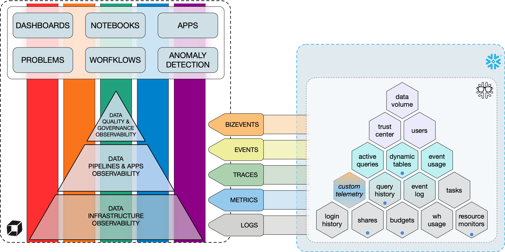
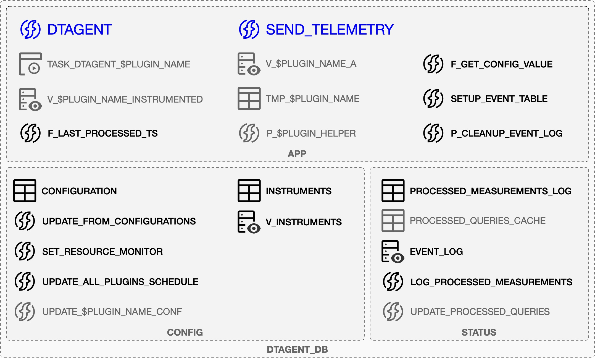
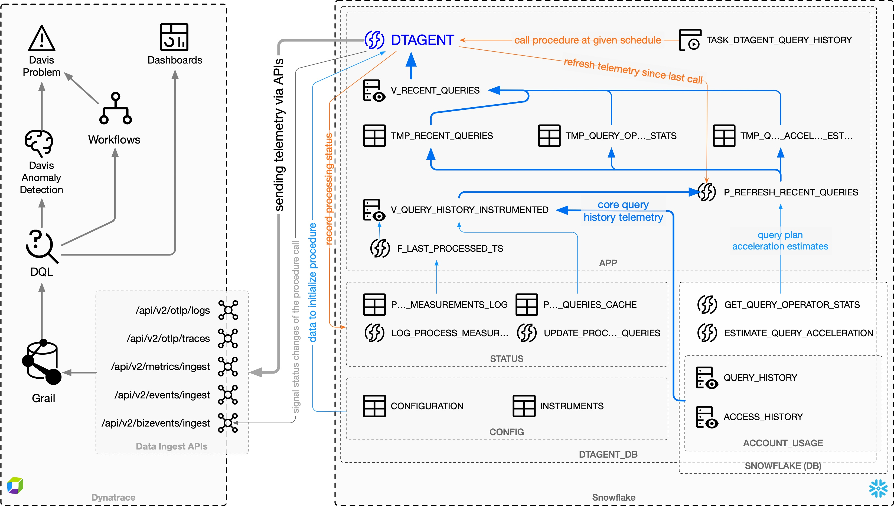

# Architecture and Core Capabilities

Dynatrace Snowflake Observability Agent (DSOA) augments [Data Platform Observability](DPO.md) capabilities already offered by
Dynatrace with OneAgent and custom telemetry (including logs and bizevents) delivered by Extract, Transform, Load (ETL) and other applications.

DSOA fulfills the promise of Data Platform Observability by delivering telemetry data already present in Snowflake
directly to Dynatrace as logs, traces, events, and metrics. Depending on what type of telemetry a given DSOA plugin sends, it can support one or more [Data Platform Observability themes](DPO.md#the-five-core-themes-of-dpo) across one or
multiple [layers of Data Platform Observability](DPO.md#the-three-tiers-of-data-platform-observability).



The main capabilities offered by DSOA are:

1. **Data Collection**: DSOA collects and parses useful observability data from various Snowflake
   sources.
2. **Data Transmission**: After collecting and parsing the information, DSOA sends it to Dynatrace
   tenants where it is easily accessible and ready for analysis.
3. **Alerting**: DSOA can send alerts regarding specific information, for example, potential security breaches,
   unmonitored warehouses, directly during data parsing, as well as using workflows and anomaly detections set up on the Dynatrace tenant.
4. **Visualization**: DSOA delivers telemetry which facilitates building Dynatrace dashboards that ease
   the process of data analysis.

**Table of contents:**

- [High-Level overview](#high-level-overview)
- [DSOA objects in Snowflake](#dsoa-objects-in-snowflake)
  - [The `APP` schema](#the-app-schema)
  - [The `CONFIG` schema](#the-config-schema)
  - [The `STATUS` schema](#the-status-schema)
- [Telemetry flow](#telemetry-flow)
- [Internal API for sending telemetry](#internal-api-for-sending-telemetry)
  - [Sending logs](#sending-logs)
  - [Sending traces/spans](#sending-tracesspans)
  - [Sending metrics](#sending-metrics)
  - [Sending events](#sending-events)
  - [Sending BizEvents](#sending-bizevents)
- [Sending custom telemetry](#sending-custom-telemetry)
  - [Default data structure](#default-data-structure)
  - [Examples of sending custom telemetry](#examples-of-sending-custom-telemetry)
    - [Sending logs and metrics from a view](#sending-logs-and-metrics-from-a-view)
    - [Sending logs, events, and bizevents from an array of custom objects](#sending-logs-events-and-bizevents-from-an-array-of-custom-objects)
- [Dynatrace Snowflake Observability Agent self-monitoring](#dynatrace-snowflake-observability-agent-self-monitoring)
  - [Build Artifacts](#build-artifacts)
  - [Deployment Scopes](#deployment-scopes)
  - [Security Model](#security-model)
    - [Role Responsibilities](#role-responsibilities)
      - [DTAGENT\_OWNER](#dtagent_owner)
      - [DTAGENT\_ADMIN (Optional)](#dtagent_admin-optional)
      - [DTAGENT\_VIEWER](#dtagent_viewer)
    - [Administrative Operation Isolation](#administrative-operation-isolation)
    - [Privilege Separation for Deployment](#privilege-separation-for-deployment)

## High-Level overview

DSOA takes full advantage of Snowflake Snowpark capabilities (Snowflake's developer framework for building data pipelines), allowing active "code" to be
scheduled and executed within Snowflake, close to where the telemetry data originates. This design enables telemetry to flow directly to
Dynatrace, similar to OneAgent.

The following figure illustrates, at high level, how telemetry data flows from Snowflake sources to Dynatrace for consumption.


DSOA enables easy extension with new plugins, each of which can utilize the core functions to
deliver telemetry data via logs, spans/traces, events, bizevents, and metrics.

By default, each plugin is executed with an independent Snowflake task, scheduled to run at its own interval. You can also
call multiple plugins from a single Snowflake task if needed, providing flexible scheduling options.

**Telemetry data sources:**

The telemetry data can come from various sources:

- `snowflake.account_usage` views
- Functions and procedures
- "SHOW" command calls

DSOA encapsulates each telemetry data into views delivered by "plugins." Each
plugin focuses on delivering telemetry from one or more sources related to a specific subject, for example, query history or dynamic tables.

## DSOA objects in Snowflake

DSOA operates within a single database (`DTAGENT_DB`) with a dedicated warehouse (`DTAGENT_WH`)
and at minimum two roles per DSOA instance:

- `DTAGENT_OWNER` owns all DSOA objects (database, schemas, tables, procedures, tasks)
- `DTAGENT_VIEWER` queries and sends telemetry data

Optionally, when the `admin` scope is installed:

- `DTAGENT_ADMIN` that handles elevated administrative operations (role grants, ownership transfers, privilege management).

The role hierarchy is:

- Primary hierarchy: `ACCOUNTADMIN` → `DTAGENT_OWNER` → `DTAGENT_VIEWER`
- Admin branch (optional): `DTAGENT_OWNER` → `DTAGENT_ADMIN`

When `DTAGENT_ADMIN` is present, `DTAGENT_OWNER` receives both `DTAGENT_ADMIN` and `DTAGENT_VIEWER` roles. This isolates admin operations while maintaining the main operational hierarchy through `DTAGENT_VIEWER`.

This flexible role model enables deployment with reduced privileges:

- **`DTAGENT_OWNER`** creates and manages all objects, but does not require `ACCOUNTADMIN` privileges for most operations
- **`DTAGENT_ADMIN`** (optional, only when admin scope is installed) has `MANAGE GRANTS` privilege to grant monitoring permissions on warehouses and dynamic tables, but does not own the objects
- **`DTAGENT_VIEWER`** executes all regular telemetry collection tasks and queries, with no administrative privileges

You can run multiple DSOA instances within one Snowflake account. Additional instances
(deployed in multitenancy mode) include the tag name in their object names: `DTAGENT_$TAG_DB`, `DTAGENT_$TAG_WH`,
`DTAGENT_$TAG_OWNER`, `DTAGENT_$TAG_VIEWER`, and optionally `DTAGENT_$TAG_ADMIN` (if admin scope is installed).

The figure below depicts objects that DSOA creates and maintains within a dedicated database in
Snowflake:



### The `APP` schema

This is the main schema maintained by DSOA. It contains two main stored procedures:

- `DTAGENT_DB.APP.DTAGENT(plugins)` is the main procedure of DSOA, which sends telemetry generated by
  executing one or more [available plugins](PLUGINS.md). Telemetry views queried by plugins use the internal telemetry API available in this
  procedure to send telemetry data directly to Dynatrace.
- `DTAGENT_DB.APP.SEND_TELEMETRY(sources, params)` is based on the same core and internal telemetry API code as `DTAGENT()` but instead of
  using plugins to query, process, and send telemetry data, it enables to [send arbitrary data](#sending-custom-telemetry) from given
  tables/views/queries or array/objects to Dynatrace.

**Helper functions and procedures:**

The schema also includes:

- Helper functions to check the timestamp of the last telemetry piece of a given type processed so far
  (`STATUS.F_LAST_PROCESSED_TS()`)
- Functions to get configuration parameters (`CONFIG.F_GET_CONFIG_VALUE()`)
- Procedures for setting up and maintaining the event log table, if managed by this DSOA instance

Plugins can define their main and helper views, helper procedures, and tasks which invoke DSOA with the
given plugin at a given schedule.

To communicate with the Dynatrace API, DSOA uses dedicated `SECRET`, `NETWORK RULE`, and
`EXTERNAL ACCESS INTEGRATION` objects.

### The `CONFIG` schema

Contains the `CONFIGURATIONS` table with all configurable options of DSOA, including internal API and plugins.
DSOA main stored procedures initialize from this table.

**Helper procedures:**

The schema provides procedures to change DSOA behavior that does not
initialize during runtime, for example:

- The number of credits allowed daily by the internal resource monitor
- The schedule of each plugin's execution

### The `STATUS` schema

Provides a table (`PROCESSED_MEASUREMENTS_LOG`) with a log of all DSOA executions. It also includes either an
`EVENT_LOG` table that DSOA sets up for this account or a view over the existing account-level event log table.

Plugins can maintain their own "status" tables in this schema. For example, the `query history` plugin maintains the list of recently
processed query IDs in `PROCESSED_QUERIES_CACHE`.

It is a good practice to accompany status tables with helper procedures, such as `LOG_PROCESSED_MEASUREMENTS()` for the
`PROCESSED_MEASUREMENTS_LOG` table.

## Telemetry flow

Telemetry delivered by DSOA to Dynatrace becomes available in Grail (Dynatrace's data lakehouse). You can access it with Dynatrace Query Language (DQL) in
Notebooks, Dashboards, Workflows, and Anomaly detection rules.

**Example flow: Query history plugin**

The following figure depicts in detail each step of how telemetry data flows from Snowflake telemetry sources through DSOA to Dynatrace. This example shows the execution of the `query_history` plugin.



**Process steps:**

1. The process starts with Snowflake task `TASK_DTAGENT_QUERY_HISTORY` calling the `DTAGENT()` procedure with `query_history` as a
   parameter:
   - The procedure initializes by reading the configuration.
   - A query tag is set for the session to identify this particular execution of DSOA in Snowflake
     telemetry.
   - Before starting the processing, the system sends a BizEvent to Dynatrace to indicate the start of a single plugin execution; a single call to
     the `DTAGENT()` procedure can execute one or more plugins sequentially.

2. The `query_history` plugin initializes telemetry data for sending by calling the `P_REFRESH_RECENT_QUERIES()` procedure, which:
   - retrieves data from `QUERY_HISTORY` and `ACCESS_HISTORY` tables, filtering out already processed queries, and
   - prepares a standardized view with telemetry based on that information.

3. For the slowest queries, the plugin enhances the telemetry with:
   - a query profile obtained by calling `GET_QUERY_OPERATOR_STATS()`, and
   - estimated query acceleration with estimates from `SYSTEM$ESTIMATE_QUERY_ACCELERATION()`.

4. Telemetry for each query is then sent to Dynatrace as traces, logs, and metrics; no events are sent by the `query_history` plugin.

5. The execution of DSOA finalizes with
   - the plugin stores the list of processed queries in the `PROCESSED_QUERIES_CACHE` to avoid reprocessing them,
   - the system records execution stats in the `PROCESSED_MEASUREMENTS_LOG` table,
   - a BizEvent sent to Dynatrace indicates the end of plugin execution, and
   - the query tag for the session resets.

## Internal API for sending telemetry

DSOA offers an internal API to send telemetry as
[OTEL logs](https://docs.dynatrace.com/docs/discover-dynatrace/references/dynatrace-api/environment-api/opentelemetry/post-logs),
[OTEL spans](https://docs.dynatrace.com/docs/discover-dynatrace/references/dynatrace-api/environment-api/opentelemetry/post-traces),
[metrics](https://docs.dynatrace.com/docs/discover-dynatrace/references/dynatrace-api/environment-api/metric-v2),
[events](https://docs.dynatrace.com/docs/discover-dynatrace/references/dynatrace-api/environment-api/events-v2), and
[BizEvents](https://docs.dynatrace.com/docs/discover-dynatrace/references/dynatrace-api/environment-api/business-analytics-v2).

### Sending logs

DSOA sends logs to Dynatrace using the
[Python OpenTelemetry SDK](https://opentelemetry.io/docs/languages/python/) with
[Dynatrace OTEL collector for logs](https://docs.dynatrace.com/docs/discover-dynatrace/references/dynatrace-api/environment-api/opentelemetry/post-logs).

### Sending traces/spans

DSOA can create traces/spans using
[Python OpenTelemetry SDK](https://opentelemetry.io/docs/languages/python/) configured to deliver data to
[Dynatrace OTEL collector for traces](https://docs.dynatrace.com/docs/discover-dynatrace/references/dynatrace-api/environment-api/opentelemetry/post-traces).
In case `trace_id` or `span_id`, or both, are available, e.g., in Snowflake Trail telemetry, their values are used when sending
traces/spans.

Traces/spans delivery can be adjusted in the configuration:

```json
{
  "OTEL": {
    "SPANS": {
      "EXPORT_TIMEOUT_MILLIS": 10000,
      "MAX_EXPORT_BATCH_SIZE": 50
    }
  }
}
```

### Sending metrics

Due to limitations of OpenTelemetry metrics protocol, Dynatrace Snowflake Observability Agent sends metrics via the
[Dynatrace Metrics API v2](https://docs.dynatrace.com/docs/discover-dynatrace/references/dynatrace-api/environment-api/metric-v2).

Dynatrace Snowflake Observability Agent sends metrics in batches of aggregated data once they reach the payload size limit for a request to
avoid creating redundant calls.

The internal telemetry API enables for metrics cache to be manually flushed before reaching the maximum payload. The maximum size of payload
and maximum number of retries to send data can be configured:

```json
{
  "OTEL": {
    "METRICS": {
      "MAX_RETRIES": 5,
      "MAX_BATCH_SIZE": 1000000
    }
  }
}
```

### Sending events

Dynatrace Snowflake Observability Agent enables to send events using the
[Dynatrace Events API v2](https://docs.dynatrace.com/docs/discover-dynatrace/references/dynatrace-api/environment-api/events-v2).

Each event has columns specifying the event type and title accompanied by additional attributes describing its details. Dynatrace API for
Events require each event to be send separately. Dynatrace Snowflake Observability Agent enables to configure maximum number of retries and
delay (in milliseconds) between retries, in case event could not be delivered.

```json
{
  "OTEL": {
    "EVENTS": {
      "MAX_RETRIES": 5,
      "RETRY_DELAY": 10000
    }
  }
}
```

### Sending BizEvents

Dynatrace Snowflake Observability Agent is also capable of sending special type of events to Dynatrace, i.e., business events (BizEvents),
using the
[Dynatrace Business Events API v2](https://docs.dynatrace.com/docs/discover-dynatrace/references/dynatrace-api/environment-api/business-analytics-v2).

Those events are usually used for tracking execution of actions within Dynatrace Snowflake Observability Agent flow. Each posted business
event is required to have fields specifying its `id`, `source`, `specversion`, and `type`. Dynatrace Snowflake Observability Agent sends
business events as batch of `CloudEvent` objects.

There are multiple parameters of delivering BizEvents can be configured:

```json
{
    "OTEL": {
        "BIZ_EVENTS": {
            "MAX_RETRIES": 5,
            "MAX_PAYLOAD_BYTES": 1000 * 1024 * 5,
            "MAX_EVENT_COUNT": 400,
            "RETRY_DELAY_MS": 10000,
            "RETRY_ON_STATUS": [429, 502, 503]
        }
    }
}
```

## Sending custom telemetry

Apart from sending telemetry prepared by plugins, Dynatrace Snowflake Observability Agent enables sending custom telemetry using the
`DTAGENT_DB.APP.SEND_TELEMETRY(sources VARIANT, params OBJECT)` procedure.

The `sources` parameter specifies the content to be sent to Dynatrace and can be:

- a fully qualified name of a view or table,
- a `SELECT` or `SHOW ->> SELECT` SQL statement,
- a single object, or
- an array of objects.

The `params` object controls how `DTAGENT_DB.APP.SEND_TELEMETRY` works. Key options:

| Param          | Default            | Description                                                                                    |
| -------------- | ------------------ | ---------------------------------------------------------------------------------------------- |
| `auto_mode`    | `true`             | Expects data in [default structure](#default-data-structure) unless set to `false`.            |
| `context`      | `telemetry_sender` | Identifies custom data source; used for tracking with `STATUS.F_LAST_PROCESSED_TS()`.          |
| `metrics`      | `true`             | Enables sending metrics (only in auto-mode).                                                   |
| `logs`         | `true`             | Enables/disables sending logs.                                                                 |
| `events`       | `$auto_mode`       | In auto-mode, disables/enables events from `EVENT_TIMESTAMPS`; in manual mode, enables events. |
| `biz_events`   | `false`            | Enables sending custom objects as bizevents.                                                   |
| `davis_events` | `false`            | Enables sending custom objects as Davis events.                                                |

This stored procedure returns a object with number of records sent:

```jsonc
{
  "entries": 100, // all entries sent,
  "log_lines": 100, // entries sent as logs,
  "metrics": 150, // entries sent as metrics,
  "events": 10, // entries sent as events,
  "biz_events": 2, // entries sent as bizevents,
  "davis_events": 0, // entries sent as davis_events,
}
```

### Default data structure

By default, this stored procedure expects each source object or table/view/query results row to be structured according to the following
schema:

```json
{
  "START_TIME": 1732101411467179000,
  "DIMENSIONS": {
    "dimensions.name.1": "value",
    "dimensions.name.2": true,
    "dimensions.name.3": 100
  },
  "ATTRIBUTES": {
    "attribute.name.1": "value",
    "attribute.name.2": true,
    "attribute.name.3": 100
  },
  "EVENT_TIMESTAMPS": {
    "ddl": 1731436379508000000
  },
  "METRICS": {
    "metric.name.1": 1,
    "metric.name.2": 2.3,
    "metric.name.3": 100
  }
}
```

This schema corresponds to the names and structure of columns in the telemetry view created by Dynatrace Snowflake Observability Agent
plugins to streamline the process of writing new plugins by using high level internal telemetry API, which can automatically identify
metrics and events to be send from given payload.

### Examples of sending custom telemetry

Here is a couple of different examples of sending data to Dynatrace with `SEND_TELEMETRY()`.

#### Sending logs and metrics from a view

This example sends logs and metrics based on data from the `MY_DB.MY_SCHEMA.V_MY_VIEW` view, which follows the Dynatrace Snowflake
Observability Agent data structure, without generating events based on `EVENT_TIMESTAMPS`:

```sql
call APP.SEND_TELEMETRY('MY_DB.MY_SCHEMA.V_MY_VIEW'::variant, OBJECT_CONSTRUCT('events', false));
```

#### Sending logs, events, and bizevents from an array of custom objects

This example sends logs, events, and bizevents based on data from an array of custom objects:

```sql
call APP.SEND_TELEMETRY(ARRAY_CONSTRUCT(
        OBJECT_CONSTRUCT(
            'timestamp', 1732103723000,
            'status.code', 'OK',
            '_message', 'This is a test object 1',
            'value.int', 10,
            'value.str', 'test',
            'value.bool', true,
            'value.list', ARRAY_CONSTRUCT(1, '2', 3),
            'value.dict', OBJECT CONSTRUCT('k', 'v', 'k2', 2)
        ),
        OBJECT_CONSTRUCT(
            'timestamp', 1732103723000,
            'status.code', 'OK',
            '_message', 'This is a test object 2',
            'event.type', 'PERFORMANCE_EVENT',
            'value.int', 10000000,
            'value.str', 'test 2',
            'value.bool', false,
            'value.list', ARRAY CONSTRUCT('1', '2'),
            'value.dict', OBJECT CONSTRUCT('k', 1, 'k2', 2)
        ),
        OBJECT_CONSTRUCT(
            'timestamp', 1732103723000,
            'status.code', 'ERROR',
            'event.type', 'ERROR_EVENT',
            'test.message', 'This is a test object 3',
            'value.int', -10,
            'value.str', 'error test',
            'value.bool', NULL,
            'value.list', ARRAY_CONSTRUCT(1, 3),
            'value.dict', OBJECT_CONSTRUCT('k', false, 'k2', true)
        )
    )::variant, OBJECT_CONSTRUCT('auto_mode', false, 'context', 'example', 'events', true, 'bizevents', true));
```

## Dynatrace Snowflake Observability Agent self-monitoring

Dynatrace Snowflake Observability Agent has configurable self-monitoring capabilities.

```json
{
  "PLUGINS": {
    "SELF_MONITORING": {
      "SEND_BIZEVENTS_ON_DEPLOY": true,
      "SEND_BIZEVENTS_ON_RUN": true
    }
  }
}
```

With `SEND_BIZEVENTS_ON_RUN` set to `true` Dynatrace Snowflake Observability Agent will provide updates to DT on the statuses of executed
tasks in form of bizevents. The messages contain - among others - the current status of task execution (possible values `STARTED`,
`FINISHED`, `FAILED`), task name and run id.

Example of task status bizevent payload.

```json
{
  "event.type": "dsoa.task",
  "host.name": "snowflakecomputing.com",
  "service.name": "dynatrace",
  "dsoa.run.context": "self_monitoring",
  "dsoa.run.id": "2c8988a1b94d43aeaa11d3c83d45468b",
  "dsoa.task.exec.id": "2025-03-18 10:58:59.364252",
  "dsoa.task.exec.status": "STARTED",
  "dsoa.task.name": "query_history",
  "telemetry.exporter.name": "dynatrace.snowagent",
  "telemetry.exporter.version": "0.8.0.0"
}
```

With `SEND_BIZEVENTS_ON_DEPLOY`, Dynatrace Snowflake Observability Agent will send a bizevent to DT with each deployment run. Depending on
the type of deployment, the event titles will be set as follows:

- full deployment ("New complete Dynatrace Snowflake Observability Agent deployment."),
- configuration update ("New Dynatrace Snowflake Observability Agent config deployment."),
- teardown ("Dynatrace Snowflake Observability Agent teardown initiated."),
- API key update ("Dynatrace Snowflake Observability Agent API key redeployed.").

Example of deployment bizevent payload.

```json
{
  "type": "CUSTOM_DEPLOYMENT",
  "title": "New complete Dynatrace Snowflake Observability Agent deployment.",
  "db.system": "snowflake",
  "deployment.environment": "TEST",
  "host.name": "snowflakecomputing.com",
  "telemetry.exporter.name": "dynatrace.snowagent",
  "dsoa.deployment.parameter": "full_deployment"
}
```

### Build Artifacts

The build process creates staged SQL scripts in the `build/` directory:

- `00_init.sql` - Initialization scripts (database, roles, basic setup)
- `09_upgrade/v*.sql` - Version-specific upgrade scripts
- `10_admin.sql` - Administrative operations (role grants, ownership transfers)
- `20_setup.sql` - Core setup (schemas, tables, procedures)
- `30_plugins/*.sql` - Individual plugin definitions
- `40_config.sql` - Configuration management
- `70_agents.sql` - Agent task definitions

### Deployment Scopes

The deployment script supports the following scopes:

- `init` - Deploy initialization scripts only
- `admin` - Deploy administrative operations (role setup, ownership)
- `setup` - Deploy core setup scripts
- `plugins` - Deploy plugin definitions
- `config` - Deploy configuration
- `agents` - Deploy agent tasks
- `apikey` - Update API key secrets
- `upgrade` - Upgrade from a specific version
- `all` - Deploy everything (default)
- `teardown` - Remove the agent

### Security Model

Dynatrace Snowflake Observability Agent implements a flexible role-based security model to enable deployment with varying privilege levels while maintaining security best practices.

#### Role Responsibilities

##### DTAGENT_OWNER

- Owns all Dynatrace Snowflake Observability Agent objects: database, schemas, tables, procedures, tasks
- Creates and manages all objects within `DTAGENT_DB`
- Can be used for most deployment operations (`setup`, `plugins`, `config`, `agents` scopes)
- Does not require `ACCOUNTADMIN` privileges for most operations
- Owns `DTAGENT_VIEWER` role (and `DTAGENT_ADMIN` role when present)

##### DTAGENT_ADMIN (Optional)

- **Only created and used when the `admin` scope is installed**
- Granted to `DTAGENT_OWNER` (alongside `DTAGENT_VIEWER`)
- Handles elevated administrative operations that require account-level privileges
- Has `MANAGE GRANTS` privilege to grant monitoring permissions on warehouses and dynamic tables to `DTAGENT_VIEWER`
- Has `EXECUTE TASK` privilege to manage task execution
- Used exclusively in admin scope operations (`--scope=admin`)
- Does not own any objects (owned by `DTAGENT_OWNER`)
- **If not installed, administrative operations must be performed manually or by ACCOUNTADMIN**

##### DTAGENT_VIEWER

- Executes all regular telemetry collection and processing operations
- Runs all agent tasks to query telemetry data and send it to Dynatrace
- Has `MONITOR`, `MONITOR USAGE`, and `MONITOR EXECUTION` privileges on account
- Has `IMPORTED PRIVILEGES` on `SNOWFLAKE` database to access account usage views
- Has `USAGE` on `DTAGENT_DB` and `OPERATE` on tasks
- Has no administrative privileges

#### Administrative Operation Isolation

Administrative operations (requiring `DTAGENT_ADMIN` role when present, or manual intervention when not) are isolated in dedicated admin files:

- `src/dtagent.sql/admin/*.sql` - Core administrative operations
- `src/dtagent/plugins/*.sql/admin/*.sql` - Plugin-specific administrative operations

These files are compiled into `build/10_admin.sql` and deployed only when using `--scope=admin`. This ensures that:

1. The `DTAGENT_ADMIN` role is only created when explicitly needed
2. Administrative privileges are only used in appropriate contexts
3. Regular operations can run without elevated privileges
4. Security audits can easily identify privileged operations
5. Organizations can choose whether to deploy the admin scope based on their security requirements

If the admin scope is not installed:

- The `DTAGENT_ADMIN` role will not be created
- Administrative tasks (such as granting MONITOR privileges on warehouses) must be performed manually by an administrator
- Some plugins may require manual setup (e.g., query_history, dynamic_tables plugins)

Automated tests (`test_admin_role_usage.py`) enforce this separation by verifying that `DTAGENT_ADMIN` role usage is restricted to admin files only.

#### Privilege Separation for Deployment

Organizations can leverage this role model to maintain strict separation of duties:

1. **Initial Setup**: Use `ACCOUNTADMIN` to run `--scope=init` creating roles and base structure
2. **Administrative Operations** (optional): Choose to either:
   - Install the admin scope: Use `DTAGENT_ADMIN` (or delegate to `ACCOUNTADMIN`) to run `--scope=admin` for automated privilege grants
   - Skip the admin scope: Perform privilege grants manually as needed, avoiding the creation of `DTAGENT_ADMIN` role
3. **Regular Deployment**: Use `DTAGENT_OWNER` to run other scopes (`setup`, `plugins`, `config`, `agents`)
4. **Runtime Operations**: All tasks execute as `DTAGENT_VIEWER` with minimal required privileges

This enables deployment and maintenance without requiring `ACCOUNTADMIN` access for routine operations. Organizations can choose whether to deploy the admin scope based on their security policies:

- **With admin scope**: Automated privilege management through scheduled tasks
- **Without admin scope**: Manual privilege management with stricter control, but requires more hands-on administration
