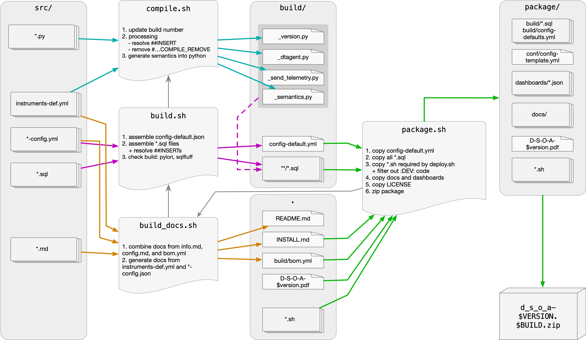

# Contributing

Welcome! This document is intended for developers wishing to contribute to the Dynatrace Snowflake Observability Agent (DSOA).

**Table of Contents:**

1. [Setting up Development Environment](#setting-up-development-environment)
2. [Development Workflow](#development-workflow)
3. [Testing](#testing)
4. [Writing Plugins](#writing-plugins)
5. [Semantic Conventions](#semantic-conventions)
6. [Source Code Overview](#source-code-overview)
7. [Pull Request Checklist](#pull-request-checklist)

---

## Setting up Development Environment

This guide helps developers who want to contribute to DSOA. If you only want to install and use it, see the [installation guide](INSTALL.md).

### Prerequisites

**Required tools:**

- [Python](https://www.python.org/) (3.9 or newer)
- [Git](https://git-scm.com/)
- **Windows Users**: [WSL2](https://learn.microsoft.com/en-us/windows/wsl/install) is required.
- **Recommended IDE**: [VS Code](https://code.visualstudio.com/) with the [Snowflake extension](https://marketplace.visualstudio.com/items?itemName=snowflake.snowflake-vsc).

### Environment Setup

1. **Clone the repository:**

    ```bash
    git clone https://github.com/dynatrace-oss/dynatrace-snowflake-observability-agent.git
    cd dynatrace-snowflake-observability-agent
    ```

1. **Run the setup script:**
    This helper script installs system dependencies and sets up the Python virtual environment.

    ```bash
    ./scripts/deploy/setup.sh
    source .venv/bin/activate
    ```

1. **Install dependencies manually (if needed):**

    ```bash
    pip install -r requirements.txt
    ```

### System Dependencies

For **Ubuntu/Debian**:

```bash
sudo apt-get update
sudo apt-get install -y pango cairo gdk-pixbuf libffi pandoc
npm install -g prettier
```

For **macOS** (using [Homebrew](https://brew.sh/)):

```bash
brew install pango cairo gdk-pixbuf libffi pandoc prettier
```

---

## Development Workflow

The source code is split into Python, SQL templates, and configuration files. You must **build** the agent to combine these into deployable artifacts.



### Building the Agent

Before deploying changes or running integration tests, run the build script. This compiles the Python code into Snowpark-compatible formats and assembles the SQL templates.

```bash
./scripts/dev/build.sh
```

**What this does:**

1. **Compilation** (`compile.sh`):
   - Creates `_version.py`
   - Pre-compiles `dtagent.otel.semantics.Semantics` to include metric semantics dictionary
   - Creates single files for both main stored procedures (`_dtagent.py` and `_send_telemetry.py`)
   - The `##INSERT` directive controls assembly order

2. **Building and embedding** (`build.sh`):
   - Creates default configuration file (`build/config-default.yml`)
   - Copies SQL files from all `*.sql` folders
   - Embeds compiled Python files into procedure templates

3. Prepares all files for deployment in the `build/` directory

**Note**: When Snowflake reports issues in stored procedures, line numbers correspond to `_dtagent.py` and `_send_telemetry.py` files.

### Updating Documentation

If you change `info.md`, configuration files, `instruments-def.yml`, or add a new plugin, you must rebuild the documentation (PDFs and READMEs).

```bash
./scripts/dev/build_docs.sh
```

This command will:

- Rebuild the agent
- Refresh `README.md`
- Generate `Dynatrace-Snowflake-Observability-Agent-$VERSION.pdf`

*Note: This requires `pango`, `cairo`, `libffi`, and `prettier` installed on your system. On macOS, you may need to set:*

```bash
export WEASYPRINT_DLL_DIRECTORIES=/opt/homebrew/lib
```

### Packaging for Distribution

To create a distributable zip file (containing SQL scripts and docs) for sharing with other users:

```bash
./scripts/dev/package.sh
```

This creates `dynatrace_snowflake_observability_agent-$VERSION.$BUILD.zip` containing everything necessary for distribution.

---

## Testing

We use `pytest` for Python tests and `bats` for Bash script tests.

### Test Suites Overview

- **Core Tests** (`test/core/`): Configuration, utilities, and view structure
- **OTel Tests** (`test/otel/`): OpenTelemetry integration
- **Plugin Tests** (`test/plugins/`): Individual plugin logic
- **Bash Tests** (`test/bash/`): Deployment and build scripts, including:
  - Custom object name replacement (`test_custom_object_names.bats`)
  - Optional object filtering (`test_optional_objects.bats`)
  - Configuration conversion (`test_convert_config_to_yaml.bats`)
  - Deployment script utilities (`test_list_options_to_exclude.bats`)

For detailed information about each test suite, see:

- [Main tests](../test/readme.md)
- [Core tests](../test/core/readme.md)
- [OTel tests](../test/otel/readme.md)
- [Plugin tests](../test/plugins/readme.md)

### Test Execution Modes

1. **Local Mode (Mocked):**
   - Runs **without** `test/credentials.yml`
   - Does not connect to Snowflake/Dynatrace
   - Useful for rapid logic testing
   - Uses mocked APIs and example test data from `test/test_data/`

2. **Live Mode:**
   - Runs **if** `test/credentials.yml` exists
   - Connects to real Snowflake/Dynatrace endpoints
   - Sends data to actual Dynatrace APIs

### Running Tests

**Run all Python tests:**

```bash
pytest
```

**Run all bash tests:**

```bash
./test/bash/run_tests.sh
```

**Run specific test suites:**

```bash
# Core tests
pytest test/core/

# OTel tests
pytest test/otel/

# Plugin tests
pytest test/plugins/

# Individual bash test
./test/bash/run_tests.sh test_custom_object_names.bats
```

**Run a specific plugin test:**
(e.g., for the 'budgets' plugin)

```bash
./scripts/dev/test.sh test_budgets
```

**Regenerate NDJSON fixtures:**
If you modify a plugin's SQL logic, you may need to regenerate its fixture data from a live Snowflake environment.

```bash
./scripts/dev/test.sh test_budgets -p
```

### Test Data

Tests use NDJSON fixture files from the `test/test_data/` folder. Each fixture file contains one JSON object per line, named `{plugin_name}[_{view_suffix}].ndjson`.

Fixtures are version-controlled. To regenerate them from a live Snowflake environment, run the relevant plugin test with the `-p` flag (requires `test/credentials.yml`).

Expected telemetry output is stored in `test/test_results/test_<plugin>/` as JSON files and used for regression comparison.

### Setting Up Test Environment

To run tests in live mode:

1. **Create a test deployment** with configuration in `conf/config-test.yml`:

   ```yaml
   core:
     dynatrace_tenant_address: abc12345.live.dynatrace.com
     deployment_environment: TEST
     log_level: DEBUG
     tag: ""
     procedure_timeout: 3600
     snowflake:
       account_name: 'your_snowflake_account.us-east-1'
       host_name: 'your_snowflake_account.us-east-1.snowflakecomputing.com'
       resource_monitor:
         credit_quota: 1
   otel: {}
   plugins:
     disabled_by_default: true
   ```

2. **Create `test/credentials.yaml`** from the `test/credentials.template.yml` template.

3. **Generate `test/conf/config-download.yml`** by running:

   ```bash
   PYTHONPATH="./src" pytest -s -v "test/core/test_config.py::TestConfig::test_init" --save_conf y
   ```

### Running Tests in Local Mode

For local mode testing (mocked APIs), ensure `test/conf/config-download.yml` does NOT exist. A good practice is to temporarily disable these files by prefixing them with an underscore (e.g., `_config-download.yml` and `_credentials.yml`). The gitignore ensures files prefixed with underscore are not tracked.

### VS Code Test Explorer

- Open Test Explorer view (`Ctrl+Shift+P` → "Test: Focus on Test Explorer")
- Click "Run All Tests" to execute all Python and bash tests
- Individual test suites can be run by expanding the test tree

---

## Writing Plugins

For a comprehensive guide on how to write a plugin, including step-by-step instructions, complete examples, configuration details, and debugging tips, please refer to the **[Plugin Development Guide](PLUGIN_DEVELOPMENT.md)**.

The Plugin Development Guide covers:

- Complete plugin structure and file organization
- Step-by-step plugin creation with working examples
- Python class implementation patterns
- SQL views, procedures, and task definitions
- Configuration and semantic dictionary setup
- Bill of Materials (BOM) documentation
- Comprehensive testing strategies
- Common patterns and advanced topics
- Troubleshooting and debugging tips

---

## Semantic Conventions

**IMPORTANT:** Before contributing code, ensure you understand these naming rules.

### Field and Metric Naming Rules

1. **Case:** ALWAYS use `snake_case`
2. **Prefix:** Custom fields SHOULD start with `snowflake.`
3. **Units:** AVOID measurement units in names (e.g., use `duration`, not `duration_ms`)
4. **Boolean:** Must use `is_` or `has_` prefix
5. **No Suffix:** DO NOT use `.count` suffix (it is implied for counters)
6. **Structure:** Use dots `.` to denote object hierarchy (e.g., `snowflake.table.name`)
7. **No Objects:** Avoid reporting raw OBJECT fields; expand them into specific metrics/attributes
8. **Existing Semantics:** Use existing OpenTelemetry or Dynatrace semantics when they express the same field
9. **Dimensionality:** DO NOT provide dimensionality information in field names
10. **Consistency:** DO NOT produce different names of the same metric depending on the dimension set
11. **Extension Name:** DO NOT add extension name or technology as part of field name
12. **Singular/Plural:** Use singular and plural properly to reflect the field content

### SQL Object Rules

1. **Names:** All Snowflake objects in `DTAGENT_DB` must be **UPPERCASE** (e.g., `DTAGENT_DB.APP.MY_VIEW`). Lowercase names will not be caught during custom tag deployment, causing objects to initialize in the default `DTAGENT_DB`.
2. **Permissions:**
    - Tables/Views: Grant `SELECT` to `DTAGENT_VIEWER`
    - Procedures: Grant `USAGE` to `DTAGENT_VIEWER`
    - Tasks: Grant `OWNERSHIP` to `DTAGENT_VIEWER`
3. **Safety:** Procedures should include `EXCEPTION` handling blocks
4. **Boolean Returns:** Avoid returning boolean values from stored procedures. Make them more descriptive (e.g., by specifying affected tables)
5. **Table Initialization:** Avoid using `create or replace table` in stored procedures. Initialize tables before procedures and truncate them inside
6. **Log Messages:** For views reported as logs, include `_MESSAGE` column (automatically mapped to `content` field)

### Metric Types

OpenTelemetry defines 3 metric types:

- **Counters**: Values that accumulate (e.g., total requests)
- **Gauges**: Point-in-time measurements (e.g., current temperature)
- **Histograms**: Distributions for aggregation (e.g., request duration)

**Important**: Since Dynatrace API only recognizes `counters` and `gauges`, and there are no examples of `counter` metrics in current implementation, all metrics are currently sent as `gauge` until further improvements.

---

## Source Code Overview

- **`src/dtagent`**: Python source code
- **`src/dtagent.sql`**: Core SQL init scripts (Roles, DBs, Warehouses)
- **`src/dtagent.conf`**: Default configuration and core semantics
- **`src/dtagent/plugins`**: Source code for all plugins (Python + SQL + Config)
- **`src/dtagent/otel`**: Telemetry API Python code
- **`scripts/dev`**: Tools for building, compiling, and testing
- **`scripts/deploy`**: Tools for deploying the agent to a Snowflake account
- **`scripts/tools`**: Utility scripts for config and dashboard format conversion

### SQL File Prefixes

SQL files use three-digit prefixes to enforce execution order:

- `0xx` - Core initialization + plugin-specific procedures, views
- `70x` - Core procedures
- `80x` - Task definitions
- `90x` - Plugin-specific update procedures

### Conditional Code Blocks

SQL scripts support annotation blocks for conditional inclusion:

```sql
--%PLUGIN:plugin_name:
-- Code included only when plugin is enabled
--%:PLUGIN:plugin_name

--%OPTION:option_name:
-- Code included only when optional component is enabled
--%:OPTION:option_name
```

Supported options:

- `dtagent_admin` - Admin role code (excluded when `core.snowflake.roles.admin` is `"-"`)
- `resource_monitor` - Resource monitor code (excluded when `core.snowflake.resource_monitor.name` is `"-"`)

---

## Pull Request Checklist

Before submitting a PR, please ensure:

<div class="checklist">

- [ ] You have run `./scripts/dev/build.sh` successfully
- [ ] You have added tests for any new functionality
- [ ] All tests pass locally (`pytest` and `./test/bash/run_tests.sh`)
- [ ] Documentation (`README.md`, `PLUGIN_DEVELOPMENT.md`, etc.) is updated if needed
- [ ] User-facing changes are documented in `docs/CHANGELOG.md` (highlights only)
- [ ] Technical implementation details are documented in `docs/DEVLOG.md`
- [ ] If adding a plugin, `instruments-def.yml` is defined and valid
- [ ] New use cases are documented in `docs/USECASES.md` under the appropriate Data Platform Observability theme(s)
- [ ] Code follows the [Semantic Conventions](#semantic-conventions)
- [ ] If changing SQL objects, all names are UPPERCASE
- [ ] If adding new semantic fields, they follow naming rules
- [ ] Documentation has been rebuilt (`./scripts/dev/build_docs.sh`) if needed

</div>
