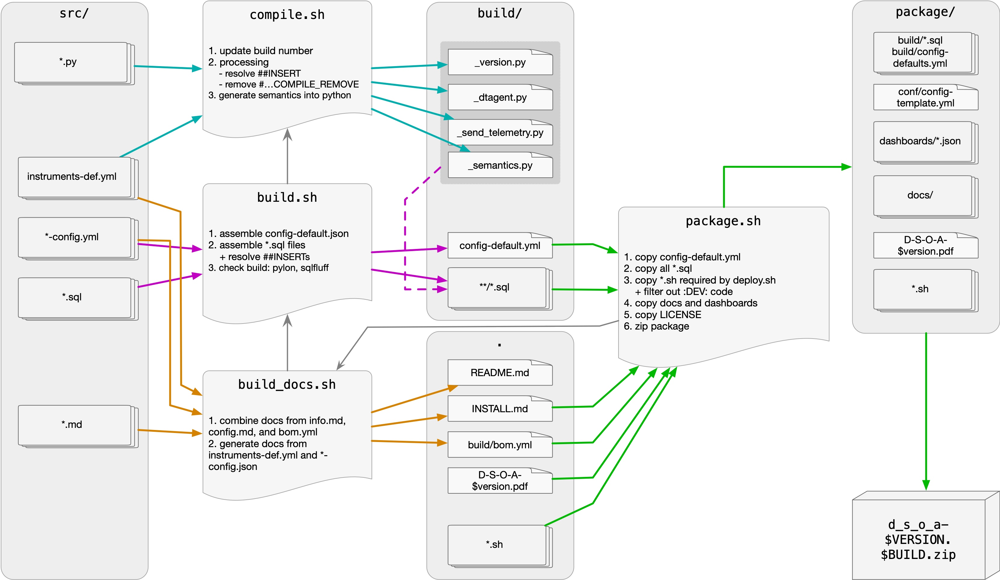

# Contributing

Welcome! This document is intended for developers wishing to contribute to the Dynatrace Snowflake Observability Agent (DSOA).

**Table of Contents:**

1. [Setting up Development Environment](#setting-up-development-environment)
1. [Development Workflow](#development-workflow)
1. [Testing](#testing)
1. [Writing Plugins](#writing-plugins)
1. [Semantic Conventions](#semantic-conventions)
1. [Source Code Overview](#source-code-overview)
1. [AI-Assisted Dashboard / Workflow Development](#ai-assisted-dashboard--workflow-development)
1. [Pull Request Checklist](#pull-request-checklist)

---

## Setting up Development Environment

If you only want to install and use DSOA, see the [installation guide](INSTALL.md).

### Prerequisites

- [Python](https://www.python.org/) 3.9+ (CI uses 3.11)
- [Git](https://git-scm.com/)
- **Windows:** [WSL2](https://learn.microsoft.com/en-us/windows/wsl/install) required
- **Recommended IDE:** [VS Code](https://code.visualstudio.com/) with the [Snowflake extension](https://marketplace.visualstudio.com/items?itemName=snowflake.snowflake-vsc)

### Environment Setup

```bash
git clone https://github.com/dynatrace-oss/dynatrace-snowflake-observability-agent.git
cd dynatrace-snowflake-observability-agent
./scripts/deploy/setup.sh
source .venv/bin/activate
```

**System dependencies** (for docs generation):

- **Ubuntu/Debian:** `sudo apt-get install -y pango cairo gdk-pixbuf libffi pandoc && npm install -g prettier`
- **macOS:** `brew install pango cairo gdk-pixbuf libffi pandoc prettier`

---

## Development Workflow

Source code is split into Python, SQL templates, and configuration files. You must **build** the agent to combine these into deployable artifacts.



### Building the Agent

```bash
./scripts/dev/build.sh
```

This runs:

1. **Compilation** (`compile.sh`) — creates `_version.py`, pre-compiles semantics dictionary, assembles single-file stored procedures via `##INSERT` directives
1. **Building** (`build.sh`) — creates default config, copies SQL files, embeds compiled Python into procedure templates
1. Output goes to the `build/` directory

**Note:** When Snowflake reports stored procedure errors, line numbers correspond to `_dtagent.py` and `_send_telemetry.py`.

### Updating Documentation

```bash
./scripts/dev/build_docs.sh
```

Rebuilds the agent, refreshes `README.md`, and generates the PDF. Requires `pango`, `cairo`, `libffi`, `prettier`. On macOS, you may need: `export WEASYPRINT_DLL_DIRECTORIES=/opt/homebrew/lib`

### Packaging for Distribution

```bash
./scripts/dev/package.sh
```

Creates a distributable zip with SQL scripts and docs.

---

## Testing

We use `pytest` for Python tests and `bats` for Bash script tests.

### Test Suites

| Suite | Location | Purpose |
|-------|----------|---------|
| Core | `test/core/` | Configuration, utilities, view structure |
| OTel | `test/otel/` | OpenTelemetry integration |
| Plugin | `test/plugins/` | Individual plugin logic |
| Bash | `test/bash/` | Deployment/build scripts, custom object names, config conversion |

For detailed docs see: [test/readme.md](../test/readme.md), [test/core/readme.md](../test/core/readme.md), [test/otel/readme.md](../test/otel/readme.md), [test/plugins/readme.md](../test/plugins/readme.md).

### Test Modes

- **Local (mocked):** Runs without `test/credentials.yml`. Uses NDJSON fixtures from `test/test_data/` and mocked APIs. Fast, CI-friendly.
- **Live:** Requires `test/credentials.yml`. Connects to real Snowflake + Dynatrace.

### Running Tests

```bash
pytest                                          # all Python tests
./test/bash/run_tests.sh                        # all Bash tests
pytest test/core/                               # core suite
pytest test/plugins/                            # plugin suite
./scripts/dev/test.sh test_budgets              # single plugin
./scripts/dev/test.sh test_budgets -p           # regenerate NDJSON fixtures
```

### Test Data

Fixtures are NDJSON files (one JSON object per line) in `test/test_data/`, named `{plugin}[_{view_suffix}].ndjson`. Expected output is in `test/test_results/test_{plugin}/`. Both are version-controlled; regenerate from live Snowflake with the `-p` flag.

### Setting Up Live Testing

1. Create a test deployment config in `conf/config-test.yml`:

    ```yaml
    core:
      dynatrace_tenant_address: abc12345.live.dynatrace.com
      deployment_environment: TEST
      log_level: DEBUG
      procedure_timeout: 3600
      snowflake:
        account_name: 'your_account.us-east-1'
        host_name: 'your_account.us-east-1.snowflakecomputing.com'
        resource_monitor:
          credit_quota: 1
    otel: {}
    plugins:
      disabled_by_default: true
    ```

1. Create `test/credentials.yaml` from `test/credentials.template.yml`.

1. Generate `test/conf/config-download.yml`:

    ```bash
    PYTHONPATH="./src" pytest -s -v "test/core/test_config.py::TestConfig::test_init" --save_conf y
    ```

For local-only testing, ensure `test/conf/config-download.yml` does not exist (prefix with `_` to disable).

---

## Writing Plugins

See the **[Plugin Development Guide](PLUGIN_DEVELOPMENT.md)** for complete step-by-step instructions covering plugin structure, Python/SQL implementation, configuration, testing, and deployment.

---

## Semantic Conventions

### Field and Metric Naming Rules

1. **Case:** Always `snake_case`
1. **Prefix:** Custom fields should start with `snowflake.`
1. **Units:** Avoid measurement units in names (use `duration`, not `duration_ms`)
1. **Boolean:** Must use `is_` or `has_` prefix
1. **No suffix:** Do not use `.count` suffix (implied for counters)
1. **Structure:** Use dots `.` for object hierarchy (e.g., `snowflake.table.name`)
1. **No raw objects:** Expand OBJECT fields into specific metrics/attributes
1. **Existing semantics:** Use OTel/Dynatrace conventions when they match
1. **No dimensionality info** in field names
1. **No extension name** or technology in field names
1. **Consistency:** Same metric, same name regardless of dimension set
1. **Singular/plural:** Use correctly to reflect field content

### SQL Object Rules

- All Snowflake objects in `DTAGENT_DB` must be **UPPERCASE**
- Tables/Views: grant `SELECT` to `DTAGENT_VIEWER`
- Procedures: grant `USAGE` to `DTAGENT_VIEWER`
- Tasks: grant `OWNERSHIP` to `DTAGENT_VIEWER`
- Procedures should include `EXCEPTION` handling
- Avoid returning boolean values from stored procedures; make return values descriptive (e.g., affected table names)
- Avoid `create or replace table` in procedures; initialize tables beforehand and truncate inside
- Include `_MESSAGE` column for views reported as logs

### Metric Types

OpenTelemetry defines counters, gauges, and histograms. Since the Dynatrace API only recognizes counters and gauges, all DSOA metrics are currently sent as **gauge**.

---

## Source Code Overview

| Directory | Purpose |
|-----------|---------|
| `src/dtagent` | Python source code |
| `src/dtagent.sql` | Core SQL init scripts (roles, DBs, warehouses) |
| `src/dtagent.conf` | Default configuration and core semantics |
| `src/dtagent/plugins` | Plugin source (Python + SQL + config) |
| `src/dtagent/otel` | Telemetry API code |
| `scripts/dev` | Build, compile, test tools |
| `scripts/deploy` | Deployment tools |
| `scripts/tools` | Utility scripts (config/dashboard conversion) |

### SQL File Prefixes

| Range | Purpose |
|-------|---------|
| `0xx` | Core init + plugin views/procedures |
| `70x` | Core procedures |
| `80x` | Task definitions |
| `90x` | Plugin config update procedures |

### Conditional Code Blocks

```sql
--%PLUGIN:plugin_name:
-- Included only when plugin is enabled
--%:PLUGIN:plugin_name

--%OPTION:option_name:
-- Included only when option is enabled
--%:OPTION:option_name
```

Supported options: `dtagent_admin` (admin role), `resource_monitor` (resource monitor code).

---

## AI-Assisted Dashboard / Workflow Development

DSOA ships AI-agent skills in `.opencode/skills/` for dashboard, workflow, and plugin development tasks.

### Prerequisites for AI-Assisted Development

1. **Base DSOA installation** must exist on the target Snowflake account:

    ```bash
    snow sql -c snow_agent_test-qa -q "SHOW DATABASES LIKE 'DTAGENT%'"
    ```

    If empty, a **human** must run `--scope=all` first (AI agents must never run privileged scopes).

1. **Snowflake CLI connection** `snow_agent_test-qa` configured for the QA account.

1. **Agent configuration** `conf/config-test-qa.yml` with plugins disabled by default:

    ```yaml
    plugins:
      disabled_by_default: true
      deploy_disabled_plugins: false
    ```

1. **Enable required plugins** with `is_enabled: true` and scoped `include` filters.

1. **Rebuild and redeploy:**

    ```bash
    ./scripts/dev/build.sh
    ./scripts/deploy/deploy.sh test-qa --scope=plugins,config --options=skip_confirm
    ```

### Available Skills

| Skill | Purpose |
|-------|---------|
| `snowflake-synthetic` | Create synthetic test data in Snowflake |
| `dynatrace-dashboard` | Design and deploy Dynatrace dashboards |
| `dynatrace-workflow` | Build Dynatrace workflows |
| `dashboard-docs` | Generate dashboard documentation |
| `plugin-development` | Full plugin development lifecycle |

Skills are consumed automatically by AI agents — no manual activation needed.

---

## Pull Request Checklist

<div class="checklist">

- [ ] `./scripts/dev/build.sh` succeeds
- [ ] Tests added for new functionality
- [ ] All tests pass (`pytest` and `./test/bash/run_tests.sh`)
- [ ] Documentation updated where needed
- [ ] User-facing changes in `docs/CHANGELOG.md`
- [ ] Technical details in `docs/DEVLOG.md`
- [ ] `instruments-def.yml` defined and valid (if adding a plugin)
- [ ] Use cases in `docs/USECASES.md` (if adding a plugin)
- [ ] Code follows [Semantic Conventions](#semantic-conventions)
- [ ] SQL object names are UPPERCASE
- [ ] Semantic fields follow naming rules
- [ ] Documentation rebuilt (`./scripts/dev/build_docs.sh`) if needed

</div>
