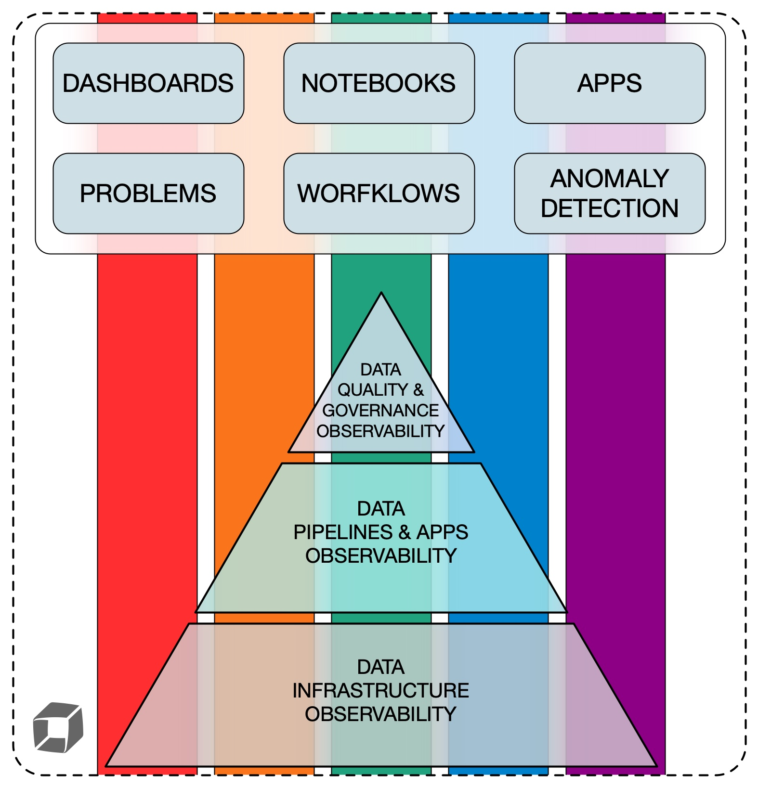

# Data Platform Observability

In today's data-driven world, maintaining a robust and efficient data platform is crucial. As organizations increasingly rely on data to
drive decision-making, especially with the advent of AI and large language models (LLMs), ensuring the timely delivery of high-quality data
while keeping costs under control and maintaining operational efficiency and security is paramount. This is where Data Platform
Observability (DPO) comes into play.

- [Why observability is crucial](#why-observability-is-crucial)
- [The five core themes of DPO](#the-five-core-themes-of-dpo)
  - [Security theme](#security-theme)
  - [Operations theme](#operations-theme)
    - [Infrastructure monitoring](#infrastructure-monitoring)
    - [Apps Monitoring](#apps-monitoring)
  - [Costs theme](#costs-theme)
    - [Resource management](#resource-management)
    - [Cost monitoring](#cost-monitoring)
    - [Optimizing warehouse parameters](#optimizing-warehouse-parameters)
  - [Performance theme](#performance-theme)
    - [Detecting and analyzing slow queries](#detecting-and-analyzing-slow-queries)
    - [Identifying tables leading to query slowdown](#identifying-tables-leading-to-query-slowdown)
    - [Optimizing warehouses](#optimizing-warehouses)
  - [Quality theme](#quality-theme)
    - [Freshness](#freshness)
    - [Distribution](#distribution)
    - [Volume](#volume)
    - [Schema](#schema)
    - [Lineage](#lineage)
- [The three tiers of Data Platform Observability](#the-three-tiers-of-data-platform-observability)
  - [T1. Data Infrastructure Observability](#t1-data-infrastructure-observability)
  - [T2. Data Apps and Pipelines Observability](#t2-data-apps-and-pipelines-observability)
  - [T3. Data Quality and Governance Observability](#t3-data-quality-and-governance-observability)
- [Aligning the three tiers with the five themes](#aligning-the-three-tiers-with-the-five-themes)
  - [Security](#security)
  - [Operations](#operations)
  - [Costs](#costs)
  - [Performance](#performance)
  - [Quality](#quality)
- [How Dynatrace can help](#how-dynatrace-can-help)

## Why observability is crucial

**Data Platform Observability (DPO)** refers to the ability to fully understand the health and performance of your entire data ecosystem. It
encompasses monitoring, tracking, and analyzing the usage and processing of data across various stages to ensure they meet the required
standards of quality, performance, and security.

As data platforms grow in complexity and scale, the need for observability becomes increasingly critical.

**The cost of poor observability:**

When you do not adhere to the Data Platform Observability paradigm and lose track of the overall health of your data platform, you risk not
only losing credibility (by delivering late or poor-quality data) but also incurring monetary losses:

- [According to Gartner](https://www.decube.io/post/data-observability-use-case-finance), poor data quality costs organizations an average
  of **$12.9 million annually**. This includes losses from inefficiencies, missed opportunities, and compliance penalties. For instance, in
  the financial industry, data observability can help avoid losses due to bad data quality, which can cost over **$14 million a year**.
- [The IBM Cost of a Data Breach Report 2023](https://www.wissen.com/blog/data-security-and-privacy-challenges-in-modern-data-pipelines)
  highlights that the global average cost of a data breach was **$4.45 million**. Implementing robust observability can help detect and
  mitigate security threats early, reducing the risk and associated costs.
- Data Platform Observability ensures that data pipelines function smoothly, detecting anomalies and inefficiencies before they impact
  end-users. This can lead to
  [improved operational efficiency and reduced downtime](https://dagster.io/guides/data-governance/data-observability-in-2025-pillars-pros-cons-best-practices),
  which translates to cost savings; extended observability implemented by
  [Netflix enabled it to improve the reliability of the data pipelines](https://www.acceldata.io/article/critical-use-cases-for-data-observability-that-can-save-your-business-money)
  and
  [Airbnb to optimize their usage and costs](https://aws.amazon.com/solutions/case-studies/airbnb-optimizes-usage-and-costs-case-study/).
- Effective data governance, supported by observability, helps maintain data quality and compliance with regulations. This is crucial for
  [avoiding fines and maintaining customer trust](https://www.liquibase.com/blog/data-database-governance-challenges-that-risk-pipeline-productivity-potential).
- Observability can help in
  [managing and optimizing costs](https://www2.deloitte.com/us/en/pages/consulting/articles/data-observability.html) by providing insights
  into resource usage and identifying areas where efficiencies can be gained.

## The five core themes of DPO

Building on the importance of Data Platform Observability (DPO) in ensuring the health and performance of your data ecosystem, we can
analyze DPO through five core themes:

- [security](#security-theme),
- [operations](#operations-theme),
- [costs](#costs-theme),
- [performance](#performance-theme),
- [quality](#quality-theme).

These themes highlight the various aspects where observability plays a crucial role in maintaining and optimizing your data platform.

**Key benefits of comprehensive DPO:**

By [thoroughly examining each theme](https://www.montecarlodata.com/blog-data-observability-use-cases/), you can:

- Improve overall data quality
- Strengthen security posture
- Enhance operational efficiency
- Optimize cost management
- Boost performance

The following sections explore each theme in detail, starting with the Security theme.

### Security theme

Data Platform Observability (DPO) plays a crucial role in maintaining the security of your data ecosystem.

**Security benefits:**

By implementing robust security measures, organizations can:

- Prevent data breaches
- Protect sensitive information
- Ensure compliance with regulatory standards

**Key security capabilities:**

- **Centralized analysis** enables the Chief Information Security Officer (CISO) to conduct regular security audits and vulnerability
  assessments. These audits are essential for identifying weaknesses in the digital infrastructure and ensuring compliance with industry
  standards. Regular security audits help safeguard sensitive data, reduce the likelihood of data breaches, and avoid costly penalties. For
  example, non-compliance with regulations like GDPR can result in fines of up to
  [€20 million or 4% of annual global turnover](https://qualysec.com/what-is-it-security-audits/):

- **Detecting anomalies** is a powerful tool for identifying irregularities in data access and usage. By leveraging machine learning and
  statistical methods, organizations can detect outliers that may indicate security threats, such as
  [unauthorized transactions or operational hiccups](https://www.mindbridge.ai/blog/anomaly-detection-techniques-how-to-uncover-risks-identify-patterns-and-strengthen-data-integrity/).
  Effective anomaly detection helps improve
  [prevent fraud and ensure compliance with security standards](https://www.tinybird.co/blog-posts/real-time-anomaly-detection).

- [**User activity monitoring (UAM)**](https://www.teramind.co/blog/user-activity-monitoring/) is critical for detecting and preventing
  security threats. By tracking user actions across devices, networks, and applications, organizations can identify suspicious behavior and
  respond promptly. Key aspects of UAM include:
  - **Detecting increases in login failures** helps identify potential brute force attacks or unauthorized access attempts.
    [An increase in login failures](https://karim-ashraf.gitbook.io/karim_ashraf_space/writeups/advanced-log-analysis/how-to-detect-and-respond-to-brute-force-attacks-using-log-data)
    can signal a security threat that needs immediate attention.
  - **Identifying abnormal login behavior** involves analyzing login patterns, such as frequency and origin IP, to detect unusual activities
    that
    [may indicate compromised accounts](https://medium.com/@RocketMeUpCybersecurity/using-behavioral-analytics-to-identify-anomalous-user-activity-6788db431f71).
  - **Tracking key pair rotation** ensures that
    [cryptographic keys are updated and managed securely](https://apidog.com/blog/api-key-rotation-best-practices-for-enhanced-security/#5-monitor-key-usage),
    reducing the risk of unauthorized access.
  - **Analyzing anomalies in data access** helps prevent data breaches by identifying
    [unusual or potentially harmful admin activities](https://cyberinsight.co/what-is-a-behavioral-analysis-in-cyber-security/). Detecting
    these anomalies is crucial.
  - **Monitoring sensitive data protection** ensures that sensitive data is protected with masking mechanisms,
    [helping to prevent unauthorized access and data leaks](https://www.digitalguardian.com/blog/what-user-activity-monitoring-how-it-works-benefits-best-practices-and-more).

[The financial impact of data breaches can be significant](https://gettrusted.io/blog/the-real-cost-of-data-breaches-in-2024-2025/). The
global average cost of a data breach surged to **$4.88 million in 2024**, with industries like healthcare and finance facing even higher
costs due to the sensitive nature of their data. Implementing robust security measures, including regular audits, user activity monitoring,
and anomaly detection, can help mitigate these risks and reduce the associated costs.

By focusing on these key aspects, organizations can enhance their security posture, protect sensitive data, and avoid the financial and
reputational damage associated with data breaches.

### Operations theme

Ensuring the smooth operation of your data ecosystem requires a robust approach to observability. By monitoring infrastructure and
applications, organizations can detect and resolve issues promptly, optimize performance, and prevent resource wastage. Here are the main
elements of the operations theme:

#### Infrastructure monitoring

Infrastructure monitoring involves tracking the performance, availability, and health of various components within your data platform.
[This includes servers, virtual machines, containers, databases, and more](https://www.ibm.com/think/topics/infrastructure-monitoring).

- **Monitoring data flow** ensures that data flows as expected (through
  [scheduled tasks, data streams](https://docs.snowflake.com/en/user-guide/data-pipelines-intro), or
  [dynamic table refreshes](https://docs.snowflake.com/en/user-guide/dynamic-tables-monitor)) to maintain data integrity and availability. A
  notable example is the
  [2012 Knight Capital Group incident](https://www.henricodolfing.com/2019/06/project-failure-case-study-knight-capital.html), where a
  software glitch due to an unmonitored, reactivated old code led to erroneous trades. This oversight resulted in a $440 million loss within
  45 minutes, highlighting the critical need for robust monitoring mechanisms to prevent such costly errors.

- **Identifying breaking changes in data shares** helps maintain data compatibility and prevents disruptions in data workflows. For example,
  [monitoring for changes in the schema of shared data](https://quickstarts.snowflake.com/guide/monitor_schema_drift_in_data_shares_with_sharewatch/index.html#0),
  such as a column being renamed or removed, is crucial to avoid undetected issues.

- **Monitoring uptime** ensures the availability and performance of critical infrastructure components.
  [FedEx suffered a major outage](https://finance.yahoo.com/news/fedex-experienced-network-disruptions-due-134013340.html) that halted their
  operations for several hours, resulting in millions of dollars in lost revenue and damaged reputation.

#### Apps Monitoring

Application monitoring focuses on tracking the performance and health of running applications, procedures, and data pipelines. This helps
prevent resource exhaustion and ensures efficient execution of data workflows.

- **Monitoring running apps, procedures, and pipelines** involves tracking their status and performance to identify bottlenecks and optimize
  resource usage. For instance,
  [Walmart experienced significant slowdowns during peak shopping periods](https://www.wsj.com/business/retail/walmart-computer-glitch-halts-sales-and-returns-at-stores-02858f45)
  due to unoptimized application performance, leading to lost sales and frustrated customers.

- **Preventing resource exhaustion** requires monitoring resource usage and setting up alerts for resource consumption to prevent unexpected
  costs and ensure efficient use of resources. Even tech giants like Twitter are not immune to the perils of CPU exhaustion.
  [A case study from Twitter](https://danluu.com/cgroup-throttling/) revealed that their most CPU-bound services started experiencing
  performance degradation and failures when CPU utilization reached around 50% of their reserved container capacity. This unexpected
  behavior, despite having theoretically available resources, highlights the complexities of resource management in containerized
  environments and the importance of understanding the interplay between CPU allocation, thread management, and scheduling mechanisms.

- **Gaining insights into app and pipeline execution** provides detailed understanding of performance patterns and identifies areas for
  improvement.
  [Netflix improved their user experience](https://www.33rdsquare.com/netflix-case-study-eda-unveiling-data-driven-strategies-for-streaming/)
  by analyzing and optimizing their data pipelines, resulting in reduced buffering times and increased customer satisfaction.

By focusing on these key aspects, organizations can enhance their operational efficiency, prevent downtime, and optimize resource usage,
ultimately leading to cost savings and improved performance.

### Costs theme

**Cost Management and Optimization** is crucial for maintaining financial efficiency and ensuring that resources are utilized effectively.
By proactively managing resources, monitoring costs, and optimizing warehouse parameters, organizations can achieve significant cost savings
and improve overall performance. Here are the main elements of the costs theme:

#### Resource management

**Proactively managing resource monitors** and **tracking centralized budgets** is essential for optimizing warehouse parameters based on
usage analysis. Effective resource management involves adjusting resource allocation to meet changing demands. For example,
[a case study on project strategy and budget management](https://www.datatobiz.com/case-studies/project-strategy-and-budget-management-with-ecac-dashboard/)
with an ECAC dashboard demonstrated how real-time visibility into project costs improved cost estimation accuracy by 18% and reduced budget
deviations by 8%. This approach helps ensure efficient resource utilization and cost control.

Combining spending limits, linked resources, and spending history provides a comprehensive view of costs. This allows for early
identification of cost overruns or underruns, enabling proactive measures to be taken. A case study from Netflix demonstrated how they used
a centralized data platform to tag, track, and manage their cloud costs effectively. By implementing detailed cost monitoring and reporting,
[Netflix was able to optimize their cloud resource usage](https://dyota.substack.com/p/aws-case-study-netflixs-automated), resulting in
significant cost savings and improved budget management.

#### Cost monitoring

Detecting long-running and failed queries, monitoring data ingestion costs, and tracking credits used by serverless tasks are key aspects of
cost monitoring. These practices help prevent unexpected expenses and ensure efficient resource usage.

**Monitoring long-running queries** helps identify performance bottlenecks and optimize query execution. For instance,
[a case study on managing long-running queries in MySQL](https://www.atatus.com/blog/managing-long-running-queries-mysql/) showed how using
slow query logs and performance schema improved database performance.

**Tracking data ingestion costs** used during events helps manage expenses effectively.
[A case study on automating data ingestion for Marubeni Power](https://futuralis.com/case-study/marubeni-power/) demonstrated how serverless
solutions improved efficiency and reduced operational overheads.

Additionally, **monitoring credits spent by serverless tasks** ensures that resources are used efficiently. A practical case for serverless
architecture highlighted the benefits of
[using AWS services to simplify infrastructure management and optimize costs](https://www.forbes.com/councils/forbestechcouncil/2025/03/03/the-practical-case-for-serverless-simplifying-infrastructure-with-serverless-architecture/).

#### Optimizing warehouse parameters

Optimizing warehouse parameters based on usage analysis is vital for ensuring efficient resource utilization and cost savings.

**Analyzing usage patterns** helps optimize Snowflake virtual warehouses and improve performance. A case study from Snowflake demonstrated
how a company used the Information Schema to profile their warehouse usage. By leveraging functions like `WAREHOUSE_LOAD_HISTORY` and
`WAREHOUSE_METERING_HISTORY`, they were able to gather detailed information about their virtual warehouse usage, identify inefficiencies,
and optimize their compute resources.
[This led to significant cost savings and improved performance](https://www.snowflake.com/en/blog/understanding-snowflake-utilization-warehouse-profiling/).

**Monitoring data volume growth** helps manage storage costs effectively.
[A comprehensive survey of anomaly detection techniques](https://journalofbigdata.springeropen.com/articles/10.1186/s40537-020-00320-x) for
high-dimensional big data discussed methods for identifying and addressing data anomalies.

By focusing on these key aspects, organizations can enhance their cost management strategies, prevent unexpected expenses, and optimize
resource usage, ultimately leading to significant cost savings and improved performance.

### Performance theme

Performance management is essential for ensuring efficient and effective database operations. By monitoring and optimizing query
performance, organizations can identify and address bottlenecks, enhance resource utilization, and improve overall system efficiency.

Providing **detailed query status** information helps manage performance effectively. Knowing the count, fastest, slowest, and average
running time of queries is crucial. Tracking how long queries have been running helps identify performance bottlenecks.
[An article from Secoda](https://www.secoda.co/glossary/query-monitoring) explains how query monitoring optimizes database performance by
tracking query behavior and addressing issues like slow execution and resource bottlenecks. It emphasizes the importance of metrics such as
execution time, resource usage, and query volume.

In his article, [Ramdoss explores](https://ijsra.net/content/enhancing-database-query-performance-cost-optimization-approach) various
**query optimization techniques**, including cost-based analysis, indexing, and execution plan analysis. It highlights the significance of
understanding query performance metrics to ensure efficient data management and improve user experience.

By focusing on these key aspects, organizations can enhance their performance management strategies, prevent unexpected expenses, and
optimize resource usage, ultimately leading to significant cost savings and improved performance.

#### Detecting and analyzing slow queries

Identifying and addressing slow queries is crucial for maintaining optimal database performance.

**Detecting common query performance anti-patterns**, such as Cartesian joins, can significantly improve query efficiency.
[A case study on SQL anti-patterns](https://sonra.io/mastering-sql-how-to-detect-and-avoid-34-common-sql-antipatterns/) highlights how
avoiding these can enhance performance. Another study on Azure SQL's query anti-pattern event demonstrates how detecting these patterns can
prevent performance issues. A practical guide on query optimization discusses methods to diagnose and resolve such issues.

**Monitoring for anomalies** helps identify queries that are slower than usual.
[Kamatchi and Suri discuss](https://www.academia.edu/31463105/IMPROVING_ETL_SQL_EXECUTION_THROUGH_ANOMALY_DETECTION) anomaly detection
techniques applied to SQL query execution times can significantly enhance ETL process efficiency by identifying and addressing abnormal
changes in execution times.

**Identifying and optimizing costly, repeated queries** can reduce resource consumption.
[An article from WebCE](https://blog.webce.com/article/database-query-performance-case-studies%3A-repeated-queries) explores how SQL
Server’s Query Store feature was used to identify and troubleshoot repeated queries. It discusses leveraging caching in the application
layer to reduce the frequency of repeated queries and improve performance.

#### Identifying tables leading to query slowdown

Recognizing tables that contribute to slow queries is essential for improving overall performance. Tables that slow down queries can be
optimized to enhance performance. [Optimizing table structures](https://datatas.com/table-structure-and-its-impact-on-performance/),
including normalization, indexing, and choosing appropriate data types, can significantly improve query processing speed and overall
database efficiency.

#### Optimizing warehouses

Optimizing warehouse parameters based on usage analysis ensures efficient resource utilization and cost savings.

**Analyzing usage patterns** helps optimize virtual warehouses.
[An article from Snowflake](https://www.snowflake.com/en/blog/understanding-snowflake-utilization-warehouse-profiling/) explains how
profiling warehouse usage in Snowflake can help identify patterns and optimize resource allocation, leading to increased speed of data
processing and significant cost reductions.

**Monitoring warehouse loads** helps determine resource needs and optimize warehouse sizes.
[A case study from Snowflake](https://medium.com/snowflake/mastering-snowflake-warehouse-utilization-a-deep-dive-into-the-warehouse-utilization-view-855fa72fdf11)
demonstrates how the WAREHOUSE_UTILIZATION view provides detailed insights into resource consumption, enabling effective cost optimization
and performance improvements. The Snowflake web interface and
[`QUERY_HISTORY` view](https://docs.snowflake.com/en/sql-reference/account-usage/query_history) allow for
[analysis of concurrent queries processed by a warehouse](https://docs.snowflake.com/en/user-guide/warehouses-load-monitoring), helping to
identify periods of high and low utilization for better resource management.

### Quality theme

The exponential rise in data generation brings new challenges in ensuring data quality. Data Platform Observability (DPO) helps address
these challenges by providing insights into the entire data lifecycle, from ingestion to usage. This involves monitoring and managing data
systems to ensure data remains reliable, accurate, and timely. Effective data quality management is essential for making informed decisions
and optimizing digital operations.

Here are five pillars of data observability that help us realize the quality theme, extended with detailed points and case studies.

#### Freshness

Freshness refers to the timeliness of the data. In an ideal data ecosystem, all data is as current as possible.
[Observing the freshness of data](https://www.anomalo.com/blog/defining-data-freshness-measuring-and-monitoring-data-timeliness/) helps to
ensure that decisions are based on the most recent and relevant information.
[Monitoring table refresh events ensures up-to-date information](https://datahubproject.io/learn/data-freshness/). For example, a financial
institution relying on outdated data for forecasting may face misguided decisions and misallocated resources; implementing data freshness
monitoring will help to make accurate projections and optimize investments.

#### Distribution

Distribution is the statistical spread or range of the data. Data distribution is essential in identifying patterns, outliers, or anomalies.
Deviation from the expected distribution can signal an issue in data collection or processing. Identifying patterns and anomalies helps
maintain data integrity. A retail company used data distribution monitoring to detect anomalies in sales data, leading to the identification
of a data processing error that was causing inaccurate sales reports.

[Chip Huyen discusses the importance of monitoring data distribution shifts](https://huyenchip.com/2022/02/07/data-distribution-shifts-and-monitoring.html)
and provides examples of how deviations can impact model performance. This article includes a case study on a company that faced issues due
to data distribution shifts in their machine learning model.

#### Volume

Volume refers to the quantity of data generated or processed during a certain time period. Unexpected increases or drops in the data volume
are usually good indicators of undetected issues. The volume aspect often overlaps with data freshness, making it challenging to determine
whether the expected but missing data will arrive later or if it's permanently lost. Understanding data growth and its impact on performance
is crucial.

[A case study from Neev Data](https://dqops.com/what-is-data-volume/) discusses how a consumer electronics retailer managed data growth by
archiving inactive data, which improved system performance and stability.

#### Schema

Schema refers to the structure or format of the data, including the data types and relationships between different entities. Observing the
schema can help identify and flag unexpected changes, like the addition of new fields or the removal of existing ones. Understanding the
structure, content, and quality of data is essential. An ETL process improvement initiative used data profiling to identify and resolve
schema inconsistencies, ensuring high-quality data for analytics.

[An article from DQLabs.ai](https://www.dqlabs.ai/blog/what-are-schema-changes-and-how-does-that-affect-your-data-reliability/) explores the
impact of schema changes on data reliability and provides strategies for detecting and monitoring these changes.
[Another article from DQOps discusses schema changes and drifts](https://dqops.com/schema-changes-and-drifts-definition-examples/),
providing definitions, examples, and best practices for managing and monitoring schema changes. Both emphasize the use of data observability
tools to continuously monitor schema drifts.

#### Lineage

Lineage is the journey of the data through a system. It provides insights into where the data comes from (upstream) and what it affects
(downstream). Data lineage plays a crucial role in root cause analysis as well as informing impacted systems about an issue as quickly as
possible. Understanding data flow and transformations from source to destination is vital.

[Mizrahi discusses](https://www.secoda.co/blog/data-lineage-in-action-case-studies-across-industries) real-world examples of how different
industries use data lineage to enhance data transparency and operational efficiency. It highlights the importance of tracking data lineage
for root cause analysis and issue resolution.
[In his article from Analytics Vidhya, Shukla discusses](https://www.analyticsvidhya.com/blog/2022/11/data-lineage-case-studies-of-data-driven-businesses/)
how companies like Netflix, Slack, and Postman have implemented data lineage to improve their data management practices and operational
efficiency.
[Mitich provides examples on how column-level data lineage helps companies](https://www.selectstar.com/resources/column-level-data-lineage-in-action-5-real-world-examples)
across various industries detect data quality issues, streamline compliance, and improve decision-making. For example, Bowery Farming
improved data visibility and reduced support tickets, while Xometry saved millions by reducing data outages and improving data accuracy.

By focusing on these five pillars of data observability, organizations can ensure high data quality, which is essential for making informed
decisions and optimizing digital operations.

## The three tiers of Data Platform Observability

To effectively implement Data Platform Observability across all five themes—security, operations, costs, performance, and quality—we need to
gather and analyze telemetry across the three tiers that constitute the Data Platform.

It can be a challenging task, especially when using a diverse stack of tools and platforms, e.g., AWS (EC2), Snowflake, custom Java services
for ETL, dbt, PowerBI, and DataHub. Some common challenges include:

- **Integration**: Ensuring seamless integration between different tools and platforms to provide a unified view of the data ecosystem.
- **Metadata management**: Managing and ingesting metadata from various sources to maintain data visibility and governance.
- **Scalability**: Handling large-scale environments without impacting performance.
- **Collaboration**: Facilitating collaboration between data engineers, analysts, and business stakeholders.

### T1. Data Infrastructure Observability

Monitoring infrastructure components such as CPU, memory, and network usage is crucial. By collecting telemetry data on resource
utilization, system health, and performance metrics, we gain visibility into the underlying infrastructure's health. This helps identify
bottlenecks and optimize resource allocation.

[Acceldata discusses](https://www.acceldata.io/article/top-ten-use-cases-for-data-observability) various use cases for data observability,
including infrastructure design, capacity planning, and performance tuning. This article highlights how observability can optimize resource
allocation and improve system performance

### T2. Data Apps and Pipelines Observability

[Monitoring orchestration events, tasks, and pipeline execution ensures smooth operation](https://firsteigen.com/blog/top-data-pipeline-monitoring-tools/).
By tracking the execution of data pipelines, including task completion times, error rates, and data flow, we can detect and resolve issues
promptly, improving the reliability of data processing. This proactive approach minimizes downtime and enhances overall system performance,
ensuring that data-driven decisions are based on accurate and timely information.

### T3. Data Quality and Governance Observability

Implementing data quality checks and monitoring data lineage ensures data integrity and compliance. By collecting telemetry on data quality
metrics, lineage, and governance policies, we can track data flow and transformations, maintaining high data quality standards.

[An article by IBM](https://www.ibm.com/think/topics/data-lineage-for-healthcare) discusses the importance of data lineage in healthcare for
ensuring data integrity and compliance. It highlights how data lineage helps healthcare organizations manage data accuracy, quality, and
integrity, leading to better patient outcomes.
[This guide covers](https://www.clindcast.com/the-guide-to-healthcare-data-quality-management-in-2025/) various aspects of healthcare data
quality management, including data quality metrics, governance policies, and the impact of data quality on patient outcomes. It emphasizes
the importance of maintaining high data quality standards to ensure compliance and improve patient care.

## Aligning the three tiers with the five themes

To provide a comprehensive observability strategy, it's essential to align the three tiers with the five key themes:

### Security

- T1: Monitor for unauthorized access and unusual activity.
- T2: Track data access patterns and secure sensitive data.
- T3: Ensure data compliance with security policies.

### Operations

- T1: Optimize resource allocation and reduce downtime.
- T2: Ensure smooth and efficient data processing.
- T3: Maintain operational data quality and governance standards.

### Costs

- T1: Identify and eliminate resource wastage.
- T2: Optimize pipeline efficiency to reduce processing costs.
- T3: Prevent costly data quality issues and compliance fines.

### Performance

- T1: Enhance system performance through proactive monitoring.
- T2: Improve data processing speeds and reliability.
- T3: Ensure high-quality data for accurate and timely insights.

### Quality

- T1: Maintain high availability and reliability of infrastructure.
- T2: Ensure data pipelines deliver accurate and timely data.
- T3: Continuously monitor and improve data quality standards.

By integrating observability across these three tiers and aligning them with the five themes, organizations can mitigate the aforementioned
challenges and achieve a holistic view of their data platform, ensuring optimal performance, security, and cost-efficiency.

## How Dynatrace can help

Though there is a lot of focus on the data quality, we can see is just a piece of a puzzle, placed in the upper-right corner of the larger
Data Platform Observability picture. In order to deliver valuable data products, we need to make sure we don't consider data product
delivery operating in the vacuum. Therefore, implementing Data Platform Observability (DPO) is essential for maintaining the security,
operational efficiency, cost-effectiveness, performance, and quality of data platforms.

Dynatrace provides a comprehensive solution to achieve this across three observability tiers: infrastructure, applications/pipelines, and
quality/governance.

Dynatrace integrates multiple data sources, including Snowflake, to offer a holistic view of the data platform. This integration enhances
monitoring and proactive issue resolution, ensuring high data quality for both internal and external customers. By combining multiple
telemetry sources, Dynatrace provides a comprehensive view of costs, performance, and security.

Key questions to consider include how to leverage telemetry data from Snowflake and integrate it with Dynatrace for comprehensive
monitoring, and how Dynatrace’s tools—such as dashboarding, workflows, anomaly detection, and problem reporting—enhance the ability to
monitor and improve data quality proactively. Additionally, understanding the functional requirements, such as table size monitoring and
data quality check integration, is crucial for providing real-time insights and proactive issue resolution.

By addressing these questions and focusing on the key aspects of security, operations, costs, performance, and quality, organizations can
enhance their data quality management strategies, prevent data-related issues, and optimize digital operations. This ultimately leads to
significant improvements in data reliability and decision-making.

Dynatrace's advanced observability capabilities include advanced dashboarding, which provides detailed dashboards, workflows, and alerting
capabilities for efficient monitoring and management. AI-powered insights utilize AI to detect anomalies, identify root causes, and provide
actionable insights. Seamless integration with various tools and platforms ensures a comprehensive observability solution.

Leveraging Dynatrace's advanced observability capabilities enables organizations to effectively implement DPO, ensuring robust data quality
management and operational excellence across their data platforms.
