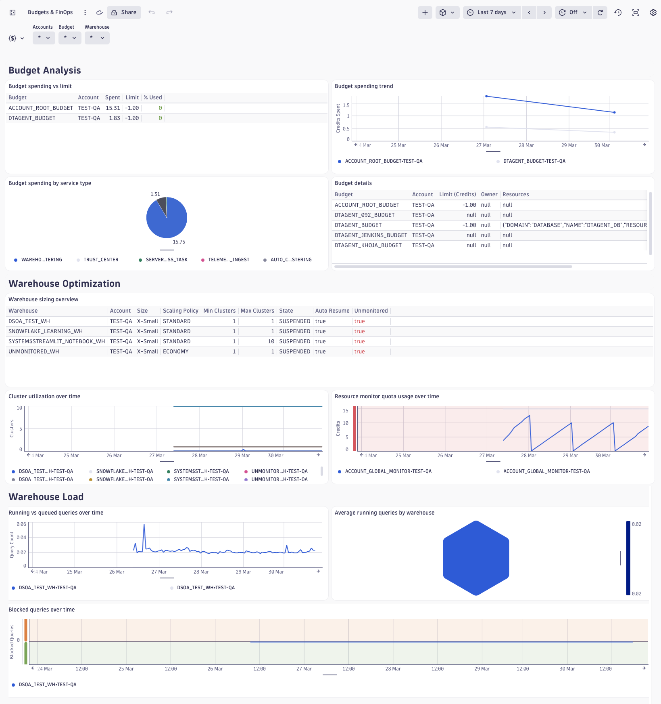
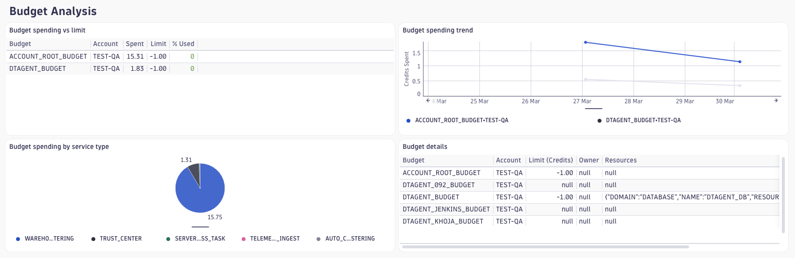
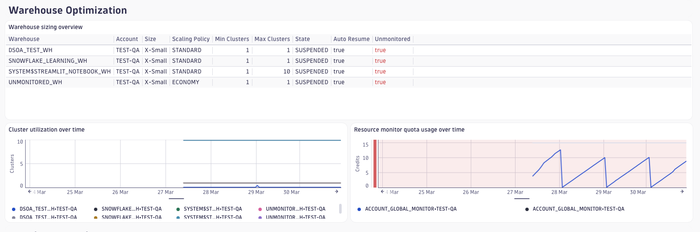
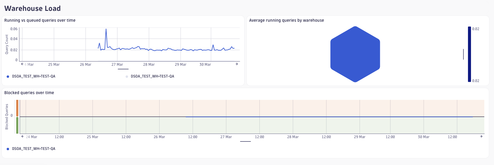

# Budgets & FinOps Dashboard

## Overview

The **Budgets & FinOps Dashboard** provides a unified view of Snowflake budget
consumption, warehouse sizing optimisation, and warehouse load patterns. It is
designed for FinOps practitioners, platform engineers, and Snowflake account
owners who need to track credit spend, understand where costs originate, and
right-size compute resources.



| Section                    | Observable Dimension                        | DSOA Plugins        |
|----------------------------|---------------------------------------------|---------------------|
| 1 — Budget Analysis        | Budget credit spend vs. limit               | `budgets`           |
| 2 — Warehouse Optimization | Warehouse sizing, cluster config, RM quotas | `resource_monitors` |
| 3 — Warehouse Load         | Running / queued / blocked query counts     | `warehouse_usage`   |

> **Event Table Ingest Costs** — this section is not yet available. The
> underlying Snowflake view (`ACCOUNT_USAGE.EVENT_USAGE_HISTORY`) is
> [deprecated](https://docs.snowflake.com/en/sql-reference/account-usage/event_usage_history).
> It will be re-introduced once the `metering` plugin is implemented.

## Prerequisites

### Required DSOA Plugins

| Plugin              | Telemetry             | Default Schedule              | Notes                                             |
|---------------------|-----------------------|-------------------------------|---------------------------------------------------|
| `budgets`           | logs, metrics         | `USING CRON 30 0 * * * UTC`   | Disabled by default — requires `is_enabled: true` |
| `warehouse_usage`   | logs, metrics         | `USING CRON */30 * * * * UTC` | ACCOUNT_USAGE lag: 45–180 min                     |
| `resource_monitors` | logs, metrics, events | `USING CRON */30 * * * * UTC` | Reads live `SHOW WAREHOUSES`                      |

Add to your DSOA configuration file (`conf/config-<env>.yml`):

```yaml
plugins:
  budgets:
    is_enabled: true
    monitored_budgets:
      - "SNOWFLAKE.LOCAL.ACCOUNT_ROOT_BUDGET"   # always include
      - "MY_DB.MY_SCHEMA.MY_BUDGET"             # add custom budget FQNs here
  warehouse_usage:
    is_enabled: true
  resource_monitors:
    is_enabled: true
```

Then rebuild and redeploy:

```bash
./scripts/dev/build.sh
./scripts/deploy/deploy.sh <env> --scope=admin,config --options=skip_confirm
# Run the grant procedure once as DTAGENT_ADMIN to set up budget privileges:
snow sql --connection <conn> -q "USE ROLE DTAGENT_ADMIN; CALL APP.P_GRANT_BUDGET_MONITORING();"
./scripts/deploy/deploy.sh <env> --scope=plugins,agents,config --options=skip_confirm
```

### Budget Grant Notes

`APP.P_GRANT_BUDGET_MONITORING()` (admin scope) handles three Snowflake-specific
edge cases automatically:

- **Imported databases** (`SNOWFLAKE`): uses `GRANT IMPORTED PRIVILEGES` instead of `GRANT USAGE`.
- **Application schemas** (`SNOWFLAKE.LOCAL`): schema grant is skipped — imported privileges cover it.
- **Application-owned budgets** (`ACCOUNT_ROOT_BUDGET`): instance-role grant is skipped — access is
  covered by `GRANT APPLICATION ROLE SNOWFLAKE.BUDGET_VIEWER` which the procedure grants unconditionally.

## Dashboard Variables

| Variable     | Type               | Description                                                           |
|--------------|--------------------|-----------------------------------------------------------------------|
| `$Accounts`  | Multi-select query | Filters all tiles to specific `deployment.environment` values.        |
| `$Budget`    | Multi-select query | Filters Budget Analysis tiles to specific budget names.               |
| `$Warehouse` | Multi-select query | Filters Warehouse Optimization and Load tiles to specific warehouses. |

All three variables support multi-select. Leave blank to show all values.

## Sections and Tiles

### Section 1 — Budget Analysis



Tracks credit spend against configured budget limits for each monitored budget.

| Tile                            | Type       | Description                                                                                                                          |
|---------------------------------|------------|--------------------------------------------------------------------------------------------------------------------------------------|
| Budget spending vs limit        | Table      | Per-budget summary of credits spent vs. the configured limit, with a `% Used` column colour-coded green / amber / red at 75% / 100%. |
| Budget spending trend           | Line chart | Credits spent per budget over the selected timeframe — useful for spotting sudden cost spikes.                                       |
| Budget spending by service type | Pie chart  | Credit breakdown by Snowflake service type (e.g. `WAREHOUSE_METERING`, `SERVERLESS_TASK`).                                           |
| Budget details                  | Table      | Latest per-budget snapshot: spending limit, owner, and linked resources.                                                             |

**Data source**: `fetch logs` filtered on `dsoa.run.plugin == "budgets"`.
Budget metadata uses `dsoa.run.context == "budgets"`; spending rows use
`dsoa.run.context == "spendings"`. The spending vs limit tile uses a DQL `join`
to combine both contexts.

### Section 2 — Warehouse Optimization



Per-warehouse sizing and compute utilisation metrics to support right-sizing
decisions and resource monitor governance.

| Tile                          | Type       | Description                                                                                                                                                                                                                             |
|-------------------------------|------------|-----------------------------------------------------------------------------------------------------------------------------------------------------------------------------------------------------------------------------------------|
| Warehouse sizing overview     | Table      | Latest per-warehouse snapshot: size, scaling policy, min/max clusters, execution state, auto-resume, and whether a resource monitor is assigned. The `Unmonitored` column is highlighted red for warehouses without a resource monitor. |
| Cluster utilization over time | Line chart | Started cluster count vs. max clusters per warehouse — helps identify under- or over-provisioned multi-cluster warehouses.                                                                                                              |
| Resource monitor quota usage  | Line chart | Credits used vs. total quota per resource monitor — thresholds at 70% (amber) and 100% (red).                                                                                                                                           |

**Data source**: `fetch logs` filtered on `dsoa.run.plugin == "resource_monitors"`.

### Section 3 — Warehouse Load



Query execution load per warehouse — running, queued, and blocked query counts
sourced from `ACCOUNT_USAGE.WAREHOUSE_LOAD_HISTORY`.

| Tile                      | Type       | Description                                                                                                       |
|---------------------------|------------|-------------------------------------------------------------------------------------------------------------------|
| Running vs queued queries | Line chart | Concurrent running and overloaded-queued query counts per warehouse — elevated queued values indicate saturation. |
| Average running queries   | Honeycomb  | Per-warehouse colour-coded average running query count for at-a-glance fleet health.                              |
| Blocked queries over time | Line chart | Blocked query count per warehouse — any value ≥ 1 is highlighted amber (potential transaction contention).        |

**Data source**: `fetch logs` filtered on `dsoa.run.plugin == "warehouse_usage"`
and `dsoa.run.context == "warehouse_usage_load"`.

**Note**: `ACCOUNT_USAGE.WAREHOUSE_LOAD_HISTORY` has a 45–180 minute ingestion
lag. Load tiles reflect a delayed view of warehouse activity.

## Default Settings

| Setting               | Value                                       |
|-----------------------|---------------------------------------------|
| Default time range    | 7 days                                      |
| Auto-refresh interval | 5 minutes                                   |
| Default variables     | All accounts / all budgets / all warehouses |

## Related Dashboards

- [Costs Monitoring](../costs-monitoring/readme.md) — credit quota utilisation
  and resource monitor alerts (complements Section 2 of this dashboard)
- [DSOA Self-Monitoring](../self-monitoring/readme.md) — plugin execution health

## Related Documentation

- [`budgets` plugin](../../PLUGINS.md)
- [`warehouse_usage` plugin](../../PLUGINS.md)
- [`resource_monitors` plugin](../../PLUGINS.md)
- [Telemetry Semantics](../../SEMANTICS.md) — field definitions for all metrics
  used in this dashboard
