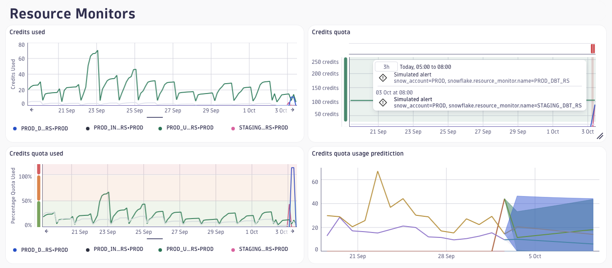
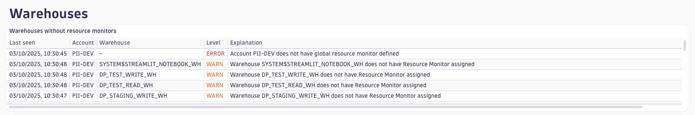
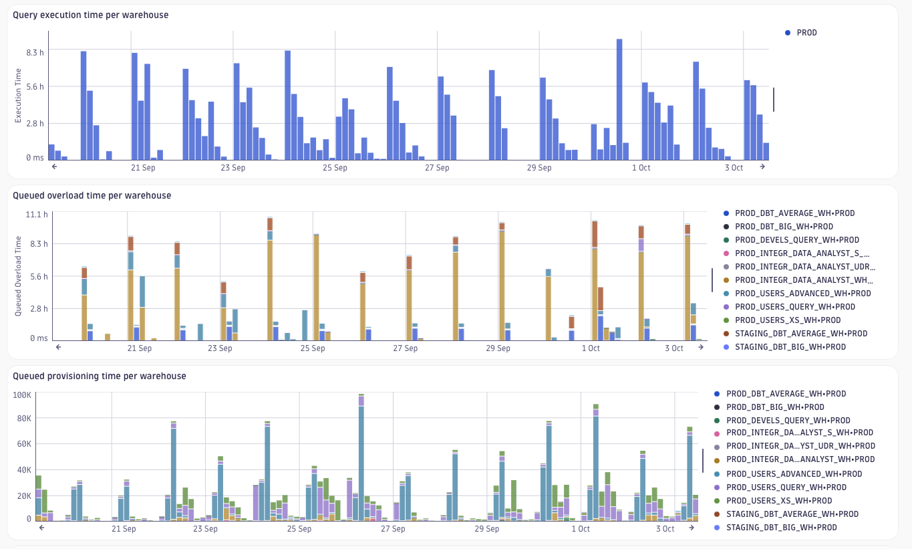
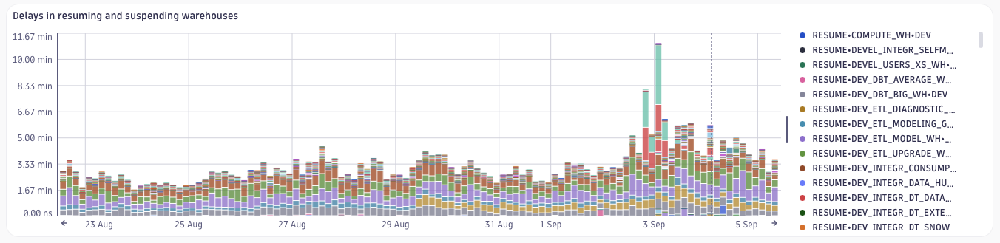
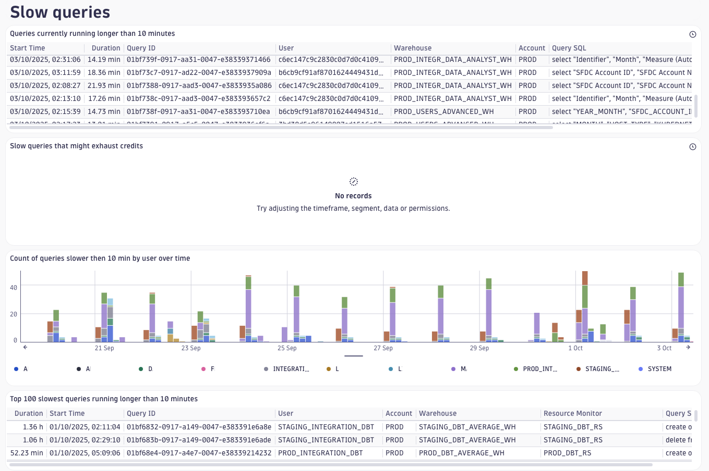

# Dashboard: Costs Monitoring

This dashboard provides insights into the costs associated with your Snowflake usage. It includes visualizations and metrics that help you monitor and analyze your spending patterns, identify cost drivers, and optimize your resource allocation.

## Cost Monitoring

- Tracks credits used over time.
- Displays the credit quota for resource monitors.
- Shows the percentage of credit quota used, with forecasting to predict future usage.

- Identifies warehouses that are not assigned to a resource monitor, which can lead to uncontrolled costs.

## Warehouse Performance

- Visualizes query execution time, queued overload time, and queued provisioning time per warehouse.

- Shows delays in resuming and suspending warehouses.

## Slow Query Analysis

- Identifies queries running longer than a configurable threshold.
- Lists currently active slow queries, with additional analysis to detect queries which might exhaust warehouse credits.
- Provides details on historical slow queries, including the user, warehouse, and query text.

