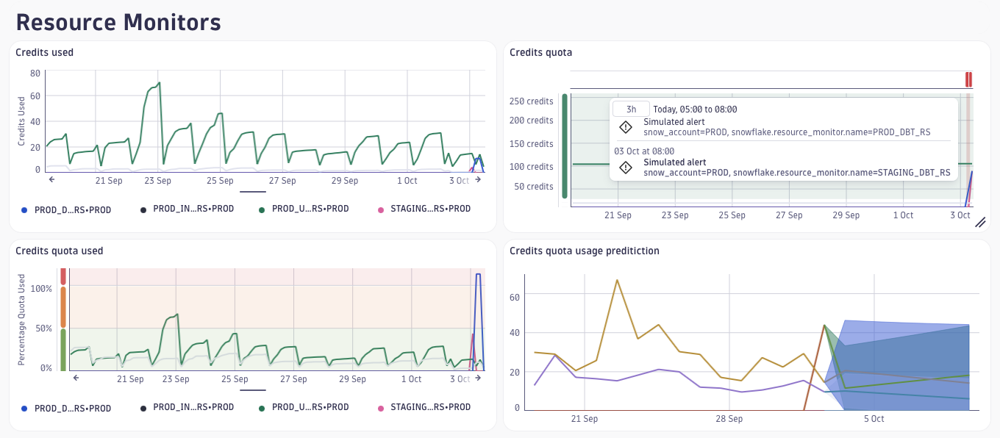
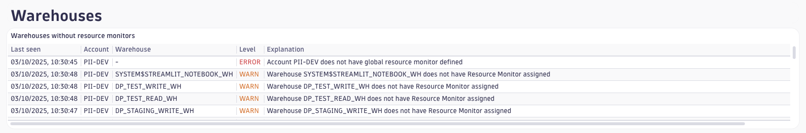
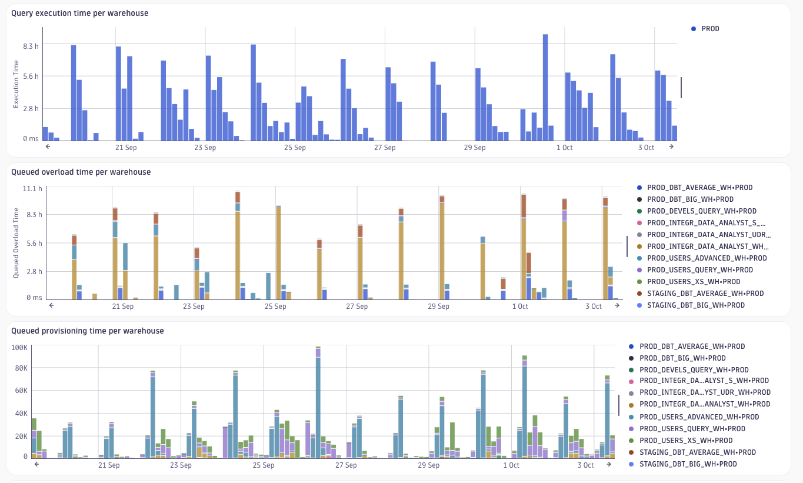
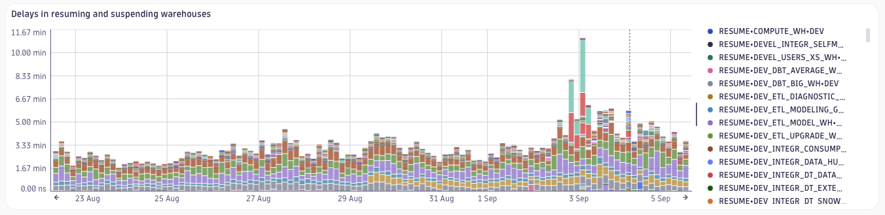
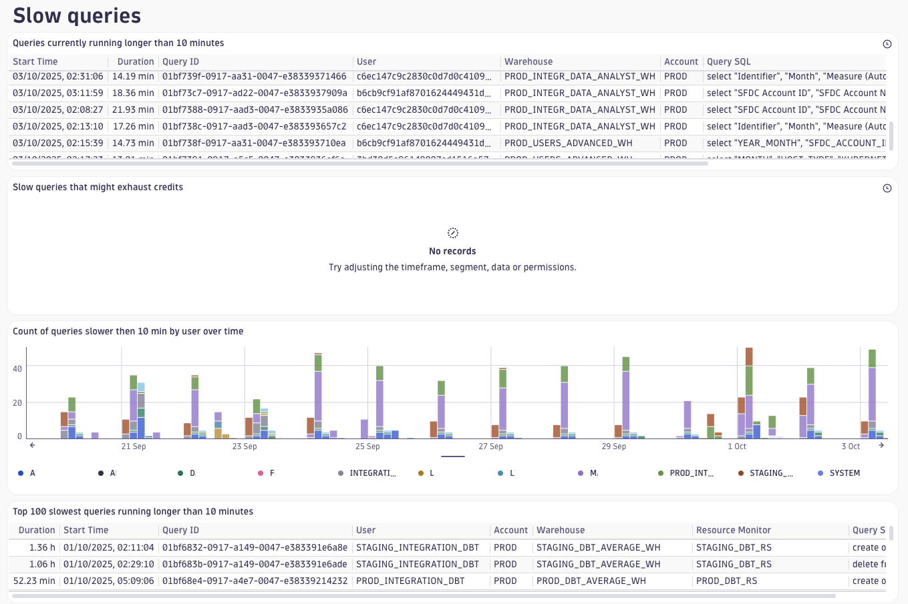

# Dashboard: Costs Monitoring

This dashboard provides insights into the costs associated with your Snowflake usage. It includes visualizations and metrics that help you monitor and analyze your spending patterns, identify cost drivers, and optimize your resource allocation.

## Cost Monitoring

- Tracks credits used over time.
- Displays the credit quota for resource monitors.
- Shows the percentage of credit quota used, with forecasting to predict future usage.

- Identifies warehouses that are not assigned to a resource monitor, which can lead to uncontrolled costs.

## Warehouse Performance

- Visualizes query execution time, queued overload time, and queued provisioning time per warehouse.

- Shows delays in resuming and suspending warehouses.

## Slow Query Analysis

- Identifies queries running longer than a configurable threshold.
- Lists currently active slow queries, with additional analysis to detect queries which might exhaust warehouse credits.
- Provides details on historical slow queries, including the user, warehouse, and query text.

## Credits Exhaustion Forecast

- Displays daily credits consumption trends alongside quota limits as a line chart, enabling visual identification of consumption velocity and remaining runway.
- Lists resource monitors sorted by percentage of quota used (descending), highlighting monitors approaching exhaustion with their remaining credits and frequency settings.

## Resource Monitor Health

- Honeycomb visualization of resource monitor active/inactive states with color-coded status (green = active, red = inactive) for rapid identification of disabled monitors.
- Comprehensive table of all resource monitors showing frequency, active state, quota, used credits, and remaining credits for configuration review.

## Warehouse Efficiency

Identifies warehouses wasting credits through excessive idle time and suboptimal auto-suspend configuration.

- **Idle Time Ratio** — per-warehouse table showing the percentage of 5-minute load-history intervals where no
  queries were running. Color-coded by configurable `$Idle_Threshold_Pct` variable (default 50%).
- **Idle Time Trend** — hourly line chart of idle ratio per warehouse over the selected timeframe, enabling
  identification of recurring idle patterns (e.g. overnight, weekends).
- **Auto-Suspend Configuration** — table of current auto-suspend timeout, warehouse size, credits/hour, type,
  scaling policy, and cluster min/max for every warehouse. Useful for auditing misconfigured timeouts.
- **Estimated Credit Waste** — table combining idle hours with credits/hour to surface the top credit-wasting
  warehouses. Includes a heuristic suggested timeout: >50% idle → 60 s, >20% idle → 300 s, else keep current.
  Note: estimates assume the 60-second Snowflake minimum billing floor.
- **Multi-Cluster Utilization** — line chart of average started vs maximum clusters over time for multi-cluster
  warehouses, showing whether provisioned capacity is actually used.
- **Idle Clusters** — table of multi-cluster warehouses with average started clusters, idle cluster count, and
  utilization percentage. Low utilization indicates over-provisioned `max_cluster_count`.
- **Resume/Suspend Frequency** — bar chart of RESUME\_WAREHOUSE and SUSPEND\_WAREHOUSE event counts over time.
  High frequency (thrashing) indicates the auto-suspend timeout is too aggressive.
