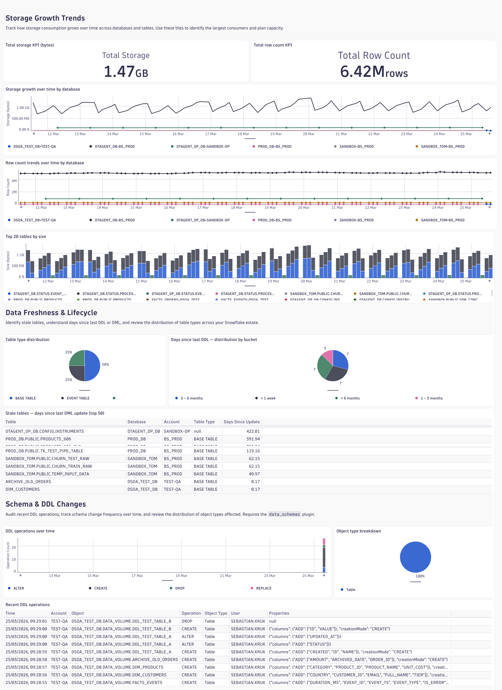
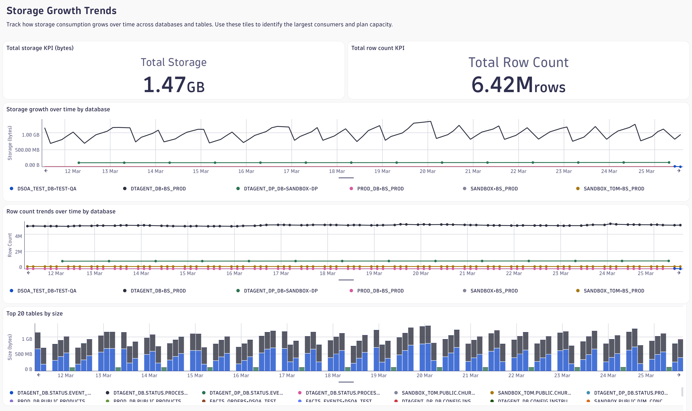

# Dashboard: Data Volume & Storage

The **Data Volume & Storage** dashboard gives data stewards, FinOps teams, and governance
leads a single pane of glass into how data grows, how fresh it is, and who is changing it.
It combines storage byte and row count trends from the `data_volume` plugin with DDL audit
events from the `data_schemas` plugin, covering five use cases across Quality, Costs, and
Security themes.

## Storage Growth Trends

The first question this section answers is: *where is my storage growing and at what rate?*
Two headline KPI tiles give an account-wide snapshot of total bytes stored and total row count
at a glance. Below them, two line charts break storage and row counts down by database over
the dashboard time range, making it easy to spot a database that is growing faster than peers.

The **Top 20 tables by size** bar chart shifts focus from trends to ranking — it shows the
twenty largest individual tables so capacity-planning work can target the right objects first.
All tiles respond to the `$Accounts`, `$Database`, and `$TableType` variable filters.

- **Total Storage KPI** — sum of `snowflake.data.size` (bytes) across the selected scope.
- **Total Row Count KPI** — sum of `snowflake.data.rows` across the selected scope.
- **Storage growth over time by database** — `snowflake.data.size` trended per `db.namespace`.
  Use this to spot sudden storage spikes or steady, unexpected growth.
- **Row count trends over time by database** — `snowflake.data.rows` trended per `db.namespace`.
  Unexpected drops indicate truncations or bulk deletes that may warrant investigation.
- **Top 20 tables by size** — shows maximum observed `snowflake.data.size` per table.
  Useful for identifying candidates for compression, archival, or tiering to Iceberg.

## Data Freshness & Lifecycle

This section answers: *which tables have not been touched recently, and how are tables
distributed by type?* A **table type distribution** pie chart provides an instant view of
the proportion of BASE TABLE, TEMPORARY TABLE, and EXTERNAL TABLE objects — deviations from
expected ratios can flag misconfigured pipelines or uncleaned temporary tables.

The **Stale tables** table lists up to 50 tables sorted by days since last DML update
(`snowflake.table.time_since.last_update` ÷ 1440). Tables with high staleness are candidates
for archival or deletion. Filter by `$Database` to scope the review to a specific database.

The **Days since last DDL distribution** bar chart buckets all tables by time since their
last structural change. This makes it straightforward to report on what percentage of the
estate has been dormant for over 90 days — a common governance metric.

- **Table type distribution** — counts by `snowflake.table.type` at the latest observation.
- **Stale tables** — top 50 tables by `days_since_update`, derived from `snowflake.table.time_since.last_update` (in minutes).
- **Days since last DDL distribution** — tables bucketed into `< 1 week`, `1 week – 1 month`,
  `1 – 3 months`, `3 – 6 months`, `> 6 months` from `snowflake.table.time_since.last_ddl`.

## Schema & DDL Changes

This section answers: *what structural changes are happening and who is making them?*
A **DDL operations over time** bar chart trends the volume of CREATE, ALTER, DROP, REPLACE,
and UNDROP operations — spikes indicate concentrated schema work that may need review.
An **object type breakdown** pie shows whether DDL activity is concentrated on Tables,
Views, Functions, or other object types.

The **Recent DDL operations** table is the primary audit log surface: it lists every DDL
event with timestamp, account, object name, operation, object type, user, and property
changes. Analysts can filter by `$Database` to scope the audit to a specific database. The
`Properties` column contains a JSON summary of the structural change (e.g. columns added or
dropped).

- **DDL operations over time** — `count()` by `snowflake.object.ddl.operation` over time.
- **Object type breakdown** — `count()` by `snowflake.object.type` for the selected period.
- **Recent DDL operations** — sorted by timestamp descending, limit 200; shows
  `snowflake.object.name`, `snowflake.object.ddl.operation`, `snowflake.object.type`,
  `db.user`, and `snowflake.object.ddl.properties`.

## Dashboard Variables

| Variable      | Type  | Default | Description                                                                         |
|---------------|-------|---------|-------------------------------------------------------------------------------------|
| `$Accounts`   | query | all     | Snowflake account identifiers (`deployment.environment`) from `data_volume` events. |
| `$Database`   | query | all     | Database names (`db.namespace`) filtered to the selected accounts.                  |
| `$TableType`  | query | all     | Table types (`snowflake.table.type`): BASE TABLE, TEMPORARY TABLE, EXTERNAL TABLE.  |

All three variables are multi-select. The DDL tiles filter by `$Accounts` and `$Database`;
freshness and storage tiles additionally respect `$TableType`. Setting `$Database` to a
single value is the recommended starting point for a per-team governance review.

## Required Plugin(s)

**`data_volume`** — Collects storage bytes and row counts per table by querying
`INFORMATION_SCHEMA.TABLE_STORAGE_METRICS`. Emits metrics (`snowflake.data.size`,
`snowflake.data.rows`, `snowflake.table.time_since.last_ddl`,
`snowflake.table.time_since.last_update`) and timestamp events. Typical collection
cadence: every DSOA run (configurable, default ~5 min). Data reflects the state at query
time; time-travel and fail-safe bytes are not included in `snowflake.data.size`.

**`data_schemas`** — Tracks DDL operations by querying `SNOWFLAKE.ACCOUNT_USAGE.ACCESS_HISTORY`
or equivalent. Emits events for each DDL change with operation, object type, user, and
property details. Collection cadence matches the DSOA run schedule.

## Known Limitations

- `snowflake.data.size` reflects active bytes only; time-travel bytes and fail-safe bytes are
  separate Snowflake metrics not captured in this plugin version.
- The `data_schemas` tiles do not filter by `$TableType` because DDL events do not carry a
  `snowflake.table.type` attribute — that dimension is emitted only by `data_volume`.
- Stale-table and DDL-distribution tiles use the **maximum observed value** within the
  dashboard time window, not a point-in-time snapshot. Very short time windows may show lower
  staleness values if a full DSOA cycle has not completed within the window.
- The `$Database` variable for the DDL section matches on `db.namespace`; objects that do not
  carry a database namespace (e.g. account-level objects) will appear regardless of this filter.
