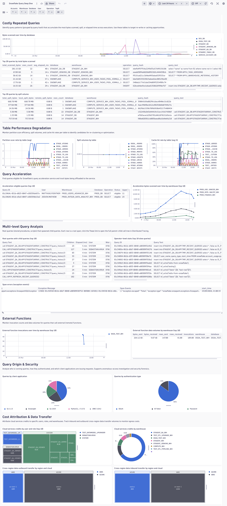
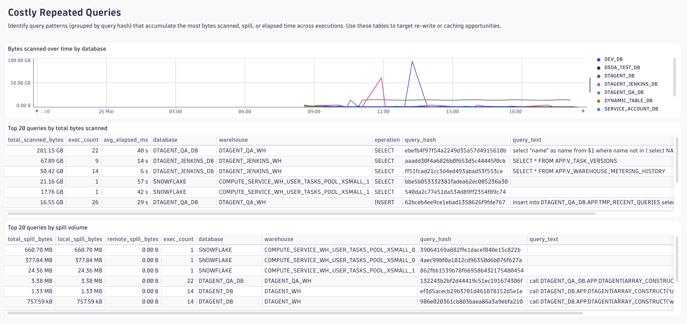
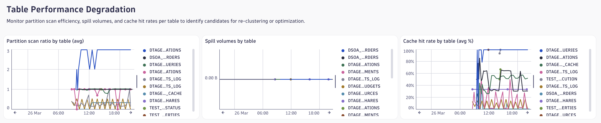
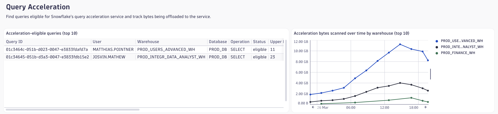
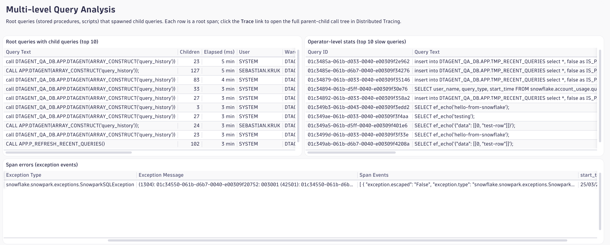
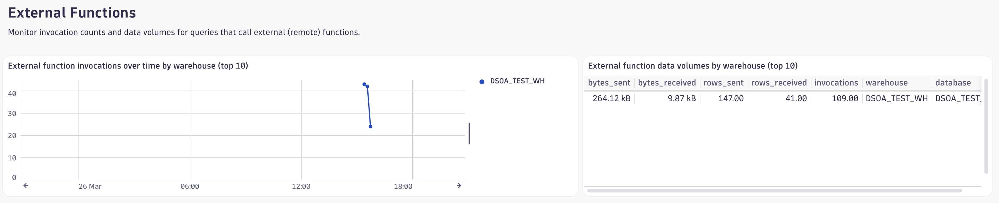
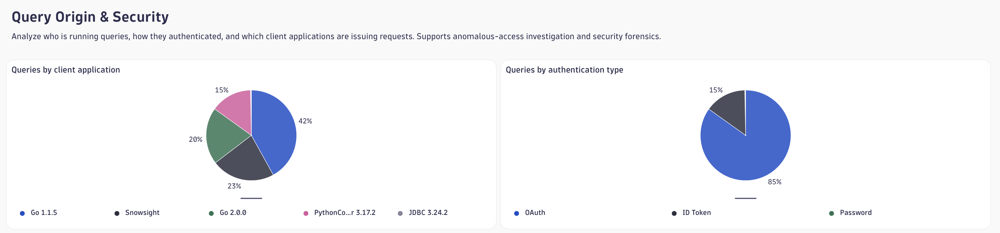
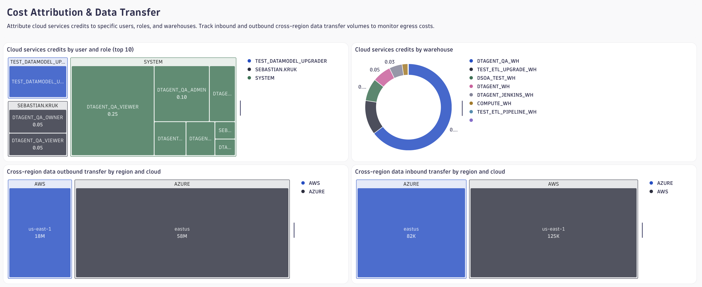
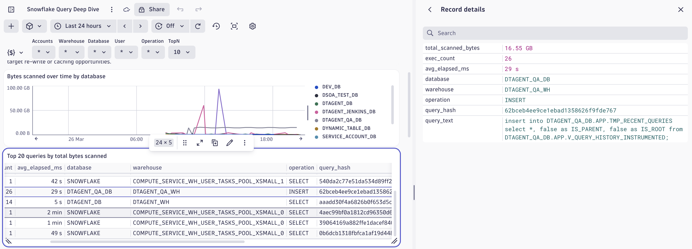

# Dashboard: Snowflake Query Deep Dive

Advanced query analytics for DBAs and FinOps teams covering eight use cases:
costly repeated queries, table performance degradation, query acceleration analysis,
multi-level query analysis, external function performance, query origin & security,
query cost attribution, and cross-region data transfer monitoring.

## Purpose

The dashboard empowers teams to:

- Identify the most resource-intensive query patterns across repeated executions
- Detect table performance degradation via partition scan ratios and spill volumes
- Monitor query acceleration service adoption and bytes offloaded
- Trace parent-child query relationships and operator-level plan statistics
- Track external function invocation frequency and data volumes
- Audit query origins by client application and authentication type
- Attribute cloud services credits to specific users, roles, and warehouses
- Quantify cross-region data transfer costs by region and cloud provider

## Dashboard Variables

| Variable | Dimension | Default | Description |
|---|---|---|---|
| `$Accounts` | `deployment.environment` | `*` (all) | Filter to one or more Snowflake accounts |
| `$Warehouse` | `snowflake.warehouse.name` | `*` (all) | Filter by warehouse |
| `$Database` | `db.namespace` | `*` (all) | Filter by database context |
| `$User` | `db.user` | `*` (all) | Filter by Snowflake user |
| `$Operation` | `db.operation.name` | `*` (all) | Filter by SQL operation type (SELECT, INSERT, etc.) |
| `$TopN` | n/a | `10` | Controls how many series the Section 2 charts display (5 / 10 / 25 / 50) |

The first five variables support multi-select and apply consistently across all data tiles.
`$TopN` is a single-select static variable.

## Section 1 — Costly Repeated Queries

Identifies query patterns (grouped by `snowflake.query.hash`) that accumulate
the most resource consumption across repeated executions.

**Top queries by total bytes scanned** (table)
Ranks query hashes by the sum of `snowflake.data.scanned` across all executions.
Includes execution count and average elapsed time to distinguish high-frequency
cheap queries from low-frequency expensive ones.
A representative query text (`query_text`) is included as the last column — hidden
by default to keep the table readable. See [Viewing query text](#viewing-query-text) below.

**Top queries by spill volume** (table)
Ranks query hashes by combined local + remote spill (`snowflake.data.spilled.local` +
`snowflake.data.spilled.remote`). High spill indicates memory pressure that can
be resolved by reducing result set sizes, improving joins, or upsizing the warehouse.
Query text is included as the last hidden column.

**Bytes scanned over time by database** (bar chart)
Trends total bytes scanned per database over the selected timeframe. Sudden increases
in a specific database signal a new or modified query pattern worth investigating.

## Section 2 — Table Performance Degradation

Per-table metrics that reveal whether micro-partition clustering is degrading
and whether data is being served from cache or always re-read from storage.

**Partition scan ratio by table** (line chart)
Plots `snowflake.partitions.scanned / snowflake.partitions.total` per table over time.
A ratio approaching 1.0 means nearly all partitions are scanned — a strong signal
the table needs re-clustering on the most-filtered column(s).

**Spill volumes by table** (line chart)
Trends local and remote spill per table. Persistent remote spill on a specific
table indicates queries against that table regularly exhaust warehouse memory.

**Cache hit rate by table** (line chart)
Plots `snowflake.data.scanned_from_cache * 100` (percentage) per table. Low cache
hit rates for frequently-read tables suggest queries vary enough to prevent cache reuse
or those tables are rarely re-queried within the warehouse result cache window.

## Section 3 — Query Acceleration

Lists queries where Snowflake has flagged acceleration eligibility and tracks
bytes actually offloaded to the query acceleration service.

**Acceleration-eligible queries** (table)
Shows queries where `snowflake.query.accel_est.status == "eligible"` with their
estimated speedup times at various scale factors and the upper limit scale factor.
Sort by `total_elapsed_ms` to prioritise the most expensive eligible queries.

**Acceleration bytes scanned over time by warehouse** (line chart)
Trends bytes scanned by the acceleration service (`snowflake.acceleration.data.scanned`)
per warehouse. Growth here indicates increasing adoption of the service and can be
correlated with execution time improvements on those warehouses.

## Section 4 — Multi-level Query Analysis

Spans emitted by the `query_history` plugin carry parent-child relationships and
operator-level plan data. Use these tiles to trace procedure call chains and identify
the costliest plan operators.

**Root queries with child queries** (table)
Lists root spans (no `snowflake.query.parent_id`) that have at least one child span,
joined via a lookup on `snowflake.query.id`. Shows query text, number of children,
elapsed time, user, warehouse, database, and operation. Sorted by elapsed time descending.

**Operator-level stats (slow queries)** (table)
Shows spans carrying `span.events` with embedded operator statistics (populated only
for queries exceeding `slow_queries_threshold`, default 100 ms). The `operator_stats`
column contains a parsed JSON array of per-operator stats (input/output rows, memory
usage). Sorted by elapsed time descending.

## Section 5 — External Functions

Monitors queries that invoke external (remote) functions, tracking invocation
frequency and data volumes to surface latency and bandwidth costs.

**External function invocations over time by warehouse** (line chart)
Trends the total number of remote function calls (`snowflake.external_functions.invocations`)
per warehouse. Spikes indicate new or changed workloads relying on external services.

**External function data volumes by warehouse** (table)
Summarises bytes sent/received and rows sent/received per warehouse and database
across all external function calls. Use this to identify the most data-intensive
remote function consumers.

## Section 6 — Query Origin & Security

Breaks down queries by how they were submitted and who submitted them, supporting
anomalous-access investigation and client application auditing.

**Queries by client application** (pie chart)
Distribution of query counts by `client.application.id`. Unexpected application IDs
or sudden growth of a new application may indicate unauthorised tooling or a
misconfigured integration.

**Queries by authentication type** (pie chart)
Distribution of query counts by `authentication.type` (e.g., `PASSWORD`, `OAUTH`,
`KEY_PAIR`, `MFA`). A large proportion of PASSWORD-authenticated queries from service
accounts is a security risk and should trigger rotation or migration to key-pair auth.

## Section 7 — Cost Attribution & Data Transfer

Attributes compute and cloud services credits to specific actors and identifies
cross-region transfer costs.

**Cloud services credits by user and role** (treemap)
Shows the top user+role combinations by total `snowflake.credits.cloud_services`
consumed. Each rectangle is sized by credit volume. Focus optimisation efforts on
the largest rectangles.

**Cloud services credits by warehouse** (donut chart)
Ranks warehouses by total cloud services credits. Warehouses with unexpectedly high
cloud services credit consumption often have poorly-optimised queries or excessive
metadata operations.

**Cross-region outbound data transfer** (treemap)
Visualises outbound transfer volumes broken down by region and cloud provider.
Sized by `outbound_bytes`. Use this to quantify egress costs and identify data
pipelines moving large volumes across regions or clouds.

**Cross-region inbound data transfer** (treemap)
Visualises inbound transfer volumes broken down by region and cloud provider.
Sized by `inbound_bytes`. Useful for tracking ingestion costs from external sources.

## Viewing Query Text

The two top-query tables (Section 1) include a `query_text` column containing a
representative sample of the SQL for each query hash (via `takeFirst(db.query.text)`).
This column is **hidden by default** to keep the table compact.

There are two ways to read it:

**Option 1 — View record details (recommended)**
Right-click any row (or click the `⋮` row menu) and select **View record details**.
A side panel opens showing all fields for that row, including the full `query_text`.

**Option 2 — Show the column**
Click the column visibility icon (grid icon, top-right of the table tile) and toggle
`query_text` on. The column appears at the far right; very long queries will truncate
in the cell — use Option 1 for the full text.

## Technical Notes

- All numeric metrics (`snowflake.data.scanned`, `snowflake.time.total_elapsed`, etc.)
  are stored as strings in Dynatrace. All queries use `toDouble()` before aggregation.
- Section 4 tiles use `fetch spans` instead of `fetch logs`. The `query_history` plugin
  emits spans for operator-level plan data.
- The `$Warehouse`, `$Database`, `$User`, and `$Operation` variable filters use the
  null-or-match pattern (`isNull(x) or in(x, array($Var))`) so records without those
  dimensions are still shown when the variable is set to the wildcard default `*`.
- The `$Accounts` filter uses a strict `in()` because `deployment.environment` is always
  populated for `query_history` records.
- Operator stats in the Section 4 slow-queries tile are only populated for queries that
  exceed `slow_queries_threshold` (default 100 ms in test-qa).
- Default timeframe: last 24 hours. Auto-refresh: every 5 minutes.
- **Required plugin**: `query_history`
- **Dashboard ID**: `9dbac33a-25ba-4192-b748-c8b6fe561c3b`
- **DPO Themes**: Performance · Security · Costs
