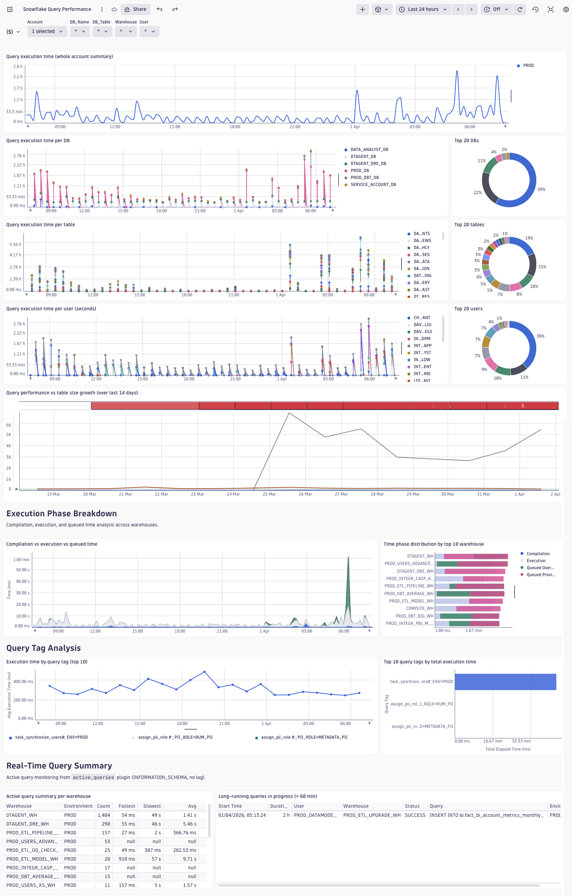

# Dashboard: Snowflake Query Performance

This dashboard provides comprehensive insights into the performance of Snowflake queries, helping database administrators and developers identify slow or resource-intensive queries. It enables performance monitoring across multiple dimensions including accounts, databases, tables, and users, facilitating targeted optimization efforts.

## Purpose

The dashboard empowers teams to:

- Monitor query execution time trends across the entire Snowflake environment
- Identify the most resource-intensive databases, tables, and users
- Track performance changes over time to detect degradation or improvements
- Correlate query performance with data volume growth using AI-powered anomaly detection
- Make informed decisions about query optimization and resource allocation

## Dashboard Variables

Four cascading variables enable hierarchical filtering from account down to individual users:

- **Account**: Filter by Snowflake deployment environment or service name (single selection, default: all accounts)
- **DB_Name**: Filter by database name or namespace (single selection, default: all databases)
- **DB_Table**: Filter by specific table name (single selection, default: all tables)
- **User**: Filter by database user (single selection, default: all users)

Each variable dynamically updates based on the selections made in previous filters, ensuring only valid combinations are available.

## Executive Summary

**Query execution time (whole account summary)** - A line chart providing a high-level overview of total query execution time across all selected accounts. This visualization uses smooth curves and gap connection to show continuous performance trends, making it easy to spot overall system performance patterns at a glance.

## Execution Time Analysis

Three complementary area charts break down query execution time across different dimensions:

### By Database
**Query execution time per DB** - Shows cumulative execution time for each database over time. This helps identify which databases are consuming the most computational resources and whether specific databases show performance degradation patterns.

### By Table
**Query execution time per table** - Displays execution time aggregated by individual tables. This is particularly valuable for identifying hot tables that are frequently queried or have performance issues, enabling targeted table-level optimizations such as indexing, partitioning, or materialized views.

### By User
**Query execution time per user (seconds)** - Tracks execution time by database user, revealing which users or applications are generating the most load. This information is useful for capacity planning, identifying inefficient client applications, and targeted user training on query optimization.

## Top Resource Consumers

Three donut charts identify the highest consumers of query execution time, providing a proportional view of resource distribution:

### Top 20 Tables
**Top 20 tables** - Visualizes the relative execution time consumption of the 20 most queried or slowest tables. The relative size of each segment immediately shows which tables deserve optimization attention.

### Top 20 Users
**Top 20 users** - Shows the proportion of execution time attributed to the top 20 users. This helps identify power users, automated processes, or applications that may benefit from query optimization or resource adjustments.

### Top 20 Databases
**Top 20 DBs** - Displays execution time distribution across the top 20 databases, supporting decisions about database consolidation, resource allocation, or targeted performance tuning efforts.

## Advanced Analytics

**Query performance vs table size growth (over last 14 days)** - An AI-powered Davis anomaly detection visualization that correlates average query execution time with table row count growth over a 14-day period.

This advanced analysis:

- Calculates execution time per row for each table to normalize performance metrics
- Automatically detects anomalies where performance degrades disproportionately to data growth
- Helps predict future performance issues before they become critical
- Identifies tables where query performance is not scaling linearly with data volume

This proactive monitoring enables database teams to address performance issues before they impact users.

## Technical Details

**Default Timeframe**: Last 24 hours

**Required Plugin**: `query_history`

**Data Source**: Snowflake logs captured by the DSOA query history plugin, providing comprehensive query execution metadata including execution times, user information, database context, and table access patterns.

**Performance Metrics**: All execution time measurements are captured in milliseconds and automatically converted to appropriate time units for display.
