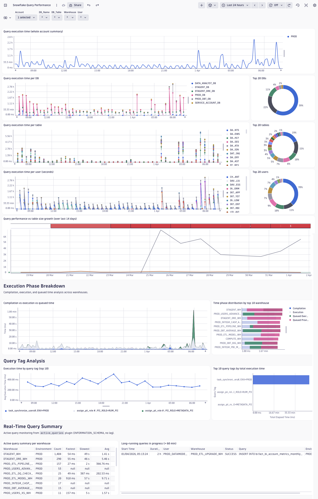

# Dashboard: Snowflake Query Performance

This dashboard provides comprehensive insights into the performance of Snowflake queries, helping database administrators and developers identify slow or resource-intensive queries. It enables performance monitoring across multiple dimensions including accounts, databases, tables, and users, facilitating targeted optimization efforts.

## Purpose

The dashboard empowers teams to:

- Monitor query execution time trends across the entire Snowflake environment
- Identify the most resource-intensive databases, tables, and users
- Track performance changes over time to detect degradation or improvements
- Correlate query performance with data volume growth using AI-powered anomaly detection
- Make informed decisions about query optimization and resource allocation

## Dashboard Variables

Eight variables enable flexible filtering across multiple dimensions. The first five are multi-select query variables that cascade from account down to individual users. The remaining three control display behavior.

### Filter Variables (multi-select)

- **Account**: Filter by Snowflake deployment environment. Multi-select; cascades to all downstream variables.
- **DB_Name**: Filter by database name or namespace. Multi-select; scoped to the selected Account(s).
- **DB_Table**: Filter by specific table name. Multi-select; scoped to the selected Account(s) and DB_Name(s). Expands `db.snowflake.tables` JSON arrays to list individual tables.
- **Warehouse**: Filter by Snowflake warehouse name. Multi-select; scoped to the selected Account(s).
- **User**: Filter by database user. Multi-select; scoped to the selected Account(s) and DB_Name(s).

### Display Variables

- **TopN** (hidden, CSV): Controls the number of items shown in ranked tiles (execution time by query tag, top query tags, time phase distribution by warehouse). Options: 5, 10, 20, 50, 100. Default: 10.
- **SlowQueryMin** (hidden, text): Minimum elapsed time in minutes for a query to appear in the long-running queries table. Default: 5.
- **TAG_FILTER** (hidden, text): Internal parse pattern for extracting query tags from statement text. Not intended for manual editing.

All multi-select variables use `in(field, array($Variable))` filtering. Each variable dynamically updates based on the selections made in upstream filters, ensuring only valid combinations are available.

## Executive Summary

**Query execution time (whole account summary)** - A line chart providing a high-level overview of total query execution time across all selected accounts. This visualization uses smooth curves and gap connection to show continuous performance trends, making it easy to spot overall system performance patterns at a glance.

## Execution Time Analysis

Three complementary area charts break down query execution time across different dimensions:

### By Database
**Query execution time per DB** - Shows cumulative execution time for each database over time. This helps identify which databases are consuming the most computational resources and whether specific databases show performance degradation patterns.

### By Table
**Query execution time per table** - Displays execution time aggregated by individual tables. This is particularly valuable for identifying hot tables that are frequently queried or have performance issues, enabling targeted table-level optimizations such as indexing, partitioning, or materialized views.

### By User
**Query execution time per user (seconds)** - Tracks execution time by database user, revealing which users or applications are generating the most load. This information is useful for capacity planning, identifying inefficient client applications, and targeted user training on query optimization.

## Top Resource Consumers

Three donut charts identify the highest consumers of query execution time, providing a proportional view of resource distribution:

### Top 20 Tables
**Top 20 tables** - Visualizes the relative execution time consumption of the 20 most queried or slowest tables. The relative size of each segment immediately shows which tables deserve optimization attention.

### Top 20 Users
**Top 20 users** - Shows the proportion of execution time attributed to the top 20 users. This helps identify power users, automated processes, or applications that may benefit from query optimization or resource adjustments.

### Top 20 Databases
**Top 20 DBs** - Displays execution time distribution across the top 20 databases, supporting decisions about database consolidation, resource allocation, or targeted performance tuning efforts.

## Advanced Analytics

**Query performance vs table size growth (over last 14 days)** - An AI-powered Davis anomaly detection visualization that correlates average query execution time with table row count growth over a 14-day period.

This advanced analysis:

- Calculates execution time per row for each table to normalize performance metrics
- Automatically detects anomalies where performance degrades disproportionately to data growth
- Helps predict future performance issues before they become critical
- Identifies tables where query performance is not scaling linearly with data volume

This proactive monitoring enables database teams to address performance issues before they impact users.

## Execution Phase Breakdown

**Compilation vs execution vs queued time** - An area chart showing average compilation, execution, queued overload, and queued provisioning time per warehouse over time. All four phases are displayed as stacked areas (`union: true`) with automatic millisecond-to-time-unit conversion via `unitsOverrides`. This reveals whether query slowdowns are caused by compilation overhead, actual execution time, or warehouse queuing, enabling targeted remediation. Filtered by Account and Warehouse variables.

**Time phase distribution by top $TopN warehouse** - A categorical bar chart showing total compilation, execution, queued overload, and queued provisioning time per warehouse, limited to the top N warehouses ranked by total time. Uses log scale on the value axis to handle wide magnitude differences across warehouses. Field names use clean labels (Compilation, Execution, Queued Overload, Queued Provisioning) with `unitsOverrides` for millisecond display.

## Query Tag Analysis

**Execution time by query tag (top $TopN)** - A line chart tracking average execution time over time for the top N query tags ranked by total execution time sum. Query tags allow teams to attribute workloads to specific applications, teams, or pipelines, making this visualization essential for workload-level performance monitoring.

**Top $TopN query tags by total execution time** - A categorical bar chart showing the N query tags consuming the most total elapsed time. Uses `$TopN` variable to control the number of displayed tags.

## Real-Time Query Summary

**Active query summary per warehouse** - A table showing count, fastest, slowest, and average elapsed time for currently active queries grouped by warehouse. Time fields use clean names (Fastest, Slowest, Avg) with `unitsOverrides` for automatic millisecond-to-time-unit conversion. Data comes from the `active_queries` plugin (INFORMATION_SCHEMA, no ingestion lag), providing a real-time view of warehouse utilization.

**Long-running queries in progress (> $SlowQueryMin min)** - A table listing queries that have been running longer than the threshold set by the `$SlowQueryMin` variable (default: 5 minutes), including start time, duration, user, warehouse, execution status, and a truncated query text. This enables immediate identification of runaway queries that may need intervention.

## Technical Details

**Default Timeframe**: Last 24 hours

**Required Plugins**: `query_history`, `active_queries`

**Data Source**: Snowflake logs captured by the DSOA query history plugin, providing comprehensive query execution metadata including execution times, user information, database context, and table access patterns.

**Performance Metrics**: All execution time measurements are captured in milliseconds and automatically converted to appropriate time units for display.
