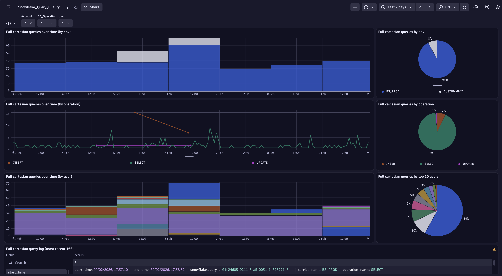

# Dashboard: Snowflake Query Quality

This dashboard identifies and analyzes Snowflake queries with full cartesian joins, which are often indicators of query quality issues. Cartesian joins are detected when a Join operator's output rows exceed its input rows, suggesting that the query may be producing an unintended cross product of data sets. This can lead to poor performance, excessive resource consumption, and potentially incorrect results.

## Purpose

The dashboard helps database administrators and developers:

- Identify queries that may have inefficient join conditions
- Track trends in query quality issues over time
- Pinpoint which environments, operations, or users are most affected
- Investigate specific problematic queries for optimization

## Dashboard Variables

Three interactive variables allow fine-grained filtering:

- **Account**: Filter by Snowflake deployment environment (single selection, default: all accounts)
- **DB_Operation**: Filter by database operation type (SELECT, INSERT, UPDATE, etc.) (single selection, default: all operations)
- **User**: Filter by database user (multi-select, default: all users)

These variables cascade, with each subsequent filter dynamically updating based on previous selections.

## Time Series Analysis

The dashboard provides three complementary time-series views showing full cartesian join occurrences over time:

1. By Environment

    **Full cartesian queries over time (by env)** - Bar chart with daily intervals showing cartesian join trends across different deployment environments (PROD, DEV, etc.). Production environments are highlighted in purple, development in blue for easy identification.

1. By Operation

    **Full cartesian queries over time (by operation)** - Line chart tracking cartesian joins by database operation type (SELECT, INSERT, UPDATE). Different operations are color-coded:

    - SELECT queries in green
    - INSERT queries in brown
    - UPDATE queries in purple

    This helps identify which types of operations are most prone to cartesian join issues.

1. By User

    **Full cartesian queries over time (by user)** - Bar chart with daily intervals showing which database users are executing queries with cartesian joins, enabling targeted education and remediation efforts.

## Distribution Analysis

Three pie charts provide aggregate views of cartesian join distribution:

1. By Environment

    **Full cartesian queries by env** - Shows the proportion of cartesian join queries across different deployment environments, helping prioritize which environments need attention.

1. By Operation

    **Full cartesian queries by operation** - Displays the breakdown of cartesian joins by SQL operation type, revealing which operation patterns need review.

1. By User

    **Full cartesian queries by top 10 users** - Identifies the top 10 users generating cartesian joins, useful for focused training or query review sessions.

## Detailed Query Log

**Full cartesian query log (most recent 100)** - A comprehensive record view displaying the 100 most recent queries with full cartesian joins. Each record includes:

- **Timing**: Start time, end time, total elapsed time, and execution time
- **Identification**: Query ID and query text
- **Context**: Deployment environment, operation name, database user
- **Status**: Execution status
- **Technical details**: Span events and operator statistics showing exactly which join operations caused the cartesian product
- **BI/ETL metadata**: Action, modeler task, module, and task tags (when available)

This detailed view allows for immediate investigation and optimization of problematic queries.

## Technical Details

**Default Timeframe**: Last 7 days

**Required Plugin**: `query_history`

**Detection Method**: The dashboard identifies cartesian joins by analyzing span events for Join operators where `input_rows < output_rows`, indicating that the join is producing more rows than it consumes—a characteristic of cartesian products.

**Data Source**: All queries fetch from Snowflake spans with event data, ensuring comprehensive coverage of query execution details captured by the DSOA's query history plugin.
