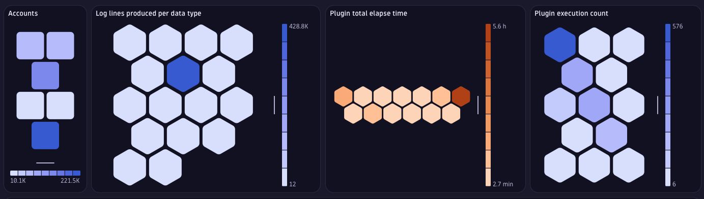
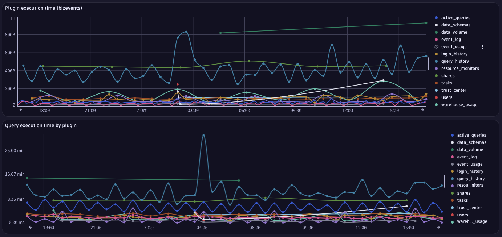
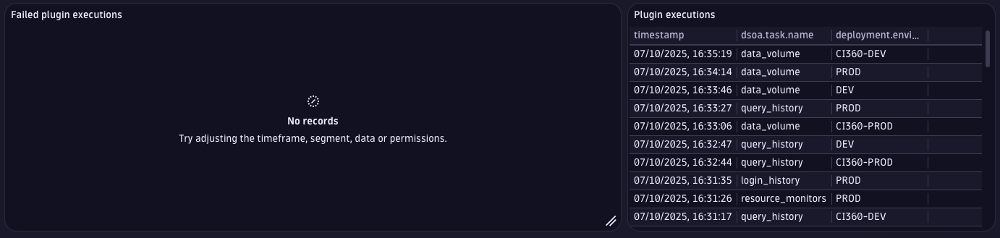

# Dashboard: DSOA Self-Monitoring

This dashboard provides a comprehensive overview of the Dynatrace Snowflake Open Source Agent (DSOA) itself, focusing on its operational health, performance, and resource consumption. It is designed to help administrators monitor the agent's activity, identify performance bottlenecks, and troubleshoot any issues that may arise during its execution.

## Dashboard Variables

The dashboard includes three interactive variables for filtering data:

- **Accounts**: Filter by Snowflake deployment environments
- **Plugin Names**: Filter by specific DSOA plugins
- **Plugin Contexts**: Filter by plugin execution contexts

## Account Overview

- Displays the monitored Snowflake accounts and their activity levels using a honeycomb visualization
- Shows the relationship between deployment environments and host names
- Helps identify which accounts are actively being monitored

## Data Production Metrics

The dashboard tracks the volume of observability data produced by DSOA across four data types:

- **Log lines produced per data type**: Visualizes the volume of logs by plugin context
- **Events produced per data type**: Shows event production breakdown by plugin context
- **Spans produced per data type**: Displays distributed tracing spans generated by each plugin
- **Combined data type timeline**: A bar chart showing all data types (logs, events, spans, bizevents) over time with logarithmic scale for easy comparison

This helps administrators understand the data footprint of each plugin and optimize resource allocation.

## Plugin Execution Analysis

- **Plugin execution time**: Line chart showing the duration of plugin executions over time based on business events, helping identify performance trends
- **Plugin execution count**: Honeycomb visualization displaying the total number of executions per plugin
- **Plugin total elapsed time**: Honeycomb chart showing cumulative execution time for each plugin, highlighting resource-intensive plugins
- **Recent plugin executions**: Table listing the 50 most recent plugin executions with timestamps, task names, and deployment environments

## Execution Failures and Troubleshooting

- **Failed plugin executions (bar chart)**: Time-series view of failed executions grouped by plugin and execution status
- **Failed plugin executions (detailed table)**: Comprehensive table showing failed queries with plugin names, query IDs, database namespaces, execution status, and error messages for detailed troubleshooting

This provides immediate visibility into operational errors and enables quick root cause analysis.

