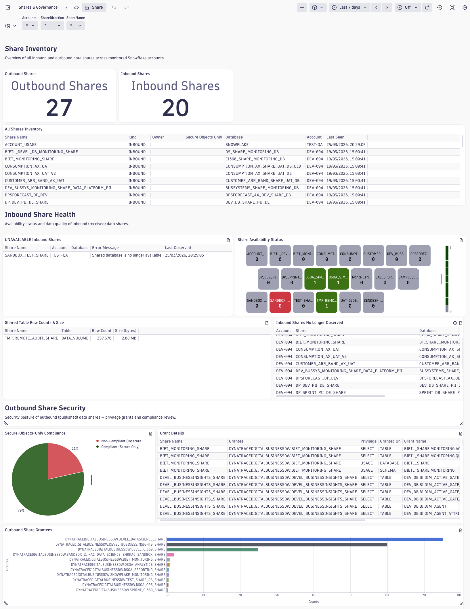
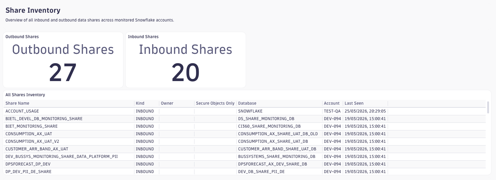
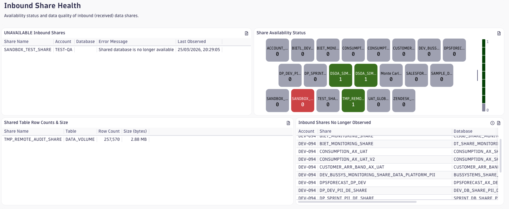
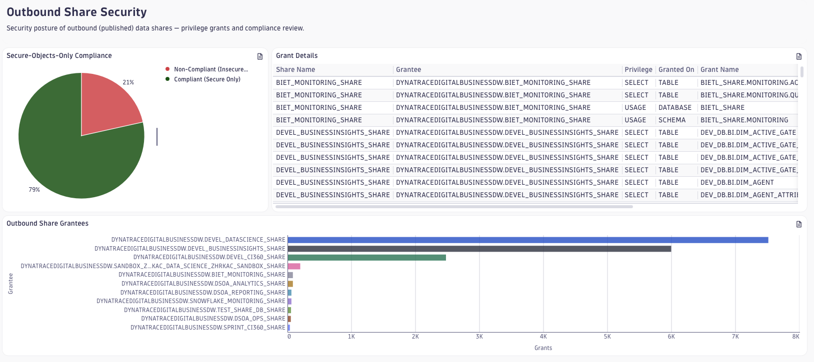

# Dashboard: Snowflake Shares & Governance

This dashboard gives data platform and security teams a single pane of glass for monitoring the health, security posture, and governance of Snowflake data sharing. It surfaces both sides of the sharing boundary: the outbound shares your organisation publishes to external consumers, and the inbound shares your accounts receive from providers. At a glance you can see which shares are active, which are broken, whether outbound shares follow your secure-objects policy, and who has been granted access to your data.

## Share Inventory

The top section answers the foundational questions: *how many shares do we have, and what are they?* Two KPI tiles at the top left give the total count of outbound and inbound shares currently observed. These numbers update every collection cycle, so a sudden drop can indicate a share was revoked or a database was deleted.

The **All Shares Inventory** table below expands the summary into a full registry: share name, direction (OUTBOUND or INBOUND), owner role, whether secure-objects-only mode is enforced, the linked database, and the originating Snowflake account. Filter by `$ShareDirection` or `$ShareName` to narrow focus, or leave the defaults to see your entire sharing footprint across all monitored accounts.

## Inbound Share Health

Inbound shares can silently break — a provider may revoke access, delete their underlying database, or let a share expire — leaving consumers with stale data without any immediate alert. This section is designed to surface exactly those conditions.

- **UNAVAILABLE Inbound Shares** — lists every inbound share whose `snowflake.share.status` is `UNAVAILABLE`, together with the last-observed error message and timestamp. Any row here means data from that share is no longer accessible. The most common cause is access revocation by the provider.
- **Share Availability Status** — a honeycomb tile mapping every inbound share to green (AVAILABLE) or red (UNAVAILABLE). Colour at a glance tells you whether a share is healthy. When you see a red cell, cross-reference the table above for the specific error.
- **Shared Table Row Counts & Size** — breaks down the data volume per table within each inbound share. Use this to detect truncated or unexpectedly empty shares: a table that normally contains millions of rows appearing with zero rows is a data-quality signal even when the share itself shows as AVAILABLE.
- **Shares with Deleted Database** — flags any share (inbound or outbound) whose provider-side database has been deleted. If rows appear here, the share is a dead reference that should be cleaned up.

## Outbound Share Security

Every outbound share is a potential data-exfiltration vector if not properly configured. This section gives security and compliance teams the visibility they need to enforce your sharing governance policy.

The **Secure-Objects-Only Compliance** pie chart shows how many outbound shares have `IS_SECURE_OBJECTS_ONLY` enabled versus how many do not. Snowflake recommends enabling this flag to ensure that only secure views and secure UDFs can be included in a share, preventing accidental exposure of underlying table structures or proprietary logic. A non-trivial "Non-Compliant" slice is a finding that warrants remediation.

The **Grant Details** table lists every privilege grant associated with your outbound shares — grantee, privilege, the object the privilege was granted on, and who granted it. This is the audit trail for your sharing agreements: review it periodically to ensure no unintended accounts have been granted access.

The **Outbound Share Grantees** bar chart ranks external accounts by the number of grants they hold across all your outbound shares. A single account holding an unexpectedly large number of grants may indicate over-provisioning or a misconfigured share. Pair this with the Grant Details table to investigate.

## Dashboard Variables

| Variable         | Type  | Default | Description                                                            |
|------------------|-------|---------|------------------------------------------------------------------------|
| `$Accounts`      | query | all     | Filter by Snowflake account identifier (`deployment.environment`)      |
| `$ShareDirection`| query | all     | Filter by share direction: `INBOUND` or `OUTBOUND`                     |
| `$ShareName`     | query | all     | Filter by share name — cascades from `$Accounts` and `$ShareDirection` |

All three variables are multi-select. The `$ShareName` variable is populated dynamically based on the selected `$Accounts` and `$ShareDirection` values, so the list only shows shares that match the upstream filters. Use `$ShareName` to drill into a single share when investigating an incident.

## Required Plugin(s)

This dashboard requires the **`shares`** plugin to be enabled. The plugin queries `SHOW SHARES` inside Snowflake and emits telemetry for three contexts:

| Context           | Telemetry type | Content                                                           |
|-------------------|----------------|-------------------------------------------------------------------|
| `outbound_shares` | logs           | One log line per outbound share, with grants and security flags   |
| `inbound_shares`  | logs           | One log line per inbound share, with status, tables, and row counts |
| `shares`          | events         | Summary-level share list (share name, kind, comment)              |

Collection cadence follows the agent's task schedule — typically every 5 minutes. The `outbound_shares` and `inbound_shares` contexts emit logs; the `shares` context emits timestamp events. All dashboard tiles use `fetch logs` queries except those backed by the `shares` context. Data latency is approximately one collection interval after the agent run.

## Known Limitations

- The `snowflake.share.has_db_deleted` and `snowflake.share.status` attributes are populated only for **inbound** shares. The "Shares with Deleted Database" tile queries both contexts but will only return rows for inbound shares in practice.
- The `inbound_shares` context does not populate `db.namespace` consistently — shared table data comes from the provider's account. The `$Accounts` filter therefore reflects the *consumer* account, not the provider.
- `snowflake.data.rows` and `snowflake.data.size` on the `inbound_shares` context are string attributes. The "Shared Table Row Counts & Size" tile converts them with `toLong()`. If a provider sets non-numeric row/size values, those rows will be dropped by the conversion.
- The `$ShareDirection` variable filters `INBOUND`/`OUTBOUND` as reported by Snowflake's `SHOW SHARES`. The `shares` summary context (used only for the top-level KPI variables query) does not emit grant details — grant information comes exclusively from `outbound_shares`.
