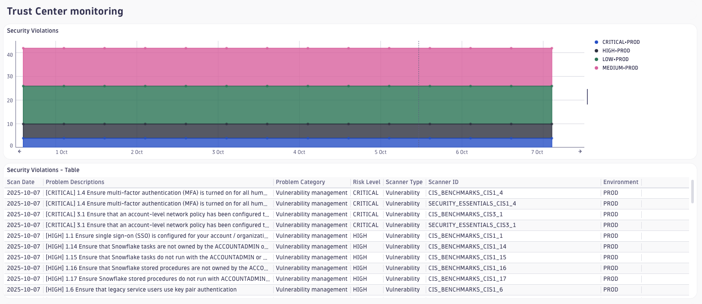
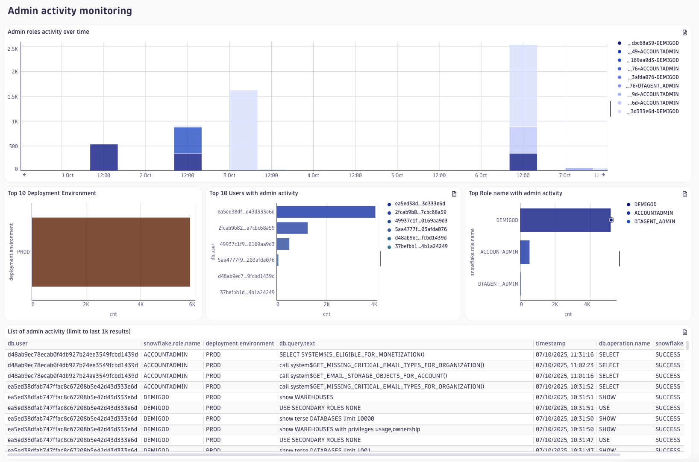
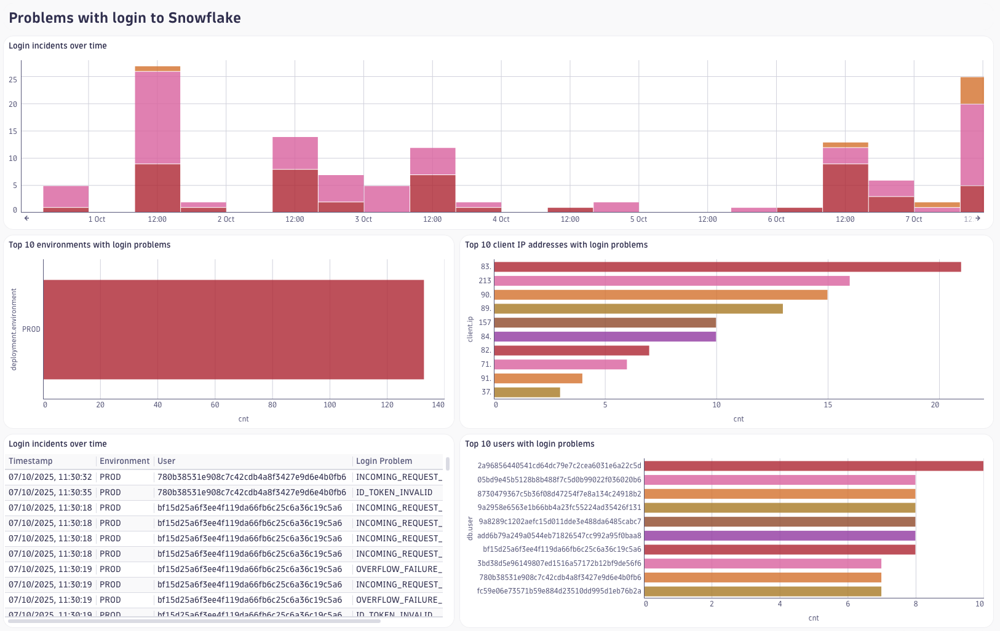
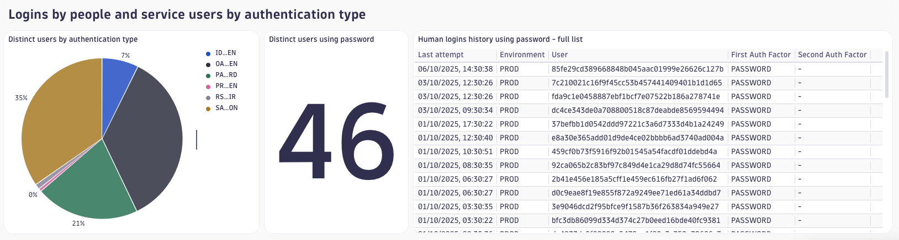

# Dashboard: Snowflake Security

This dashboard provides insights into the security aspects of your Snowflake accounts. It includes visualizations and metrics that help you monitor user authentication, login issues, administrative activity, and security compliance based on Snowflake's Trust Center.

## Consolidating Trust Center Findings for Enhanced Security Management

- Centralizes findings from Snowflake's internal Trust Center, which consolidates security-related tests and queries to provide a comprehensive overview of vulnerabilities and compliance issues.
- Enables efficient comparison of findings across multiple accounts to identify those with the most pressing security problems, a process that would otherwise require manual logins to each account.
- Allows security teams to prioritize and address critical security concerns efficiently, improving risk management and ensuring compliance with industry standards.

## Query History of Users with Excessive Privileges

- Monitors the query history of users with excessive privileges (e.g., admin roles) to safeguard sensitive data and detect potential misuse.
- Analyzes query patterns and helps identify unusual or unauthorized access to sensitive information, ensuring that powerful accounts are used responsibly.
- This proactive oversight helps maintain data integrity, prevent insider threats, and enforce strict access controls.

## Monitoring Failed Login Attempts for Early Threat Detection

- Tracks failed login attempts to identify potential brute force attacks and unauthorized access attempts, enabling the Incident Detection and Response (IDR) team to take immediate action.
- By analyzing patterns of failed logins, it helps detect ongoing attacks and allows for a swift response to prevent security breaches.
- Provides a detailed log of login incidents for further investigation and forensic analysis.

## Enforcing Secure Authentication Methods

- Identifies which users need to be migrated to stronger authentication methods like Multi-Factor Authentication (MFA) or Single Sign-On (SSO), as Snowflake will soon discontinue support for logins using only a username and password.
- For service accounts, it helps ensure they are configured with secure, non-password methods such as Key-Pair Authentication, Programmatic Access Tokens (PAT), External OAuth, or Workload Identity Federation (WIF).
- Tracks authentication methods used by both human and service users to monitor the transition to more secure practices.

