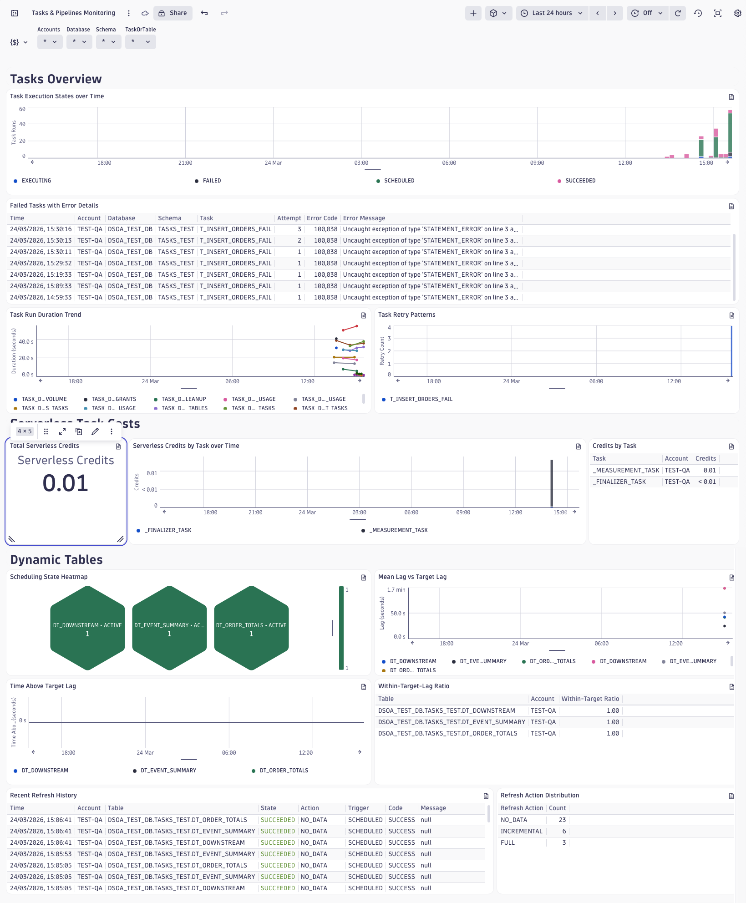
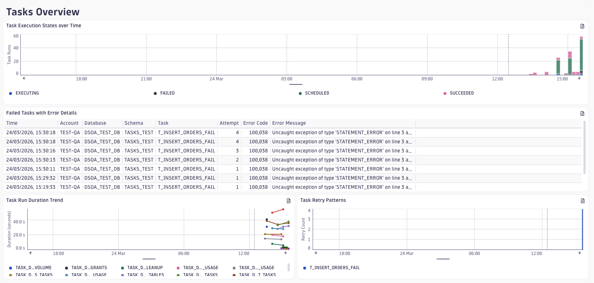
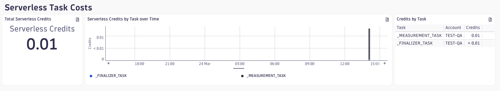
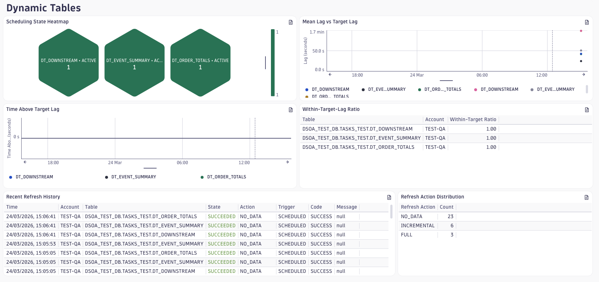
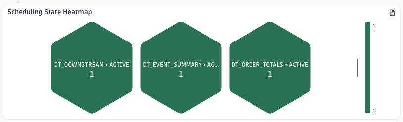

# Dashboard: Tasks & Pipelines Monitoring

This dashboard gives pipeline owners a single pane of glass for monitoring the health, performance, cost, and data freshness of Snowflake task graphs and dynamic tables. It covers the full lifecycle: from detecting a failed or retried task run, to attributing serverless compute spend to specific pipelines, to verifying that dynamic tables are meeting their configured freshness SLAs.

## Tasks Overview

The top section focuses on task orchestration health. Two questions it answers immediately: *are any tasks failing right now?* and *which tasks have been getting slower?*

- **Task Execution States over Time** — stacked bar chart of run states (SUCCEEDED, FAILED, SKIPPED) across all tasks in the selected scope. A growing red bar signals pipeline breakage; a growing grey (SKIPPED) bar indicates unmet predecessor conditions — useful for diagnosing upstream failures that cascade through a DAG.
- **Failed Tasks with Error Details** — the most recent 100 failed runs, with error codes, error messages, and attempt numbers. Sort by timestamp to see the latest failures first, or filter `$TaskOrTable` to drill into a specific task. Retry rows (attempt > 1) appear as separate entries, making it easy to distinguish transient failures from persistent ones.
- **Task Run Duration Trend** and **Task Retry Patterns** sit side by side. Duration surfaces regressions — a task that used to complete in 30 seconds but now takes 5 minutes is flagged visually before users notice data delays. Retry patterns highlight instability: tasks that consistently need more than one attempt to succeed are candidates for investigation even if they ultimately succeed.

## Serverless Task Costs

The middle section tracks credit consumption for tasks running in serverless execution mode. All three tiles sit on a single row: the KPI on the left, the trend in the centre, and the per-task breakdown on the right.

- **Total Serverless Credits** — a single-value tile showing the aggregate credits consumed in the selected timeframe. The trend indicator shows direction relative to the previous equivalent period.
- **Serverless Credits by Task over Time** — bar chart breaking down credit spend per task name over time. Useful for spotting a task that suddenly consumed far more credits than usual — often a sign of a query plan regression or unexpected data volume spike.
- **Credits by Task** — a compact table ranking tasks by total credits consumed. Use this alongside the trend chart to prioritise optimisation efforts: high total spend combined with a rising trend is the most actionable combination.

> **Note:** The `serverless_tasks` context covers tasks configured with serverless (i.e. managed) compute only. Tasks running on a named virtual warehouse do not emit credit data here — their costs appear in warehouse credit consumption instead.

## Dynamic Tables

The bottom section monitors the freshness and refresh behaviour of dynamic tables. The key question it answers is: *are my downstream consumers receiving data on time?*

- **Scheduling State Heatmap** — one hexagon per dynamic table, coloured green (ACTIVE), amber (SUSPENDED), or red (any other state). A non-green cell requires investigation; hover to see the exact state string and the account it belongs to.

  

- **Mean Lag vs Target Lag** — line chart of observed mean and maximum scheduling lag per table over time. When the mean lag line consistently exceeds the target lag, the table is falling behind its freshness SLA and downstream consumers are reading stale data.
- **Time Above Target Lag** — bar chart showing cumulative seconds each table spent above its configured target lag. Any non-zero value is a confirmed SLA breach in the selected period.
- **Within-Target-Lag Ratio** — table sorted ascending by freshness ratio (0–1, where 1.0 means always fresh). Colour thresholds highlight tables at risk: below 0.99 is orange, below 0.90 is red. Worst offenders surface at the top.
- **Recent Refresh History** and **Refresh Action Distribution** give operational detail: the last 100 refresh events with state, action type (INCREMENTAL, FULL, REINITIALIZE, NO_DATA), trigger, and any error codes. A high proportion of FULL or REINITIALIZE refreshes may indicate non-incremental query patterns or recent schema changes, which increases compute cost.

## Dashboard Variables

| Variable       | Purpose                                                            | Default   |
|----------------|--------------------------------------------------------------------|-----------|
| `$Accounts`    | Filter by Snowflake account (`deployment.environment`)             | `*` (all) |
| `$Database`    | Filter by database (`db.namespace`), cascades from Accounts        | `*` (all) |
| `$Schema`      | Filter by schema (`snowflake.schema.name`), cascades from Database | `*` (all) |
| `$TaskOrTable` | Union of task names and dynamic table names, cascades from Schema  | `*` (all) |

All variables support multi-select. To investigate a specific failing task, set `$TaskOrTable` to the task name — the **Failed Tasks** table and **Duration Trend** chart will immediately narrow to that task's history. To verify freshness for a single dynamic table, set `$TaskOrTable` to the table name and check the **Within-Target-Lag Ratio** and **Time Above Target Lag** tiles.

## Required Plugins

This dashboard requires the `tasks` and `dynamic_tables` plugins to be enabled in your DSOA configuration.

- **`tasks`** — collects from two contexts: `task_history` (task run states, durations, retries, errors) and `serverless_tasks` (credit consumption). Billing data from `serverless_tasks` follows Snowflake's `SERVERLESS_TASK_HISTORY` latency.
- **`dynamic_tables`** — collects refresh events from `dynamic_table_refresh_history` and scheduling state and lag metrics from `ACCOUNT_USAGE.DYNAMIC_TABLES`. Updates on the plugin's configured collection interval.

Data must be flowing for at least one collection cycle before tiles populate. The serverless cost tiles and refresh history tiles may take longer to show data depending on Snowflake's `ACCOUNT_USAGE` view latency (~45–90 minutes for new data).

## Known Limitations

- Serverless credit data only reflects tasks using Snowflake-managed (serverless) compute. Warehouse-based task costs are not included.
- Task execution duration is computed from datetime string fields (`scheduled_time`, `completed_time`). Tasks still in RUNNING state have a null `completed_time` and are excluded from the duration tile.
- The `$Database` and `$Schema` filters do not apply to serverless task credit tiles — the underlying `SERVERLESS_TASK_HISTORY` view does not populate `database_name`/`schema_name` for DSOA's own internal scheduler tasks.
- Dynamic table `snowflake.table.dynamic.scheduling.state` can be emitted as an empty string by the plugin when Snowflake returns a null variant key. The heatmap filters these out; see telemetry issue TI-004 for the recommended plugin fix.
