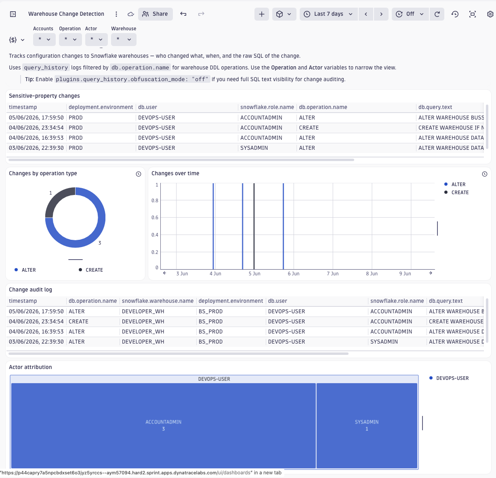

# Dashboard: Warehouse Change Detection

This dashboard provides a security audit trail for Snowflake warehouse configuration changes.
It surfaces every CREATE, ALTER, DROP, and RENAME_WAREHOUSE operation logged by the `query_history`
plugin — who made the change, when, and what SQL was executed — so security and platform teams
can detect unauthorized reconfiguration and enforce change-management policies.

## Change Audit Log

- Full log of warehouse DDL operations filtered by the `$Accounts`, `$Operation`, `$Actor`,
  and `$Warehouse` dashboard variables.
- Columns: timestamp, operation type (`ALTER`, `CREATE`, `DROP`, `RENAME_WAREHOUSE`), warehouse
  name, environment, user, role, and raw SQL query text.
- Provides a complete, searchable record of every warehouse change within the selected time range.

## Changes Over Time

- Bar chart trending warehouse DDL activity by operation type over the default 7-day window.
- Reveals spikes in reconfiguration activity and correlates with deployment or incident timelines.

## Changes by Operation Type

- Donut chart summarizing the distribution of `CREATE`, `ALTER`, `DROP`, and `RENAME_WAREHOUSE`
  events in the selected period.
- Useful for a quick breakdown of change-pattern composition across the fleet.

## Actor Attribution

- Treemap ranking users by number of warehouse changes, subdivided by the role used.
- Surfaces high-volume actors for governance review and least-privilege enforcement.

## Sensitive-Property Changes

- Filtered table showing only `ALTER WAREHOUSE` statements that touch high-impact configuration
  properties: `WAREHOUSE_SIZE`, `AUTO_SUSPEND`, `SCALING_POLICY`, `ENABLE_QUERY_ACCELERATION`,
  `QUERY_ACCELERATION_MAX_SCALE_FACTOR`, `MAX_CONCURRENCY_LEVEL`, `MIN_CLUSTER_COUNT`,
  `MAX_CLUSTER_COUNT`.
- Companion to the [Warehouse Sensitive Change Alert](../../workflows/warehouse-sensitive-change-alert/)
  workflow, which raises a Dynatrace event for these changes automatically.

> **Note — Snowflake telemetry limitation.** Snowflake's `ACCESS_HISTORY.OBJECT_MODIFIED_BY_DDL`
> does **not** capture warehouse-level DDL (only database-object DDL such as tables and views).
> This dashboard therefore relies on `db.operation.name` and `db.query.text` attributes from
> `query_history` logs. The `snowflake.object.ddl.*` semantic attributes are **not** populated
> for warehouse DDL events and should not be used for warehouse change queries.
