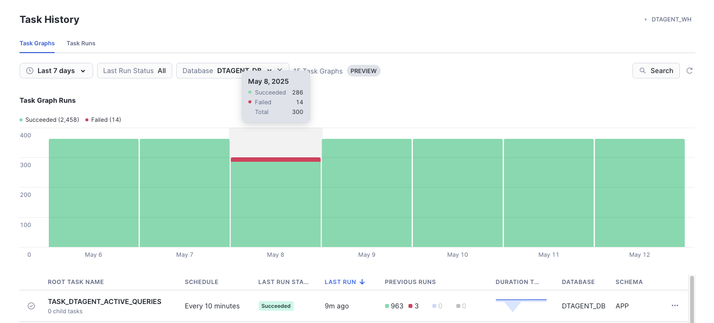
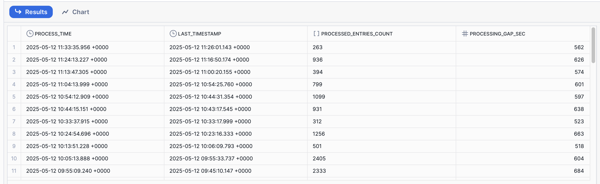
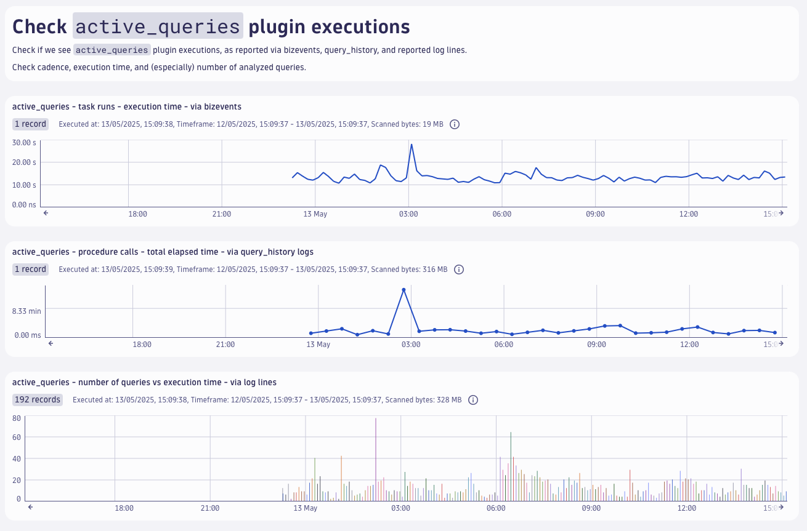
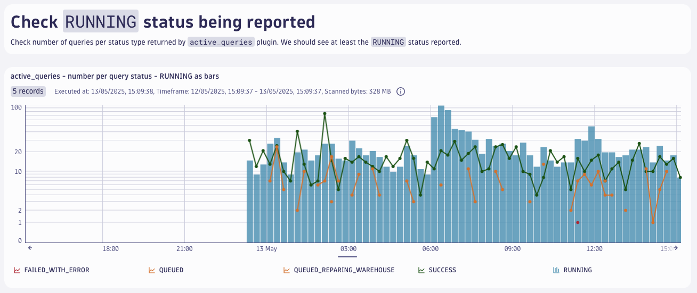
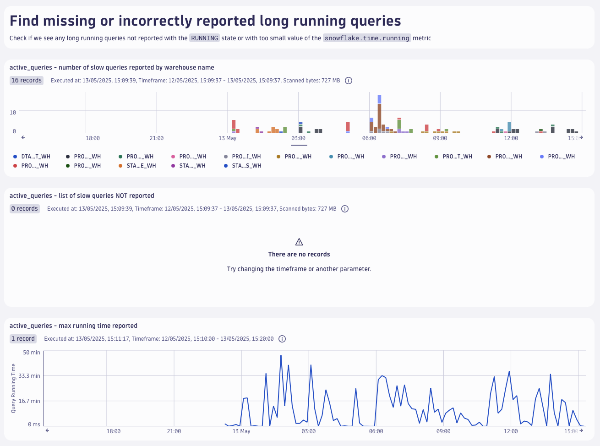
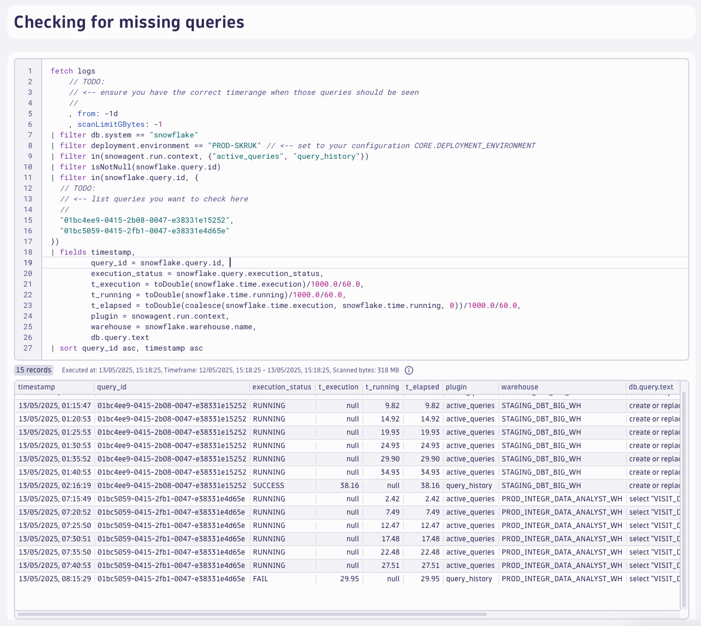

# Root Cause Analysis: Missing Long-Running Queries

This step-by-step tutorial will help you diagnose why long-running queries may not be reported by the Dynatrace Snowflake Observability Agent.

- [Prerequisites](#prerequisites)
- [Understanding the `active_queries` Plugin](#understanding-the-active_queries-plugin)
  - [Operating Modes](#operating-modes)
    - [FAST Mode (Default)](#fast-mode-default)
    - [SLOW Mode](#slow-mode)
  - [Important Limitations](#important-limitations)
- [Troubleshooting Methodology](#troubleshooting-methodology)
- [Step 1: Verify Agent Task Execution](#step-1-verify-agent-task-execution)
  - [1.1 Check Task Status and Errors](#11-check-task-status-and-errors)
  - [1.2 Analyze Query Processing Statistics](#12-analyze-query-processing-statistics)
- [Step 2: Validate Data in Dynatrace](#step-2-validate-data-in-dynatrace)
  - [2.1 Verify Plugin Execution Reports](#21-verify-plugin-execution-reports)
  - [2.2 Analyze Query Status Distribution](#22-analyze-query-status-distribution)
  - [2.3 Identify Missing Long-Running Queries](#23-identify-missing-long-running-queries)
  - [2.4 Expected Results](#24-expected-results)
- [Step 3: Deep Dive Analysis for Missing Queries](#step-3-deep-dive-analysis-for-missing-queries)
  - [3.1 Collect Sample Missing Queries](#31-collect-sample-missing-queries)
  - [3.2 Cross-Reference with Dynatrace Data](#32-cross-reference-with-dynatrace-data)
  - [3.3 Validate Snowflake Query Visibility](#33-validate-snowflake-query-visibility)
  - [3.4 Analysis Patterns](#34-analysis-patterns)
  - [3.5 Next Steps Based on Findings](#35-next-steps-based-on-findings)
- [Troubleshooting Decision Tree](#troubleshooting-decision-tree)
- [Resources and Tools](#resources-and-tools)
- [Summary](#summary)

## Prerequisites

Before starting this troubleshooting guide, ensure you have:

- Access to both Snowflake and Dynatrace environments
- `DTAGENT_VIEWER` role permissions in Snowflake
- Basic understanding of SQL queries and Dynatrace navigation

## Understanding the `active_queries` Plugin

The `active_queries` plugin is responsible for collecting query information from Snowflake. Understanding its behavior is crucial for effective troubleshooting:

### Operating Modes

#### FAST Mode (Default)

- Collects currently `RUNNING`, `QUEUED`, and recently `FINISHED` queries
- Captures queries that intersect with plugin execution intervals (see diagram below)
- Executes every 10 minutes by default

#### SLOW Mode

- Includes all FAST mode functionality
- Additionally retrieves all queries that `FINISHED` or `FAILED` since the previous execution
- Looks back 2 minutes before the end of the last reported query
- More comprehensive but slower

### Important Limitations

⚠️ **Key Constraint**: Snowflake's `QUERY_HISTORY()` function returns only the most recent 10,000 queries. This is a hard limit that can affect data collection in high-volume environments.


## Troubleshooting Methodology

This guide follows a systematic approach to identify and resolve issues with missing long-running queries. Follow these steps in order for the most effective diagnosis.

## Step 1: Verify Agent Task Execution

**Objective**: Confirm that the `active_queries` plugin is running correctly on the Snowflake side.

### 1.1 Check Task Status and Errors

First, verify that the Dynatrace Snowflake Observability Agent tasks are executing without errors:

1. **Task Name**: `DTAGENT_DB.APP.TASK_DTAGENT_ACTIVE_QUERIES`
2. **What to Check**:
   - Task executes without errors
   - Task runs at expected cadence (10 minutes by default)
   - Some task executions might be missing if a task ran longer than the next scheduled execution




### 1.2 Analyze Query Processing Statistics

Execute the following SQL to check the plugin's recent activity:

```sql
-- Listing last 50 executions of active_queries plugin,
-- with number of queries processed and time since previous processing
use role DTAGENT_VIEWER;
use schema DTAGENT_DB.STATUS;
use warehouse DTAGENT_WH;

select
  PROCESS_TIME,
  LAST_TIMESTAMP,
  ENTRIES_COUNT:"processed_entries_cnt"  as PROCESSED_ENTRIES_COUNT,
  timediff(second,
           LAG(PROCESS_TIME)
           OVER (ORDER BY PROCESS_TIME),
           PROCESS_TIME)                 as PROCESSING_GAP_SEC,
from STATUS.PROCESSED_MEASUREMENTS_LOG
where MEASUREMENTS_SOURCE = 'active_queries'
order by PROCESS_TIME desc
limit 50
;
```



## Step 2: Validate Data in Dynatrace

**Objective**: Confirm that data from the `active_queries` plugin is correctly transmitted to and available in Dynatrace Grail.

### 2.1 Verify Plugin Execution Reports

Check if the plugin executions are being reported to Dynatrace:

1. **Data Sources to Check**:
   - Business events (bizevents)
   - Query history records
   - Both sources should show consistent data

2. **Metrics to Compare**:
   - Execution cadence (should match Snowflake task execution)
   - Running time of the plugin
   - Number of queries analyzed per execution



### 2.2 Analyze Query Status Distribution

Examine the types of queries being reported:

1. **Expected Status Types**:
   - `RUNNING` queries should always be present (this is the most critical indicator)
   - `QUEUED` queries may be present depending on workload
   - `FINISHED` queries should be present in both modes

2. **Red Flags**:
   - No `RUNNING` queries reported consistently
   - Unusual status distributions
   - Missing expected query types



### 2.3 Identify Missing Long-Running Queries

Search for queries that should have been reported but appear to be missing:

1. **Query Characteristics to Check**:
   - Long execution times not reflected in `snowflake.time.running` metric
   - Queries not reported with `RUNNING` status despite long execution
   - Discrepancies between expected and actual execution times



### 2.4 Expected Results

✅ **Healthy Data Flow**:

- Plugin executions visible in Dynatrace
- Consistent cadence matching Snowflake task execution
- `RUNNING` queries always present
- Query execution times match expectations

❌ **Warning Signs**:

- Missing plugin execution reports
- No `RUNNING` queries reported
- Significant discrepancies in execution times
- Gaps in data transmission

## Step 3: Deep Dive Analysis for Missing Queries

**Objective**: When Steps 1 and 2 don't reveal clear issues, perform detailed analysis to identify specific missing queries and their root causes.

### 3.1 Collect Sample Missing Queries

If you've reached this step without finding obvious problems, you need to systematically identify queries that should have been reported but weren't:

1. **Identify Candidate Queries**:
   - Focus on queries with execution times longer than expected reporting intervals
   - Look for queries that ran during plugin execution windows
   - Document query IDs, start times, and execution durations

### 3.2 Cross-Reference with Dynatrace Data

**At Dynatrace**: Check if the missing queries appear in Grail with incorrect data:

1. **Search Strategy**:
   - Look up specific query IDs in Dynatrace
   - Compare reported execution times with actual execution times
   - Check if queries appear with unexpected status values

2. **Data Validation**:
   - Verify query execution time accuracy
   - Confirm status transitions are properly captured
   - Check for any partial data reporting



### 3.3 Validate Snowflake Query Visibility

**At Snowflake**: Verify that missing queries were actually visible to the `QUERY_HISTORY()` function:

1. **Use the provided SQL script**: [`t00_test_missing_active_queries.off.sql`](t00_test_missing_active_queries.off.sql)
2. **Check Query Accessibility**:
   - Confirm queries appear in `QUERY_HISTORY()` results
   - Verify timing of query availability
   - Check if queries were within the 10,000 query limit


### 3.4 Analysis Patterns

**Consistent Missing Queries**:

- Queries systematically missing from all reporting intervals
- May indicate permission issues or query visibility problems

**Partial Missing Queries**:

- Queries missing from some intervals but present in others
- Missing from beginning, end, or middle of execution periods
- May indicate timing issues or plugin execution problems

**Intermittent Missing Queries**:

- Sporadic missing queries without clear pattern
- May indicate performance issues or temporary connectivity problems

### 3.5 Next Steps Based on Findings

🔍 **If queries are missing from Snowflake query history**:

- Check user permissions and role assignments
- Verify query visibility settings
- Review Snowflake query history retention policies

🔍 **If queries are visible in Snowflake but missing from Dynatrace**:

- Check data transmission connectivity
- Review plugin execution timing
- Verify Dynatrace ingestion pipeline

🔍 **If queries are partially reported**:

- Analyze timing relationships between query execution and plugin runs
- Check for plugin execution timeout issues
- Review query status transition timing

## Troubleshooting Decision Tree

```text
Start: Long-running queries not reported
↓
Step 1: Are agent tasks running correctly?
├─ No → Fix task execution issues, check permissions
└─ Yes → Continue to Step 2
        ↓
        Step 2: Is data reaching Dynatrace?
        ├─ No → Check connectivity, data pipeline
        └─ Yes → Continue to Step 3
                ↓
                Step 3: Are specific queries missing?
                ├─ From Snowflake → Check permissions, visibility
                ├─ From Dynatrace → Check data transmission
                └─ Partially → Analyze timing and execution patterns
```

## Resources and Tools

- [Snowflake SQL script](t00_test_missing_active_queries.off.sql)
- Dynatrace notebook for testing [current version](dsoa-active-queries-test-dashboard.json) ( [version 0.7](dsoa-active-queries-test-dashboard-0.7.0.json), [version 0.8.2](dsoa-active-queries-test-dashboard-0.8.2.json) )

## Summary

This systematic approach helps identify the root cause of missing long-running queries by:

1. **Verifying the data collection source** (Snowflake agent tasks)
2. **Confirming data transmission** (Dynatrace data availability)
3. **Performing detailed analysis** (specific query investigation)

Each step builds upon the previous one, allowing you to isolate the problem area and apply targeted solutions. Remember that the 10,000 query limit in Snowflake's `QUERY_HISTORY()` function is a critical constraint that affects data collection in high-volume environments.
