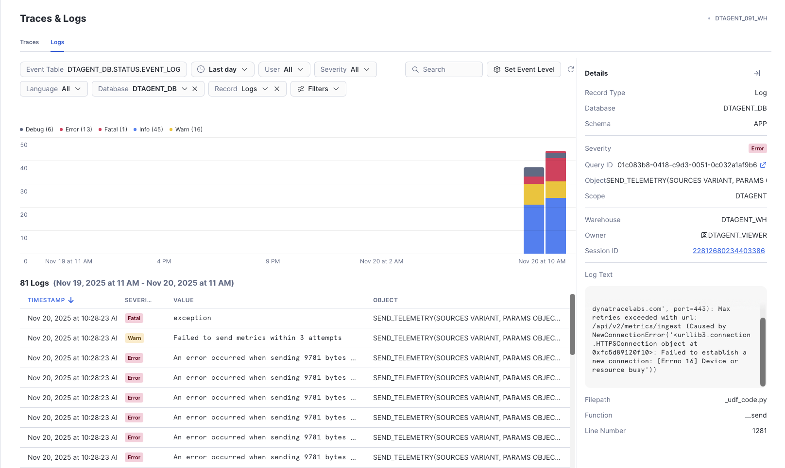

# Troubleshooting: No Data in Dynatrace

This guide helps you diagnose and resolve issues when Dynatrace Snowflake Observability Agent tasks are running in Snowflake, but no telemetry data appears in your Dynatrace tenant.

* [Prerequisites](#prerequisites)
* [Common Symptoms](#common-symptoms)
* [Troubleshooting Steps](#troubleshooting-steps)
  * [Step 1: Check for Error Logs in Snowflake](#step-1-check-for-error-logs-in-snowflake)
  * [Step 2: Identify Connection Issues](#step-2-identify-connection-issues)
  * [Step 3: Validate Dynatrace Tenant URL Configuration](#step-3-validate-dynatrace-tenant-url-configuration)
  * [Step 4: Reset Agent Configuration](#step-4-reset-agent-configuration)
    * [Option A: Wait for scheduled execution](#option-a-wait-for-scheduled-execution)
    * [Option B: Manually trigger a plugin (recommended for immediate testing)](#option-b-manually-trigger-a-plugin-recommended-for-immediate-testing)
  * [Step 5: Verify Telemetry Configuration](#step-5-verify-telemetry-configuration)
* [Prevention and Best Practices](#prevention-and-best-practices)
* [Summary](#summary)

## Prerequisites

Before starting this troubleshooting guide, ensure you have:

* Access to both Snowflake and Dynatrace environments
* `DTAGENT_VIEWER` role permissions in Snowflake
* Access to the agent's configuration file (`conf/config-$env.json`)
* The deployment scripts (`deploy.sh`)

## Common Symptoms

You may be experiencing this issue if:

* Agent tasks are scheduled and running in Snowflake without errors
* Tasks show successful execution in `TASK_HISTORY`
* No telemetry data (logs, metrics, traces, events) appears in Dynatrace
* Previously working agent suddenly stops sending data

## Troubleshooting Steps

### Step 1: Check for Error Logs in Snowflake

The first step is to check if the agent is reporting any errors in its internal logging.

**Query to check for DTAGENT errors:**

```sql
USE ROLE DTAGENT_VIEWER;
USE DATABASE DTAGENT_DB;
USE WAREHOUSE DTAGENT_WH;

-- Check recent error and warning logs from the agent
SELECT
    TIMESTAMP,
    SEVERITY,
    VALUE as MESSAGE,
    OBJECT as SOURCE
FROM DTAGENT_DB.STATUS.EVENT_LOG
WHERE SEVERITY IN ('ERROR', 'FATAL', 'WARN')
  AND TIMESTAMP > DATEADD(hour, -24, CURRENT_TIMESTAMP())
ORDER BY TIMESTAMP DESC
LIMIT 100;
```

**What to look for:**

* Connection errors or timeout messages
* Authentication failures
* HTTP error codes (400, 401, 403, 500, etc.)
* Any messages mentioning "failed to send" or "error occurred when sending"



### Step 2: Identify Connection Issues

Connection problems are a common cause of data not reaching Dynatrace. Look specifically for connection-related errors.

**Common connection error patterns:**

```text
An error occurred when sending 9781 bytes with metrics (retry = 0):
HTTPSConnectionPool(host='abc12345.live.dynatrace.com', port=443):
Max retries exceeded with url: /api/v2/metrics/ingest
(Caused by NewConnectionError('<urllib3.connection.HTTPSConnection object at 0xfc5d89120f10>:
Failed to establish a new connection: [Errno 16] Device or resource busy'))
```

**Possible causes:**

* **Network allowlist configuration**: The stored procedure doesn't have the Dynatrace endpoint in its external access integration
* **Network connectivity issues**: Snowflake cannot reach your Dynatrace tenant
* **DNS resolution problems**: Snowflake cannot resolve the Dynatrace tenant hostname
* **Rate limiting**: Too many requests being sent to Dynatrace APIs

**Understanding Snowflake network configuration:**

Dynatrace Snowflake Observability Agent sets up network allowlists at the **stored procedure level** using Snowflake's [External Network Access](https://docs.snowflake.com/en/sql-reference/sql/create-external-access-integration) feature. This is configured automatically during deployment.

> **IMPORTANT**: For **Snowflake Business Critical Edition with Private Connectivity** or **Dynatrace Managed** deployments, additional network configuration may be required at the infrastructure level to allow connectivity between Snowflake and Dynatrace.

**Action items:**

1. Verify the external access integration is properly configured for the agent's stored procedures
2. For Private Connectivity/Managed deployments: Work with your network team to ensure connectivity between Snowflake VPC and Dynatrace
3. Check Snowflake's [External Access documentation](https://docs.snowflake.com/en/sql-reference/sql/create-external-access-integration) for any account-level restrictions
4. Confirm your Dynatrace tenant is accessible from Snowflake's network

### Step 3: Validate Dynatrace Tenant URL Configuration

Incorrect URL configuration is a frequent cause of connection failures. The agent requires the correct Dynatrace tenant address format.

**Check your configuration file** (`conf/config-$env.json`):

```json
{
    "OTEL": {
        "DYNATRACE_TENANT_ADDRESS": "abc12345.live.dynatrace.com"
    }
}
```

**✅ Correct format:**

* `abc12345.live.dynatrace.com`
* For managed environments: `managed.example.com/e/environment-id`

**❌ Incorrect formats:**

* `abc12345.apps.dynatrace.com` ← **This is wrong!** (Apps URL, not API endpoint)
* `https://abc12345.live.dynatrace.com` (Do not include protocol)
* `abc12345.live.dynatrace.com/` (Do not include trailing slash)

> **IMPORTANT**: The `DYNATRACE_TENANT_ADDRESS` should be the **tenant URL** (for API access), NOT the apps URL. The apps URL (with `.apps.`) is used for accessing the Dynatrace web interface, but the agent needs the API endpoint.

**How to find your correct tenant address:**

1. Log in to your Dynatrace tenant
2. Go to **Settings** → **Integration** → **Dynatrace API**
3. Look for the **Environment API** section
4. Copy the domain from the API endpoint (without `https://` and without the path)

### Step 4: Reset Agent Configuration

If you've identified configuration issues or want to ensure a clean state, reset the agent configuration and API key.

**Process overview:**

1. Update your configuration file if needed
2. Redeploy the configuration
3. Update the API key/token

**Commands to reset configuration:**

Refer to the [deployment documentation](../../../INSTALL.md) for detailed information about the deployment process and required token permissions.

```bash
# Set your environment variable (replace $env with your config name, e.g., "production")
export ENV_NAME="$env"

# IMPORTANT: Set your Dynatrace Access Token
# Use a space before the command to prevent it from being saved in bash history
export HISTCONTROL=ignorespace
 export DTAGENT_TOKEN="dt0c01.XXXXXXXX..."

# Step 1: Reset configuration from config file
./deploy.sh $ENV_NAME config

# Step 2: Update API key/token
# This will use the DTAGENT_TOKEN environment variable
./deploy.sh $ENV_NAME apikey
```

> **NOTE**: When running `./deploy.sh $env apikey`, ensure you have a valid Dynatrace Access Token set in the `DTAGENT_TOKEN` environment variable. If not set, you will be prompted to provide it during deployment.

**Required token permissions:**

Your `DTAGENT_TOKEN` must have the following scopes enabled:

| Scope ID                    | Scope Name                   |
| --------------------------- | ---------------------------- |
| `logs.ingest`               | Ingest Logs                  |
| `metrics.ingest`            | Ingest Metrics               |
| `bizevents.ingest`          | Ingest BizEvents             |
| `openpipeline.events`       | OpenPipeline - Ingest Events |
| `openTelemetryTrace.ingest` | Ingest OpenTelemetry Traces  |

See the [How to Install](../../../INSTALL.md#deploying-dynatrace-snowflake-observability-agent) documentation for complete details on token requirements and deployment procedures.

**Verification after reset:**

After resetting the configuration, you can either wait for the next scheduled task execution or manually trigger a plugin for immediate testing.

#### Option A: Wait for scheduled execution

Wait for the next scheduled task execution (check your plugin schedules in the configuration file) and verify data appears in Dynatrace.

#### Option B: Manually trigger a plugin (recommended for immediate testing)

```sql
USE ROLE DTAGENT_VIEWER;
USE WAREHOUSE DTAGENT_WH;
USE SCHEMA DTAGENT_DB.APP;

-- Execute a specific plugin (e.g., active_queries)
CALL APP.DTAGENT(ARRAY_CONSTRUCT('active_queries'));
```

You can replace `'active_queries'` with any other plugin name (e.g., `'query_history'`, `'warehouse_usage'`, etc.).

**Important diagnostic information:**

The `DTAGENT()` procedure returns a JSON result showing telemetry counts for the executed plugin:

```json
{
  "active_queries": {
    "dsoa.run.id": "89c0df5ce7244250bf177a86f4bcb3a3",
    "dsoa.run.plugin": "active_queries",
    "dsoa.run.results": {
      "active_queries": {
        "entries": 17,
        "events": 0,
        "log_lines": 17,
        "metrics": 37
      }
    }
  }
}
```

The `dsoa.run.results` object contains the telemetry counts:

* `entries` - Total number of entries processed by the plugin
* `log_lines` - Number of log entries sent
* `metrics` - Number of metric data points sent
* `events` - Number of events sent
* `spans` - Number of spans sent (when applicable)

> **⚠️ WARNING**: If the procedure returns **all zeros** in the results (e.g., `"entries": 0, "events": 0, "log_lines": 0, "metrics": 0`), this likely means the `TELEMETRY` configuration arrays in your `OTEL` or plugin-specific settings are limiting which types of telemetry can be sent. See [Step 5](#step-5-verify-telemetry-configuration) below.

**Verify data in Dynatrace:**

1. Check for new error logs in Snowflake (Step 1)
2. Check if data appears in Dynatrace within a few minutes
3. Query Dynatrace for recent agent activity:

```dql
fetch logs
| filter db.system == "snowflake"
| filter deployment.environment == "YOUR_ENV_NAME"
| sort timestamp desc
| limit 100
```

### Step 5: Verify Telemetry Configuration

If you manually execute a plugin using `CALL APP.DTAGENT(ARRAY_CONSTRUCT('plugin_name'))` and see all zeros in the results, this indicates that telemetry is being filtered by configuration.

**Check TELEMETRY arrays in your configuration:**

Each plugin and the global OTEL configuration have `TELEMETRY` arrays that control which types of data are sent:

```json
{
    "OTEL": {
        "TELEMETRY": [
            "logs",
            "metrics",
            "spans",
            "events",
            "biz_events"
        ]
    },
    "PLUGINS": {
        "ACTIVE_QUERIES": {
            "TELEMETRY": [
                "logs",
                "metrics",
                "spans",
                "biz_events"
            ]
        }
    }
}
```

**Understanding TELEMETRY configuration:**

* The **global** `OTEL.TELEMETRY` array controls what types of telemetry the agent can send overall
* Each **plugin-specific** `TELEMETRY` array further controls what that plugin sends
* Both must include the telemetry type for it to be sent

**Valid telemetry types:**

* `"logs"` - Log entries
* `"metrics"` - Metrics data
* `"spans"` - Distributed traces
* `"events"` - Dynatrace events
* `"biz_events"` - Business events

**Troubleshooting steps:**

1. Verify that `OTEL.TELEMETRY` includes all required types
2. Check that each plugin's `TELEMETRY` array includes the types you expect
3. If arrays are empty or missing required types, update your configuration file
4. Redeploy configuration: `./deploy.sh $env config`
5. Test again with manual execution

**Example of misconfiguration:**

```json
{
    "OTEL": {
        "TELEMETRY": []  // ❌ Empty - nothing will be sent!
    }
}
```

Refer to the [Plugins documentation](../../../PLUGINS.md) for the default `TELEMETRY` configuration for each plugin and detailed information about what each plugin reports.

## Prevention and Best Practices

**Configuration management:**

* Always validate the `DYNATRACE_TENANT_ADDRESS` format before deployment
* Use version control for your configuration files
* Document any custom network configurations

**Monitoring:**

* Set up alerts in Snowflake for task failures
* Create Dynatrace alerts for missing data from specific environments
* Regularly review agent error logs

**Token management:**

* Use tokens with only the required scopes
* Rotate tokens according to your security policy
* Store tokens securely and never commit them to version control
* Use the `HISTCONTROL=ignorespace` technique to prevent tokens from being saved in shell history

**Network considerations:**

* Work with your network team to configure external access integrations properly
* For Private Connectivity or Managed deployments, ensure proper VPC/infrastructure connectivity
* Document any required network policies or firewall rules
* Test connectivity after any network infrastructure changes

## Summary

When troubleshooting data transmission issues:

1. **Check error logs first** - Most issues are logged by the agent
2. **Identify connection problems** - Network access issues are common, especially with external access integrations
3. **Validate URL configuration** - Using the wrong URL format (especially `.apps.` instead of `.live.`) prevents data transmission
4. **Reset configuration when needed** - Use `deploy.sh` to cleanly reset configuration and tokens
5. **Verify telemetry arrays** - Empty or misconfigured `TELEMETRY` arrays will prevent data from being sent
6. **Test manually** - Use `CALL APP.DTAGENT()` to immediately test plugin execution and diagnose issues

Remember that it may take a few minutes for data to appear in Dynatrace after fixing configuration issues, depending on your plugin schedules. Manual execution provides immediate feedback for troubleshooting.

For issues related to specific plugins not reporting data (while others work correctly), refer to the [Plugins documentation](../../../PLUGINS.md) for plugin-specific configuration and troubleshooting.
